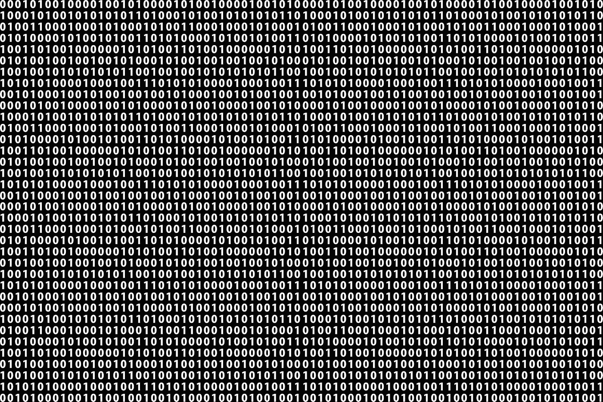

# 将文本编码到量子位上

> 原文：<https://levelup.gitconnected.com/encoding-text-onto-qubits-23bed648d6a7>

# 毕竟，一切都是二元的

这是“Mike & Ike”量子计算圣经中的一个微妙的引用。我大概已经浏览了好几遍了。但是，就在几天前，我又一次浏览了一遍，但还是没有找到答案。

> …原则上，一个人可以将莎士比亚的整个文本存储在θ的无限二进制展开中。

等等，什么？

我仍在消化 Seth Lloyd 博士的声明，即一万亿比特的数据可以映射成 40 个量子比特。答案似乎是振幅编码。“迈克和艾克”的这句话是不是暗示我可以将一个太比特映射到一个量子比特？

## 一种方法

这可能不是一个最佳的方法，但“Mike & Ike”并没有深究这个简短的陈述，所以我发现了一种可能性:

1.  将每个字符转换成二进制。
2.  从左到右数每个字符的第 n 位。
3.  将每个字符的值计算为(1 / 2^n) * [0 或 1]。
4.  把所有的值加起来。

## 这

作为练习，让我们用英语中最常用的词:the。

t: 01110100

h: 01101000

e: 01100101

货号:01110100110100001100101

从左至右:

1/2*0=0

1/4*1=0.25

1/8*1=0.125

1/16*1=0.0625

1/32*0=0

1/64*1=0.015625

1/128*0=0

1/256*0=0

1/512*0=0

1/1024*1=9.8e-4

1/2048*1=4.9e-4

1/4096*0=0

1/8192*1=1.2e-4

1/16384*0=0

1/32768*0=0

1/65536*0=0

1/13132*0=0

1/262144*1=3.8e-6

1/524288*1=1.9e-6

1/1048576*0=0

1/2097152*0=0

1/4194304*1=2.4e-7

1/8388608*0=0

1/16777216*1=6.0e-8

总和:0.45336363637

## 编码

使用绕 y 轴的旋转将单词“the”编码到量子位上，例如:

ry(0.4547179341316 * pi)q[0]；

对于那些习惯使用 Qiskit 或其他 Python 库的人来说，这就是 OpenQASM。重要的是角度θ(θ)；您可以使用自己喜欢的方法应用旋转。

## “原则上”

如你所见，原则上，我们可以继续。但是，你也可以看到，编码“他们”或“他们”之间的区别——只添加一个字母——会使旋转角度发生很小的变化。对单词“这些”进行编码会显示一个更小的差异。尽管如此，我们还是能做到。

## 适应性

这个有实际应用吗？

对于编码到独立量子位上的小单词，也许格罗弗的搜索算法可以确定一个单词是否存在于列表中。或者，也许可以使用[交换测试](https://link.medium.com/aal4wKfa4cb)来比较单词，以确定它们是否相同。如果没有别的，你可以从中得到乐趣，给某人一个生日直方图，显示他们名字的尺寸。

## 反馈

你能做得更好吗？我很想读它。举例来说，如果我们将每一个量子位元限制为个别的小写字，我们可以使用每个字元 5 个位元。另外，我们可以玩整个 z 轴。不过，在第一轮实验中，将文本转换成量子态，即使效率不高，也绝对令人兴奋。