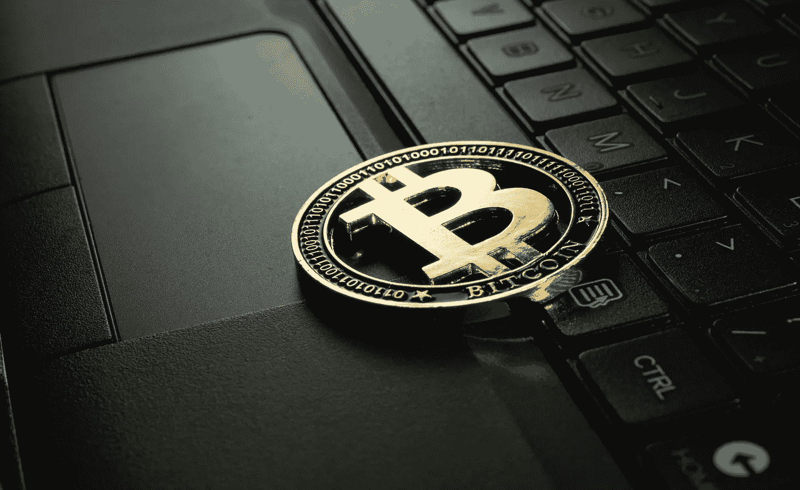
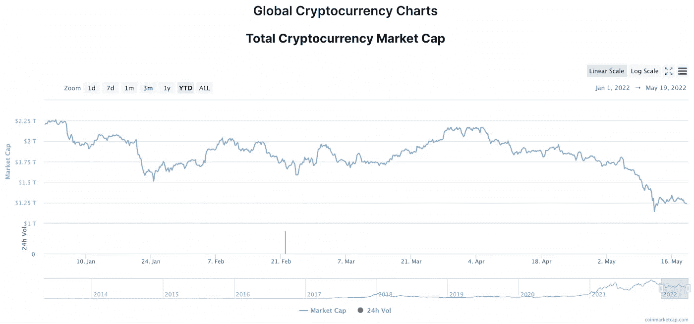

# 鼓励加密功能:为什么最近的加密货币崩溃可能会改善生态系统的前景

> 原文：<https://levelup.gitconnected.com/encouraging-crypto-functionality-why-the-recent-cryptocurrency-crash-may-improve-the-ecosystems-e5260adcf05d>

最近的加密货币市场崩溃，是由大量更广泛的投资者担忧造成的负面情绪和大量抛售造成的，这将预示着许多硬币的交易活动将持续低迷，许多人认为这是一个“加密冬天”。然而，专家认为，长期低迷实际上可能是该行业的一个健康事件。

虽然比特币等加密货币是专门作为数字现金替代品开发的，但它们的广泛流行为市场大幅波动和价格大幅上涨铺平了道路——这使得这些商品作为更具投机性的投资非常受欢迎。

如今，许多主要的加密货币都依赖于大量的能源消耗，从环境角度来看，这是一种极大的浪费。此外，比特币和以太坊等货币的价格在六个月的时间里总共下跌了 55%以上，这导致监管者呼吁介入。

虽然许多人将最近不太稳定的硬币 TerraUSD 的崩溃归咎于最近的低迷，但这忽略了一个事实，即许多加密货币自 2021 年 11 月以来一直在努力维持其价值。

*(图片:*[*coin market cap*](https://coinmarketcap.com/charts/)*)*

从上面的图表中我们可以看出，自 2022 年初以来，[加密货币市场](https://en.freedom24.com/ideas/11841-cryptocurrency-for-portfolio-diversification)的总市值已经下降了近 1 万亿美元，这凸显了该行业在保持 2021 年建立的势头方面遇到的一系列问题。

“如果我们将 2021 年夏季的情况与当前的情况进行比较，当时比特币因通胀预期而增长，在某种程度上是黄金的临时数字替代品，有一个重要区别值得强调；3 月 15 日，美联储启动了加息和结束 QE 的进程，”自由金融欧洲投资咨询主管马克西姆·曼图罗夫指出。“这是过去两年所有比特币和加密货币增长的根本原因。随着利率的提高，加密货币等资产类别的吸引力可能会下降。”

由于近年来利率保持相对稳定，像 crypto 和 NFTs 这样的投资似乎比银行债券和短期国库券更有前景。

然而，随着美国美联储和英国央行都大幅提高利率，这一因素加上俄罗斯入侵乌克兰对加密货币生态系统的损害尤为严重。

对于密码爱好者来说，这可能是一颗难以下咽的苦药丸，他们经常承认，建立在去中心化的区块链框架上的资产不应该容易受到中央金融衰退的影响。

然而，其他加密货币纯粹主义者认为，席卷市场的持续困难是保护其未来并使生态系统更加可信和安全的好机会。

# 为什么“秘密的冬天”可能是这个领域的好消息

由于许多[主要加密货币](/the-7-types-of-cryptocurrencies-you-must-know-3b26b2ce0eb8)难以提供市场复苏可能在不久的将来出现的乐观情绪，一些旁观者已经开始预计“加密冬天”可能即将到来。

像 2018 年至 2020 年期间观察到的那样，加密冬天是一段很长的时间，交易稀少，价格波动很少。如果另一个加密冬天正在进行，情况在 2024 年之前不太可能改善，届时比特币的下一次减半事件将使矿工返回的加密货币减半——这一事件引发了 BTC 2021 年令人印象深刻的价格上涨。

尽管潜在的冬季听起来像是一件消极的事情，但分析师们表示，这可能是生态系统进行急需改善的好时机。

专注于比特币的公司 Lightspark 的联合创始人兼首席执行官 David Marcus 说:“正是在加密的冬天，最优秀的企业家建立了最好的公司，”[。"这是再次关注解决实际问题而不是抽代币的时候了."](https://www.verdict.co.uk/cryptocurrency-winter-is-it-coming/)

马库斯认为，比特币的牛市让更多的开发者分散了注意力，试图创造能够快速增值的资产。

现在这个行业已经经历了低迷，重点可以正确地回到创造有价值的创新项目与加密和区块链。

# 展望更光明的未来

根据《财富》杂志(Fortune)最近的一份报告，随着时间的推移，乐观情绪将重返[加密市场](/where-should-you-keep-your-cryptocurrencies-eb29df78191b)，尽管我们看到该领域的主要参与者出现了一系列低迷，但加密货币的前景仍比 11 月比特币 2021 年末牛市之前更加强劲。

美国银行加密和数字资产策略师阿尔凯什·沙阿说【很明显，在这次调整中，你已经上涨了 50%，但那是在去年 1 月以来上涨了 350%之后】。

即使我们已经进入了一个可能跨越未来几年的加密冬天，比特币的历史周期也意味着加密冬天已经成为投资者积累更多加密货币的绝佳场所。

当然，永远不要在像加密这样不稳定的领域下大赌注是很重要的，但投资者为数字金融驱动的光明未来做好准备当然也很重要。