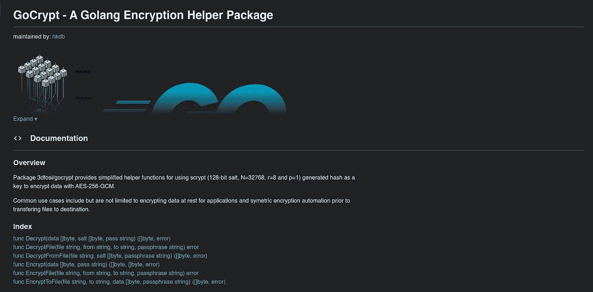

# 用 Golang 加密数据

> 原文：<https://levelup.gitconnected.com/encrypting-data-with-golang-f54f0f02123d>

## 3d fosi/gocrypt——Golang 加密辅助模块



最近，我在审查为移动应用程序存储的工作数据实施的加密，也偶然看到了这篇关于在微软团队桌面应用程序中发现的漏洞的[文章](https://www.bleepingcomputer.com/news/security/microsoft-teams-stores-auth-tokens-as-cleartext-in-windows-linux-macs/)，其中访问令牌以明文形式存储在用户的计算机上。这促使我回顾我以前编写的一些敏感数据存储应用程序，我想用可能更现代、更安全的方式来更新这些应用程序上的数据加密方式。在这样做的时候，我也意识到我经常以不同的方式实现对称加密，这是非常低效的。为什么我每次都要重新发明轮子？也许我只是想借此机会让自己精通不同的数据加密方式，但真正让我感动的是，我发现有时我甚至实现了相同的数据加密方式，但从头开始使用略有不同的代码，这真的很愚蠢。

在做了一些阅读和刷新我的记忆后，首先，不是 [AES](https://en.wikipedia.org/wiki/Advanced_Encryption_Standard) -128，即使它可能对大多数标准情况仍然足够好，以我们的硬件状态，我觉得 [AES](https://en.wikipedia.org/wiki/Advanced_Encryption_Standard) -256 不会对性能造成太大的影响，因此我可能会选择走这条路。我还想选择[伽罗瓦/计数器模式(GCM)](https://en.wikipedia.org/wiki/Galois/Counter_Mode) ，因为与流行的同类产品相比，它似乎仍然在安全性、隐私和性能之间取得了最大的平衡。

最后，如果我能生成一个相当难破解的散列作为 256 位加密密钥来提高它的抗暴力攻击能力，那将是最好的。虽然 [Argon2](https://en.wikipedia.org/wiki/Argon2) 、 [Bcrypt](https://en.wikipedia.org/wiki/Bcrypt) 和 [Scrypt](https://en.wikipedia.org/wiki/Scrypt) 都是这方面的现代候选产品，但我最终选择了 Scrypt (128 位 salt，32768 cpu/mem 成本，8 r，1 p，32 密钥长度)，顺便提一下，它最初是为其创建者为在线备份服务派生密钥而设计的，后来，它的简化版本被许多人用作工作证明方案

因此，我开始在一个包含 6 个主要函数的 main.go 文件中写下上述内容作为测试，因为我总是在确认研究得出的理论是可行的之前做这样的测试。当我满意地结束我的黑客会议时，我对自己说，嘿，为什么我不把它变成一个容易访问和记录的 Go 模块，这样我就可以重用它来解决我的“重新发明轮子”的问题？为什么我不把它也开源，这样其他人就可以查看它并提供反馈，或者告诉我任何潜在的疏忽？于是出现了一个超级简单的围棋模块，[github.com/3dfosi/gocrypt](https://github.com/3dfosi/gocrypt):

[](https://github.com/3dfosi/gocrypt) [## GitHub - 3dfosi/gocrypt:一个为使用 scrypt 提供简化的帮助函数的包…

### 一个为使用 scrypt (128 位 salt，N=32768，r=8，p=1)生成的提供简化帮助函数的包…

github.com](https://github.com/3dfosi/gocrypt) 

及其随附的[文件](https://pkg.go.dev/github.com/3dfosi/gocrypt@v0.0.0-20220919050132-73b9f718fcb9):


[https://pkg . go . dev/github . com/3d fosi/gocrypt @ v 0 . 0 . 0-20220919050132-73b 9 f 718 fcb 9](https://pkg.go.dev/github.com/3dfosi/gocrypt@v0.0.0-20220919050132-73b9f718fcb9)

对于你们中的专家来说，我希望你们联系我，让我知道你们的想法，对于你们中有兴趣尝试的人来说，即使可能有一堆模块以他们自己的方式做类似的事情，你们所要做的就是在你们的代码中导入它:

```
import (
   ...
   "github.com/3dfosi/gocrypt"
) 
```

然后，您可以加密和解密数据，如下例所示:

```
package main

import (
   "log"
   "github.com/3dfosi/gocrypt"
)var pass = "SOME-CRAZY-LONG-PASSPHRASE"

func main() {

	// Encrypt Data
	e_data, salt, err := gocrypt.Encrypt([]byte("secret"), pass)
	if err != nil {
		log.Println(err)
		return
	}

	// Decrypt Data
	plaintext, err := gocrypt.Decrypt(e_data, salt, passphrase)
	if err != nil {
		log.Println(err)
		return
	}

}
```

您还可以执行以下操作:

*   加密数据并将其写入一个新文件(我让开发人员决定在这里存储 salt 的位置)
*   用相关的 salt 解密现有文件的加密内容
*   加密各种格式的文件(即图像或任何东西)并输出带有存储相关盐的伴随文件的加密版本
*   解密加密文件及其附带的 salt 文件，并在选择的位置创建新的解密版本

仅此而已。像往常一样，我们非常欢迎任何问题或反馈。