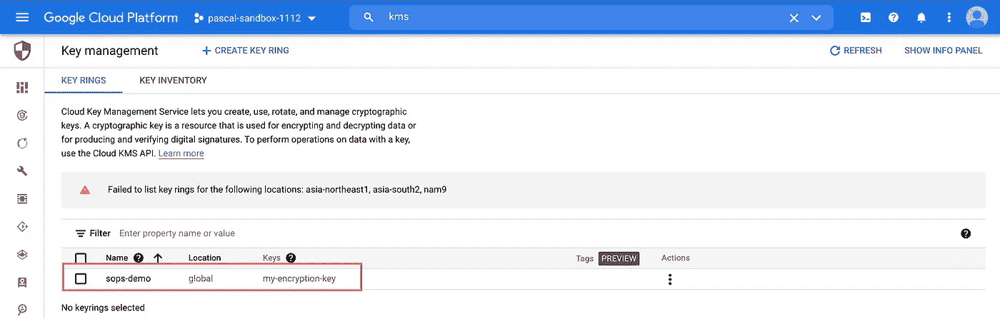
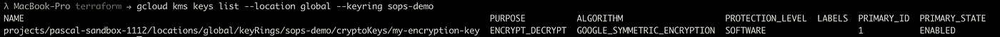

# 加密您的 YAML 文件使用 Mozilla SOPS 和 GCP KMS

> 原文：<https://levelup.gitconnected.com/encrypting-your-yaml-files-using-mozilla-sops-and-gcp-kms-b1fcd22cf40f>

使用 [Mozilla SOPS](https://github.com/mozilla/sops) 和谷歌云 KMS 加密你的 YAML 文件的分步指南。


[图为](https://unsplash.com/@towfiqu999999) [Unsplash](https://www.unsplash.com/) 上的

## 要求

*   [SOPS 安装在本地机器上](https://github.com/mozilla/sops/releases)
*   [GCP 项目](https://cloud.google.com/)带有激活的计费账户
*   [安装了 Google Cloud SDK](https://cloud.google.com/sdk/docs/install)
*   (可选)[安装地形](https://www.terraform.io/)

本教程将向您展示通过 Google Cloud SDK 和 Terraform 设置云 KMS 的步骤。当然，两种方式都非常好。但是既然我是 Terraform 的忠实粉丝，也许你也是，我也将向你展示如何用 IaC 的方式来做。

对于本教程，我还准备了一个 GitHub 存储库，您可以从中找到用于演示加密/解密的文件和 Terraform 文件。

 [## GitHub - mr-pascal/medium-sops

### 此时您不能执行该操作。您已使用另一个标签页或窗口登录。您已在另一个选项卡中注销，或者…

github.com](https://github.com/mr-pascal/medium-sops) 

## 为什么要使用 sop？

SOPS 是“**S**ecrets**OP**operation**S**的首字母缩写，由 [Mozilla](https://www.mozilla.org/) 打造，是一种加密你的敏感文件的简单方法，因此你可以将它们提交到你的 VCS 中而不用担心安全性。

SOPS 还内置了与所有主要云提供商的集成，如 GCP、AWS、Azure 和 Hashicorp。

## 设置

无论您是采用 Terraform 还是 Cloud SDK 方式，您都需要通过 Google 认证才能访问 KMS 并运行 Terraform 命令。

由于 GCP·KMS 使用您系统的[应用默认凭证](https://cloud.google.com/docs/authentication/production)，您需要使用 SDK 来启用它们:

```
gcloud auth application-default login
```

**地形**

如果您正在使用 Terraform，您可以运行下面的 Terraform 代码来为您的 GCP 项目创建一个新的密匙环和一个新的加密密匙，并且已经设置了。只是不要忘记更改`project`变量的默认值以匹配您的项目。

**云 SDK**

如果您更喜欢使用 Cloud SDK 来设置密匙环和加密密匙，您可以运行以下命令来实现与上面的 Terraform 代码相同的功能。唯一的例外是云 KMS API 的启用。这里我建议通过云控制台来实现。

**确认一切正常**

现在我们已经设置了密匙环和加密密匙，我们可以验证一切都可以在云控制台中或通过 CLI 获得。

通过云控制台，您可以导航到“密钥管理”部分，应该会看到添加了一个密钥的新密钥环:



云控制台|密钥管理

通过 CLI，您可以使用以下命令列出位置`global`中所有可用的密钥，这些密钥是密匙环`sops-demo`的一部分:

```
gcloud kms keys list --location global --keyring sops-demo
```



“gcloud kms 密钥列表-位置全局-密钥环 sops-演示”的输出

## 加密

在确认您设置好一切后，我们现在可以开始实际使用 sop 和云 KMS 了。

首先，我建议在您的终端中创建以下环境变量，以使后面的命令更容易阅读和执行。然后，确保用适合您的环境和项目的值替换命令中的四个`<XXX>`部分。

```
export KMS_PATH="projects/<GCP_PROJECT>/locations/<LOCATION>/keyRings/<KEY_RING>/cryptoKeys/<CRYPTO_KEY>"
```

在下面的代码片段中，您可以看到一些我们想要加密的基本 Kubernetes 秘密资源。如您所见，`privateKey`的值是纯文本的，当然，我们不想将这种格式的文件提交给我们的 VCS。

现在让我们使用 sop 来加密我们的文件。

```
sops --encrypt --gcp-kms $KMS_PATH secret.yaml > secret.enc.yaml
```

命令分解:

*   `--encrypt`:我们告诉 sop 我们想要加密我们的输入。还有`--decrypt`，我们将在本文后面看到。
*   `--gcp-kms $KMS_PATH` : SOPS 将使用 GCP 云 KMS 对输入进行解密/加密。参数`$KMS_PATH`必须指向 sop 应该使用的加密密钥的唯一路径。
*   `secret.yaml`:我们要加密的文件的名称。在我们的例子中,`secret.yaml`包含了上述 Kubernetes 的秘密资源。
*   `> secret.enc.yaml`:将`sops`命令的输出写入`secret.enc.yaml`文件。如果我们不指定这一点，该命令会将输出打印到控制台。

执行上述命令后，您应该会看到创建了一个包含以下代码的新文件:

您可以看到输出仍然提醒我们实际的秘密。所以房产名称都还在。他们所有的值都被加密了。除此之外，SOPS 还创建了一个额外的`sops`属性，告诉 SOPS 它是如何加密文件的，以便 SOPS 可以在以后使用这些信息进行解密。

正如您已经猜到的，SOPS 加密所有属性值是相当“糟糕”的。这对于维护来说很糟糕，因为没有一个值是纯文本格式的，而且仅仅从加密文件中，您甚至不知道它应该代表哪种资源。

但是不用担心。标准作业程序也让你到了那里。幸运的是，有一个“部分加密”特性，我们现在就来看看。

**部分加密**

正如我刚才提到的，部分加密解决了我们加密 YAML 文件的所有值的问题。此外，它只允许加密指定的属性或以纯文本形式保存特定的属性。

因此您可以定义一个包含或排除列表。对于所有的可能性，你可以查看官方的[文档](https://github.com/mozilla/sops#encrypting-only-parts-of-a-file)。

在我们的例子中，我们希望显式加密位于 YAML 文件的`data`属性中的所有内容。像`metadata`或`type`这样的其他东西应该保持纯文本格式。

下面的命令就是这样做的。

```
sops --encrypt --encrypted-regex '^(data)$' --gcp-kms $KMS_PATH secret.yaml > secret_partial.enc.yaml
```

使用`--encrypted-regex`,我们可以定义一个正则表达式，SOPS 将对 YAML 文件运行，以检查所有匹配的属性。在根层上匹配的地方，在我们的例子中是`data`，SOPS 将加密子键值对。

我们再次将`sops`命令的输出写入一个文件。这次叫`secret_partial.enc.yaml`。

在下面的代码片段中，您可以看到上述命令的结果。可以看到 SOPS 只加密了`data.privateKey`处的值。标准作业程序没有触及 YAML 文件的任何其他价值。另外，您会注意到`sops`属性现在看起来不同了。它没有包含默认的`unencrypted_suffix: _unencrypted`，而是包含了一个`encrypted_regex: ^(data)$`，告诉`decrypt`命令需要解密哪些属性。

**就地加密**

我们总是在加密 YAML 源文件时创建一个新文件。这可能适合我们的用例，但也有我们不想创建新文件的用例。

对于这些情况，您可以使用`sops`命令的`--in-place`参数。以下命令与前一个命令的作用相同，只是它不是将命令的输出写入新文件，而是替换现有的文件。

```
sops --encrypt --encrypted-regex '^(data)$' --in-place --gcp-kms $KMS_PATH secret.yaml
```

理论上，这也是你可以独立完成的事情，但是在这里使用`sops`工具有一个很好的特性来防止错误。如果您试图加密一个已经加密的文件，SOPS 将抛出以下错误:

```
The file you have provided contains a top-level entry called 'sops'. This is generally due to the file already being encrypted. SOPS uses a top-level entry called 'sops' to store the metadata required to decrypt the file. For this reason, SOPS can not encrypt files that already contain such an entry.If this is an unencrypted file, rename the 'sops' entry.If this is an encrypted file and you want to edit it, use the editor mode, for example: `sops my_file.yaml`
```

这样，当您试图加密一个已经加密的文件时，尤其是使用`--in-place`参数时，就不会遇到问题。

## [通信]解密

既然我们已经学会了如何加密文件，那么解密文件也是必不可少的。

这非常简单，你只需要用`--decrypt`代替`--encrypt`就可以了。当然，您不需要像上面提到的`--encrypted-regex`那样添加特定于加密的参数，因为这已经是加密文件的一部分。

在下面的代码片段中，您可以看到如何解密您的加密文件。通过将输出写入另一个文件或通过`--in-place`选项。

```
# Decrypt and write into another file
sops --decrypt --gcp-kms $KMS_PATH secret.enc.yaml > secret.yaml# Decrypt and replace source file
sops --decrypt --in-place --gcp-kms $KMS_PATH secret.yaml
```

## 摘要

保护包含敏感数据的文件始终是一个大话题，但我希望我可以向您展示一种简单的方法，通过使用 sop，在将文件正确推送至 VCS 之前对其进行加密。

## 你想联系吗？

如果你想联系我，请在 LinkedIn 上联系我。

另外，请随意查看我的书籍推荐📚。

[](https://mr-pascal.medium.com/my-book-recommendations-4b9f73bf961b) [## 我的书籍推荐

### 在接下来的章节中，你可以找到我对所有日常生活话题的书籍推荐，它们对我帮助很大。

mr-pascal.medium.com](https://mr-pascal.medium.com/my-book-recommendations-4b9f73bf961b) [](https://mr-pascal.medium.com/membership) [## 通过我的推荐链接加入 Medium—Pascal Zwikirsch

### 作为一个媒体会员，你的会员费的一部分会给你阅读的作家，你可以完全接触到每一个故事…

mr-pascal.medium.com](https://mr-pascal.medium.com/membership)