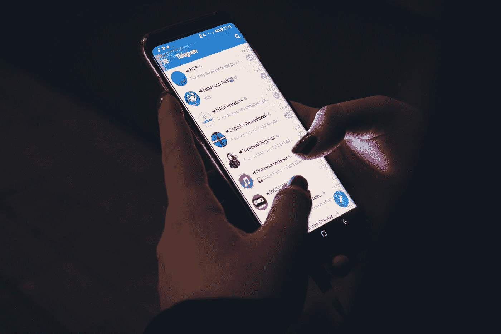
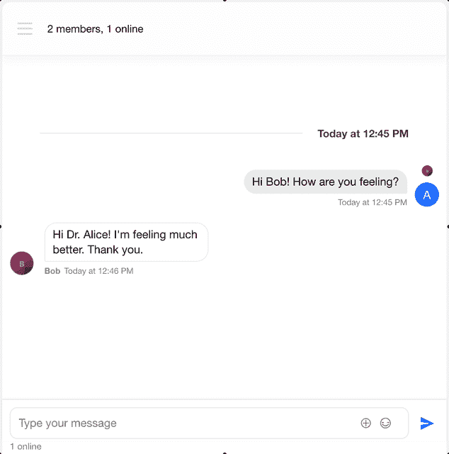
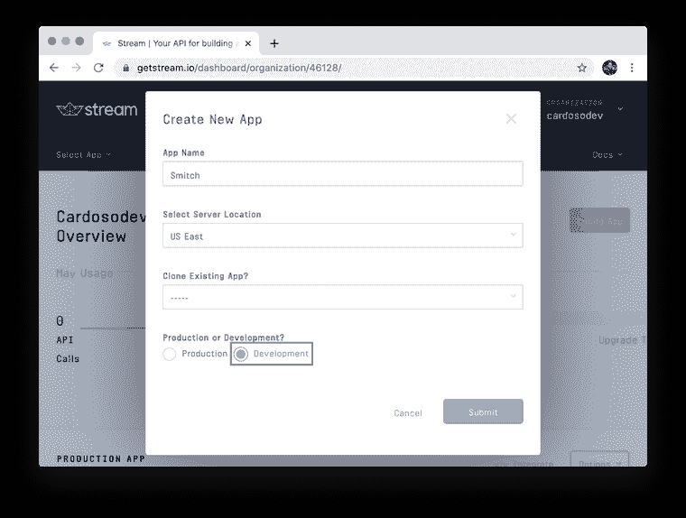
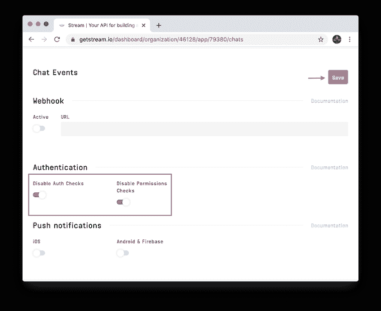
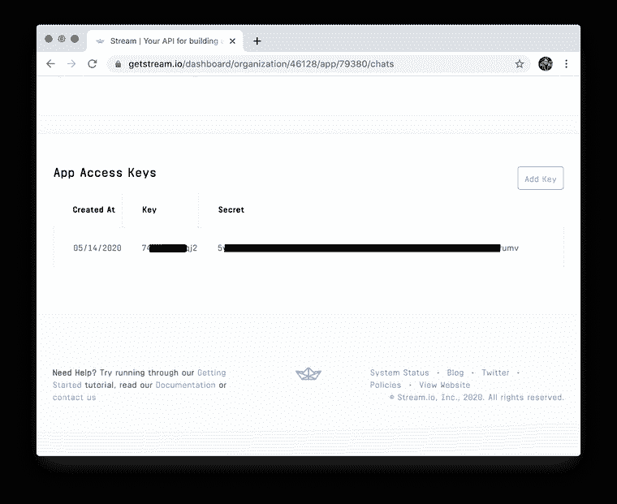
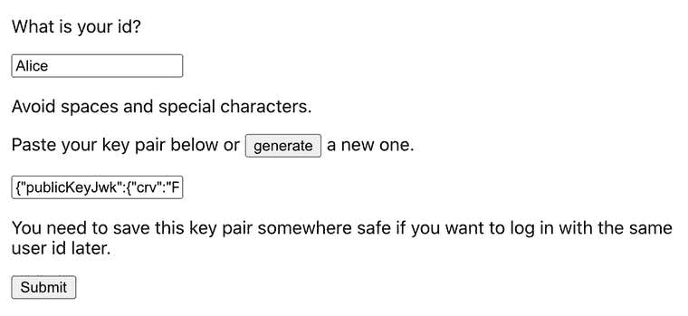
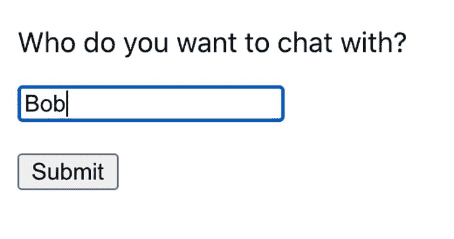
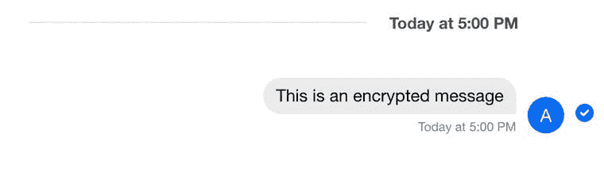
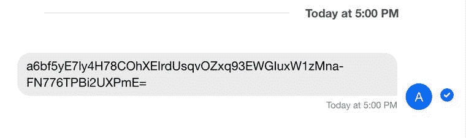

# 使用 Web Crypto API 进行端到端加密聊天

> 原文：<https://levelup.gitconnected.com/end-to-end-encrypted-chat-with-the-web-crypto-api-dd30718ce884>

克里斯蒂安·威迪格在 [Unsplash](https://unsplash.com?utm_source=medium&utm_medium=referral) 上拍摄的照片

当传输或存储用户数据，尤其是私人对话时，考虑使用加密技术来确保隐私是至关重要的。

通过阅读本教程，您将了解如何在 web 应用程序中使用 JavaScript 和本地浏览器 API[Web Crypto API](https://developer.mozilla.org/en-US/docs/Web/API/Web_Crypto_API)进行端到端的数据加密。

**请注意，本教程非常基础，而且具有严格的教育性，可能包含简化内容，并且不建议开发自己的加密协议。如果在安全专家的帮助下使用不当，所使用的算法可能包含某些“陷阱”**

如果你碰巧迷路了，你也可以在这个 [GitHub repo](https://github.com/GetStream/encrypted-web-chat) 中找到完整的项目。如果你有任何问题，请随时通过 [Twitter](https://twitter.com/cardosodev) :)联系我。

# 什么是端到端加密？

> *端到端加密是一种通信系统，在这种系统中，只有通信人员才能读取消息。任何窃听者都无法获取解密对话所需的密钥，即使是运行消息服务的公司也不行。*

*   [*黑客词典:什么是端到端加密*](https://www.wired.com/2014/11/hacker-lexicon-end-to-end-encryption/)

# 什么是 Web 加密 API？

> *Web Cryptography API 定义了一个低级接口，用于与由用户代理管理或公开的密钥材料进行交互。API 本身不知道密钥存储的底层实现，但提供了一组公共接口，允许富 web 应用程序执行诸如签名生成和验证、散列和验证、加密和解密等操作，而无需访问原始密钥材料。*

*   [*W3C:网络加密 API*](https://www.w3.org/TR/WebCryptoAPI/)

# 基础知识

在下面的步骤中，我们将声明端到端加密中涉及的基本功能。你可以把每一个都复制到一个专用的`lib`文件夹下的`.js`文件中。注意，由于 Web Crypto API 的异步特性，它们都是 `async`函数。

注意:并不是所有的浏览器都实现了我们将要使用的算法。即 Internet Explorer 和 Microsoft Edge。查看 [MDN web docs:微妙的加密-Web API](https://developer.mozilla.org/en-US/docs/Web/API/SubtleCrypto#Browser_compatibility)的兼容性表。

# 生成密钥对

加密密钥对对于端到端加密至关重要。一个**密钥对**由一个**公钥**和一个**私钥**组成。应用程序中的每个用户都应该有一个密钥对来保护他们的数据，公共组件对其他用户可用，私有组件只对密钥对的所有者可用。在下一节中，您将理解这些是如何发挥作用的。

为了生成密钥对，我们将使用`[window.crypto.subtle.generateKey](https://www.w3.org/TR/WebCryptoAPI/#SubtleCrypto-method-generateKey)`方法，并使用`[window.crypto.subtle.exportKey](https://www.w3.org/TR/WebCryptoAPI/#SubtleCrypto-method-exportKey)`以 [JWK 格式](https://tools.ietf.org/html/rfc7517)导出私有和公共密钥。后者是保存或传输这些密钥所必需的。可以把它看作是在 JavaScript 之外序列化键的一种方式。

此外，我选择了带有 P-256 椭圆曲线的 ECDH 算法，因为它得到了很好的支持，并且在安全性和性能之间取得了平衡。随着新算法的出现，这种偏好会随着时间而改变。

注意:导出私钥会导致安全问题，因此必须小心处理。允许用户复制和粘贴它的方法将在本教程的集成部分介绍，这不是一个很好的实践，只是出于教育目的。

# 派生密钥

我们将使用上一步中生成的密钥对来导出对称密钥，该密钥对数据进行加密和解密，并且对于任何两个通信用户都是唯一的。例如，用户 A 使用他们的私钥和用户 B 的公钥导出密钥，而用户 B 使用他们的私钥和用户 A 的公钥导出相同的密钥。没有人能够在不访问至少一个用户私钥的情况下生成**派生密钥**，因此保证它们的安全是至关重要的。

在上一步中，我们以 JWK 格式导出了密钥对。在我们可以导出密钥之前，我们需要使用`[window.crypto.subtle.importKey](https://www.w3.org/TR/WebCryptoAPI/#SubtleCrypto-method-importKey)`将它们导入回初始状态。为了获得密钥，我们将使用`[window.crypto.subtle.deriveKey](https://www.w3.org/TR/WebCryptoAPI/#SubtleCrypto-method-deriveKey)`。

在这种情况下，我选择了 [AES-GCM 算法](https://www.w3.org/TR/WebCryptoAPI/#aes-gcm)，因为它具有已知的安全性/性能平衡和浏览器可用性。

# 加密文本

现在我们可以使用派生的密钥来加密文本，所以传输它是安全的。

在加密之前，我们将文本编码成一个`Uint8Array`，因为这是加密函数所需要的。我们使用`[window.crypto.subtle.encrypt](https://www.w3.org/TR/WebCryptoAPI/#SubtleCrypto-method-encrypt)`对该数组进行加密，然后将它的`ArrayBuffer`输出返回到`Uint8Array`，然后再返回到`string`并将其编码到 [Base64](https://en.wikipedia.org/wiki/Base64) 。JavaScript 让它变得有点复杂，但这只是一种将加密数据转化为可传输文本的方式。

如您所见，AES-GCM 算法参数包括一个[初始化向量](https://en.wikipedia.org/wiki/Initialization_vector) (iv)。对于每个加密操作，它可以是随机的，但绝对必须是唯一的，以确保加密的强度。它包含在消息中，因此可以在解密过程中使用，这是下一步。此外，虽然不太可能达到这个数字，但您应该在使用 2 次后丢弃密钥，因为随机 IV 会在该点重复。

# 解密文本

现在我们可以使用派生的密钥来**解密**我们收到的任何加密文本，做的正好与加密步骤相反。

在解密之前，我们检索初始化向量，将字符串从 Base64 转换回来，转换成一个`Uint8Array`，并使用相同的算法定义解密。之后，我们解码`ArrayBuffer`并返回人类可读的字符串。

也有可能由于使用了错误的派生密钥或初始化向量而导致解密过程失败，这意味着用户没有正确的密钥对来解密他们收到的文本。在这种情况下，我们会返回一条错误消息。

# 集成到您的聊天应用中

这就是所有需要的加密工作！在接下来的部分中，我将解释我如何使用我们上面实现的方法对一个聊天应用程序进行端到端加密，这个应用程序是用 [Stream Chat 的强大的 React 聊天组件](https://getstream.io/chat/react-chat/tutorial/)构建的。

# 克隆项目

在本地文件夹中克隆[加密网络聊天库](https://github.com/getstream/encrypted-web-chat)，安装依赖项并运行它。

之后，应该会打开一个浏览器选项卡。但是首先，我们需要用我们自己的流聊天 API 键来配置项目。

# 配置流聊天仪表板

在 [GetStream.io](https://getstream.io/) 创建您的帐户，创建一个应用程序，并选择开发而不是生产。

为了简化，让我们禁用授权检查和权限检查。确保点击保存。当你的应用程序在生产中，你应该保持这些启用，并有一个后端为用户提供令牌。

如需进一步参考，请参见[认证文档](https://getstream.io/chat/docs/tokens_and_authentication/?language=js)和[权限文档](https://getstream.io/chat/docs/chat_permission_policies/?language=js)。

请注意流凭据，因为我们将在下一步中使用它们来初始化应用程序中的聊天客户端。因为我们禁用了身份验证和权限，所以我们现在只需要密钥。不过，在未来，您将使用后端的秘密来[实现身份验证，为流聊天](https://getstream.io/docs/auth_and_permissions/)发布用户令牌，这样您的聊天应用程序就可以拥有适当的访问控制。

如你所见，我修改了我的钥匙。如果您妥善保管这些凭据，那将是最好的选择。

# 更改凭据

在`[src/lib/chatClient.js](https://github.com/GetStream/encrypted-web-chat/blob/main/src/lib/chatClient.js)`中，用你的钥匙更换钥匙。我们将使用这个对象进行 API 调用并配置聊天组件。

在这之后，您应该能够测试应用程序了。在接下来的步骤中，您将理解我们定义的函数在哪里。

# 设置用户

在`[src/lib/setUser.js](https://github.com/GetStream/encrypted-web-chat/blob/main/src/lib/setUser.js)`中，我们定义了设置聊天客户端用户的函数，并用给定密钥对的公钥更新它。其他用户需要发送公钥来获取加密和解密与我们用户的通信所需的密钥。

在这个函数中，我们导入了上一步中定义的`chatClient`。它获取一个用户 id 和一个**密钥对**，然后调用`chatClient.setUser`来设置用户。之后，它检查该用户是否已经有了一个公钥，以及它是否与给定的密钥对中的公钥相匹配。如果公钥匹配或者不存在，我们用给定的公钥更新该用户；如果没有，我们断开连接并显示一个错误。

# 发送方组件

在`[src/components/Sender.js](https://github.com/GetStream/encrypted-web-chat/blob/main/src/components/Sender.js)`中，我们定义第一个屏幕，在这里我们选择我们的用户 id，并且可以使用我们在`generateKey.js`中描述的函数生成一个密钥对，或者，如果这是一个现有用户，粘贴在用户创建时生成的密钥对。

# 收件人组件

在`[src/components/Recipient.js](https://github.com/GetStream/encrypted-web-chat/blob/main/src/components/Recipient.js)`中，我们定义了第二个屏幕，在这里我们选择想要与之通信的用户的 id。该组件将使用`[chatClient.queryUsers](https://getstream.io/chat/docs/query_users/?language=js)`获取该用户。调用的结果将包含用户的公钥，我们将使用它来导出加密/解密密钥。

# KeyDeriver 组件

在`[src/components/KeyDeriver.js](https://github.com/GetStream/encrypted-web-chat/blob/main/src/components/KeyDeriver.js)`中，我们定义了第三个屏幕，在这里使用我们在`deriveKey.js`中实现的方法，使用发送者(us)的私钥和接收者的公钥来导出密钥。该组件只是一个被动加载屏幕，因为所需的信息已在前两个屏幕中收集。但是如果键有问题，它会显示一个错误。

# 加密消息组件

在`[src/components/EncryptedMessage.js](https://github.com/GetStream/encrypted-web-chat/blob/main/src/components/EncryptedMessage.js)`中，我们定制了流聊天的消息组件，使用我们在`decrypt.js`中定义的方法以及加密数据和派生密钥来解密消息。

如果没有消息组件的这种定制，它将如下所示:

定制是通过包装流聊天的`MessageSimple`组件并使用`useEffect`钩子通过解密方法修改消息属性来完成的。

# EncryptedMessageInput 组件

在`[src/components/EncryptedMessageInput.js](https://github.com/GetStream/encrypted-web-chat/blob/main/src/components/EncryptedMessageInput.js)`中，我们定制了 Stream Chat 的 MessageInput 组件，在发送消息之前使用我们在`encrypt.js`中定义的方法对消息进行加密。

定制是通过包装 Stream Chat 的`MessageInputLarge`组件并将`overrideSubmitHandler`属性设置为在发送到频道之前加密文本的函数来完成的。

# 聊天组件

最后，在`[src/components/Chat.js](https://github.com/GetStream/encrypted-web-chat/blob/main/src/components/Chat.js)`中，我们使用 Stream Chat 的组件以及我们的自定义消息和 EncryptedMessageInput 组件构建了整个聊天屏幕。

`MessageList`组件有一个`Message`属性，设置为自定义的`EncryptedMessage`组件，而`EncryptedMessageInput`可以放在层次结构中它的正下方。

# Web 加密 API 的后续步骤

恭喜你！您刚刚学习了如何在您的 web 应用程序中实现基本的端到端加密。要知道这是最基本的端到端加密形式，这一点很重要。它缺乏一些额外的调整，使其在现实世界中更加防弹，例如[随机填充](https://en.wikipedia.org/wiki/Padding_(cryptography)#Randomized_padding)、[数字签名](https://en.wikipedia.org/wiki/Digital_signature)和[前向保密](https://en.wikipedia.org/wiki/Forward_secrecy)等等。此外，对于现实世界的使用，获得应用程序安全专业人员的帮助是至关重要的。