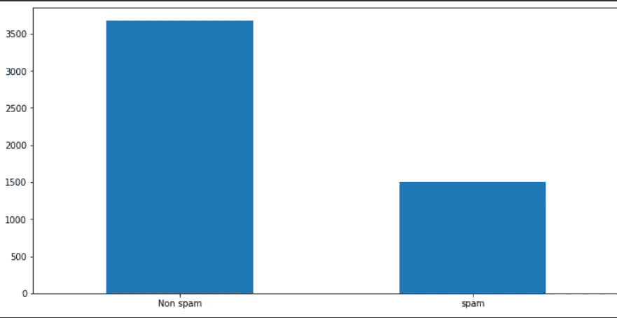
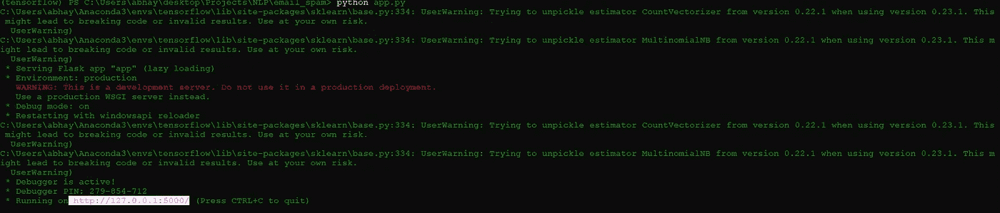
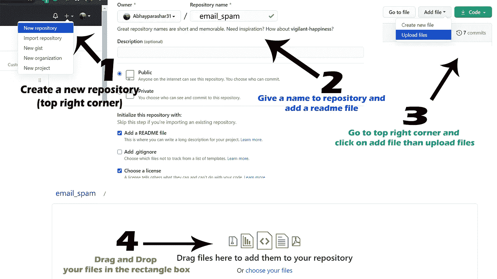
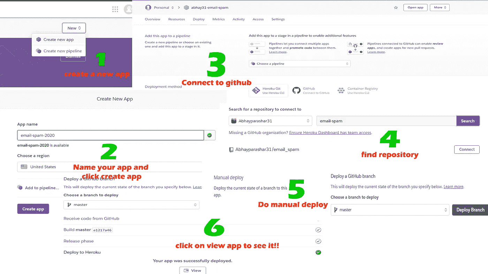
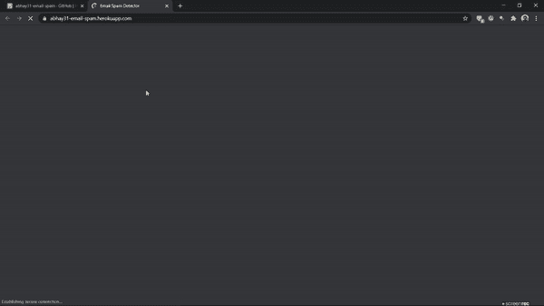

# 使用 ML、NLP 和 Heroku 构建和部署垃圾邮件分类器🚀

> 原文：<https://levelup.gitconnected.com/end-to-end-project-on-spam-classifier-from-training-to-deployment-fd9232cb1323>

端到端 NLP 项目，直到部署


照片由 [Nghia Le](https://unsplash.com/@lephunghia?utm_source=medium&utm_medium=referral) 在 [Unsplash](https://unsplash.com?utm_source=medium&utm_medium=referral) 上拍摄

根据《福布斯》上的一篇文章，我们每天产生大约 2.5 万亿字节的数据，并且这些数据在未来五年内将增加 5 倍。在如此庞大的数据量中，几乎 90%的数据是未标记的和无用的。它是无用的，因为我们不知道如何使用它。数据科学家和机器学习专家的角色来了。数据科学家有能力将无用的数据转换成有用的形式，以便任何人都能理解。

这些数据中很大一部分是文本数据，无论是评论、消息、投诉还是其他形式。目前，主要任务之一是设计某种技术，使用该技术我们可以容易地对数据进行分类并更好地理解它。[的作用来了**自然语言处理**](https://medium.com/swlh/basics-of-natural-language-processing-in-10-minutes-2ed51e6d5d32) 。自然语言处理可以让我们很好地理解文本数据。它给了我们将文本分类到不同类别的能力。如果你从事计算机科学的职业，那么你必须很好地学习这些东西和它们的概念。

不要等待合适的时机到来，无论你什么时候开始，那个时机都会成为你合适的时机。

当你开始学习和进入人工智能领域时，你经常会看到许多教程和博客向你解释不同的算法和方法，但你很难找到一些博客或教程会教你使用一些项目的概念。好吧，我不是所有这些人。

在这篇博客中，我们将从头开始实现一个垃圾邮件分类器。首先，我们训练我们的模型，然后我们测试我们的模型，之后使用 flask 和 journal HTML 和 CSS，我们为我们的模型创建一个 web 应用程序，稍后我们还将使用 Heroku 部署它。

所以如果我们对自然语言处理一无所知，先去看看我的博客吧。

[](https://medium.com/swlh/basics-of-natural-language-processing-in-10-minutes-2ed51e6d5d32) [## 10 分钟自然语言处理基础

### 你也想尽快学会 NLP 吗？？？

medium.com](https://medium.com/swlh/basics-of-natural-language-processing-in-10-minutes-2ed51e6d5d32) 

## 我们将分四步完成我们的项目。

1.  ***使用 ML 和 NLP 创建模型***
2.  ***使用 flask 创建一个 web 应用程序并将其与模型*** 连接
3.  ***将项目提交给 Github***
4.  ***使用 Heroku*** 部署我们的模型

# 在开始之前，我们先来设置一下我们的环境

1.  ***下载最新版本的 Python***

[](https://www.python.org/downloads/) [## 下载 Python

### 关于特定端口的信息、开发人员信息来源和二进制可执行文件由发布经理或……

www.python.org](https://www.python.org/downloads/) 

2. ***安装需要的包***

所有软件包都可以使用 cmd(终端)中的 pip 进行安装。

```
pip install pandas,numpy,scikit-learn,matplotlib,nltk,seaborn
```

3. ***安装 Jupyter 笔记本***

```
pip install jupyter-notebookjupyter notebook ## For running
```

完成所有三个步骤后，现在让我们开始我们的项目。

# 在 jupyter 中打开一个新笔记本，按照以下步骤操作

# 1.使用 ML 和 NLP 创建模型

## **导入必要的库**

```
import numpy as np **## scientific computation**import pandas as pd **## loading dataset file**import matplotlib.pyplot as plt **## Visulization**import nltk  **## Preprocessing our text**from nltk.corpus import stopwords **## *removing all the stop words***from nltk.stem.porter import PorterStemmer **## stemming of words**
```

**NLTK:** 自然语言处理工具包是一个 python 库，用于执行所有的自然语言处理任务，如词干提取、词汇化或删除停用词等。

波特·斯特梅尔:这是一种用于堵塞的去梗器。词干提取基本上是一种将单词转换成其词根的技术。
例:学习→学习

# 数据集

我们将要使用的数据集是 Kaggle 上的开源数据集。

数据集: [spam_ham_dataset.csv](https://www.kaggle.com/venky73/spam-mails-dataset)

## **关于数据集**

数据集包含三列。数据集的大小约为 5.65mb，总共约有 5000 行。

## 列

Label: ham，spam
Text:文本或电子邮件的集合
Label_num: 0 表示火腿，1 表示垃圾邮件

## 工作

> 我们的任务是创建一个机器学习模型，可以准确预测一封电子邮件是否是垃圾邮件。

## 将数据集加载到笔记本中

```
df = pd.read_csv("spam_ham_dataset.csv")
```

# 数据集上的 EDA

```
print(data.shape)  ### Return the shape of data 
print(data.ndim)   ### Return the n dimensions of data
print(data.size)   ### Return the size of data 
print(data.isna().sum())  ### Returns the sum fo all na values
print(data.info())  ### Give concise summary of a DataFrame
print(df.head())  ## top 5 rows of the dataframe
print(df.tail()) ## bottom 5 rows of the dataframe
```

运行上述代码块后，您将会看到我们的数据集中没有任何空值。另外，需要注意的一点是，我们的中只有一列有数值，所以我们只能可视化该列。

## 让我们可视化列 *label_num*

我们只能看到列中两个类别的数量。

```
df["label_num"].value_counts().plot(kind="bar",figsize=(12,6))
plt.xticks(np.arange(2), ('Non spam', 'spam'),rotation=0);
```



“作者提供的图像”

在该图中，我们可以看到几乎 3500 条不是垃圾邮件，大约 1500 条是垃圾邮件。

# 清理文本

在任何 NLP 问题中，最重要的步骤是清理文本。清理文本意味着删除所有标点符号、删除停用词、执行词干分析、词汇化，并将文本转换为向量。

```
import re
corpus = []
length = len(df)
for i in range(0,length):
    text = re.sub("[^a-zA-Z0-9]"," ",df["text"][i])
    text = text.lower()
    text = text.split()
    pe = PorterStemmer()
    stopword = stopwords.words("english")
    text = [pe.stem(word) for word in text if not word in set(stopword)]
    text = " ".join(text)
    corpus.append(text)print(corpus)
```

**解释:**

第 1 行:我们正在导入 re 库，它用于在 python 中执行 regex。第 2 行:定义一个空的语料库列表，可以用来存储所有清理后的文本。
第 3 行:用数据帧的长度初始化 var length。
第 4 行:运行一个从 0 到数据帧长度的循环。
第 5 行:删除除小写字母、大写字母和数字之外的所有字符。
第 6 行:将文本转换为小写。
第 7 行:按空格分割文本。
第 8 行:创建 porter stemmer 的对象。
第 9 行:将英语词典中的所有停用词初始化为 var 停用词
第 10 行:在句子的长度上运行一个循环，然后对句子中的每个词在停用词中进行检查，如果在停用词中没有找到，则对文本应用词干并将其添加到列表中。
第 11 行:将所有单词连接起来组成一个句子
第 12 行:将句子附加到语料库列表
第 13 行:打印语料库列表。

在清理过程中，下一步是将句子列表(语料库)转换为向量，以便我们可以将这些数据输入到我们的机器学习模型中。为了将文本转换成向量，我们将使用一个单词包，它将文本转换成二进制形式。'

```
from sklearn.feature_extraction.text import CountVectorizercv = CountVectorizer(max_features=35000)X = cv.fit_transform(corpus).toarray()
```

第 1 行:我们从 sklearn 导入 CountVectorizer。
第 2 行:为计数矢量器创建一个对象，最大特征数为 35000，这意味着我们只获取前 35000 列。
第 3 行:使用 CV，我们正在拟合 are 语料库，并将其转换为向量。

## **转储简历以备将来使用**

为了预测新邮件，我们需要保存我们的模型和计数矢量器。

```
import pickle ## importing pickle used for dumping modelspickle.dump(cv, open('cv.pkl', 'wb')) ## saving to into cv.pkl file
```

# 建模和培训

## 使用 train_test_split 将数据拆分为训练集和验证集

```
from sklearn.model_selection import train_test_splitX_train, X_test, y_train, y_test = train_test_split(X, y, test_size = 0.20, random_state = 0)##train size 80% and test size 20%
```

## 使用多项式贝叶斯方法创建模型

```
from sklearn.naive_bayes import MultinomialNBmodel = MultinomialNB()
```

## 将模型拟合到训练集

```
model.fit(X_train, y_train)
```

## 预言；预测；预告

```
y_pred=model.predict(X_test)y_pred
```

# 评估模型

我们将使用混淆矩阵和准确度分数来评估我们的模型。

```
from sklearn.metrics import confusion_matrix,accuracy_scorecm = confusion_matrix(y_test, y_pred)score = accuracy_score(y_test,y_pred)print(cm,score*100)
```

***输出:***

```
[[716  16]
 [ 18 285]] 96.71497584541063
```

> **太好了，我们得到了 96.71%的准确率**

# 保存我们的模型

为了保存我们的模型，我们将使用 pickle。

```
import pickle
pickle.dump(model, open("spam.pkl", "wb"))
```

现在，让我们通过加载和测试测试数据来测试我们的保存模型。

```
loaded_model = pickle.load(open("spam.pkl", "rb"))
loaded_model.predict(X_test)
loaded_model.score(X_test,y_test)#####OUTPUT######
96.71497584541063
```

# 新邮件的预测

```
def new_review(new_review):
  new_review = new_review
  new_review = re.sub('[^a-zA-Z]', ' ', new_review)
  new_review = new_review.lower()
  new_review = new_review.split()
  ps = PorterStemmer()
  all_stopwords = stopwords.words('english')
  all_stopwords.remove('not') new_review = [ps.stem(word) for word in new_review if not word in   set(all_stopwords)]
  new_review = ' '.join(new_review)
  new_corpus = [new_review]
  new_X_test = cv.transform(new_corpus).toarray()
  new_y_pred = loaded_model.predict(new_X_test)
return new_y_prednew_review = new_review(str(input("Enter new review...")))
if new_review[0]==1:
  print("SPAM")
else :
  print("NOT SPAM")
```

尝试运行上面的代码，键入一封随机的电子邮件，并检查我们的模型将如何正确地预测垃圾邮件和非垃圾邮件。

```
Enter new review...
IMPORTANT - You could be entitled up to £3,160 in compensation from mis-sold PPI on a credit card or loan. Please reply PPI for info or STOP to opt out. SPAMEnter new review...
hi scott, i was wondering you have submitted your project or notNOT SPAM
```

# 2.使用 flask 创建 web 应用程序并将其与模型连接

因此，要创建一个 web 应用程序，让我们首先准备一个如下所示的文件夹结构

```
email_spam(root)
    |____templates
            |___index.html  ## homepage file
            |___result.html ## to show prediction
    |____static
            |____style.css  ## css file 
    |____app.py  ## main flask file
    |_____spam.pkl ## ml model
    |______cv.pkl  ## count vectorizer
```

***index . html:*** 创建一个供用户输入新邮件的输入框，以及一个将文本发送到服务器的按钮。

***result . html:*** 你想显示 gif 还是纯文本还是两者都显示来代替垃圾邮件和非垃圾邮件，这是你的愿望。

***style . css* 它是一个 CSS 文件，用来让网页好看。这取决于你，只要按照你的意愿去设计。**

你可以从我的 Github 帐户下载并使用我的模板和静态目录。

[](https://github.com/Abhayparashar31/email_spam) [## Abhayparashar31/email_spam

### 通过在 GitHub 上创建一个帐户，为 Abhayparashar31/email_spam 开发做贡献。

github.com](https://github.com/Abhayparashar31/email_spam) 

***app.py:***

现在让我们在本地主机上运行代码

打开 CMD 并转到根(email_spam)文件夹，然后使用`python app.py`运行 app.py，然后您会看到如下消息👇



只需在任意浏览器中打开网址( [http://127.0.0.1:5000/](http://127.0.0.1:5000/) )，使用一些新的随机邮件测试 web app 即可。

# 3.将项目提交给 Github

在将项目提交给 Github 之前，我们还要创建两个文件。

**1。Profile:** Heroku 应用程序包含一个 Procfile，它指定了应用程序在启动时执行的命令。

```
web: gunicorn app:app
```

**2。requires . txt:**要求。txt 文件用于指定运行项目所需的 python 包。

```
Flask==1.1.1
gunicorn==19.9.0
itsdangerous==1.1.0
Jinja2==2.10.1
MarkupSafe==1.1.1
Werkzeug==0.15.5
numpy>=1.9.2
scipy>=0.15.1
scikit-learn>=0.18
matplotlib>=1.4.3
pandas>=0.19
```

现在之后，去你的 Github 账户上传文件，然后提交给分支机构。

如果你不知道怎么做，就按照下面的步骤去做。



“作者提供的图像”

# 4.使用 Heroku 部署模型

访问 [Heroku](https://signup.heroku.com/) 并创建一个免费帐户，然后登录您的帐户。

登录后，创建一个新的应用程序，并连接到你的 Github，然后手动部署。您将看到一个 URL，您可以通过该 URL 访问您的应用程序。

如果你不知道怎么做，就按照图中所示的步骤去做。



“作者提供的图像”



“作者图片:

***你可以在我的 Github 简介里找到所有的源代码***[***abhayparashar 31***](https://github.com/Abhayparashar31/Diabetes-prediction)

## 感谢阅读😃

# 关于作者

我是 Abhay Parashar，一个迷上 AI 的 python 爱好者。我是一名计算机专业的学生。一个狂热的作家和程序员。我发布关于 python，机器学习，NLP，以及更多与 AI 相关的文章。我也张贴不同种类的关于机器学习的端到端项目。

# 未来读物

[](https://towardsdatascience.com/build-deploy-diabetes-prediction-app-using-flask-ml-and-heroku-2de07cbd902d) [## 使用 Flask、ML 和 Heroku 构建和部署糖尿病预测应用程序

### 面向机器学习爱好者的端到端项目部署👍

towardsdatascience.com](https://towardsdatascience.com/build-deploy-diabetes-prediction-app-using-flask-ml-and-heroku-2de07cbd902d) [](https://medium.com/10-minutes-data-science/cuda-installation-in-windows-2020-638b008b4639) [## windows 中的 Cuda 安装(2020)-逐步过程

### 使用 GPU 训练您的深度学习模型

medium.com](https://medium.com/10-minutes-data-science/cuda-installation-in-windows-2020-638b008b4639)