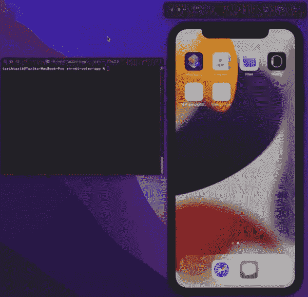

# React Native 中的端到端测试

> 原文：<https://levelup.gitconnected.com/end-to-end-testing-in-react-native-79d23dbf0168>

用 Javascript 编写跨平台的端到端测试


[自由股票](https://unsplash.com/@freestocks?utm_source=medium&utm_medium=referral)在 [Unsplash](https://unsplash.com?utm_source=medium&utm_medium=referral) 上的照片

如今，为代码编写测试已经成为编程的重要部分。有不同类型的软件测试方法，例如*单元测试、集成测试、*和*端到端测试。他的文章将涵盖我们如何在一个简单的 react-native 应用程序上应用端到端测试。*

我们将使用由 [**Wix**](https://github.com/wix) 团队开发和维护的 [**Detox**](https://github.com/wix/Detox) 库。

这个应用程序非常简单！它允许用户*喜欢*他们最喜欢的任天堂 64 应用。也就是说，实际上有一个特定的行为需要在应用程序中测试。*喜欢*功能性！

## 用户故事

让我们列出该功能的所有用户操作:

1.  用户打开应用程序。
2.  用户看到游戏卡，游戏卡上有一个*喜欢*按钮和一个*总* *数量的喜欢文字*。(比较用户操作后的文本)
3.  用户像按按钮一样按下*。*
4.  用户注意到*像*文本发生了变化。这种情况下，赞数加一。

```
***CAVEAT:*** *This user story can be considered an integration test in theory. Yet since the app itself is only responsible for allowing users to like their game, it is treated as end-to-end testing.*
```

## **代码**

当我们按顺序浏览用户故事时，我们将生成我们的代码。每个代码块最终将对应于一个特定的用户故事。

1.  **用户打开应用。**

2.**用户看到游戏卡，游戏卡上有一个*喜欢*按钮和一个*总* *喜欢文字数量*可用。(比较用户动作后的文本)**

3.**用户像按按钮一样按下*。***

4.**用户注意到*和*一样的文本发生了变化。这种情况下，赞数加一。**

## **完整代码**

## **演示**

让我们看看所有的活动。



本文介绍了 react-native 应用程序中端到端测试的初步情况。为了简单起见，应用程序本身足够简单，可以演示端到端测试的基本方面。实际上，在现实生活/生产应用中，它可能比这个更复杂。

你可以使用下面的链接来看看这个应用程序的最终源代码。

祝大家有一个无虫的一天！

[Github 源代码](https://github.com/tarikpnr/react-native-n64-voter-app)

# 分级编码

感谢您成为我们社区的一员！在你离开之前:

*   👏为故事鼓掌，跟着作者走👉
*   📰更多内容请查看[升级编码刊物](https://levelup.gitconnected.com/?utm_source=pub&utm_medium=post)
*   🔔关注我们:[推特](https://twitter.com/gitconnected) | [LinkedIn](https://www.linkedin.com/company/gitconnected) | [时事通讯](https://newsletter.levelup.dev)

🚀👉 [**加入升级人才集体，找到一份神奇的工作**](https://jobs.levelup.dev/talent/welcome?referral=true)