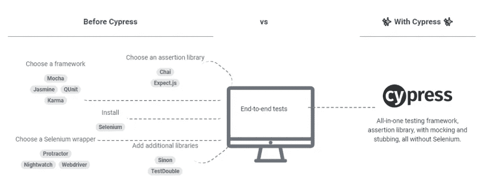
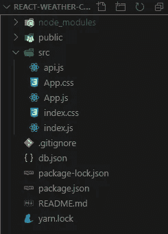
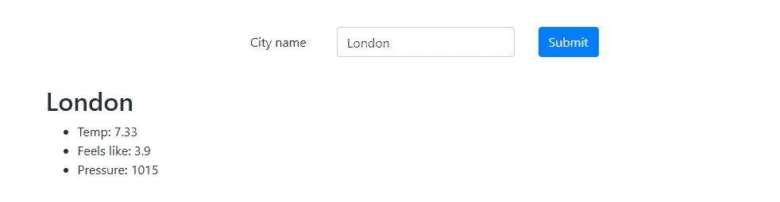
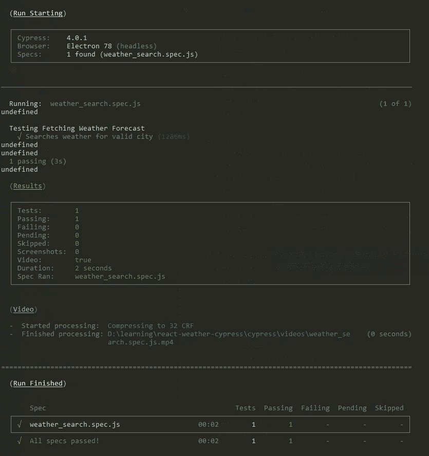
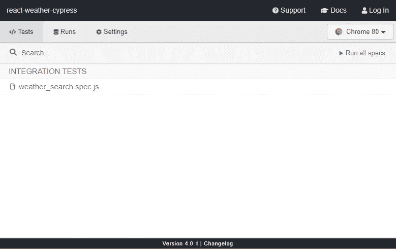
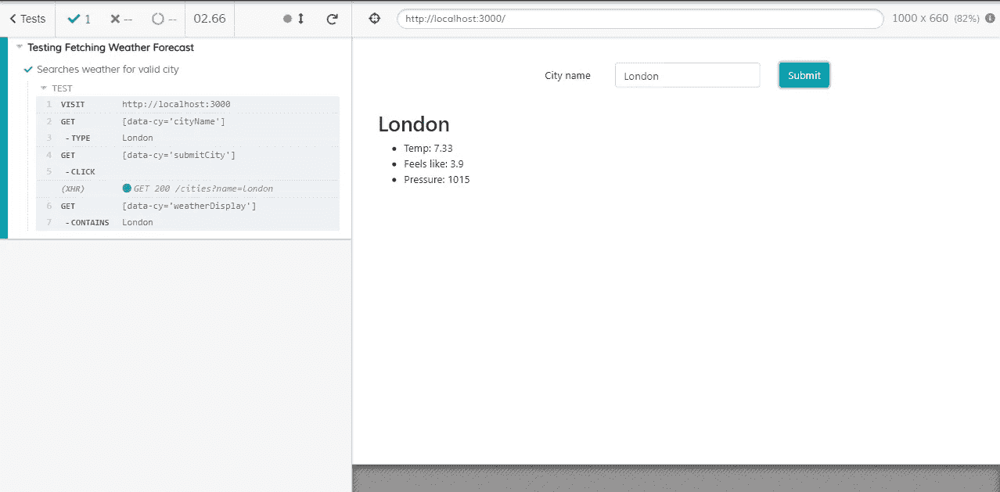
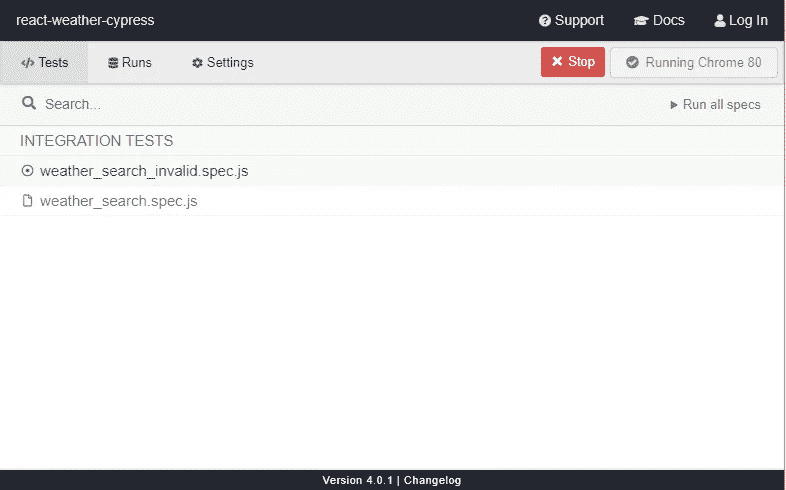
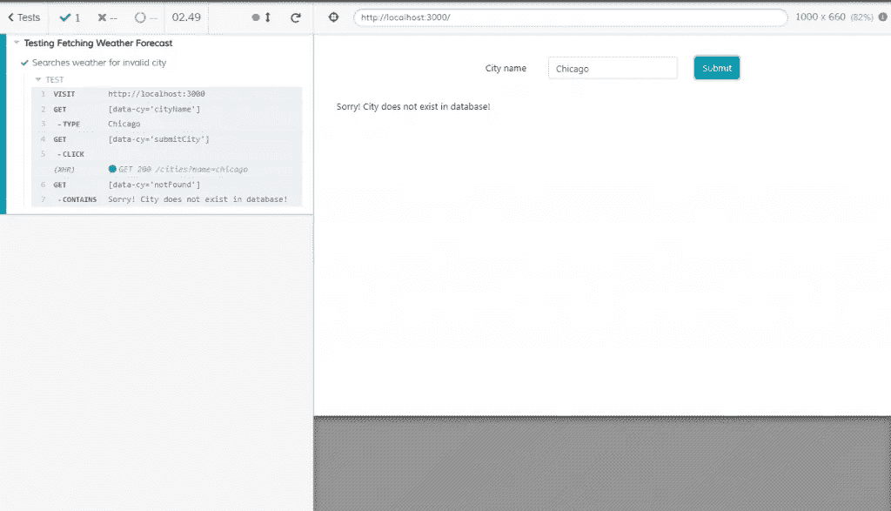

# 使用 Cypress.io 进行端到端测试——程序员书房

> 原文：<https://levelup.gitconnected.com/end-to-end-testing-with-cypress-io-programmer-den-289fe1e483a4>

前端 web 开发在过去的十年中发展迅速，导致单页面应用程序成为向最终用户提供 web 应用程序的标准。因此，像 Angular 和 React 这样的 JavaScript 框架在开发客户端 web 应用程序方面获得了极大的欢迎。许多繁重的计算和复杂的逻辑实现已经从后端转移到浏览器，导致对我们的应用程序的集成测试的需求不断增长。

过去，QA 工程师通过在浏览器中手动测试应用程序来测试新实现的前端功能，如果一切正常，该功能将被接受并准备交付生产。对于小型应用程序来说，这似乎是一个足够的解决方案，但是，随着应用程序的增长，这种测试方法不能很好地扩展。想象一个中型到大型的应用程序，有多个开发人员在开发多个不同的特性。在新开发的功能发布到生产环境之前，确保它不会破坏应用程序中任何已存在的功能是至关重要的。手动测试所有特性以确保每次实现新特性时它们都不会受到影响几乎是不可能的，更不用说还容易出现人为错误。

我们如何解决这个问题？ [Cypress.io](http://cypress.io) —端到端测试框架是*“每个开发人员和 QA 工程师都需要的前端测试新标准”*。你可能听说过其他端到端测试解决方案，尤其是 [Selenium](https://en.wikipedia.org/wiki/Selenium_(software)) 是过去几年中最流行的框架之一。然而，开发人员经常回避使用 Selenium 编写测试，因为设置它是多么令人生畏，更不用说用它编写测试了。Cypress 的主要目标之一是确保设置、编写、运行和调试测试都很容易。



因此，让我们开始使用 Cypress 编写我们的第一个测试吧！

**注意:**因为这篇博文的目的是让您开始了解 Cypress，所以我不会详细介绍我是如何设置这个示例应用程序的。您可以从我的 GitHub [库](https://github.com/DennisDurairaj/react-weather-cypress)中获取源代码。一旦您对 Cypress 的工作原理有了基本的了解，您就可以使用它为您自己的应用程序编写测试。

我们将测试的应用程序是一个简单的天气预报应用程序，获取特定城市的天气信息。为了简单起见，我使用 [json-server](https://github.com/typicode/json-server) 创建了一个模拟 API，其中包含三个城市的固定数据库。天气详情从 [OpenWeatherAPI](https://openweathermap.org/api) 获取。整个应用都是用 [React](https://reactjs.org/) 编写的。

# 设置应用程序

**注意:**要完成本教程，您需要安装 Node.js。你可以在这里下载最新的稳定版本[。](https://nodejs.org/en/)

```
# Clone the github repo to your local machine 
git clone [https://github.com/DennisDurairaj/react-weather-cypress.git](https://github.com/DennisDurairaj/react-weather-cypress.git) # Switch to the app directory 
cd react-weather-cypress # Install npm dependencies 
npm install
```

一旦你完成了上面的步骤，在你的代码编辑器中打开它，你应该会看到一个如下所示的文件夹结构——我选择的代码编辑器是 [Visual Studio Code](https://code.visualstudio.com/)



与我们相关的文件的简要说明-

*   这是我们 React 应用程序的入口点
*   **App.js** —我们的应用程序的容器组件。这是由 index.js 文件呈现的组件
*   **db . JSON**——被 [json-server](https://github.com/typicode/json-server) 用来模拟一个 API 后端服务器，其中包含三个城市的天气信息。
*   **api.js** —我们的 api 调用所在的文件。
*   package.json —包含我们的应用程序依赖项列表和可以为我们的应用程序运行的各种脚本。

让我们运行应用程序，以确保它正常工作。在您的终端中运行以下命令-

如果您查看 package.json 文件中的脚本配置，您会看到这个命令触发了另外两个命令— `npm run mockAPI`和`react-scripts start`。`npm run mockAPI`，顾名思义，在端口 3050 上启动我们的模拟 API 后端服务器。`react-scripts start` 在端口 3000 上启动我们的天气预报应用程序。

一旦应用程序在浏览器中加载，您应该会看到如下所示的主页


非常简约。为了简单起见，应用程序只支持获取 db.json 文件中三个预定义城市的信息。伦敦、巴黎和阿姆斯特丹。



请求任何其他城市会显示一条消息，表明在数据库中找不到该城市。


好了，我们已经建立并运行了我们的应用程序，现在我们如何实际测试它呢？让我们从设置 Cypress 开始，这样我们就可以开始编写我们的自动化测试。

# 系统需求

Cypress 是安装在您电脑上的桌面应用程序。桌面应用程序支持以下操作系统:

*   macOS 10.9 及以上版本(仅限 64 位)
*   Linux Ubuntu 12.04 及以上，Fedora 21 和 Debian 8(仅限 64 位)
*   Windows 7 及更高版本

让我们为我们的应用程序安装 cypress 作为一个开发依赖项

```
npm install cypress --save-dev
```

就这样，Cypress 现在已经安装好了，可以使用了！简单。

在我们编写测试之前，我们需要决定测试的规范是什么。如果你熟悉[敏捷](https://stackify.com/agile-methodology/)方法，用户故事遵循这样的格式:“作为一个用户，我想**执行**一个动作，这个动作给出一个确定的**结果**”

这可以为构建端到端测试打下良好的基础。测试应该模拟用户应该执行的操作，并断言操作后的应用程序状态与预期的结果相匹配。

通常，大多数前端测试可以分为以下步骤-

*   访问应用程序的 URL
*   查询页面上的元素，可以是输入框、链接、按钮等。
*   与元素交互，例如在输入框中输入文本，单击按钮等。
*   检查应用程序的新状态是否与预期的一致

记住这一点，让我们分析我们的应用程序，并列出用户可以与我们的应用程序交互的所有场景。我们的应用程序有两个功能-

*   用户在输入中输入一个城市名称，如果该城市出现在数据库中，它将返回该城市的天气
*   用户输入了数据库中不存在的城市名称，导致屏幕上显示“数据库中未找到城市”消息

现在我们有了我们的场景，让我们编写我们的第一个测试！

创建一个文件夹来存放我们所有的 Cypress 测试-

```
mkdir cypress && cd cypress mkdir integration && cd integration
```

我们的 Cypress 测试将存在于`/integration`文件夹中。

Cypress 需要在应用程序目录的根目录下有一个`cypress.json`配置文件才能启动，所以让我们添加一个。现在我们的`cypress.json`文件返回一个带有默认配置的空对象。

## 测试场景 1

*当用户访问应用程序时，在搜索框中键入有效的城市名称，用户应该会看到该城市的天气信息。*

在`/integration`文件夹中，我们创建一个名为`weather_search.spec.js`的新文件

与我们之前定义的步骤进行比较，让我们通过上面的测试，看看它是如何匹配的。

*   第 3 行:访问应用程序的 URL
*   第 4 行:查询页面上的一个元素，与之交互(输入)
*   第 5 行:查询页面上的一个元素，与之交互(点击)
*   第 6 行:检查应用程序的新状态是否如预期的那样

您可能已经注意到，我们告诉 Cypress 用属性`[data-cy='attributeName']`来“获取”元素。如果您查看我们的`App.js`文件，您会看到我们的选择器元素上有`data-cy`属性。使用`data-*`属性为我们的选择器提供上下文，并将它们与 CSS 或 JS 变化隔离开来，这被认为是一种最佳实践。你可以在这里了解更多信息[。](https://docs.cypress.io/guides/references/best-practices.html#Selecting-Elements)

在我们的`package.json`文件中，让我们添加两个脚本来运行我们的测试

*   `e2e-test` -以无头模式运行我们的测试
*   `cypress:open` -在浏览器中运行我们的测试

让我们进行测试。在终端运行`npm run e2e-test`。Cypress 查看了`/integration`文件夹，并运行了文件夹中的所有测试。现在我们有一个文件`weather_search.spec.js`



如您所见，Cypress 运行了我们的测试，并成功通过。

然而，还有另一种方法来运行我们的测试。它们可以在用户界面中运行，用户界面会启动一个浏览器来实时查看我们正在测试的应用程序。

如果您运行脚本`npm run cypress:open`，Cypress UI 将会打开-



点击“运行所有规格”或特定规格的名称，以打开测试浏览器，在我们的示例中，我们有一个名为`weather_search.spec.js`的测试



在左侧，您可以查看您的测试套件中已经通过或者失败的所有测试。在右边，您可以查看 Cypress 执行每个测试时应用程序的状态。

通过这个测试，我们已经能够断言，当用户搜索一个有效的城市时，预期的结果会显示在屏幕上。

## 测试场景 2

*当用户访问应用程序时，在搜索框中键入一个无效的城市名称，用户应该会看到一条消息说“城市不在数据库中”*

让我们在我们的`cypress/integration`文件夹中创建另一个测试文件，我们将其命名为`weather_search_invalid.spec.js`

一旦我们保存了它，新的测试将会在我们的 Cypress UI 测试套件中自动可见。



当你运行测试时，你应该看到它通过了-



这就是开始为您的前端应用程序编写测试是多么容易！

# 结论

您已经看到了 Cypress 是如何通过使开发人员和 QA 工程师易于实现来简化我们的应用程序的测试编写过程的。我们几乎没有探索 Cypress 的能力和它提供的一些特性。

例如，Cypress 拍摄测试过程的快照和视频，创建存根来模拟 API 响应，在测试前后运行钩子来清理应用程序的状态，等等。

编写良好的端到端测试可以节省数小时的开发时间，并有助于捕捉生产中出现的意外错误。您可以通过探索[文档](https://docs.cypress.io/guides/overview/why-cypress.html#In-a-nutshell)开始您的 Cypress 之旅，直到您足够舒适地开始编写自己的测试。

*原载于 2020 年 2 月 13 日*[*【https://programmerden.com】*](https://programmerden.com/2020/02/13/end-to-end-testing-with-cypress-io/)*。*