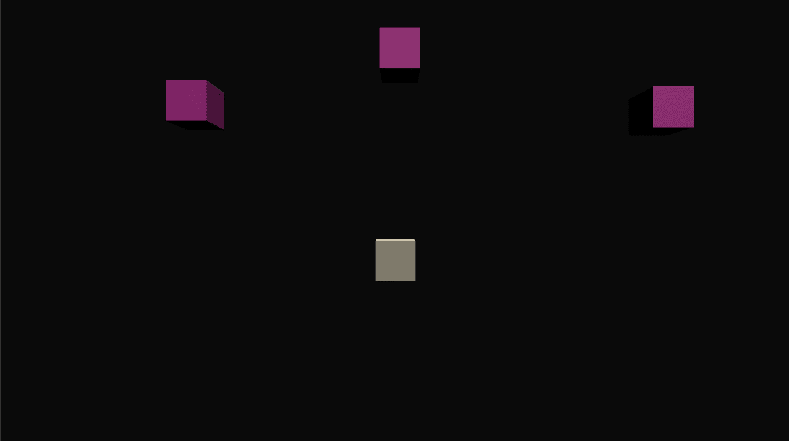
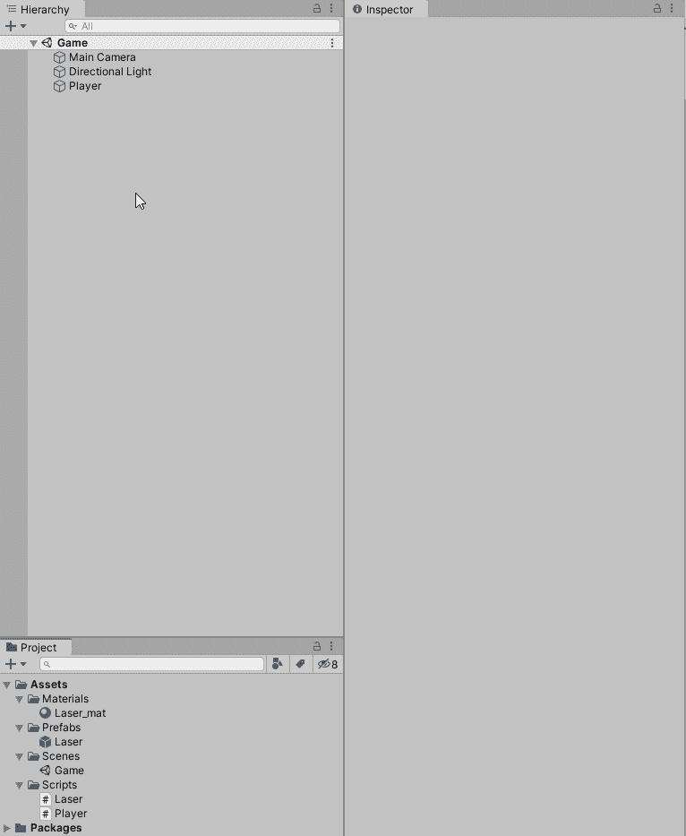
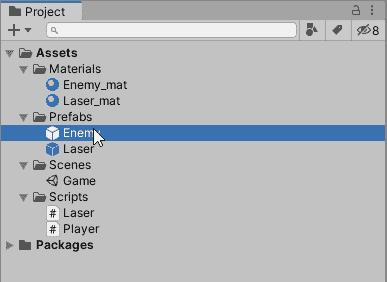
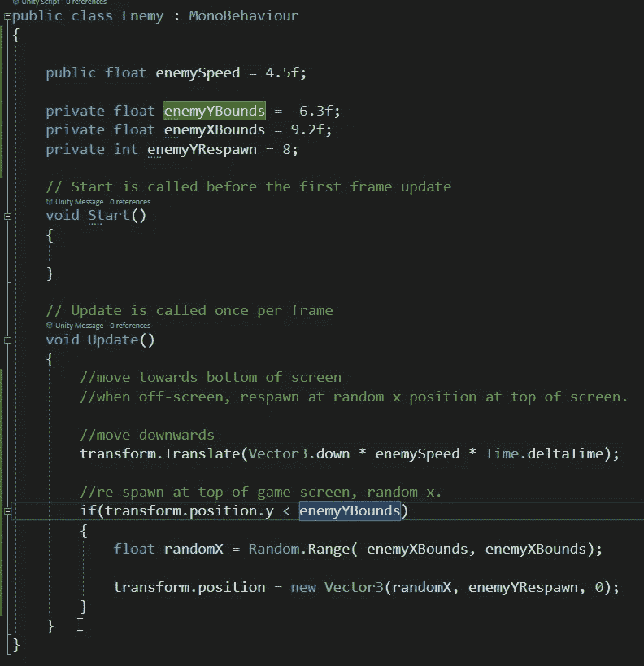
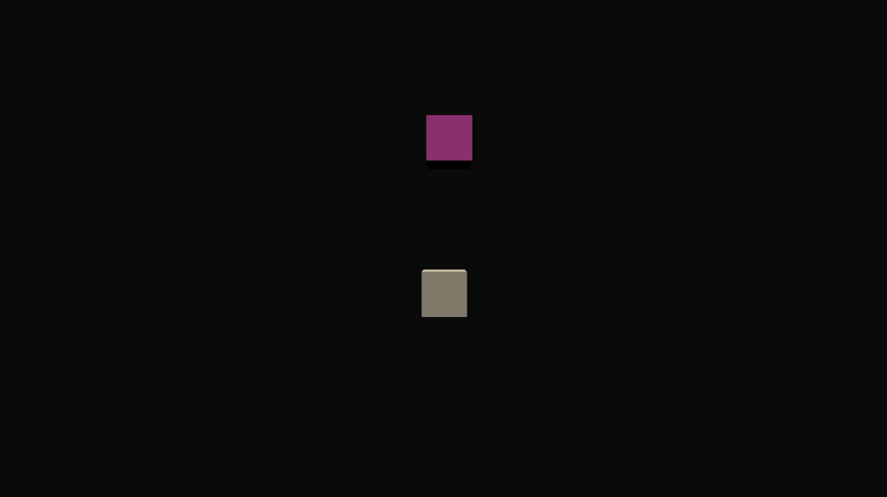
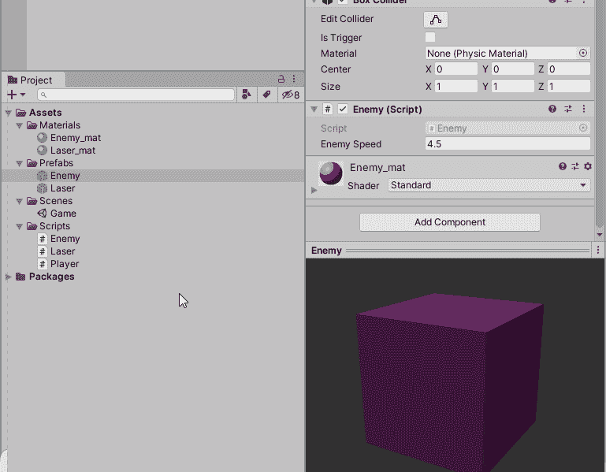
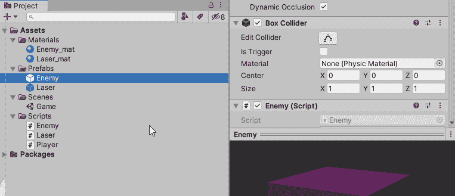
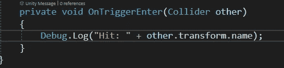
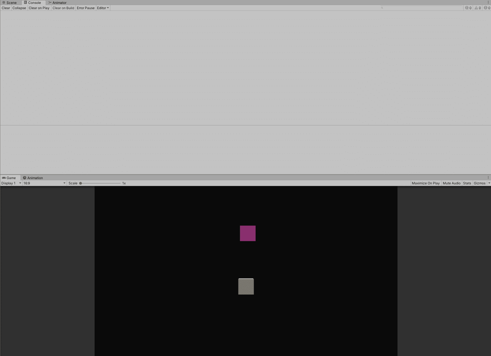
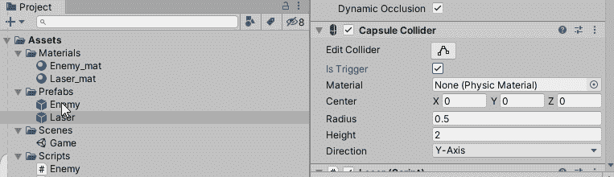

# 敌人的创造和 Unity 中触发器和碰撞器的介绍

> 原文：<https://levelup.gitconnected.com/enemy-creation-and-an-introduction-to-triggers-and-colliders-in-unity-3b6b62456124>

我们的**玩家**立方体现在可以发射他们的**激光**。激光被摧毁**屏幕外**，但是**玩家**在射击**是什么？！是时候创造完美的目标了——一个**敌人立方体**！**

嘿，看着点路！

# 创建敌人立方体

我们将从**创建**另一个**立方体**开始，并将它命名为**敌人**。然后创建一个在**背景**和**玩家**面前突出**的敌人**素材**，并**将其附加**到我们的新**游戏对象**上！**

然后我们将把我们的**敌人游戏对象**从**层级**拖到我们的**预设文件夹**，使其成为**预设**。

接下来我们将创建一个**敌人脚本**，这样我们就可以添加我们的**敌人行为**:

现在来创建**敌人逻辑**。一旦**创造了**，我们希望敌人继续**向下**，但是一旦**离开屏幕**，我们将**在屏幕**顶部的**的**随机 X** 位置重生**。

为了解释我们的变量:

*   **敌人速度**是敌人向下**移动**的**速度**。
*   **enemy bounds**是我们在 **Y 轴**上的**离屏**边界。
*   **敌人边界**是指 **X 轴**位置，我们希望敌人在到达屏幕底部后**重生**。这些边界在屏幕内(从左到右)，并被输入到使用 **Random 的 **randomX** 变量中。范围**。
*   **敌人重生**在**顶部**处**离屏**，在**到达**底部**敌人界**离屏后**重生**的地方。

下面是实际运行的代码:

这将无限期地继续**直到**敌人**被**消灭**。这就把我们带到了下一个环节——创造摧毁敌人的逻辑。**

# **毁灭逻辑——触发器、碰撞器和刚体？！**

**这些是我们还没有涉及到的一些单词/组件，但是谢天谢地，它们并不太难理解。但是理解它们是很重要的，这样才能得到正确的销毁逻辑。**

**首先，我们将覆盖**刚体**。**

****刚体**处理统一内部的**物理**。**

**一个**刚体**也需要以我们想要的方式正确使用我们的**碰撞器**。我们的交互对象**中至少有**一个**需要**一个刚体来**启用碰撞检测**。**

****

**给我们的敌人立方体一个刚体。**

**上面，我们给我们的**敌人立方体**一个**刚体**，但是也**取消**使用重力框，因为我们不希望重力作用于我们的敌人——我们已经在代码中**处理了**向下的运动。**

**接下来，我们必须搞乱我们的**对撞机**。**

**在我们的**敌人**和**激光预置**中，我们将勾选**为触发**框，将我们的**碰撞器**变成**触发**。**

**这允许其他对象**通过**对象，并且**在**我们的脚本**中触发**一个事件。然而，如果它们不是**触发**，而仅仅是**碰撞器**，当它们与其他物体接触时，它们就会**执行**一些**物理**计算，并且**碰撞**。**

****

**我们将把这段代码放到我们的**敌人脚本**中，以测试触发器是否正常工作:**

****

**当有东西进入触发碰撞器时，它会激活代码。“他者”是与对撞机相互作用的物体。**

**从我们的测试代码中，我们可以看到我们的**触发器**工作正常——当敌人击中**玩家**时，就会显示出来，对于**激光**也是如此。**

****

**调试。log(" Hit:"+other . transform . name)；**

**这是一个触发器关闭时会发生什么的例子，我们的对象上有硬表面碰撞器。物理接管，可以毁掉游戏(或者让游戏更有趣！):**

****

**触发器关闭**

****

**嘿，看着点路！**

**触发器、碰撞器和刚体是理解运行时对象交互的第一步。在下一篇文章中，我们将介绍一个稍微复杂一点的系统，让每个交互更容易使用代码！泰格，就是你了！**