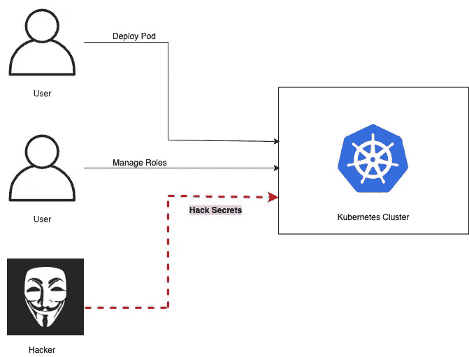
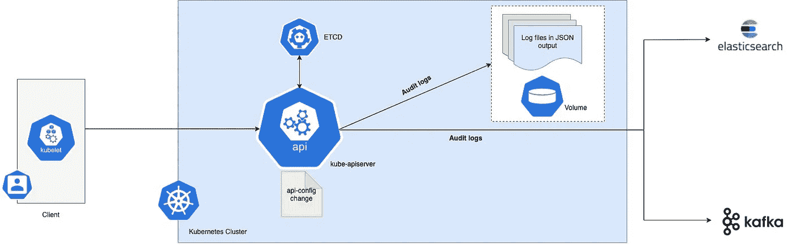
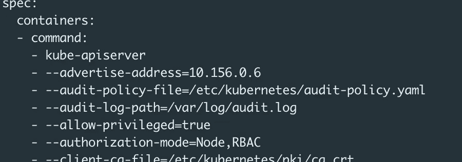
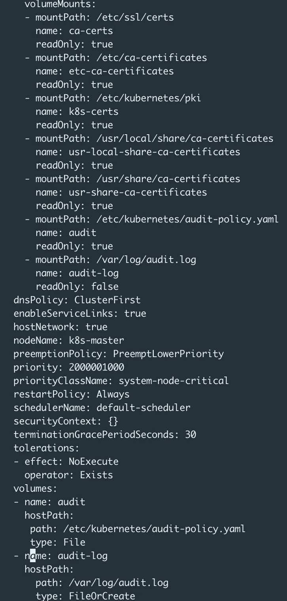

# 在 Kubernetes (k8s)中实施审计策略

> 原文：<https://levelup.gitconnected.com/enforce-audit-policy-in-kubernetes-k8s-34e504733300>

您是否希望检查 Kubernetes 生产级环境的以下活动:

1.  谁登录了您的 Kubernetes 集群？
2.  哪个服务帐户或用户访问了群集中的哪些资源？
3.  谁创造了秘密或配置图？
4.  谁读了 ETCD 的秘密，还有更多？

那么 Kubernetes 中的 ***执行审计策略*** 对你来说就是正确的选择。

# **典型的 Kubernetes 环境**



没有审计政策的 Kubernetes

一旦启用，审计记录就在[**kube-API server**](https://kubernetes.io/docs/reference/command-line-tools-reference/kube-apiserver/)组件中开始其生命周期。每个请求在其执行的每个阶段都会生成一个审计事件，然后根据特定的策略对其进行预处理，并将其写入后端。策略决定记录什么，后端保存记录。当前的后端实现包括日志文件和 webhooks。

每个请求都可以记录一个相关的*阶段*。定义的**阶段**为:

*   `**RequestReceived**` -审计处理程序一收到请求就生成的事件的阶段，在它被委托到处理程序链之前。
*   `**ResponseStarted**` -一旦发送了响应报头，但在发送响应正文之前。这个阶段只为长时间运行的请求(例如 watch)生成。
*   `**ResponseComplete**` -响应正文已完成，不再发送字节。
*   `**Panic**` -发生恐慌时生成的事件。

# 审计策略规则和级别

审计策略定义了关于应该记录哪些事件以及应该包括哪些数据的规则。审计策略对象结构在`[audit.k8s.io](https://kubernetes.io/docs/reference/config-api/apiserver-audit.v1/#audit-k8s-io-v1-Policy)` [API 组](https://kubernetes.io/docs/reference/config-api/apiserver-audit.v1/#audit-k8s-io-v1-Policy)中定义。当一个事件被处理时，它会按顺序与规则列表进行比较。第一个匹配规则设置事件的*审计级别*。定义的审计级别有:

*   `**None**` -不记录符合此规则的事件。
*   `**Metadata**` -日志请求元数据(请求用户、时间戳、资源、动词等。)但不是请求或响应体。
*   `**Request**` -记录事件元数据和请求正文，但没有响应正文。这并不适用于非资源请求。
*   `**RequestResponse**` -记录事件元数据、请求和响应正文。这并不适用于非资源请求。

下面是一个典型的审计策略文件，至少可以看到:

```
*# Log all requests at the Metadata level.*
**apiVersion**: audit.k8s.io/v1
**kind**: Policy
**rules**:
- **level**: Metadata
```

我们可以让它变得像下面这样复杂:)

```
**apiVersion**: audit.k8s.io/v1
**kind**: Policy
**omitStages**:
  - "RequestReceived"
**rules**:
  - **level**: RequestResponse
    **resources**:
    - **group**: ""
      **resources**: ["pods"]
  - **level**: Metadata
    **resources**:
    - **group**: ""
      **resources**: ["pods/log", "pods/status"]

  - **level**: None
    **resources**:
    - **group**: ""
      **resources**: ["configmaps"]
      **resourceNames**: ["controller-leader"]

  - **level**: None
    **users**: ["system:kube-proxy"]
    **verbs**: ["watch"]
    **resources**:
    - **group**: "" *# core API group*
      **resources**: ["endpoints", "services"]

  - **level**: None
    **userGroups**: ["system:authenticated"]
    **nonResourceURLs**:
    - "/api*" *# Wildcard matching.*
    - "/version"

  - **level**: Request
    **resources**:
    - **group**: "" *# core API group*
      **resources**: ["configmaps"]
    **namespaces**: ["kube-system"]

  - **level**: Metadata
    **resources**:
    - **group**: "" *# core API group*
      **resources**: ["secrets", "configmaps"]

  - **level**: Request
    **resources**:
    - **group**: "" *# core API group*
    - **group**: "extensions" *# Version of group should NOT be included.*

  - **level**: Metadata
    **omitStages**:
      - "RequestReceived"
```

# 体系结构—库本内特斯的审计策略



Kubernetes —启用了审核策略

我们可以使用 Webhooks 将审计日志发送到文件或远程 web APIs。

在本文中，我们将强制执行 **kube api-server** 将审计日志发送到文件中。

## **在 Kubernetes 中启用审核策略(对于审核日志文件):**

1.  **创建审计政策 YAML 文件** —前往您的 Kubernetes 集群，按照以下规则创建**审计政策。**

```
**apiVersion**: audit.k8s.io/v1
**kind**: Policy
**rules**: 
  *# Log the request body of configmap changes in kube-system.*
  - **level**: Request
    **resources**:
    - **group**: "" *# core API group*
      **resources**: ["configmaps"]
    **namespaces**: ["kube-system"]

  *# Log configmap and secret changes in all other namespaces at the Metadata level.*
  - **level**: Metadata
    **resources**:
    - **group**: "" *# core API group*
      **resources**: ["secrets", "configmaps"]

  *# A catch-all rule to log all other requests at the Metadata level.*
  - **level**: Metadata
    **omitStages**:
      - "RequestReceived"
```

2.**更新 kube API-服务器清单文件** —

```
- kube-apiserver
    - --advertise-address=10.156.0.6
    - --audit-policy-file=/etc/kubernetes/audit-policy.yaml
    - --audit-log-path=/var/log/audit.log ---
 --- - mountPath: /etc/kubernetes/audit-policy.yaml
   name: audit
   readOnly: true
 — mountPath: /var/log/audit.log
   name: audit-log
   readOnly: false---
---volumes:
  - name: audit
    hostPath:
     path: /etc/kubernetes/audit-policy.yaml
     type: File
  - name: audit-log
    hostPath:
      path: /var/log/audit.log
      type: FileOrCreate
```



k8s-API-服务器-清单文件



k8s-API-服务器-清单文件

仅此而已，前往生成的审核日志文件。

在我的例子中，这是 ***audit.log*** ，试着读一下，你会看到关于你的 Kubernetes 集群的审计日志信息在它的各个阶段被捕获，如下例所示:

```
{
 “kind”:”Event”,
 “apiVersion”:”audit.k8s.io/v1",
 “level”:”Metadata”,
 “auditID”:”a42fa658-f143–43d8-b5e6–4e101d3e15ea”,
 “stage”:”ResponseComplete”,
 “requestURI”:”/api/v1/namespaces/default/secrets?fieldManager=kubectl-create”,
 “verb”:”create”,
 “user”:{
 “username”:”kubernetes-admin”,
 “groups”:[
 “system:masters”,
 “system:authenticated”
 ]
 },
 “sourceIPs”:[
 “10.156.0.2”
 ],
 “userAgent”:”kubectl/v1.20.2 (linux/amd64) kubernetes/faecb19",
 “objectRef”:{
 “resource”:”secrets”,
 “namespace”:”default”,
 “name”:”test-secret”,
 “apiVersion”:”v1"
 },
 “responseStatus”:{
 “metadata”:{

 },
 “code”:201
 },
 “requestReceivedTimestamp”:”2021–04–03T13:50:37.009656Z”,
 “stageTimestamp”:”2021–04–03T13:50:38.040874Z”,
 “annotations”:{
 “authorization.k8s.io/decision”:”allow”,
 “authorization.k8s.io/reason”:””
 }
} {
 “kind”:”Event”,
 “apiVersion”:”audit.k8s.io/v1",
 “level”:”Metadata”,
 “auditID”:”f1466b01–9b68–45ec-b3bb-b440397f6481",
 “stage”:”ResponseComplete”,
 “requestURI”:”/api/v1/namespaces/default/secrets/test-secret”,
 “verb”:”get”,
 “user”:{
 “username”:”kubernetes-admin”,
 “groups”:[
 “system:masters”,
 “system:authenticated”
 ]
 },
 “sourceIPs”:[
 “10.156.0.2”
 ],
 “userAgent”:”kubectl/v1.20.2 (linux/amd64) kubernetes/faecb19",
 “objectRef”:{
 “resource”:”secrets”,
 “namespace”:”default”,
 “name”:”test-secret”,
 “apiVersion”:”v1"
 },
 “responseStatus”:{
 “metadata”:{

 },
 “code”:200
 },
 “requestReceivedTimestamp”:”2021–04–03T13:51:08.603724Z”,
 “stageTimestamp”:”2021–04–03T13:51:08.607716Z”,
 “annotations”:{
 “authorization.k8s.io/decision”:”allow”,
 “authorization.k8s.io/reason”:””
 }
} {
 “kind”:”Event”,
 “apiVersion”:”audit.k8s.io/v1",
 “level”:”Metadata”,
 “auditID”:”30be8c70-fda6–44de-8a83–3fe56161d44e”,
 “stage”:”ResponseComplete”,
 “requestURI”:”/api/v1/namespaces/default/secrets/test-secret”,
 “verb”:”get”,
 “user”:{
 “username”:”kubernetes-admin”,
 “groups”:[
 “system:masters”,
 “system:authenticated”
 ]
 },
 “sourceIPs”:[
 “10.156.0.2”
 ],
 “userAgent”:”kubectl/v1.20.2 (linux/amd64) kubernetes/faecb19",
 “objectRef”:{
 “resource”:”secrets”,
 “namespace”:”default”,
 “name”:”test-secret”,
 “apiVersion”:”v1"
 },
 “responseStatus”:{
 “metadata”:{

 },
 “code”:200
 },
 “requestReceivedTimestamp”:”2021–04–03T13:54:57.867317Z”,
 “stageTimestamp”:”2021–04–03T13:54:57.871369Z”,
 “annotations”:{
 “authorization.k8s.io/decision”:”allow”,
 “authorization.k8s.io/reason”:””
 }
}
```

此外，您可以使用以下附加标志配置 **kube api-server** ，以更改审核日志文件的状态:

*   `--audit-log-maxage`定义保留旧审核日志文件的最大天数
*   `--audit-log-maxbackup`定义要保留的最大审计日志文件数
*   `--audit-log-maxsize`定义审核日志文件旋转前的最大大小，单位为兆字节

# 总结:

审核策略会检查您的 Kubernetes 群集中发生的所有请求/响应。这是一种最佳做法，应在早期阶段启用。在这个例子中，我已经向您展示了如何将审计数据发送到文件，在下一个博客中，我将展示如何将审计数据发布到 Webhook API。

希望你喜欢这篇文章。

请在下面自由发表您的评论。