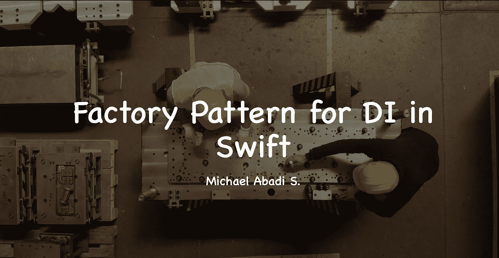
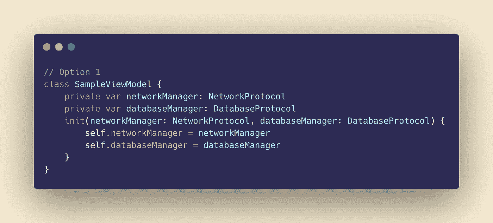
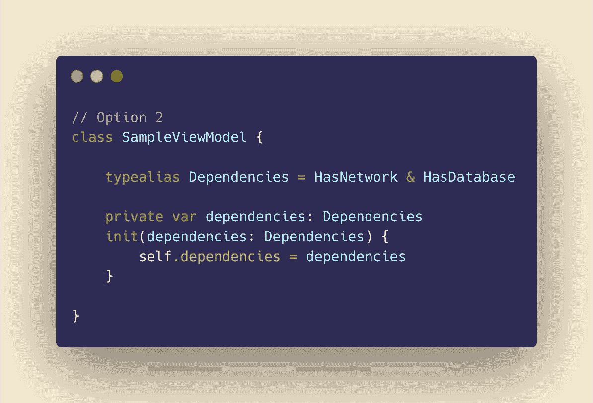
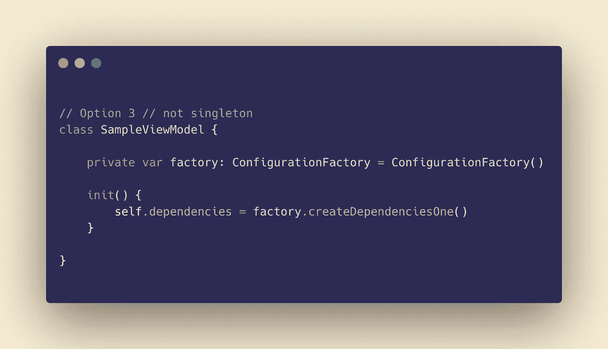
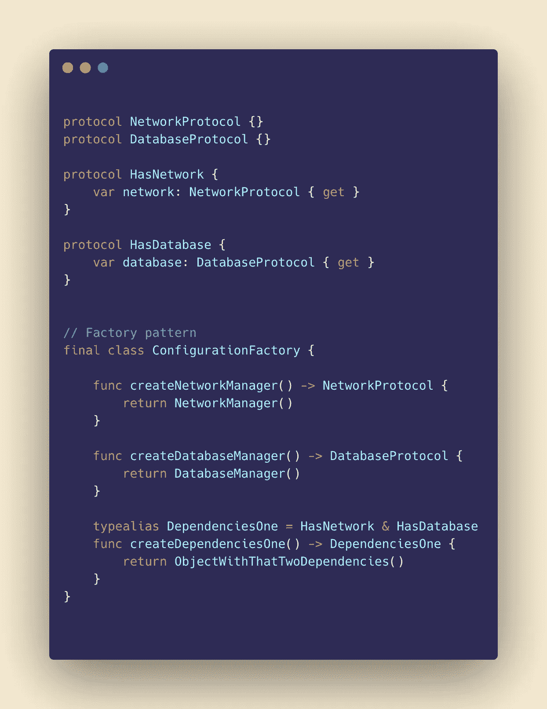
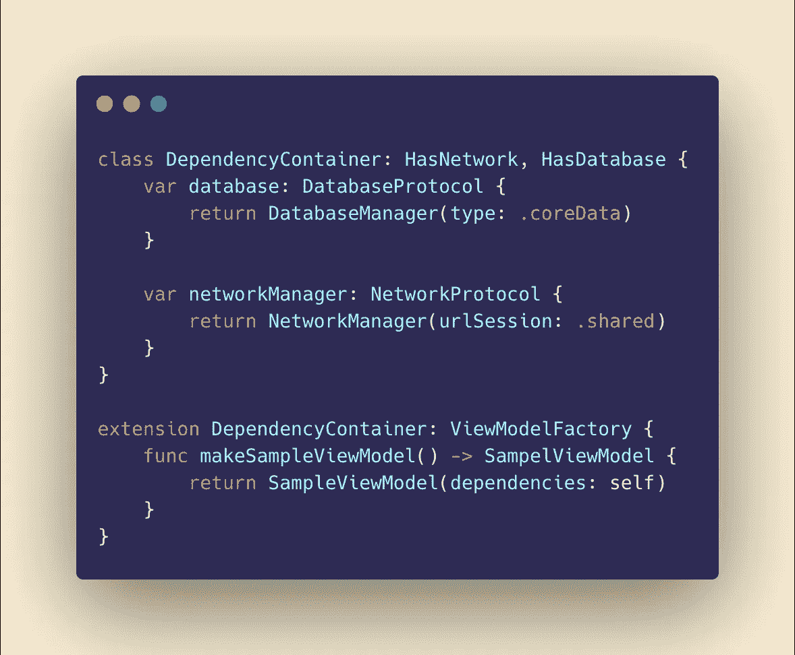

# 在 3 分钟内增强 Swift 中 DI 的工厂模式功能

> 原文：<https://levelup.gitconnected.com/enhance-factory-pattern-for-di-in-swift-b255008ba110>

工厂模式

工厂模式是编程语言中常见的模式之一。它是一种创造性的设计模式，为您的代码提供了高度的灵活性。一个有趣的用例是**依赖注入**，它可以让工厂模式成为一个方便的工具。通常，每当我们想要注入一个接口作为对一个对象的依赖时，我们可以很容易地通过初始化器传递它或者从属性中设置它。参见下面的例子

选项 1

在上面的例子中，我们试图给 **SampleViewModel** 注入网络和数据库管理器的依赖关系(记住，总是依赖于**抽象**)。在初始化式上做 DI 是最简单的方法，一旦我们有了多重依赖，需要注入太多参数，问题就开始出现了。当然，然后我们尝试下面的第二种方法。

选项 2

在第二种方法中，如果两个依赖项都封装到一个符合它们的对象中，我们简单地传递一个带有规则的 **typealias** ，这被称为**协议组合。这是一种非常快捷的方式，看起来非常整洁。在此之前不会有任何问题，我们需要将每一个依赖项传递给初始化器，否则我们可能会在我们的 **typealias 中加入多个&操作符。**如果我们使用一个可以轻松产生这种效果的物体会怎么样？是啊！那就是**厂**。参见下面的例子**

选项 3

参见**选项 3** ，我们可以只拥有一个工厂实例，然后调用函数为我们创建依赖关系。我们**厂**班的大图见下图。它有为我们创建**依赖关系**的功能，或者提供创建某个**依赖关系**的单一对象的功能。

工厂级

# **小技巧&小技巧**

1.  如果您想创建一个可以被任何对象轻松访问的工厂，您可以创建一个单例工厂。然而，请记住，为了让我们的 **singleton** 不成为**反模式，因为大多数人都试图避免它**，让它保持无状态，只是为了创建一个必要的对象。通过创建我们的 singleton **stateless** 并且只用于产生一个对象，那么就可以了，不需要担心测试。记住，DI 中的单例问题居多，因为**单例可以产生共享状态**和**提供有状态类**。所以保持干净。
2.  另一个技巧是我们可以创建一个**容器，**并且这个容器可以符合多个**工厂，**然后将这个容器存储到你的应用程序的顶层对象中，或者如果需要的话甚至使它成为一个单例，并且这个**容器**是唯一一个集合了大多数工厂协议的容器，可以产生它的访问器所需要的多个对象。
3.  探索更多关于 [**解析器**](https://quickbirdstudios.com/blog/swift-dependency-injection-service-locators/) 的模式。这种模式是一个很好的例子，说明**工厂**模式如何成为 **DI 的强大工具。**[**s winject**](https://github.com/Swinject/Swinject)**是**解析器**模式如何工作以及**工厂**模式如何在幕后工作的一个例子。**

****

**容器示例**

**今天关于工厂模式的知识到此为止。希望这是非常有帮助的，除了一个最强大的**创造性的设计模式。**敬请期待下一篇文章！**

**参考:
1。[https://refactoring . guru/design-patterns/factory-method/swift/example](https://refactoring.guru/design-patterns/factory-method/swift/example)
2 .[https://www . swiftbysundell . com/articles/dependency-injection-using-factories-in-swift/](https://www.swiftbysundell.com/articles/dependency-injection-using-factories-in-swift/)**