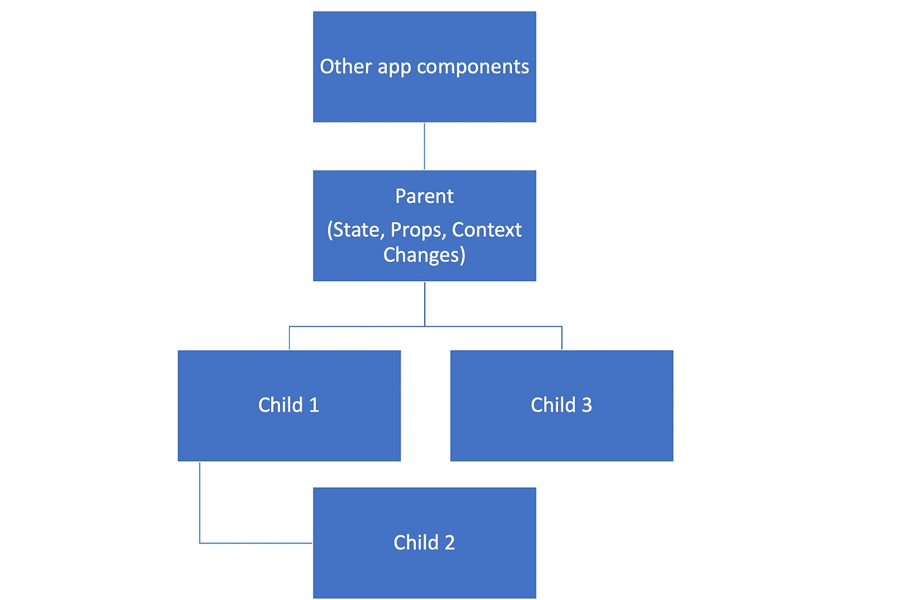
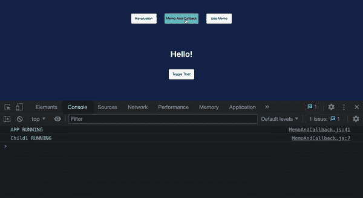
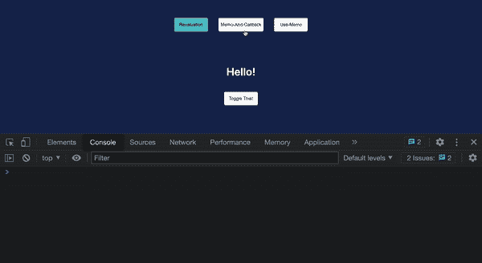
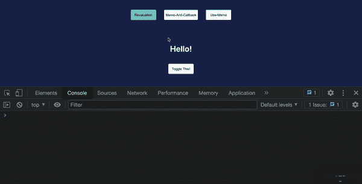
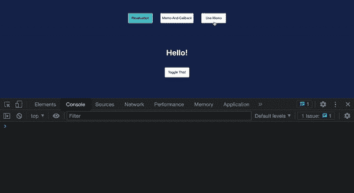
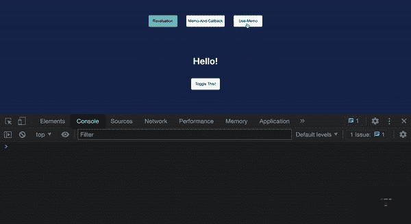

# 通过记忆增强反应性能

> 原文：<https://levelup.gitconnected.com/enhance-react-performance-with-memoization-fb49f11ada4f>

由 [SpaceX](https://unsplash.com/@spacex?utm_source=medium&utm_medium=referral) 在 [Unsplash](https://unsplash.com?utm_source=medium&utm_medium=referral) 上拍摄的照片

这是我在 Medium 上发表的第一篇文章，近两年来，我一直在思考这篇文章的内容。它并不是 covid 的解药，也不是一些谈论生命意义的具体抽象的故事，而是我已经决定与你分享我作为一名软件工程师的学习和经验。一个自学成才的开发人员的旅程经常是孤独和令人沮丧的，我想通过分享这一行为多少让我感到与他人有联系。所以让我们一起成长吧😁

# 介绍

React 是一个前端 Javascript 库，允许无缝创建基于组件的单页面应用程序(spa)。作为 2022 年的 web 开发人员，很可能我们已经使用过 React，或者至少在职业生涯的某个时候听说过它。如果你对 React 的体验和我一样，就很容易掌握一些基础知识，比如用`useState`控制状态，或者用`useEffect`管理副作用。然而，很快你就意识到，除了基本的 React 之外，世界是广阔的，如果我们想要构建高性能的 web 应用程序，特别是对于数据密集型用例，我们必须振作起来，开始像真正的软件工程师一样思考。因此，了解正确的工具对于提高 React 应用程序的性能至关重要。

今天，我想和大家分享一些我一路走来学到的技巧，特别是如何使用**内存化**来增强 React 应用程序。我们将从快速复习以下概念开始:

*   记忆化
*   对组件功能重估做出反应

掌握了上述知识后，我们将看看如何使用以下工具在 React 中实现它:

*   `React.memo()`
*   `useCallback()`
*   `useMemo()`

# 记忆化

记忆化只是缓存的一个花哨词。这是动态编程中广泛使用的代码优化概念。你可以在这里找到官方解释[，然而，在我们深入研究代码之前，这里有一个简短的定义:](https://en.wikipedia.org/wiki/Memoization#:~:text=In%20computing%2C%20memoization%20or%20memoisation,the%20same%20inputs%20occur%20again.)

*记忆化是一种优化技术，它使用缓存来存储直接映射到生成这些结果的函数的输入的结果。当使用以前看到的输入调用函数时，缓存被用来直接返回结果，而不是运行计算，因此加快了函数的执行。*

下面的代码用一个简单的场景和一些基准测试结果演示了 Javascript 中的记忆化。

1.  生成一个由 0-10 之间的 1000 万个随机数组成的数组，用于测试目的。这是全局定义的，在以下函数中用作测试数据。
2.  为基准功能设置一些测试指标。
3.  简单的函数，将索引`n`中`data`的所有数字相加。
4.  基准`sumNumbersFrom`带输出:`Result: 45004814; Duration: 75ms`。
5.  包装函数`memoizeFunc`，用于产生其输入函数`originalFunc`的记忆版本。包装器建立一个缓存`cache`，该缓存由返回的内存化函数通过其[闭包](https://developer.mozilla.org/en-US/docs/Web/JavaScript/Closures)保留。返回的函数还带有一个参数`input`，该参数应该与`originalFunc`所需的输入相同。首先检查`cache`以查看`input`是否已被预先存储，如果没有，则使用`originalFunc`根据`input`计算结果，然后将结果存储在`cache`中。如果在`cache`中找到`input`，则直接返回其相关结果，而不调用`originalFunc`导致`O(1)`操作。
6.  包装函数`memoizeFunc`应用于`sumNumbersFrom`以创建其记忆计数器部件`memoizedSumNumberFrom`。
7.  当结果未缓存和缓存(对于输入= 100)时，对两种场景的`memoizedSumNumberFrom`执行进行基准测试。我们看到，在结果未被缓存的实例中，函数花费了`75ms`来运行，因为原始的`sumNumbersFrom`必须被调用来计算结果。然而，当第二次将相同的输入 100 传递给`memoizedSumNumberFrom`时，缓存的结果立即返回，导致`0ms`执行时间。

从上面的例子中，我们可以看到记忆化是一种优化函数时间复杂度的巧妙技术。在这一点上我们应该注意，React 中的组件实际上只是函数，记忆化非常适合于提高 React 应用程序的渲染速度。同样重要的是要注意，记忆化是以存储缓存的内存和将函数输入转换为缓存的键所需的计算为代价的。因此，我们应该考虑为计算密集型问题实现这种优化，而不是我们遇到的每个小任务！

# 反应组件评估

在本节中，我们将了解为什么需要优化，特别是对于 React 如何评估组件功能以及它们在应用程序中的子组件。

图 React 应用程序结构示例

上图描绘了一个非常简单的 React 应用程序层次结构，每个模块都是一个组件，它们以树状结构设置。实现上述结构的关键方面是:

> 当在组件中注册了状态、属性或上下文变化时，React 将评估/重新评估组件。
> 
> 当 React 评估一个组件函数时，它的所有子组件都将被评估，不管该组件与其子组件之间存在任何依赖关系。简而言之，React 并不关心`Child 1`是否依赖于`Parent`中的任何状态变化，只要`Parent`被求值，那么`Child 1`就会被求值。对于`Child 2`和`Child 3`也是如此。

为了演示上述概念，我使用 [create-react-app](https://create-react-app.dev/) 创建了一个简单的应用程序，代码可以在这里访问[。](https://github.com/MasWho/medium-blog/tree/master/react-memo)

> 注意:在本文中，我将只讨论应用程序的相关代码部分。假设对提高 React 性能感兴趣的每个人都熟悉如何设置 React 项目。但是，如果您想复习一下如何设置 React 项目，主应用程序组件如何工作以及如何在 DOM 中呈现，请参考上面提供的代码链接。

图 2`Revaluation`组件的浏览器控制台输出

上面的 React 代码使用了一个`Revaluation`父组件来演示图 1 所示的结构，父组件包含三个子组件`Child1`、`Child2`和`Child3`，其中`Child2`嵌套在`Child1`中。`Revaluation`组件包含一个布尔状态`toggle`，可由`toggleHandler`更新。

这里需要注意的是，改变`toggle`状态将触发对`Revaluation`组件及其所有子组件的重新评估。此外，`Child1`、`Child2`或`Child3`都不依赖于`Revaluation`中的状态变化。以`Child1`为例，它接收一个硬连线到`false`的`show`道具，但图 2 所示的控制台输出清楚地表明，每次`Revaluation`中的状态改变时`Child1`都会被重新评估。对于`Child2`和`Child3`也可以说是同样的观察结果，即这些子组件中的逻辑与其父组件中的逻辑无关。

我希望此时您已经意识到，本节的示例展示了 React 应用程序中潜在的性能瓶颈。在现实世界中，`Child1`、`Child2`或`Child3`可能包含计算密集型逻辑。每次由于不相关的父组件状态更新而重新评估这些子组件是浪费的。

这就是记忆化的作用。如前一节所述，我们可以使用这种优化技术来缓存基于输入的函数返回的结果。React 应用程序可以使用内存化来加速，因为它们只不过是一堆嵌套在树状结构中的函数！

# React .备忘录

我们将讨论的第一个工具是`React.memo`。它是一个高阶组件(HOC ),用于封装任何反应功能组件以进行记忆。下面的代码演示了它的用法。

图 MemoExample 组件的浏览器控制台输出

这个例子由一个父组件`MemoExample`和一个状态`toggle`组成，父组件只包含一个子组件`Child1`，状态`toggle`可以被`toggleHandler`更新。

此外，我们将`Child1`封装在`React.memo`调用中，以便在 DOM 中第一次呈现子组件时对其进行记忆，也就是说，React 为`Child1`输出的 html 语法树现在缓存在内存中并映射到它的 props。对于在`MemoExample`中注册的每个后续状态更新，React 检查`Child1`属性是否有任何变化，如果没有发生变化，则将呈现`Child1`的缓存输出，而不是再次评估组件。由于`Child1`只接受一个道具`show`并且我们已经将其硬连线到`false`，这意味着`Child1`在第一次渲染后将不再被评估，不管`MemoExample`中的任何状态变化。这种行为可以在图 3 所示的控制台输出中看到，其中`Child1`中的`console.log`仅运行一次，并且对于`MemoExample`中的`toggle`状态的每一次后续变化都不会再次运行。

在这一点上，我知道你在想什么，为什么我们不把`React.memo`应用到太阳底下曾经存在过的每一个组件上呢？嗯，还记得前面提到的记忆是有成本的吗？让我们快速检查一下`React.memo`的一些警告，以便理解为什么总是使用它实际上是一个坏主意:

*   记忆一个 React 组件需要消耗内存，因为我们需要缓存该组件的渲染结果和道具。
*   仅检查 props 更改，因此对于内部状态更改，仍将评估包装的组件。
*   默认情况下，`React.memo`的 props 检查是一种浅层比较，这意味着只有原始数据类型(字符串、布尔值和数字)的变化才会被正确注册，因为更复杂的数据类型，如数组、对象甚至函数都是[引用类型](https://www.dyn-web.com/javascript/arrays/value-vs-reference.php)。为了克服浅层比较默认，我们可以将一个[比较函数](https://reactjs.org/docs/react-api.html)作为第二个参数传递给`React.memo`来告诉 React 应该如何准确地比较道具。
*   如果组件的 props 包含大量数据，比较成本和内存成本可能会变得无法使用`React.memo`。应该仔细考虑加速应用程序的这些权衡。

# 使用回调

在我们继续学习 React 中的下一个记忆工具之前，让我们先解决上一节中提到的一个细节。当在带有复杂数据类型属性的组件上使用`React.memo`时，我们需要解决浅层比较默认行为。对于对象和数组，我们可以使用比较函数`React.memo`的第二个参数输入，但是如果一个 prop 是一个函数呢？在 Javascript 中，函数是与对象和数组相同的引用数据类型，因此函数的浅层比较总是会导致错误的返回。下面的例子演示了`React.memo`用于带有功能属性的组件时的行为。

图 4 带有功能属性的 MemoAndCallback 组件的浏览器控制台输出

上面的`MemoAndCallback`组件是上一节的`MemoExample`组件的简单扩展。添加了一个`Child2`组件，该组件接受一个函数属性`func`，每当渲染`Child2`时都会调用该属性。请注意，`Child2`被包装在一个`React.memo`调用中，但是正如我们从图 4 的控制台输出中可以看到的，对于`MemoAndCallback`中的每个状态更新，`Child2`都被呈现。这是因为函数`child2Func`是为`MemoAndCallback`的每次渲染而声明的，导致它每次都分配了不同的内存位置。因为函数是引用类型，并且`React.memo`将新声明的`child2Func`内存地址与缓存的`child2Func`内存地址进行比较，这导致`Child2`被渲染，即使对于每次父状态更新，其属性实际上保持不变。

这是在使用`React.memo`或任何其他需要在渲染周期中检查数据依赖性的技术时遇到的常见问题。因此，React 实际上有一个钩子来解决这个问题，那就是`useCallback`钩子。下面是演示其用法的`MemoAndCallback`组件的修改版本。

图 5 带有 useCallback 的 MemoAndCallback 组件的浏览器控制台输出

在这里，我们在`MemoAndCallback`中添加了另一个组件`Child3`，也带有一个功能道具`func`。函数`child3Func`被传递给`Child3`，然而，它的声明被包装在一个`useCallback`钩子中。`useCallback`的概念与`React.memo`完全相同，被包装的实际函数被缓存，如果`useCallback`的第二个数组参数中指定的依赖项都没有改变，则返回前一个渲染周期中完全相同的函数。使用这种技术，我们可以确保存储在相同内存地址中的完全相同的函数将作为一个属性传递给一个组件。因此，`React.memo`将能够正确检查组件的属性，即使它们是函数。从图 5 中的控制台输出中，我们可以准确地看到，如上所述，`Child3`仅渲染一次，并且不会再次渲染，因为对于`MemoAndCallback`组件中的每个状态更新，`child3Func`仍然是同一个*。*

# *使用备忘录*

*除了优化组件功能，React 还提供了一个工具，允许我们记忆任何产生某种结果的复杂表达式。`useMemo` React 钩子可以用来包装我们在组件内部调用的代码以进行优化，下面的代码演示了它的用法。*

**

*图 UseMemoExample 组件的浏览器控制台输出*

*`UseMemoExample`组件有一个单独的状态`revaluate`，可以通过`revaluateHandler`更新。由一百万个随机数组成的全局`data`对象被定义在组件之外，以模拟传递给组件的持久数据。全局`data`为`UseMemoExample`的每次渲染排序。这种排序操作被进一步基准化，并且结果以毫秒显示在组件中。从图 6 所示的输出中我们可以看到，每次`UseMemoExample`更新时，大约在 200ms 内对`data`进行排序。实际上，这种排序操作可以被更复杂的逻辑所取代，并可能导致组件呈现出次优的性能。这是我们可以使用`useMemo`来优化代码的地方，下面是一个演示。*

**

*图 7 带有 useMemo 的 UseMemoExample 组件的浏览器控制台输出*

*我们在`UseMemoExample`组件中引入的唯一变化是将`data`的排序逻辑移动到一个`useMemo`钩子中作为回调，其中钩子的第二个参数是要检查记忆的依赖项列表。在本例中,`data`是一个全局常量，因此不应被视为依赖关系。从图 7 中我们可以看到，`UseMemoExample`第一次渲染时，`data`在 205ms 内排序，并被`useMemo`缓存。对于每一个后续的状态更新，因为没有依赖关系改变，缓存和排序的`data`对象将被使用，因此导致`UseMemoExample`组件的渲染速度大大加快。*

*应该注意的是，当实现`useMemo`来改进您的 React 组件时，我们应该考虑与前面提到的`React.memo`完全相同的优缺点。如果在糟糕的用例中实现，由于额外的空间复杂性以及检查函数输入所需的时间，记忆化可能会导致更差的性能！*

# *摘要*

*在本文中，我们讨论了什么是内存化，以及如何使用 React 提供的相关工具来提高应用程序的性能。特别是`React.memo`和`useMemo`被详细覆盖和解释。还讨论了对`useCallback`的需求，以实现记忆功能，其中功能包含在记忆功能输入中。每个概念都用代码示例进行了解释和演示，这样我们就可以清楚地看到这些工具是如何在浏览器中运行的。*

*唷！！这是大量的信息😅但是希望所有的概念都有足够的细节和例子来解释，以帮助您完成 React 之旅。这是我第一次尝试在博客上记录我的发展历程，我几乎可以肯定我的写作中可能有不足之处，因此我欢迎所有的批评和改进建议！谢谢你。*