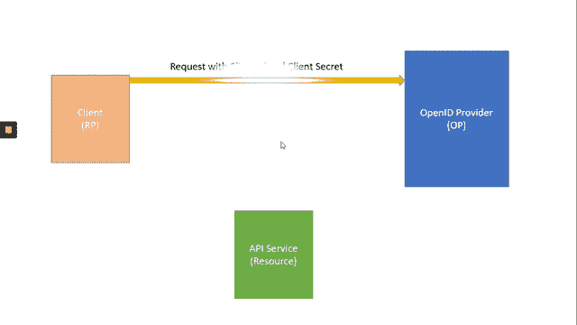

# 通过 OpenID Connect 增强安全性

> 原文：<https://levelup.gitconnected.com/enhance-security-with-openid-connect-73138e8232ba>

## 了解 OpenID Connect、OAuth 2.0 流程以及对集中式认证系统的需求

在当今时代，网络安全是一个主要问题。尤其是对于 web 或移动应用程序，安全性是关键因素。为了确保我们的应用程序不会受到未经授权的访问，我们可以实现身份验证和授权等概念。

身份验证是识别对系统拥有有效访问权限的用户或人员的过程。类似地，授权是验证通过身份验证的用户是否有权在系统中执行特定操作的过程。

大多数现代应用程序架构如下所示:

现代应用架构

在大多数情况下，我们的应用程序可以通过以下一种或多种方式进行交互:

*   浏览器与 web 应用程序通信
*   Web 应用程序与 web APIs 通信
*   移动/本地应用程序与 web APIs 通信
*   服务器应用程序与 web APIs 通信
*   web API 可以与 web API 通信

在上述任何场景中，两端都应该使用某种身份验证机制来保护，以防止未经授权的访问。

## 本地认证系统

这是最简单的一种身份验证，可以作为它的一部分在任何 web 应用程序中实现。在适当的护理下，它可以很好地工作并提供良好的安全性。但是，它有自己的局限性。

对于这种类型的安全系统，存在如下问题:

*   身份验证过程与系统紧密耦合。
*   考虑一下，如果某个应用程序有分布式服务，例如 Web API 或微服务，那么每个应用程序都必须将单独的身份验证流程设置集成到其中，指向 Web 应用程序所指向的同一个数据库。
*   考虑一下，如果一个企业有一个以上的网络产品。在这种情况下，我们如何通过隔离身份验证系统来设置单点登录(SSO)？
*   考虑一下，如果我们需要通过像 Google、LinkedIn、Twitter 等社交媒体实现身份验证。我们如何在不到处复制代码的情况下做到这一点？

要建立上述所有问题的解决方案，最好将身份验证过程委托给专门构建的独立服务。但是如何实施呢？它遵循什么标准？

解决方案是 **OpenID connect** ！

## OpenID 连接提供程序

OpenID Connect 是领先的标准，它基于 OAuth 2.0 提供的流，并与 JSON Web Token (JWT)一起工作。它为单点登录(SSO)和身份提供了很好的支持。

具有分离的集中式认证提供者的应用架构

## OpenID 连接提供程序的优势

**认证即服务:**它可以作为一个集中式服务公开，用于各种 Web、本地/移动应用程序和服务的认证。

**单点登录:**为多种应用类型的单点登录提供了强大的支持。

**访问控制:**为服务、Web 应用程序和移动应用程序颁发访问令牌，其中包含用户可以访问的资源的相关信息。

**社交媒体登录:**为通过社交媒体(如谷歌、脸书、LinkedIn、Twitter 等)扩展认证流程提供了良好的支持。

## 术语

在实现 OpenID 提供者时，我们需要注意一些术语，比如

**OpenID Provider(OP):**Provider 是实现 OpenID Connect 和 OAuth 2.0 协议并遵循其标准的一类服务。它保护资源、验证用户身份、提供会话管理、单点登录以及颁发和验证令牌。

**客户端:**客户端是一种向提供商请求令牌的软件，例如 Web 应用、本地/移动应用、服务器应用或 Web API。

**资源:**资源是您希望通过 OpenID 提供者保护的实体，如 Web APIs 或用户的身份数据。

**身份令牌:**身份令牌是认证过程的结果。它包含了用户最少的一个标识符。它包含 sub、iat 等索赔。它包含用户如何以及何时进行身份验证的信息。

**访问令牌:**访问令牌是用于访问 API 资源的签名令牌。它还包含关于用户有权访问的资源的信息，以及其他用户声明。

OpenID 提供者基于 OAuth 2.0 提供了不同种类的流，称为**授权类型**。使用授权类型，我们可以定制适合需求的身份验证过程的方式。下面给出了 OpenID Connect 提供的一些授权类型

1.  客户端凭据
2.  含蓄的
3.  授权代码
4.  混合物
5.  设备流程
6.  资源所有者密码
7.  刷新令牌
8.  推广赠款

接下来，我们将讨论上面一些常用的授权类型及其用法。

## **客户凭证**

这是最简单的流程，主要用于**服务器到服务器认证**，例如服务器应用程序或 Web API 到 Web API。在这种方法中，客户端代表客户端而不是用户向 OpenID 提供者(OP)请求访问令牌。

客户端(服务器应用程序/ API)需要向身份验证提供者提供客户端 id 和客户端机密，以证明其身份是访问资源(Web API)所必需的。

客户端凭据流

## **含蓄**

这种方法专门针对基于浏览器的应用程序(如 JavaScript 应用程序)进行了优化。使用隐式授权类型，用户使用他/她的凭证(如用户名、密码)通过 JavaScript web app 请求一些资源。

凭证被提交给提供商(OP ),并要求用户授权访问用户的基本简档数据，例如电子邮件、简档等。

一旦用户授予访问权，OP 就生成访问令牌并将其发送回浏览器。然后，这个令牌可以用来访问 API 资源。

隐式流

## 授权代码

这是最常用的身份验证方法，最初由 OAuth 2.0 指定。该流程旨在用于**传统网络应用以及本地/移动应用**。

在这个流程中，用户向提供商(OP)提交他/她的凭证，例如用户名、密码，并授予访问权限以使用用户的基本数据，例如电子邮件、个人资料等。

然后，提供者用短期授权码进行响应。
使用反向信道请求再次与提供商(OP)共享该代码，以获得访问令牌。

这个流程提供了最佳的安全性，因为访问令牌不会暴露给浏览器。

授权代码流

## 混合物

这是一种很少使用的方法，主要由**本地应用**使用。这个流程基本上是**隐式**和**授权码**流程的组合。

使用这个流程，我们可以分别请求 **Id 令牌**和**访问令牌**。Id 令牌被传输到浏览器，它被签名并包含关于用户和其他工件的信息。

一旦收到 Id 令牌，就会发出另一个反向信道请求，以便检索可用于访问资源的**访问令牌**和**刷新令牌**。

混合流

在本文中，我们了解了本地身份验证系统，它可能面临的问题，什么是 OpenID connect，以及实现它的方法/流程。

在我的下一篇文章中，我们将实现一个简单的功能 OpenID Provider (OP ),以支持上述所有流和示例客户端。所以，在那之前请继续关注并快乐编码！