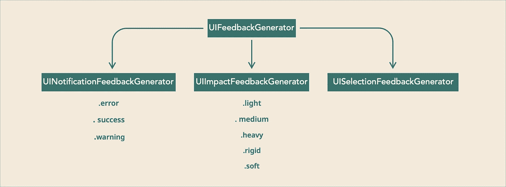

# 使用 UIFeedbackGenerator 增强 UX

> 原文：<https://levelup.gitconnected.com/enhance-ux-with-uifeedbackgenerator-756f01c54873>

从 iOS 10.0 开始，苹果为我们提供了一种生成触觉反馈的新方法，但它只能在 iPhone 7、iPhone 7 Plus 等具有第二代触觉的新设备上工作。你可以用下面的线程[在这里](https://stackoverflow.com/questions/39564510/check-if-device-supports-uifeedbackgenerator-in-ios-10/39592312#39592312)检查你的设备是否支持新的触觉 API

UIFeedbackGenerator 是这个引擎的主类，但这只是一个抽象类。你要上的 3 门课是

## **UINotificationFeedbackGenerator**

该生成器将生成 3 种类型的反馈，分别是:**错误、成功和警告**

## **UIImpactFeedbackGenerator**

该发生器将产生 5 种反馈类型:**轻、中、重、硬和软**

## **UISelectionFeedbackGenerator**

这个没有具体类型。当您滚动选择器视图时，可以看到这一点

为了方便起见，我在下面这张照片中总结了所有的内容

在底部有一个回购附件，你可以尝试一下或者去 [**人机界面指南**](https://developer.apple.com/design/human-interface-guidelines/) 并查看[触觉部分](https://developer.apple.com/design/human-interface-guidelines/ios/user-interaction/haptics/)以识别它们之间的区别。

# 实施

## UINotificationFeedbackGenerator

## UIImpactFeedbackGenerator

## UISelectionFeedbackGenerator

按照苹果的建议，我们应该在触发任何反馈之前打电话给`prepare()`

这里的`prepare()`有什么作用？

这是一个可选功能，如果你不调用`prepare()`没关系，你仍然会收到反馈，但不确定 100%你会得到低延迟的反馈。所以我们必须在使用这些 API 之前准备一个引擎

如果您调用`prepare`并立即触发反馈，它不会改善延迟。发动机需要时间准备

## 解除分配生成器

使用后，应将发电机设置到`nil`，让发动机回到怠速状态。

# 总结

我在这里创建了一个回购来总结它，让你可以体验一下

 [## ryanisnhp/触觉学

### 总结 iOS 10.0 所有的 haptics 生成器。通过创建以下账户，为 ryanisnhp/Haptics 的发展做出贡献…

github.com](https://github.com/ryanisnhp/Haptics)