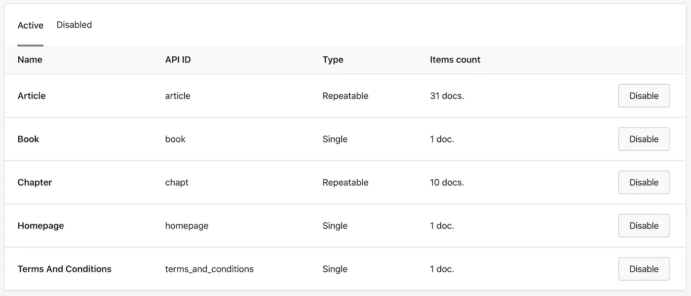
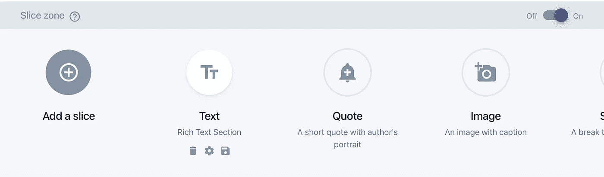
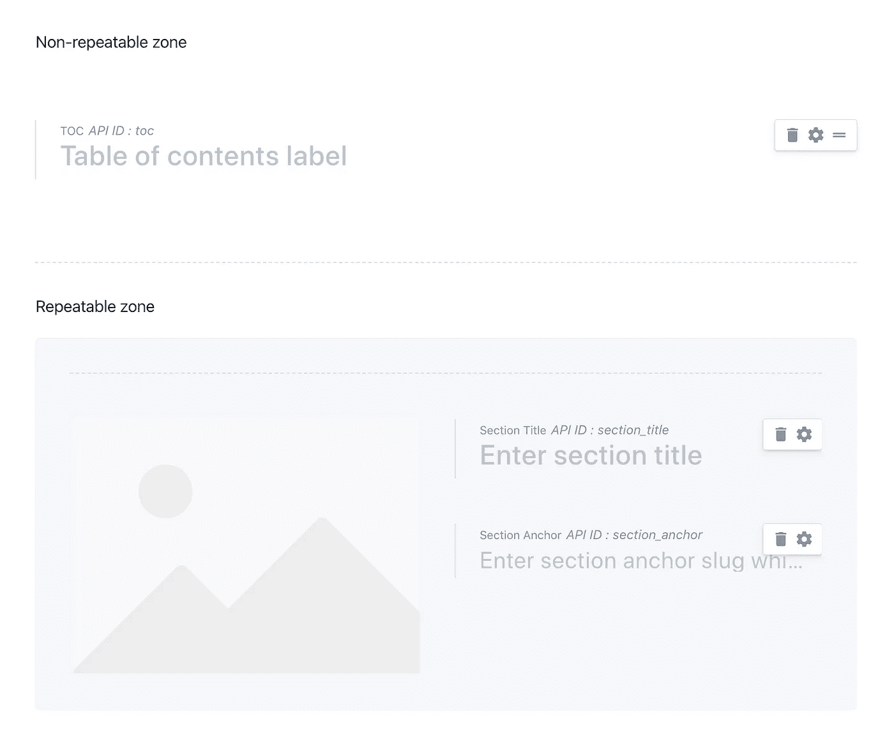
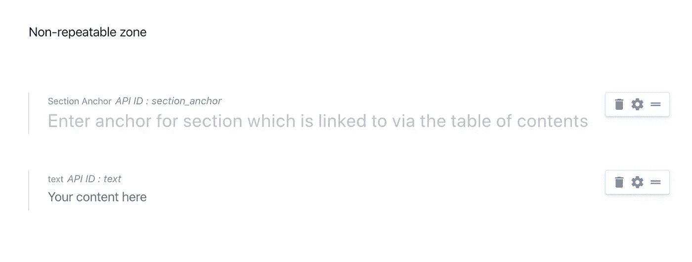
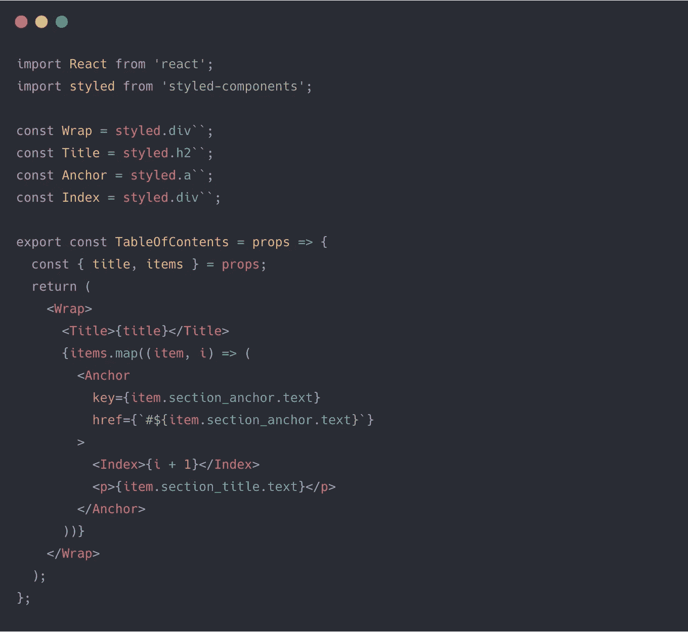
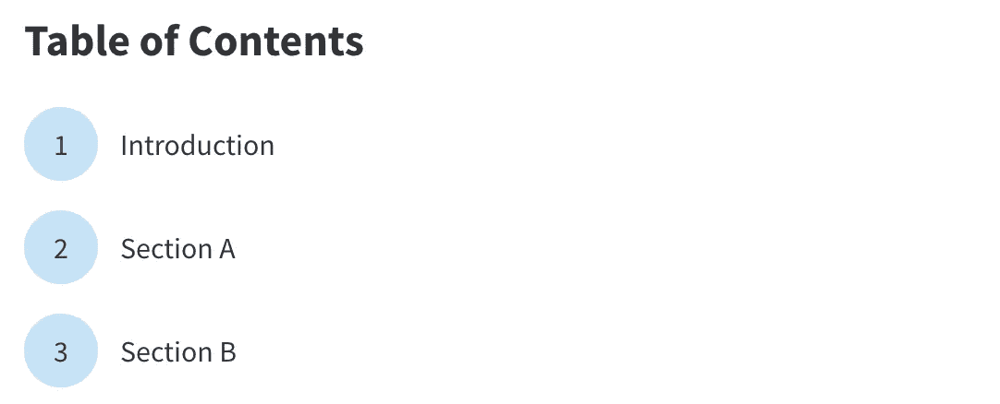
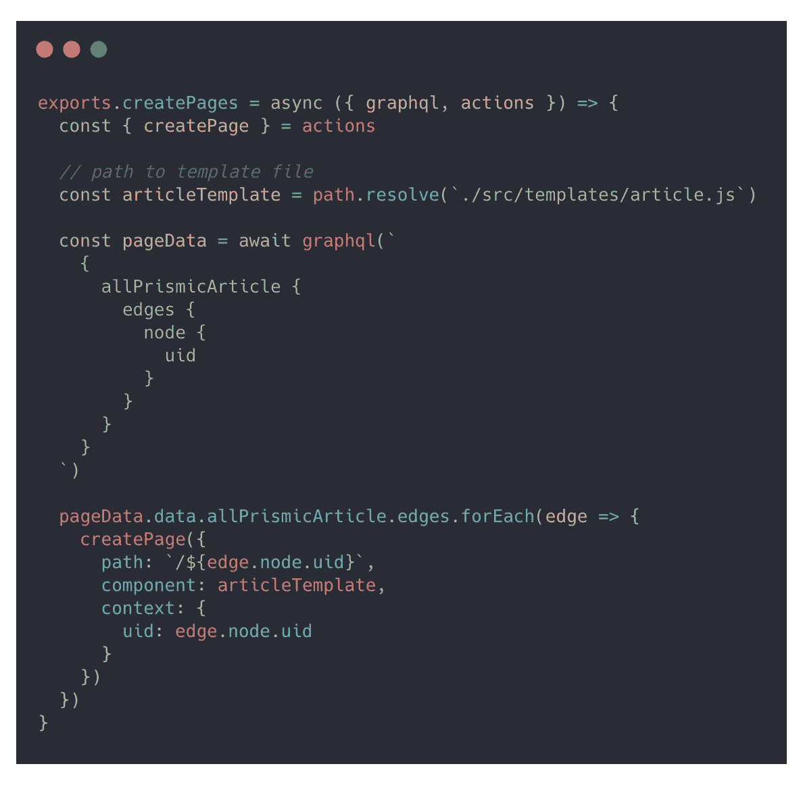
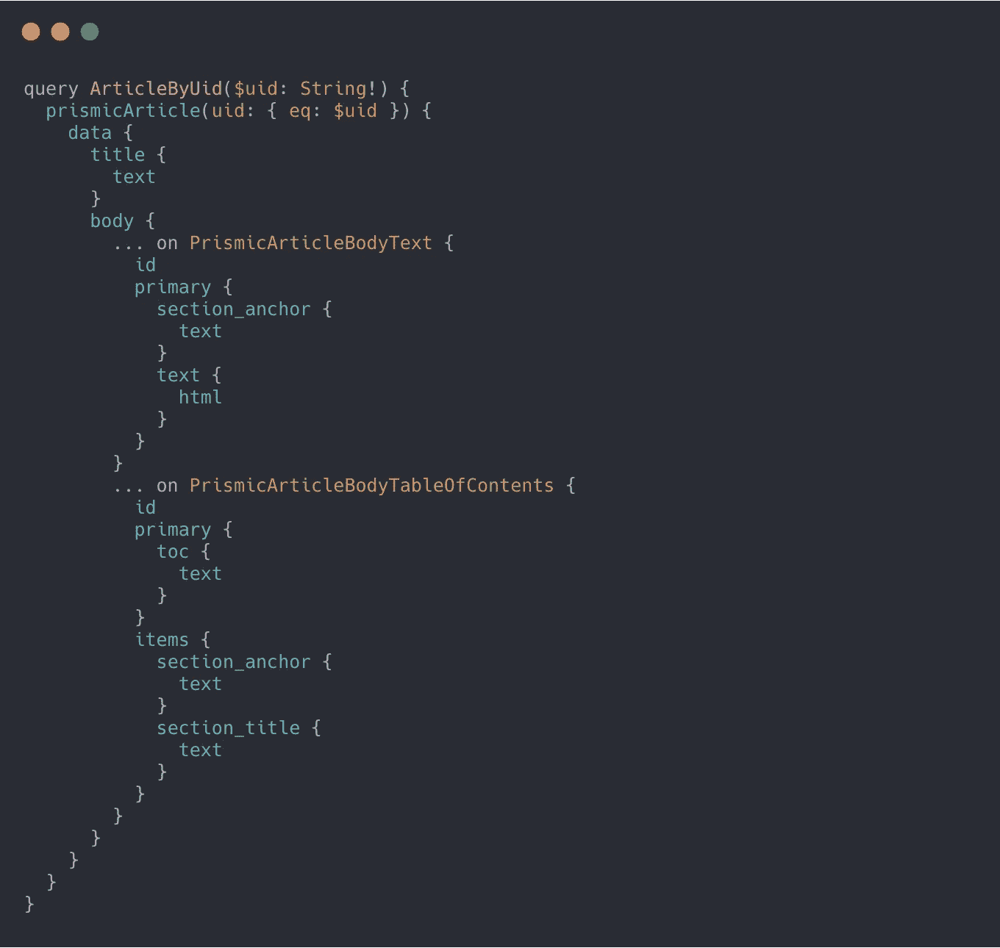
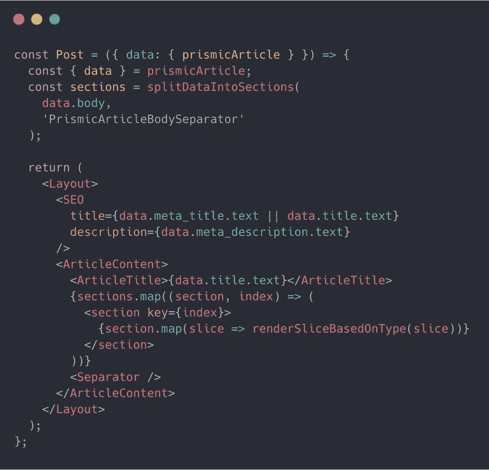
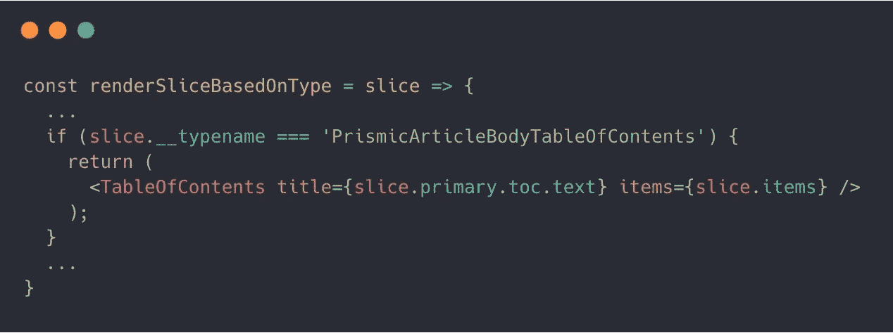

# 用目录增强你的 Prismic + Gatsby 网站

> 原文：<https://levelup.gitconnected.com/enhance-your-prismic-gatsby-site-with-a-table-of-contents-7e6739de3364>

## 目录可以帮助读者理解复杂和/或结构化的文章。以下是如何在你的 Gatsby 和 Prismic powered 站点中集成一个。

# 介绍

## 基本原理

在以下情况下，在文章和博客帖子中放置目录的理由就变得很明显了:

*   作者希望他们写作中的逻辑部分能作为导航路线图
*   文章内容广泛，需要参考文献来找到重要的信息
*   内容遵循可重复的模式，可以并排比较

杰米·坦普尔顿在 [Unsplash](https://unsplash.com?utm_source=medium&utm_medium=referral) 上拍摄的照片

Medium 没有添加目录的集成方式。但是需要它的作者可以使用这个指南集成一个:

 [## 创建中等文章的目录

### 黑客媒体:媒体有限编辑选项的变通方法

medium.com](https://medium.com/@AllienWorks/creating-table-of-contents-for-medium-articles-5f9087377b82) 

我们将使用类似的方法为你的 Gatsby 和 Prismic powered 站点创建一个目录。

## 盖茨比+普里斯米的组合

> [Gatsby](https://gatsbyjs.org) 是一个基于 React 的免费开源框架，帮助开发者构建高速网站和应用。在构建时，从一组全面的源中获取数据，并编译成静态 HTML 页面。然后，页面以一种表演的方式提供给客户机。

在这种情况下，我们的许多潜在数据源之一是 Prismic。

> [Prismic](https://prismic.io/) 是一个[无头 CMS](https://prismic.io/headless-cms-intro) ，通过专用插件与盖茨比集成。它有一个超级可定制的内容生成器和一个强大的 API。

我在 Prismic 的仪表板上找不到内置的目录组件，所以我开始着手解决这个问题。我现在分享我所能实现的。

# 配置 Prismic

## 配置内容蓝图

根据您的需求配置 Prismic 的方法有很多。逻辑表明应该有一个模板来对内容建模。该构建块的配置将是 Prismic 中的一个[自定义类型](https://user-guides.prismic.io/en/articles/380227-introduction-to-custom-type-building)。

Prismic 仪表板中显示的一些自定义类型

> 自定义类型允许您为内容定义和配置字段。自定义类型的一些例子有页面、文章、文章、作者和产品。这些是您特定项目所需的内容块。

如果你是从零开始开发，为你的内容配置一个**自定义类型**会很有好处，这样我们就可以在上面工作了。

## 创建目录切片

Prismic 有一个选项，可以通过添加名为**切片**的“动态区域”来定制**定制类型**。[切片](https://user-guides.prismic.io/en/articles/383933-slices)允许用户在其内容的任何地方添加区域，从而实现最终的可定制性。这些可以是一个文本部分，一个图像，或者许多其他的引用。您可以添加您的切片，对我来说，这似乎是我们的目录组件的逻辑基础。

> 切片允许内容作者编写更丰富的页面布局。

让我们创建一个名为“目录”的切片，并将其配置为包含两个区域。我们希望可选表格`title`位于**不可重复区域**中，而`title`和`anchor`链接位于**可重复区域**中。可重复区域中的元素将形成表格中的导航链接。将`section_title`和`section_anchor`分开允许完全的可定制性。我们为文章标题配置了不同的标题，以保持简洁。易访问性和 SEO 友好的锚链接会让 [Lighthouse](https://developers.google.com/web/tools/lighthouse) 高兴。这是该配置的样子:

目录的切片配置

你可以在 Prismic 的仪表盘中挑选任何 10+元素。外部媒体的链接？内容关系？一些图像？为了简单起见，让我们将添加保持在最低限度。

## 添加基于点击的导航支持

现在，我们需要在我们的可重复文本片段中配置(可选的)锚。在这种情况下，这个片段是创建文章主体的逻辑部分。根据您的需要，您可能已经**不同地配置了 Prismic】，但是基本原理是相同的。为了让基于点击的导航工作，我们需要两个元素:**

1.  `Text`切片开始时的锚点
2.  桌子上的锚

每个对应的对需要**相同**并遵循 **HTML 锚规则**。

配置节锚点

接下来，我们配置我们的 Gatsby 前端来使用我们的目录切片。

# 配置 Gatsby 和 React

## 添加基本的 React 组件

如果你还没有建立项目， [gatsby-universal](https://www.gatsbyjs.org/starters/fabe/gatsby-universal/) 是一个不错的(并且固执己见的)启动项目，它将很好地服务于我们的目的。

让我们从添加一个基本的 React 组件开始，它将呈现我们的目录。我们将`title`和`items`作为道具传递给它，匹配前面设计的可重复和不可重复区域。从包装器`div`开始，我们为标题添加了一个`h2`，并映射到`items`来呈现锚点。我们使用`index`对列表中的项目进行编号。

稍加修改后，结果如下所示:

## 配置文章模板

有几个插件可以帮助 Prismic 与 Gatsby 集成，每个插件都有其特定的设置过程。我将在本指南中使用 [gatsby-source-prismic](https://github.com/angeloashmore/gatsby-source-prismic) 的**稳定版本 2** 。

Gatsby 允许从外部数据创建页面，如这里的[所解释的](https://www.gatsbyjs.org/tutorial/part-seven/)。这个过程的本质是:

1.  在构建期间使用 GraphQL 查询数据
2.  使用`createPages` API 将查询结果映射到使用模板的页面

通过`context`为每一页提供一篇文章的`uid`。这将允许 Gatsby 在构建静态 HTML 时获取模板`article.js`中的每篇文章。标准的盖茨比魔术在这里概述，没有什么特别的。

获取文章的 GraphQL 查询可以在 Gatsby 的 graph QL 环境中查看和调试。

展示 **createPages** API 的代码片段

秘方是与棱镜片相关的 GraphQL 片段，它们将构成我们文章的主体。这些必须通过它们的 API 从 Prismic 中获取，方法是将它们包含在模板查询中。

我们需要添加与目录相关的 GraphQL 片段。片段名在 Gatsby 的 dev 服务器上可用，默认运行在`localhost:8000/___graphql`。

在这个特殊的例子中，`PrismicArticleBodyTableOfContents`是片段。我们需要查询这个片段来获取表上的信息。

## 渲染文章

文章数据现在可以作为道具提供给我们的`Article`模板组件。如何处理文章的渲染由你决定；提供所需数据的重要步骤已经完成。

一个可能的解决方案是由**克里斯·诺曼**概述的方法。

*   `splitDataIntoSections`根据`PrismicArticleBodySeperator`将一个文章分割成一个数组
*   `renderSliceBasedOnType`映射 React 组件和文章切片之间的关系

展示呈现逻辑的代码片段

1.  对于**目录**切片，呈现目录并将相关数据传递给它
2.  对于**文本**片段，呈现一个空 div，其 id 设置为 section 锚

就是这样！我们在一个由 Prismic 支持的 Gatsby 站点上添加了一个目录组件，没有太多的麻烦，并且具有很强的可定制性。双赢！

想看看这种方法的实际应用吗？在[https://getmrmarket.com/review/plus-500](https://getmrmarket.com/review/plus-500)查看 [Plus 500](https://www.plus500.com/) 评审。 [MrMarket](https://getmrmarket.com) 使用 Prismic 和 NextJS 供电。⚡️

感谢您的阅读，如果您有任何疑问，请务必告诉我！感谢 Prismic 和 Gatsby 的团队，感谢 Chris，我用他的代码片段完成了这篇指南。💡