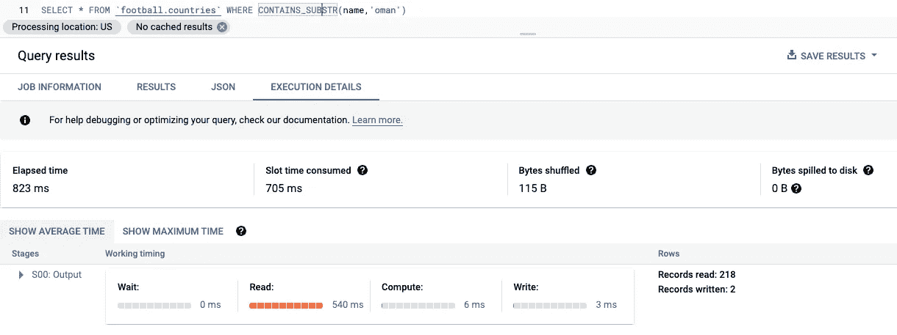
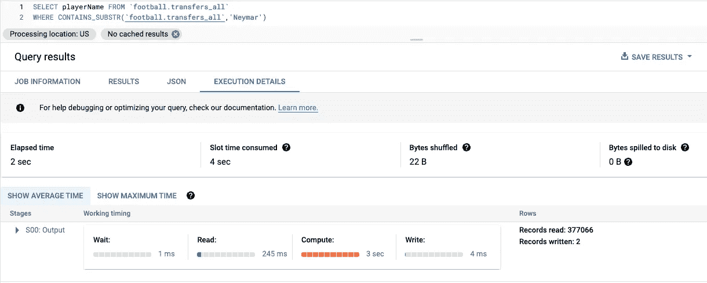
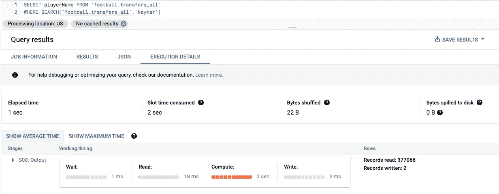
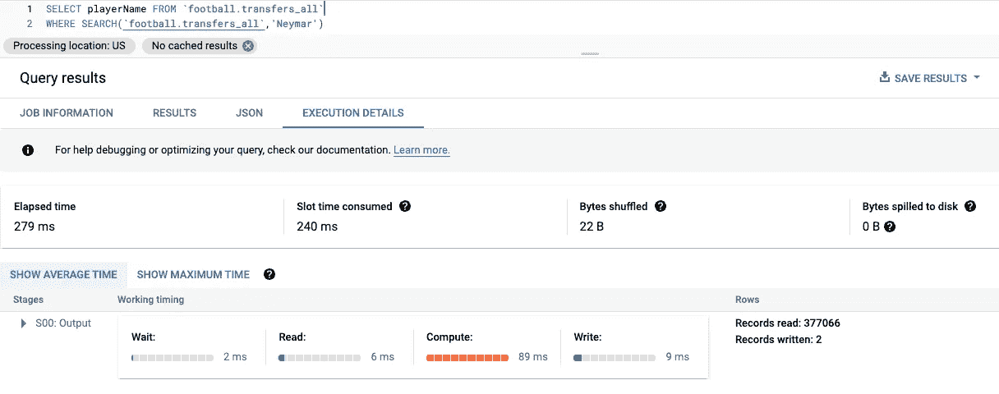

# 使用搜索索引增强 BigQuery 搜索特性

> 原文：<https://levelup.gitconnected.com/enhancing-bigquery-search-features-with-search-index-771c1eec186e>

## 简短介绍 BigQuery 的一个不错的特性

## 在非结构化文本和半结构化 JSON 中查找文本的更快方法

最近，我开始探索 BigQuery 的*搜索索引*特性，它大大加快了搜索功能。该特性允许我们使用 SQL 以更快的方式在整个表字段中查找特定的单词。


BigQuery 搜索 [GCP 博客](https://cloud.google.com/blog/products/data-analytics/pinpoint-unique-elements-with-bigquery-search-features)

如果您熟悉 BigQuery 字符串函数，那么您可能已经使用 CONTAINS_SUBSTR 函数来查找出现在所选字段中的特定单词。然后你现在有一个更快的功能和额外的功能。

这个新特性使用 search 命令简化了文本搜索，它比 CONTAINS_SUBSTR 更快，因为当您可以对所有列、所有字符串或 JSON 数据创建搜索索引时，表将被索引。

> BigQuery 搜索索引使您能够使用 Google 标准 SQL 轻松找到隐藏在非结构化文本和半结构化 JSON 数据中的唯一数据元素，而无需事先了解表模式
> 
> — GCP 博客[此处](https://cloud.google.com/blog/products/data-analytics/pinpoint-unique-elements-with-bigquery-search-features)。

# 我们一起试试吧…

我用的是一个小型足球数据集，包含 4 个表:*球员*、*俱乐部*、*国家、转会*。

我们将首先尝试使用 CONTAINS_SUBSTR 命令来查找一个特定的国家:



您可以记下读取数据所消耗的时间，以及返回结果的准确性。

命令**包含 _SUBSTR(名字，'阿曼')**在这里返回两个结果:

*   阿曼
*   罗马尼亚

在索引搜索之前，让我们在 countries 表下搜索一个国家:


命令 **SEARCH(name，' oman')** 在这里只返回一个结果:

*   阿曼

实现搜索索引:

```
CREATE SEARCH INDEX countries_indexON `football.countries`(ALL COLUMNS);
```

现在，让我们再次运行相同的搜索查询


如您所见，读取数据所消耗的时间显著减少。

我们将使用更多更大的表进行同样的尝试，*传输*。

使用 **CONTAINS_SUBSTR** 命令找到玩家内马尔:



使用**搜索**命令找到球员内马尔，无需索引:



实现搜索索引

```
CREATE SEARCH INDEX player_name_indexON `football.transfers_all`(ALL COLUMNS);
```

索引后使用**搜索**命令找到球员内马尔:



希望这篇快速介绍能够帮助您探索可以在 BigQuery 查询上实现的增强功能，以加快搜索结果的速度。