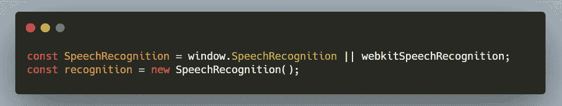
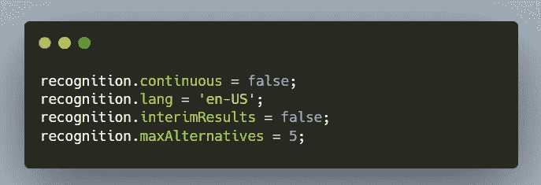
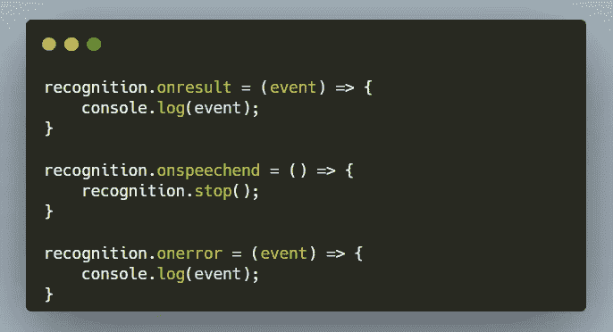
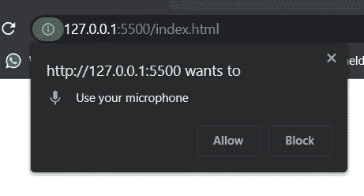
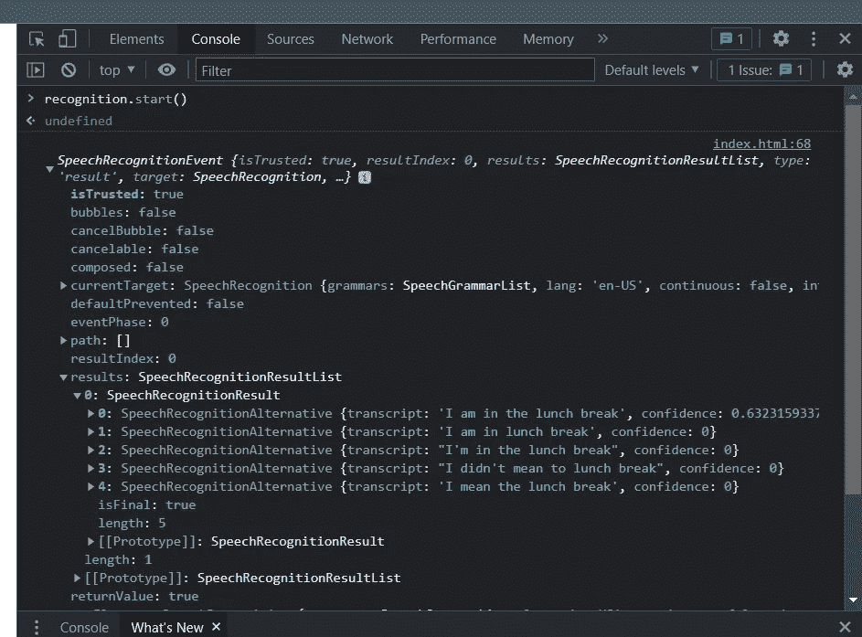
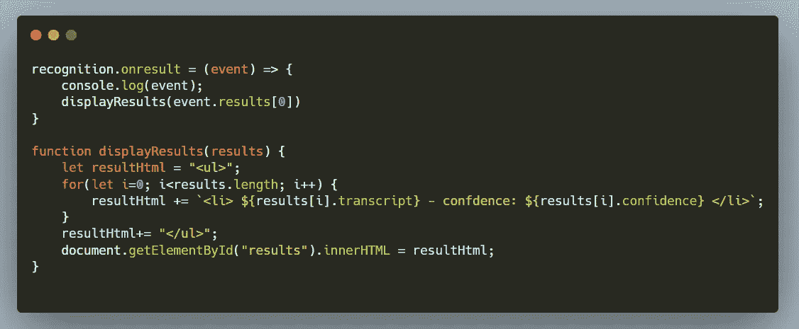
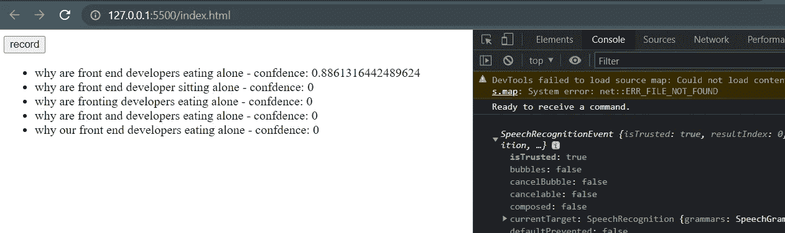

# 使用免费的人工智能语音识别丰富您的 Web 应用程序

> 原文：<https://levelup.gitconnected.com/enrich-your-web-application-with-a-free-a-i-voice-recognition-c042bb6646a2>

了解如何使用 Chrome 的 web Speech API 为您的 Web 应用程序启用语音识别。

Lyman Hansel Gerona 在 [Unsplash](https://unsplash.com?utm_source=medium&utm_medium=referral) 上拍摄的照片

## 1.实例化识别对象

Chrome 目前支持桌面和安卓浏览器的[网络语音 API](https://developer.mozilla.org/en-US/docs/Web/API/SpeechRecognition) 。因此，我们必须确保实例化正确的 *SpeechRecognition* 对象:

## 2.配置

Web Speech API 允许一些配置，例如设置语言或可选预测的最大数量:

当然，你可能想以不同的方式使用它——所以确保你看了一下[官方文档](https://developer.mozilla.org/en-US/docs/Web/API/SpeechRecognition),并为你的具体情况设置了正确的配置。

## 3.添加侦听器

添加听众并对人工智能的语音预测做出反应非常简单:

此时，我们已经可以测试我们的应用程序了。我们可以通过调用: *recognition.start()* 来触发记录

此外，我们需要允许浏览器访问麦克风。

之后，我们可以检查控制台，查看我们收到的事件和各种预测:

## 4.将该功能集成到您的应用程序中

有用！但是它不是用户友好的。此时，我们需要从 UI 触发记录，而不是从控制台。

同样，我们需要处理语音预测，并在页面上显示或以某种方式使用它们。

为了完成我们简洁的演示，我们将简单地添加一个按钮，允许用户开始记录，我们将在页面上以列表的形式显示预测。

## 5.测试它，玩 API，享受乐趣

最后，测试它，尝试不同的配置，并使用 API。

我相信这个免费的功能很棒，它肯定会带来一些很棒的想法和应用。

欢迎在评论中分享你的作品或想法。

因为他们不知道如何连接表:)

*完整源代码:*

# 分级编码

感谢您成为我们社区的一员！在你离开之前:

*   👏为故事鼓掌，跟着作者走👉
*   📰查看[升级编码出版物](https://levelup.gitconnected.com/?utm_source=pub&utm_medium=post)中的更多内容
*   🔔关注我们:[Twitter](https://twitter.com/gitconnected)|[LinkedIn](https://www.linkedin.com/company/gitconnected)|[时事通讯](https://newsletter.levelup.dev)

🚀👉 [**将像你这样的开发人员安置在顶级创业公司和科技公司**](https://jobs.levelup.dev/talent/welcome?referral=true)