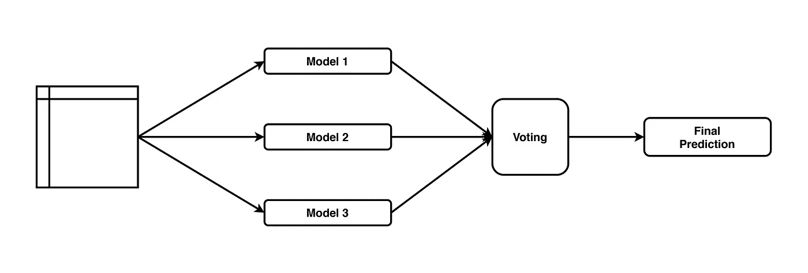

# 使用投票分类器的集成学习

> 原文：<https://levelup.gitconnected.com/ensemble-learning-using-the-voting-classifier-a28d450be64d>


来源: [pixabay](https://pixabay.com/photos/vote-word-letters-scrabble-1804596/)

## 了解如何使用集成学习的变体来利用多个模型的优势

在本文中，我描述了一个简单的集成算法。总体而言，集合模型结合多个基本模型来提高预测性能。集成模型最著名的例子是随机森林，它极大地简化了算法的逻辑，结合了多个决策树，并在分类问题中使用多数投票或通过对回归任务取平均值来聚合它们的预测。

与随机森林类似，投票集合估计多个基本模型，并使用投票来组合各个预测以获得最终预测。然而，关键的区别在于基本估计量。投票集成(和堆叠集成)等模型不要求基础模型是同质的。换句话说，我们可以训练不同的基础学习器，例如，决策树和逻辑回归，然后使用投票集成来组合结果。

下图显示了投票组合的工作流程:



投票分类器支持两种类型的投票:

*   **硬**:最终的类别预测是通过多数投票做出的——评估者选择在基本模型中出现最频繁的类别预测。
*   **软**:基于使用所有基础模型预测计算的平均概率，进行最终类别预测。例如，如果模型 1 以 70%的概率预测正类，模型 2 以 90%的概率预测正类，则投票集合将计算出有 80%的机会观察值属于正类，并选择正类作为预测。此外，我们可以使用自定义权重来计算加权平均值。这适用于我们更加信任一些模型，但仍然想考虑那些我们不太信任的模型的情况。

需要记住的一点是，为了使用软投票，所有的基本模型都必须有`predict_proba`方法。软投票可以比硬投票产生更好的性能(但不一定)，因为通过平均概率，它“给予”有信心的投票更多的权重。

上述投票方案只对分类问题(二元和多类)有效。在`scikit-learn`中，回归问题有一个单独的投票估计器(`VotingRegressor`)，它使用基本估计器预测的平均值作为最终预测。关于实现的例子，请参见[GitHub 上的笔记本](https://github.com/erykml/medium_articles/blob/master/Machine%20Learning/voting_classifier_article.ipynb)。

投票集合是一种有用的技术，当单个模型显示出某种偏差时，这种技术尤其有用。也有可能投票集合产生比最好的基本估计量更好的总体分数，因为它聚集了多个模型的预测并试图覆盖单个模型的潜在弱点。提高集合性能的一种方法是使基本估计量尽可能多样化。

在 0.22 版本中，`scikit-learn`引入了`StackingClassifier`，这是另一种使用异质模型作为基本估计器的集成技术。堆叠集成和投票集成的区别在于，前者在基本估计器预测的基础上训练另一个估计器(称为元学习器)。用于该任务的常见模型是逻辑回归。也可以将多层模型堆叠在彼此之上。

简单的理论介绍之后，让我们开始动手做编码吧。

# 设置

我们需要导入以下库:

这个列表相当长，因为我们需要导入不同的分类器，这些分类器将被用作基本估计器。

# 为分类准备数据集

为了简单起见，我们使用`scikit-learn`的`make_classification`函数来准备分类数据集。我们创建了一个包含 500 个观察值和 10 个特征的数据集。使用默认设置，数据集中有 2 个信息要素和 2 个冗余要素。有关该功能的更多信息，请参考[文档](https://scikit-learn.org/stable/modules/generated/sklearn.datasets.make_classification.html)。我们额外设置了`random_state`用于再现性。

我们创建的数据集是平衡的，标注类的比例为 1:1。我们可以通过运行`Counter(y)`来验证这一点。

创建数据集后，我们将数据分为训练集和测试集(使用 80–20 分割)，并使用 StandardScaler 缩放要素。请记住，在应用缩放等转换时，我们只在训练集上训练缩放器，并转换训练集和测试集。这样我们可以防止数据泄露。

诸如决策树之类的算法不需要缩放特征，然而，依赖于某种距离度量(例如 k-最近邻)的估计器需要缩放特征。我们对数据进行了缩放，因此它与所有考虑的估计值都兼容。

# 拟合模型

作为第一步，我们定义一个元组列表，每个元组包含模型的名称和估计器本身。此时，我们对所有分类器的默认设置都很满意。我们以这种方式建立模型，因为该列表将在稍后用作`VotingClassifier`的输入。

下一步，我们迭代前面定义的列表。对于每个模型，我们将它拟合到训练数据，预测测试集的标签，并使用准确性评估性能(这是一个可接受的度量，因为类是平衡的)。出于可再现性的考虑，每当估计量有一个`random_state`参数时，我们将其设置为 42。

以下代码片段总结了模型的性能:

```
decision tree's accuracy: 0.86 
logistic regression's accuracy: 0.85 
knn's accuracy: 0.86 
naive bayes classifier's accuracy: 0.87 
```

性能最好的模型是朴素贝叶斯分类器。

# 使用投票分类器

是时候看看我们是否可以通过使用`VotingClassifier`来提高性能了。我们从硬投票方案(多数票)开始。以下代码展示了如何设置它:

运行代码打印出 0.88 的准确度分数，比最好的基本估计值稍好。看来这次我们可以从使用系综方法中获益。

我们也可以通过用`'soft’`替换投票参数的值来尝试使用软投票。这样做实际上会将准确度分数降低到 0.85。这可能是因为在某些情况下，模型对预测的类并不真正有信心。

# 结论

在本文中，我展示了一个在`scikit-learn`中可用的集成方法的基本用例。当在一个项目中工作时，我们最有可能用不同的评估方法进行实验，所以尝试将它们聚合起来，看看是否会得到更好的结果是有意义的。在实际项目中使用这种方法的一个潜在缺点是缺乏可解释性。

此外，`VotingClassifier`可与`GridSearchCV`(或随机变量)一起使用，为基本估计量找到最佳超参数值。

您可以在我的 [GitHub](https://github.com/erykml/medium_articles/blob/master/Machine%20Learning/voting_classifier_article.ipynb) 上找到本文使用的代码。一如既往，我们欢迎任何建设性的反馈。你可以在[推特](https://twitter.com/erykml1?source=post_page---------------------------)或评论中联系我。

我最近出版了一本关于使用 Python 解决金融领域实际任务的书。如果你感兴趣，我在[贴了一篇文章](https://towardsdatascience.com/introducing-my-book-python-for-finance-cookbook-de219ca0d612)介绍这本书的内容。你可以在亚马逊或者 Packt 的网站上买到这本书。