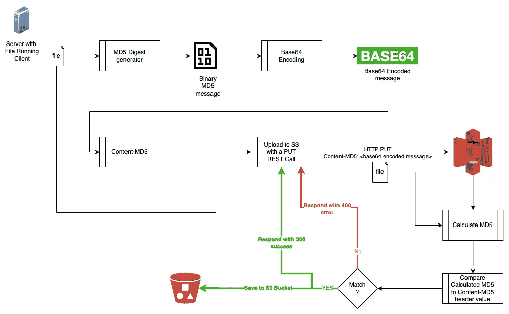
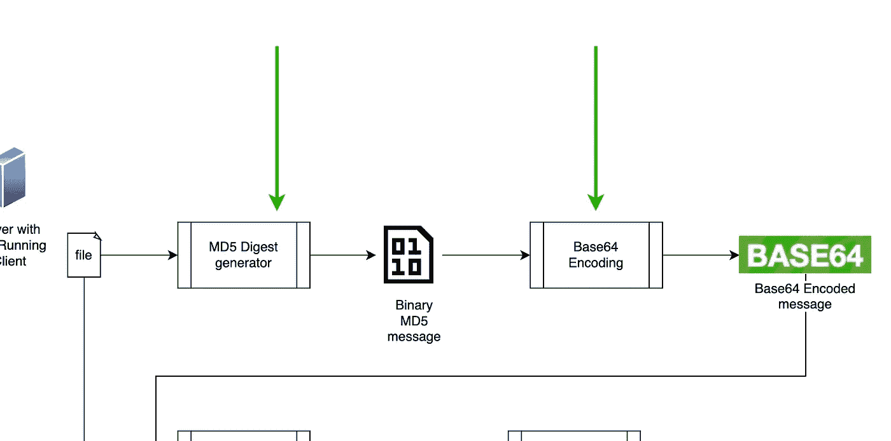

# 将文件上传到远程服务器时确保文件完整性

> 原文：<https://levelup.gitconnected.com/ensure-file-integrity-when-uploading-a-file-to-a-remote-server-552b7ccb1f3d>

AWS S3 用例——包含 JavaScript、Python、Go、Java 和 Ruby 示例


图片由[冷](https://pixabay.com/users/swidaalba-8022817/?utm_source=link-attribution&amp;utm_medium=referral&amp;utm_campaign=image&amp;utm_content=3604825)发自 [Pixabay](https://pixabay.com/?utm_source=link-attribution&amp;utm_medium=referral&amp;utm_campaign=image&amp;utm_content=3604825)

你想上传一个文件到一个远程服务器，比如亚马逊 S3，你想确保文件上传没有任何错误。

有一个简单的方法可以做到:

提供文件内容的 MD5 摘要作为头`Content-MD5`的值。然后，AWS S3 将获取文件内容，在将文件提交到 S3 桶之前，它将计算收到的内容的 MD5 摘要，并将它与`Content-MD5`头的值进行比较。如果它们不同，那么它将假设内容在到达服务器的途中被损坏，因此，实际上不会将它提交到 bucket。它会返回一个错误，这样你就知道了。

# 将此用于任何文件上传

您可以使用这种技术来检查上传到服务器的文件的完整性，对于其他情况也是如此。不仅仅是上传文件到亚马逊 S3。

更重要的是，您可以从 blog post 中获得灵感，以便为任何将数据从一个地方移动到另一个地方的用例实现数据完整性解决方案。

# 内容 MD5 如何工作

下图说明了该标题如何对您有用，以及您需要采取哪些步骤来计算`Content-MD5`标题的正确值:



如何评估 Content-MD5 标头

这篇博客文章主要关注为手头的文件计算正确的 MD5 值需要采取的两个步骤:

1.  MD5 摘要
2.  Base64 编码



我们将重点关注的步骤

我们将展示在您的编程语言中使用哪些正确的语句来计算 MD5。由于我们实际上不知道哪一种是你的编程语言，我们将展示一些最流行的语句。

但是首先，…

# 我们的基线

因为有很多方法可以计算一组字节的 MD5，并将其转换为可以通过 HTTP 请求头作为值传输的东西，所以我们遵循 [Amazon 建议](https://aws.amazon.com/premiumsupport/knowledge-center/data-integrity-s3/)使用`openssl`和`base64`命令(在 Linux 和 Mac 上)来计算正确的值，如下所示:

```
$ openssl md5 -binary invoice.pdf | base64
```

其中`invoice.pdf`是我们想要上传到 S3 的样本二进制文件。

上述 shell 调用的输出将为我们提供一个值，该值将用作我们的基线。我们接下来要编写的所有程序都必须为同一个输入文件(`invoice.pdf`)输出相同的值。如果是的话，他们是正确的。如果他们没有，他们就错了。

以上，当对我的`invoice.pdf`文件执行时，返回:`EV3WGikm7dyg2HFMqPoY3A==`。我希望下面所有的程序都为这个文件输出相同的值。

我们开始吧

# JavaScript/Node.js

# 计算机编程语言

# 去

# Java 语言(一种计算机语言，尤用于创建网站)

# 红宝石

# AWS SDKs

到目前为止一切顺利。这些是一些很好的练习，展示了我们如何计算文件内容的 MD5 摘要的 Base64 表示。除了从教程的角度来看，它们有用吗？是的，他们是。当你不想使用官方提供的 AWS SDK 作为你的编程语言时，你可能想回到上面描述的这些技术。

# 结束语

那是一篇快速提示型的博文。它展示了如何在上传文件到远程服务器时计算`Content-MD5`头的值，事实上，远程服务器是 AWS S3。除了本文中描述的具体用例，您还可以获得灵感来实现网络数据完整性的解决方案。

一如既往，我从你身上学到的比你从我身上学到的要多得多。因此，我们非常欢迎您的评论。