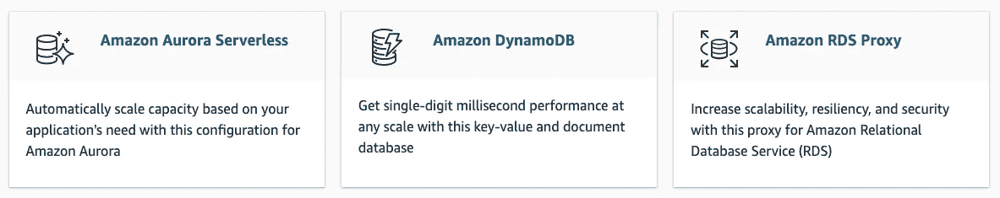
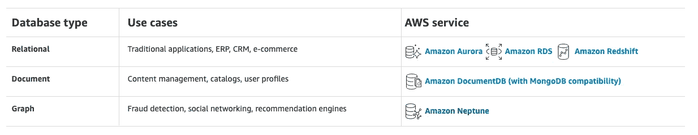
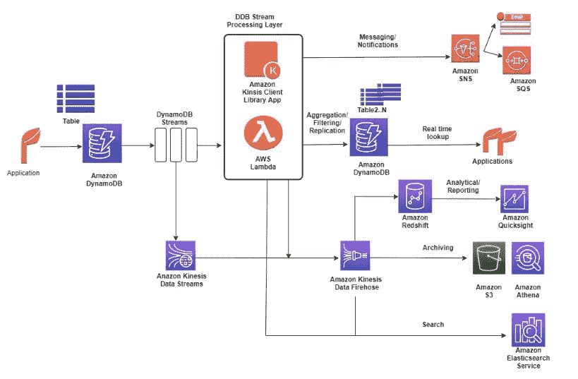
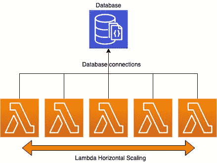
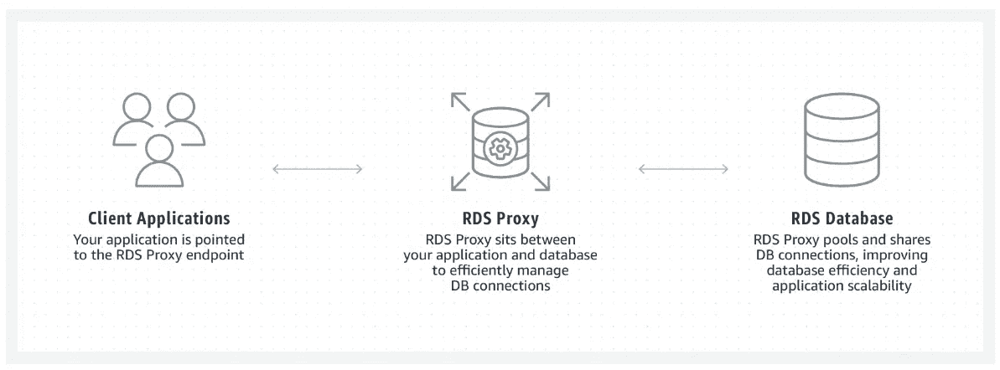
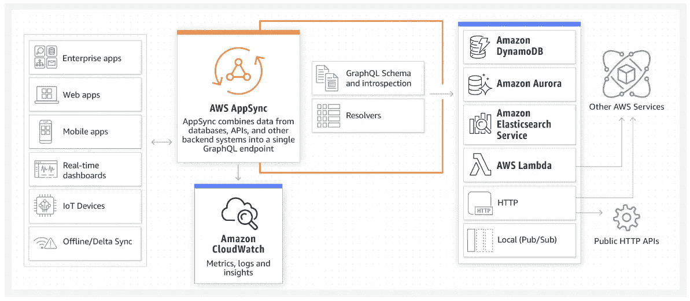
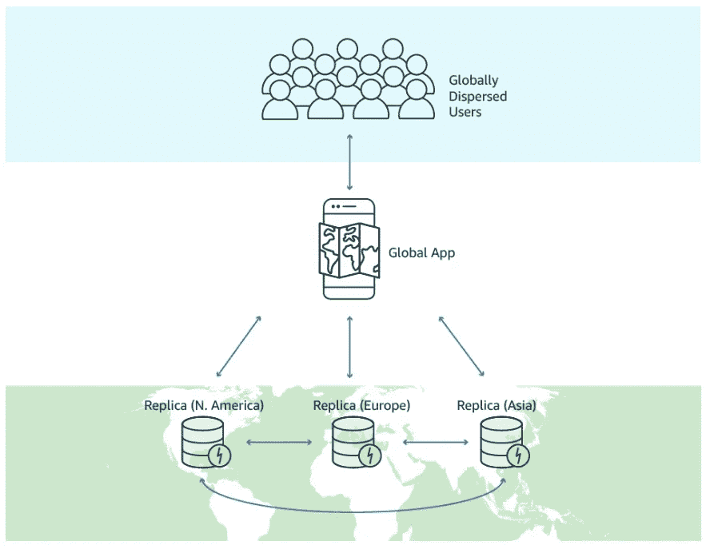

# 企业无服务器🚀数据库

> 原文：<https://levelup.gitconnected.com/enterprise-serverless-databases-208b8790998>

[https://unsplash.com/@brizmaker](https://unsplash.com/@brizmaker)

企业无服务器系列中的这一部分专门介绍数据库，以及规划、想法和问题。你可以点击下面的“*系列介绍*链接阅读该系列背后的想法。

该系列分为以下几个部分:

1.  [系列介绍](https://medium.com/@leejamesgilmore/enterprise-serverless-series-358be237b510)🚀
2.  [工装](https://medium.com/@leejamesgilmore/enterprise-serverless-tooling-aa2b84d932de)🚀
3.  [建筑](https://medium.com/swlh/enterprise-serverless-architecture-39c4f4ae5aff)🚀
4.  **数据库**🚀
5.  [提示&提示](https://medium.com/@leejamesgilmore/enterprise-serverless-hints-tips-32a41cdabc0d)🚀
6.  [AWS 限制&限制](https://medium.com/@leejamesgilmore/enterprise-serverless-aws-limits-limitations-ce99e20432be)🚀
7.  [安全](https://medium.com/@leejamesgilmore/enterprise-serverless-security-170d1aeefc22)🚀
8.  [有用的资源](https://medium.com/@leejamesgilmore/enterprise-serverless-useful-resources-cd8e987f6d69)🚀

# 数据库

## 哪些数据库是无服务器的，为什么使用它们？🤔

在 AWS 上设计和构建无服务器解决方案时，您有两个主要的数据库选项；传统(*基于服务器*)和无服务器。但问题是，这两者之间有什么区别，这对您决定使用哪个数据库有什么帮助？

当我们谈到无服务器数据库时，我们通常会谈到 [DynamoDB](https://aws.amazon.com/dynamodb/?c=ser&sec=srv) 或[无服务器 Aurora](https://aws.amazon.com/rds/aurora/serverless/?c=ser&sec=srv) ( *v1 和 v2*)；其中可能包括 RDS 代理作为管理连接的门面。

当我们谈到 AWS 上的非无服务器数据库时，我们通常会想到 AWS [RDS](https://aws.amazon.com/rds/) ( *MySQL、Postgres、Aurora、SQL Server、Oracle 等*)、 [DocumentDB](https://aws.amazon.com/documentdb/) 和 [Neptune](https://aws.amazon.com/neptune/?c=db&sec=srv) 。

使用无服务器数据库的主要好处是:

1.  **维护** —管理开销更少。
2.  **可扩展性—** 提高可扩展性，减少容量规划需求。
3.  **集成** —通常是与其他服务的更多本机集成，如 Lambda、Step Functions、API Gateway、AWS AppSync 等。
4.  **成本** —为您使用的容量付费。
5.  **连接管理**——使用 lambda 肯定有办法解决这个问题，但是使用 DynamoDB 通常不需要考虑 lambda 向外扩展时的数据库连接(稍后将详细介绍)..)
6.  **专职人员** —无需专职数据库管理员或专家来全天候管理数据库。

当我们在 AWS 上对完全无服务器数据库的企业进一步采取这一措施时，在我看来，这通常只剩下 DynamoDB 作为一个选项，因为 Aurora 无服务器的 v1 在规模上有其局限性，而 v2 仍仅处于预览阶段:

> Amazon Aurora 无服务器 v1 是一个简单、经济高效的选项，适用于不频繁、间歇或不可预测的工作负载。— **AWS**

Aurora Serverless v2 现在具有高度的可扩展性和可用性，涵盖了企业的使用案例:

> Aurora Serverless v2 (Preview)支持各种数据库工作负载，从具有不频繁、间歇或不可预测工作负载的开发和测试环境、网站和应用程序，到要求高扩展性和高可用性的最苛刻的业务关键型应用程序— **AWS**

## 为什么 DynamoDB 是王者👑

在 AWS 内部，他们有一个针对内部服务的“NoSQL 第一方法”,如 Colm maccárthaigh(*AWS*高级首席工程师)的演示所示:

在我看来，这就是为什么架构师和无服务器工程师在架构域服务时应该考虑' **DynamoDB 优先方法**'，尽管它可能不适合所有用例

## 那么什么是 DynamoDB 呢？

DynamoDB 是一个完全托管的 NoSQL 键值对和文档数据库，在任何规模下都能提供一位数的毫秒级性能。DynamoDB 每天可以处理超过 10 万亿个请求，每秒可以支持超过 2000 万个请求的峰值。

以下视频是使用 DynamoDB 实现性能和规模 **Disney+** 的绝佳范例:

AWS re:Invent 2020:Disney+如何在亚马逊 DynamoDB 上进行全球扩展

## DynamoDB 适合所有用例吗？🤔

在我看来，答案是否定的，尽管我确信里克·霍利汉会告诉我并非如此..而且他很牛！在很大程度上，当我们将微服务分成各自的领域时，我们发现 DynamoDB 将适合我的经验中的大多数用例。

我不相信它适合所有用例的原因是，在过去，我曾经做过需要同时进行复杂的查询、聚合、排序和分页的企业应用程序。这对开发团队来说是一个逻辑噩梦，降低了开发人员的满意度，增加了认知负荷，由于开发开销、未来需求的不明确性和查询的自由性，我们倾向于迁移到另一种数据库技术。

DynamoDB 在很大程度上要求您预先考虑您的[数据访问模式，在我看来，这使得它不如基于 SQL 的数据库灵活。由于解决方案通常被分割成多个域服务，它们有自己的数据存储，这通常比您想象的问题要少。](https://docs.aws.amazon.com/amazondynamodb/latest/developerguide/bp-general-nosql-design.html#bp-general-nosql-design-approach)

使用[单表设计](https://www.alexdebrie.com/posts/dynamodb-single-table/)、[邻接表模式](https://docs.aws.amazon.com/amazondynamodb/latest/developerguide/bp-adjacency-graphs.html)、[聚合](https://docs.aws.amazon.com/amazondynamodb/latest/developerguide/bp-gsi-aggregation.html)和 [GSI 重载](https://docs.aws.amazon.com/amazondynamodb/latest/developerguide/bp-gsi-overloading.html)肯定有办法解决这个问题，尽管这确实意味着架构师和开发人员需要花费大量时间预先详细说明访问模式——并且需要权衡长期使用 DynamoDB 的好处，以及最终发布特性的速度。

在我看来，DynamoDB 上关于单表设计的最好文章之一是 AWS 数据英雄 [Alex Debrie](https://twitter.com/alexbdebrie) 写的，可以在这里[找到](https://www.alexdebrie.com/posts/dynamodb-single-table/)，还有他精彩的 [DynamoDB 指南](https://www.dynamodbguide.com/what-is-dynamo-db)，涵盖了你需要知道的一切！

> 这个视频简直太神奇了——在我看来，所有的架构师和开发人员都应该看这个视频！这些年我一定看了二十遍了！👊🏼

## 我们如何解决这些限制？🧑🏻‍💻

DynamoDB 的伟大之处在于它通过使用 DynamoDB 流具有很强的可扩展性，这使得架构师和开发人员可以根据需要将数据更改传输到其他数据库技术，从而大规模获得 DynamoDB 的主要优势，并在需要时提供额外的功能。

这方面的一个很好的例子是将数据更改流式传输到 AWS ElasticSearch，以允许细粒度的搜索功能，或者 AWS Redshift 用于数据仓库查询和报告。也可以将数据流式传输到无服务器的 Aurora，这在需要时也是一种常见的模式。

[https://AWS . Amazon . com/blogs/database/dynamo db-streams-use-cases-and-design-patterns/](https://aws.amazon.com/blogs/database/dynamodb-streams-use-cases-and-design-patterns/)

> 使用多种数据库技术和 DynamoDB 流时要考虑的一件事是工作负载的最终一致性。我曾参与过一个大型项目，在这个项目中，前端允许用户在一个表单中添加一条新记录，该表单被发送到 DynamoDB，然后基于不同的数据库技术刷新回主搜索视图，当表视图加载并调用 API 时，数据尚未复制(这通常需要 200-300 毫秒，但前端会立即刷新)。这意味着当您需要在客户端缓存时，API 优先的方法可能会有问题。

## Lambda 可以与 RDS 和 DocumentDB 一起工作吗？🤔

对此的简单回答是**是的**！然而，有各种事情要考虑，并且在 DocumentDB 的可观察性和维护方面涉及更多的工作。

在我看来，当 lambda 水平扩展时，需要考虑的最重要的事情是数据库连接管理，这是您将花时间观察请求和调整 lambda 保留并发性的地方，同时还需要考虑数据库的读取副本和实例大小(*因为更大的实例通常意味着更多的可用连接*)。

对于 AWS RDS，我们有 [AWS RDS 代理](https://aws.amazon.com/rds/proxy/)，它位于您的应用程序和您的关系数据库之间，以有效地管理到数据库的连接，并提高应用程序的可伸缩性。这意味着上述问题不太突出:

[https://aws.amazon.com/rds/proxy/](https://aws.amazon.com/rds/proxy/)

> 还有一个几年前由 Jeremy Daly 创建的包叫做 T2 的无服务器 mysql，但是我在社区中找不到 DocumentDB 的对等物。还没！

**带有文档 DB 的用例**

在我参与的一个大型项目中，我们使用了 DocumentDB，它有数量有限的可用数据库连接(*包括读取副本*)，不幸的是，AWS 没有可用的代理。

当 lambda 由于不可预测的工作负载而向外扩展时，我们需要一个计划来管理这一点，即我们需要确保并发 lambda(*和连接数*)的数量不会超过总的可用连接数！

第一个计划很简单，每次调用时打开和关闭 lambda 中的数据库连接，因为它们只需要 200 毫秒左右的运行时间..简单！我们很快意识到，在负载测试时，以这种速度打开和关闭数据库连接对计算来说是非常昂贵的，数据库在相对中等的每秒并发 lambdas 数上非常快地达到了 90%的内存和高计算…啊啊啊！🔥🔥🔥

这实质上意味着我们需要依次查看每个端点，并在单个 lambdas 上设置保留并发，总并发计数小于数据库连接的总计数。这实际上工作得非常好，即使在每秒非常高的规模和保持连接打开的情况下，我们发现大约 15 分钟后任何僵尸连接都消失了，这工作得很好。这给了我们将工作负载从 MongoDB 迁移到 DocumentDB 所需要的好处，以及域服务在 lambda 上与数据库完全分离的好处。👏

> 在将[mongose](https://mongoosejs.com/)与 NodeJS、lambda 和 DocumentDB 一起使用时，一个考虑因素是 mongose 默认将连接上的池大小设置为 5，这意味着 lambda 和 open connection 之间的相关性不是 1！谢天谢地，这很容易改变[——所以不要被发现！](https://mongoosejs.com/docs/connections.html#connection_pools)

## 集成和功能🛠

在设计解决方案时，了解您选择的数据库可以利用的集成点和特性总是很有用的。下面列出了一些常见的 DynamoDB 集成，根据我的经验，这些集成非常有用。

**AWS app sync** [AWS app sync](https://aws.amazon.com/appsync/)是一个托管的 GraphQL 服务，它具有 DynamoDB 解析器，允许您直接从 Graph API 访问数据库。这是一种强大的大规模扩展模式，我过去曾广泛使用过:

[https://aws.amazon.com/appsync/](https://aws.amazon.com/appsync/)

**API Gateway** 与上面的 AWS AppSync 一样，您可以将相同的架构模式应用到 REST 与 API Gateway 的服务代理集成中。我过去在一个企业项目中使用过这种方法，该项目用于一个基本的域服务，该服务只允许公共读取，但需要具有潜在的高吞吐量和规模。

 [## 使用 Amazon API 网关作为 DynamoDB | Amazon Web 服务的代理

### AWS 解决方案架构师 Andrew Baird 说，Amazon API Gateway 有一项功能可以让客户创建自己的 API…

aws.amazon.com](https://aws.amazon.com/blogs/compute/using-amazon-api-gateway-as-a-proxy-for-dynamodb/) 

**AWS 步骤功能** [AWS 步骤功能](https://aws.amazon.com/step-functions/?step-functions.sort-by=item.additionalFields.postDateTime&step-functions.sort-order=desc)是面向工作流的托管编排服务，可与 DynamoDB 直接集成。这对于在工作流调用期间管理记录非常有用，而不需要跳出到 lambda。

 [## 用 Step 函数调用 DynamoDB APIs

### Step 函数可以直接从 Amazon States 语言控制某些 AWS 服务。有关…的更多信息

docs.aws.amazon.com](https://docs.aws.amazon.com/step-functions/latest/dg/connect-ddb.html) 

**DynamoDB Streams**
正如上面所讨论的，DynamoDB Streams 允许一个到 lambda 的集成点，用于任何项目变化的流，这打开了几乎所有你能想到的用例。例如，写信给 [Elasticsearch](https://aws.amazon.com/elasticsearch-service/) ，填充 S3 的数据湖，或者基于特定场景发出警报。

**AWS Cognito 项目级认证** 通过结合 DynamoDB 和 [AWS Cognito](https://aws.amazon.com/cognito/) 您可以在数据库中创建项目级的细粒度访问控制。这是一个强大的功能，将在中进一步讨论。

**DynamoDB 全局表**
DynamoDB 有一个名为[全局表](https://aws.amazon.com/dynamodb/global-tables/)的特性，它允许您跨区域复制数据，这提供了许多可能性，例如跨不同区域的主动活动。

[https://aws.amazon.com/dynamodb/global-tables/](https://aws.amazon.com/dynamodb/global-tables/)

**DynamoDB DAX**
AWS dynamo db 加速器( *DAX* )是 dynamo db 的完全托管内存缓存，具有高可用性，性能提升高达 10 倍。这种性能可以从几毫秒提高到几微秒，甚至每秒几百万个请求。

## 进一步的考虑和检查表📋

以下是我在选择数据库以及数据库的规划和日常维护时经常考虑的一系列问题:

VPC 还是没有 VPC，这是个问题？
使用 DynamoDB 的一个好处是配置更少，不需要像 VPC 那样复杂，也不需要 Nat 网关等。如果你已经因为商业原因在 VPC，那么你可能需要通过 [VPC 端点](https://docs.aws.amazon.com/amazondynamodb/latest/developerguide/vpc-endpoints-dynamodb.html)访问 DynamoDB。

**Blob 存储**
虽然一些数据库允许有效的 Blob 存储，但是[dynamo db 的最大二进制项目大小为 400kb](https://docs.aws.amazon.com/amazondynamodb/latest/developerguide/bp-use-s3-too.html) 。这意味着它不太适合存储图像或斑点，通常与 [AWS S3](https://aws.amazon.com/s3/) 一起工作来存储指向文件的指针。这也要便宜得多，因为 DynamoDB 根据项目大小来收取读写费用。

如果你的团队在本地进行无服务器开发，而不是直接在 AWS 中，你需要考虑数据库的本地开发策略。当使用 MySQL 或类似的语言时，可以很容易地用 Docker 解决这个问题。

另一方面，如果你正在使用 DynamoDB 和 serverless，你需要考虑如下的替代方案(*也可以使用 Docker* 运行):

1.[server less-dynamo db-local](https://www.npmjs.com/package/serverless-dynamodb-local)
2。[local stack](https://github.com/localstack/localstack)3
。[无服务器本地堆栈](https://github.com/localstack/serverless-localstack)

**短暂的环境**
如果您的团队正在使用短暂的环境和数据库技术，如 AWS Elasticsearch 和 DocumentDB，很可能您不想为每个 PR 或开发人员提供一个集群！[解决这个问题的一种方法是为 QA 和短期环境建立一个主集群，并通过您的无服务器文件管理部署和重用。](https://leejamesgilmore.medium.com/enterprise-serverless-hints-tips-32a41cdabc0d)

**总拥有成本**
在我看来，一个关键的考虑因素是总拥有成本(TCO)，这篇[文章](https://aws.amazon.com/blogs/database/how-to-determine-if-amazon-dynamodb-is-appropriate-for-your-needs-and-then-plan-your-migration/)的某些部分以及[瓦迪姆·卡祖尔金](https://twitter.com/vkazulkin)和克里斯蒂安·班尼斯的[精彩幻灯片](https://www.slideshare.net/VadymKazulkin/measure-and-increase-developer-productivity-with-help-of-severless-by-kazulkin-and-bannes-sla-the-hague-2020-238115659)都涉及到了这个问题。

您将数据存储在哪里，为什么存储，存储多长时间？
一个关键的考虑因素是[数据隐私法和合规性](https://aws.amazon.com/compliance/data-privacy/)明确你将数据存储在哪里，存储的原因，以及存储多长时间(*想想 GDPR 或类似的东西*)。

**备份您的数据** 无论您选择什么样的数据库，都要计划好数据库备份策略，因为根据我的经验，有些组织会忘记这一点，直到因为需要快速发布功能而为时已晚。

**灾难恢复策略**
规划好备份后，必须有一个灾难恢复策略，并且至少实施一次，以确保它适合您的组织。这是一份非常有用的关于这个主题的 AWS 白皮书。

**安全性**
一个主要的考虑因素是安全性，从访问的角度来看(*即谁可以访问数据*)，以及对于应用最少特权的无服务器开发来说(*如何访问数据*)。您还应该考虑静态和传输中的加密。

**数据访问层**不会，他们不太可能一一对应，但在我看来肯定会比从头开始容易！

**迁移数据库** 另一个关键考虑因素是任何现有数据库的迁移，以及现有数据库特性和目标数据库之间的奇偶校验。AWS 有一个名为 [AWS DMS](https://aws.amazon.com/dms/) 的托管服务，用于数据库迁移，既支持同构迁移，也支持异构迁移。在选择正确的数据库迁移路径时，考虑您可能拥有的可重用代码的数量和数据传输的复杂性(*和潜在的 ETL* )。

## 逮到你了🥸

下面的部分描述了我过去遇到的一些问题，这些问题可能对其他架构师有用。

**AppSync 项目级别授权**

在一个使用 AWS AppSync 的大型项目中，我们决定将其与 DynamoDB 结合使用，并使用 [peopleCanRead、groupsCanRead、peopleCanModify](https://docs.aws.amazon.com/appsync/latest/devguide/security-authorization-use-cases.html) 等在项目级别读取细粒度访问控制的最佳实践。在各种调用中，AWS 检查了 DynamoDB 模式的有效性，我们准备好了！

这非常有效，在项目开始时，我们使用 DynamoDB resolvers 来完全移除计算层(*它更便宜并且非常快*)。随着项目的进展，我们发现 VTL 无法管理我们更新的、更复杂的特性，于是我们跳到了 lambda ( *它在这一点上仍然工作得很好，因为我们使用了 OAuth2 令牌中的 sub 来检查用户应该拥有什么访问权限，并且仍然在 DynamoDB* 中的项目级别进行检查。除了一点额外的工作，这一点都很好..

有趣的是，这对于 API 的消费者是经过身份验证的用户的[隐式/授权代码流](https://auth0.com/docs/authorization/which-oauth-2-0-flow-should-i-use)非常有效，但是当还需要适应新的机器到机器流(*客户端凭证授权，其中没有用户，并且是 API 到 API* )时，我们发现我们现在不能重用相同的 lambdas。计划是为 M2M 重用带有 API 网关的 lambdas，即一个单独的处理器，但主要逻辑保持不变，但最终这意味着我们本质上需要复制大量的 lambdas，唯一的区别是数据库调用(*其余的逻辑被复制*)。

这里的要点是 a .)在使用项目级授权时考虑项目集成的未来，b .)潜在地为授权添加中间件，而不是在主逻辑内。

**DMS 不能使用 DynamoDB** 进行设置

在另一个项目中，我希望将数据迁移到 DynamoDB，但发现 AWS DMS 不能处理 set 时遇到了障碍。带有数据库迁移的早期概念验证是一个好主意，因此您应该尽早着手此类事情！

## 愿望清单！❤️

我想我会以我的个人愿望清单来结束这一部分，它将包含两个主要项目！首先是无服务器 Elasticsearch，其次是无服务器 DocumentDB。DocumentDB 代理也将是一个福音！一个男人只会做梦。)💭

**下一节:** [提示&提示](https://medium.com/@leejamesgilmore/enterprise-serverless-hints-tips-32a41cdabc0d)🚀
**上一节** : [架构](https://medium.com/@leejamesgilmore/enterprise-serverless-architecture-39c4f4ae5aff)🚀

# 包扎

让我们连接以下任何一项:

[https://www.linkedin.com/in/lee-james-gilmore/](https://www.linkedin.com/in/lee-james-gilmore/)T21[https://twitter.com/LeeJamesGilmore](https://twitter.com/LeeJamesGilmore)

如果你觉得这些文章鼓舞人心或有用，请随时用虚拟咖啡[https://www.buymeacoffee.com/leegilmore](https://www.buymeacoffee.com/leegilmore)来支持我，不管怎样，让我们联系和聊天吧！☕️

如果你喜欢这些帖子，请关注我的简介[李·詹姆斯·吉尔摩](https://medium.com/u/2906c6def240?source=post_page-----39c4f4ae5aff----------------------)以获取更多的帖子/系列，不要忘记联系我并问好👋

# 关于我

**"** *大家好，我是 Lee，英国的 AWS 认证技术架构师和多语言软件工程师，是一名技术云架构师和无服务器主管，在过去的 6 年里主要从事 AWS 上的全栈 JavaScript 工作。*

*我认为自己是一个无服务器布道者，热爱 AWS、创新、软件架构和技术。*

******** 所提供的信息是我个人的观点，我对这些信息的使用不承担任何责任。**