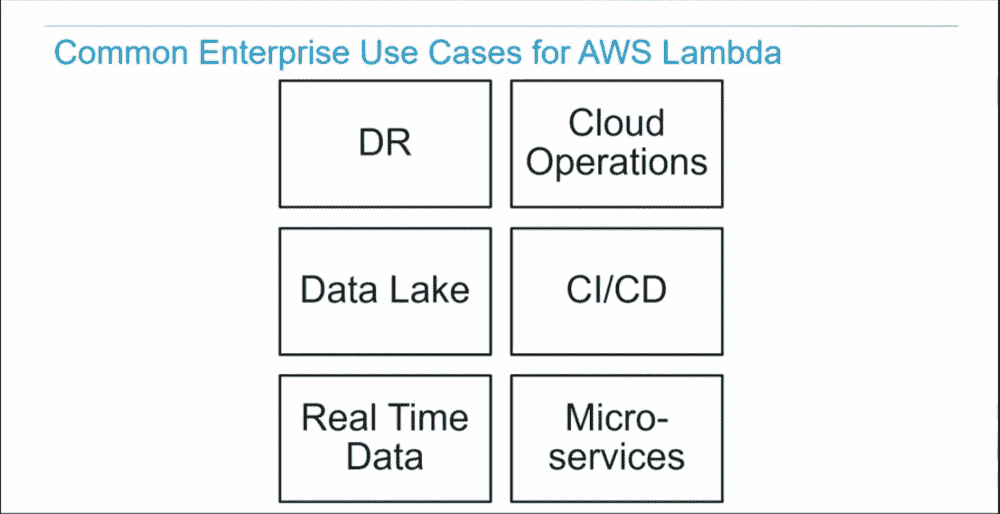
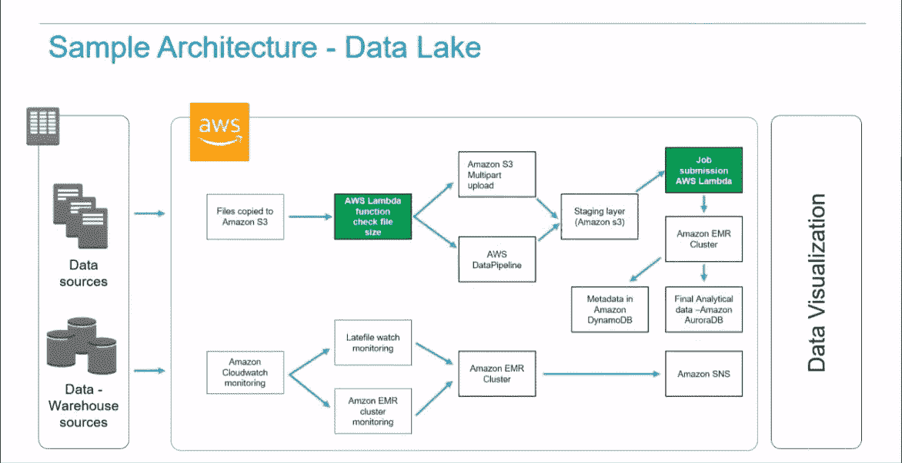
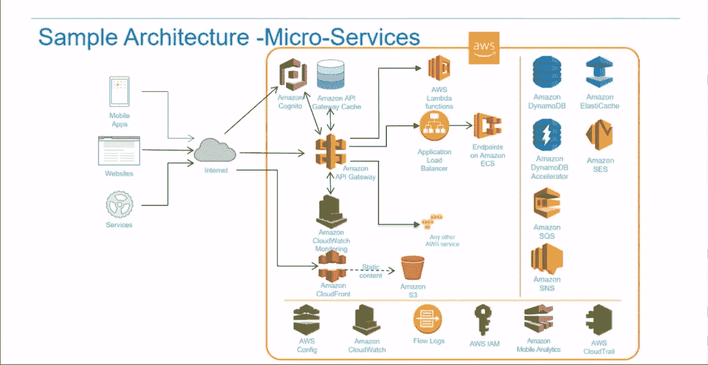
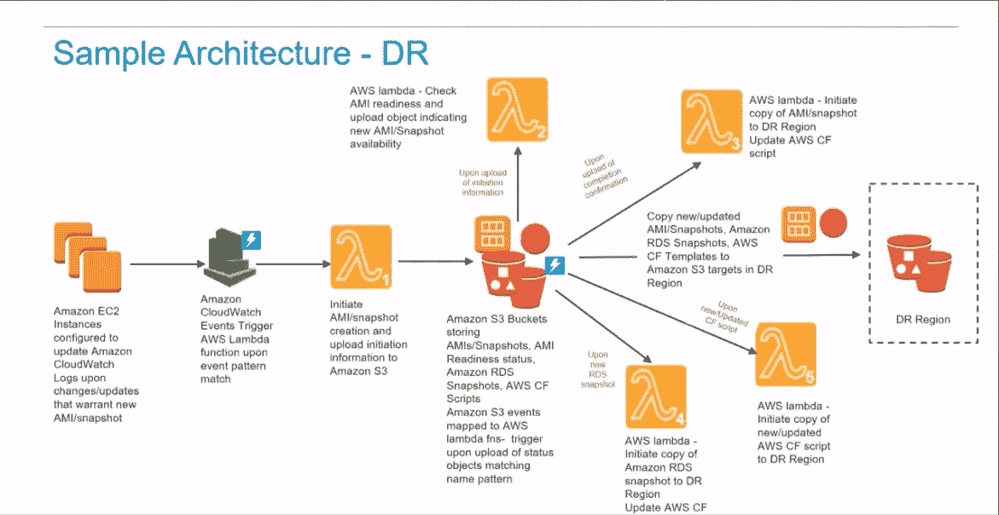

# AWS Lambda 的企业用例

> 原文：<https://levelup.gitconnected.com/enterprise-use-cases-for-aws-lambda-49bb56b0a04e>

最近，我们报道了 AWS Lambda 的[顶级企业无服务器用例](https://dashbird.io/blog/biggest-serverless-pain-points/)。为了更新我们的记忆，根据 [CNCF(云本地计算基金会)](https://www.itopstimes.com/cloud/10-use-cases-for-serverless/)，最常见的 AWS Lambda 用于 REST APIs、多媒体/图像处理、CRON 作业和流处理。今天，我想介绍一些我们的企业客户使用 Lambdas 的更复杂的方式。

在 2017 年的 AWS re:Invent 期间 [Raghu Chandra](https://www.linkedin.com/in/raghu-chandra-bb1a861/) ，认知技术解决方案的全球交付领导者展示了他们多年来为客户实施的六个最受欢迎的用例。我们要调查其中三个。

**数据湖**

如今，许多公司实施 AWS 只是为了应对数据湖的情况。亚马逊 S3 提供了一个数据湖的最佳基础，因为它几乎无限的可扩展性。

让我们看看上面的示例数据湖的架构。当从内部数据源将文件复制到 S3 时，您需要设置一个 Lambda 函数来检查刚输入的文件大小，然后通过数据管道或 S3 上传将其发送到中转层。第二个 lambda 将用于启动 EMR 集群来处理数据，以进行规范化和 ETL(提取、转换、加载)，然后再将其保存到 DynamoDB 或 AuroraDB 中。

因此，一个非常典型的用例——在数据湖场景中使用两个 lambda 函数来检测源文件，并与 EMR 集群或我们希望调用来处理数据的任何其他 ETL 作业一起工作。

**微服务**

企业的第二个示例架构模式是微服务。根据特定的用例，服务可以是短期运行的，也可以是长期运行的。对于长时间运行的服务，您可以将其部署到 ECS 上的容器上，但是对于短时间运行的服务，您可以通过 API Gateway 使用 Lambda。REST API 端点可以由 API 网关管理，该网关可以调用 Lambda 上的那些服务。

**灾难恢复**

有几种方法可以利用 AWS Lambda 来构建灾难恢复计划。通常，当对主数据中心配置进行更改时，如更改代码、jar 文件或数据库表，建议进行备份和恢复。在配置 EC2 实例时，可以使用 Lambdas 自动执行 EBS 快照和 AMI 创建等任务，将您的资源备份到 S3。与每个灾难恢复场景一样，您将有一个主数据中心和一个辅助数据中心，因此一旦新代码在 S3 可用，您将需要一个 Lambda 函数来将该代码复制到辅助数据中心，并调用 CloudFormation 脚本来构建 AMI 并将其部署到辅助数据中心。

因此，用最少的话来说，lambda 用于监听代码(在我们的用例 S3 中)和数据库中的变化事件，并与二级数据中心同步。

**结论**

正如我们所知，在处理大型企业时，无服务器永远无法取代整个堆栈——这是不合理的，但当以正确的方式将 Lambdas 和其他无服务器服务与基础架构结合时，它可以带来大量价值。为了确保这些 Lambdas 在执行关键任务时不会失败， [Dashbird](https://dashbird.io/) 可以通过为您的堆栈提供端到端的可观察性来帮助您确保可靠性。