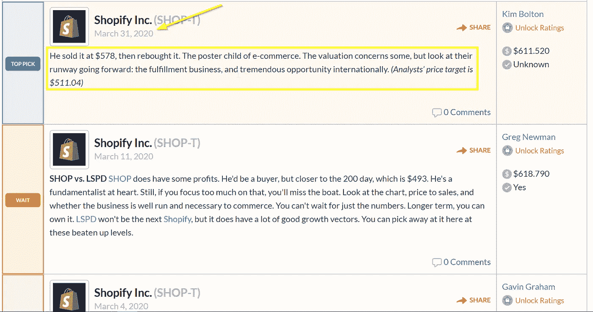

# 用 Python 实现网络抓取股票推荐

> 原文：<https://levelup.gitconnected.com/entertain-yourself-with-python-part-3-96f12ed70b7d>

*使用 Beautifulsoup 逐步介绍使用 Python 进行网页抓取*


*在之前的帖子中，我们玩过* [*声音*](https://karimlahrichi.com/2020/04/09/pr-202-entertain-yourself-with-python-part-2) *和* [*图像*](https://karimlahrichi.com/2020/04/07/image-processing-with-python) *。在这第三篇文章中，我们玩网络抓取是为了娱乐和(希望)盈利！*

我们将使用非常流行的`beautifulsoup4`库，以及有用的`dateparser`包。如果您尚未安装，请安装它们:

```
pip install beautifulsoup4 
pip install dateparser
```

# 背景

我们将使用网络搜集从一个名为 [**证券交易所**](https://stockchase.com/opinions/recent) 的投资论坛上获取一些股票的最新观点。

在那里，投资者和投资组合经理分享他们对所关注股票的看法。我们要做的是检查最近是否有专家分享了对某只股票的看法。

出于本练习的目的，我们将使用 Shopify 的股票 SHOP-T。相应的论坛页面是[这里是](https://stockchase.com/company/view/5093/SHOP-T)。

# 战略

页面的结构很简单:在一些初始的内容和图表之后，观点被组织在一个具有标准布局的表格中。在下图中，我用黄色突出显示了我们感兴趣的两个区域，即日期和意见文本。



我们需要一种方法来系统地定位这些元素。为此，我们将使用 Chrome 开发工具。使用 Ctrl+Shift+I 打开开发工具面板。

要定位特定元素，首先单击开发工具面板左上角的按钮，如下图中突出显示的。你会注意到在图片的下半部分，我正在使用另一个 chrome 扩展，名为 ChoPath。这是一个很好的扩展，但是我没有系统地使用它，我也不会在这个例子中使用它。


然后在网页中找到您想要提取的元素，将鼠标悬停在它上面:您将看到 developer tools 面板更新以及一个弹出窗口，向您显示您正在查看的确切 HTML 元素。


所以在这种情况下，我们感兴趣的日期元素似乎是一个`div`，带有类`opinion-mini__date`。在这一点上，我要提醒你的是，我们并不是要制造工业级的铲运机，只是要在一个小时内完成。

有了这些信息，`beautifulsoup`现在可以施展它的魔法了。

# 履行

首先，我们将使用`requests`包下载 HTML 页面:

```
import requests page = requests.get("https://stockchase.com/company/view/5093/SHOP-T")
```

然后创建将解析 HTML 的对象:

```
from bs4 import BeautifulSoup soup = BeautifulSoup(page.content, 'html.parser')
```

为了确认我们确实有页面的 HTML 代码，我们可以打印它:


现在是时候提取我们想要的信息了。在下面的代码中，我们添加了一个中间步骤，首先提取包含意见的每个表格行。这里的想法是，我们可以从该行中提取日期和意见文本:

```
# Extract the opinion rows
rows = soup.find_all("div", class_="opinions-row")# Extract the dates
dates = [r.find(class_="opinion-mini__date").get_text().strip() for r in rows]# Extract the opinion text
opinions = [r.find(class_="opinion-comment").get_text().strip() for r in rows]
```

让我们看看日期:


在意见中


相当酷！

最后一步:检查是否有任何意见是截止到给定日期或以后的。首先，我们使用`dateparse`将日期的文本表示转换成实际的`datetime.date`对象:

```
dates = [dateparser.parse(date).date() for date in dates]
```

这里是我们如何打印最近的意见:

```
from datetime import date
import numpy as np# Let's look for opinions emitted since March 1st
date_recent = date(2020, 3, 1)dates_today_idx = list(np.nonzero([d >= date_recent for d in dates])[0])if len(dates_today_idx) > 0:
    print("New opinion(s) found!\n")
    for idx in dates_today_idx:
        print(dates[idx])
        print(opinions[idx], "\n")
else:
    print("No new opinion found.")
```

瞧！


# 结论:

*网络抓取很有趣，也很有用，例如，如果你正在看很多股票，不想每天浪费 20 分钟浏览互联网。作为改进的建议，您可以将这段代码转换成一个函数，设置一个每天运行的云调度程序，将所有内容保存到一个小数据库中，并在论坛上发布有趣的内容时接收短信。也许以后的项目…*