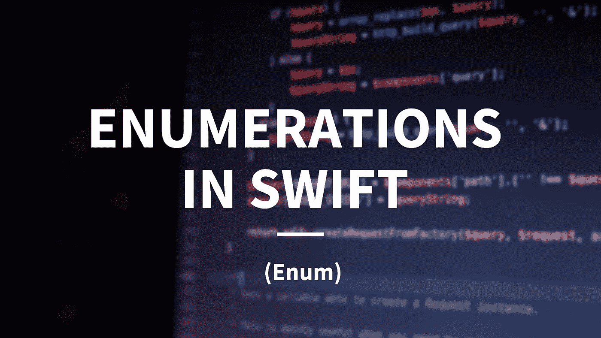
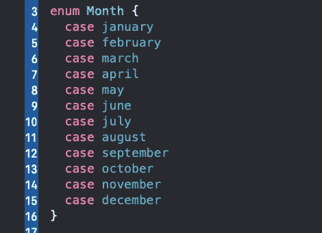
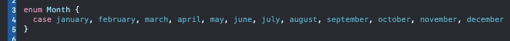
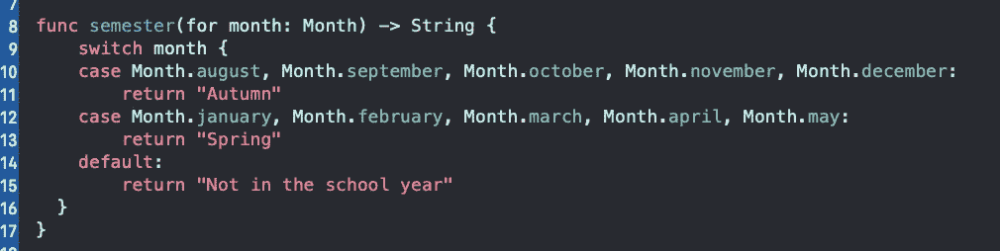
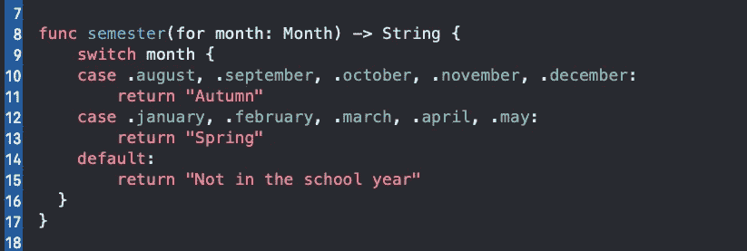
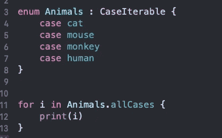
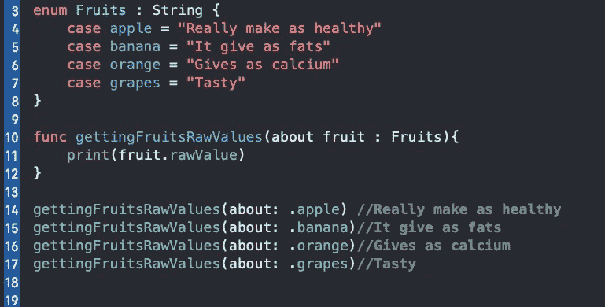
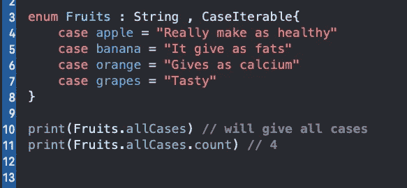
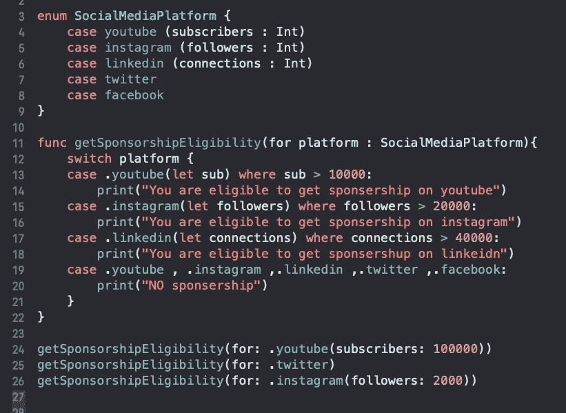

# Swift 中的枚举

> 原文：<https://levelup.gitconnected.com/enumerations-in-swift-5dd14b4055a7>

来源:[http://becodable.com/swift-enum/](http://becodable.com/swift-enum/)

枚举是一种允许您定义可能值列表的数据类型。一个**枚举**允许你创建一个包含这些值的数据类型，这样它们就可以在你的应用中被一致地识别。

> 换句话说:它是一组相关值的集合💯

# 声明枚举

若要声明枚举，请列出所有可能的成员值作为事例:

您可以通过将 case 子句压缩到一行来简化代码，每个值用逗号分隔:

他的代码创建了一个名为`Month`的新枚举，有 12 个可能的成员值。普遍接受的最佳实践是每个成员值以小写首字母开头，就像属性一样。

# 了解枚举

使用*枚举*的最佳方式是通过`switch`语句。让我们做一个函数来证明:

> 在上面的代码中，在函数参数中，就在参数被调用之前有一个`for`名。它是一个内部名，我们在函数内部使用，在内部名之前有一个外部名，我们在函数之外使用。这里`month`是内部名称，`for`是外部名称。

因为 Swift 是强类型的，并且使用类型推断，所以您可以通过删除编译器已经知道类型的地方的枚举名称来简化`semester(for:)`。保留点前缀，但丢失枚举名称，如下面 switch 语句中的情况所示:

# 在 Swift 中迭代枚举案例

为了在一个特定的*枚举*中得到所有可用的*案例*，我们可以使用*枚举*类型`CaseIterable`并且可以使用`for`循环进行打印。参见下面的代码:

# Swift Enum 中的原始值和关联值

> **原始值**:用*枚举*事例附加值，为了访问这些我们写点原始值，可以访问那些用*枚举事例*的值。

有关原始值，请参见以下示例:

在上面的代码中，我们创建了一个名为`Fruits`的*枚举*，并在*处给出 rawtype* *字符串*，并为每种情况给出原始值。没必要每个案例都给`rawValues`。然后我们创建了一个函数来获取原始值。

如果我们将一个*枚举*设为类型 **CaseIterable** ，那么你可以使用一个`for`循环访问所有的案例，并且可以使用 **allcases.count** 进行计数。

我们来举例看看:

在上面的代码中，我们将 **CaseIterable** 添加到它的类型中，然后我们可以访问 allCase 和 all case.count。

> **关联值**:关联值将 Swift 枚举的表达能力提升到了一个新的层次。它们允许您将一个自定义值(或多个值)与每个枚举案例相关联。

为了更好地理解关联值，我们应该浏览一下它们的代码示例:

在 Swift 中，不必将值与每个*枚举*案例相关联。在上面的代码中，我们制作了一个名为`SocialMediaPaltaform`的*枚举*，并通过给出一个标准来检查谁有资格获得赞助。

> **枚举可以有原始值或关联值，但不能两者都有。**

# 要点

*   一个**枚举**是定义一个公共类型的互斥案例的列表。
*   枚举为老式的整数值提供了一种类型安全的替代方法。
*   您可以使用枚举来处理响应、存储状态和封装值。
*   CaseIterable 允许您循环遍历包含所有事例的枚举。

**LinkedIn 上有作者:【linkedin.com/in/my-pro-file】**