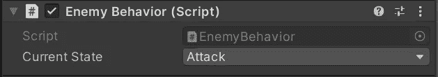

# 枚举

> 原文：<https://levelup.gitconnected.com/enums-d56a726387c5>

使用*枚举*是分离和组织状态驱动行为的一个非常有用的方法，同时保持你的代码整洁易读。枚举也能让其他设计师，甚至你自己的生活变得简单。我们走吧！

**难度选择器**

这里有一个*难度*脚本，带有一个私有*枚举*叫做*难度选择器*。Pascal case 是声明和命名你的*枚举*的标准格式。打开一些花括号，列出要切换的不同状态。重要的是在每个状态名*后使用一个*逗号*，而最后一个状态没有逗号*。这里*困难选择器枚举*有*简单、正常、困难*和*专家*的状态。在底部，声明了一个变量来存储*当前难度*级别。我们可以用这个来分配选择的难度。

如果您愿意，您可以选择在一行中列出您的州。

默认情况下，*值*将像*元素*系统一样工作。从*零*开始，然后向上计数。*弱*，会有一个 *int* 值为 *0* ，而*中*会有一个 *int* 值为 *1* 。*强*和 *OP* 将分别具有 *int* 值 *2* 和 *3、*。如果需要，您可以*在这里分配*不同的值，如下图所示。现在这些状态将为它们的*硬编码*值 *(2，5，8，12)* 返回一个 *int* 值。

查看*检查器*中的*当前难度*变量，会显示一个漂亮的*下拉*选择器，用于*设置*枚举*的*状态*。*

所有*难度*选项都可用。

枚举本身不会做任何事情。这需要一些逻辑来解决，所以让我们使用一个 *switch* 语句来切换当前难度枚举变量的状态。在*难度选择器*枚举中，每个*难度*都有一个*案例*。*调试*消息会将所选难度打印到控制台。

**铸造值**

虽然您不能直接使用*枚举值*作为一个*整数*，但是在这种情况下，您可以将它转换为一个 *int* ，您希望*基于一个*索引*号加载*一个*游戏场景*。

**敌人的行为**

将*枚举*用于*状态驱动行为*正是敌方人工智能系统所需要的。这个*敌人行为*脚本附加在场景视图中几个不同的*立方体*敌人身上。他们都有 *100 生命值*，状态为*巡逻，跟随，攻击，防守，躲避*和*死亡*。*枚举敌人状态*可以通过*当前状态*变量循环。

在 void *update* 中，我运行了一个名为*改变敌方状态*的方法，这个方法现在调用一个将为敌方对象运行*行为*动作脚本的方法。

这个函数的开始将在下一个例子中发挥作用，但是这里的*敌人状态*被重置为*巡逻*，如果该状态的 *int* 值试图将*移动到比*死亡*状态更高的*。

该*切换*语句使用*当前状态*变量在不同的*枚举敌人状态*中循环。这里没有插入实际的敌人移动行为，我只是发送一个*调试*消息到控制台来显示那个特定的状态。

这些敌人对象中的每一个都附有*敌人行为*脚本。

这使他们能够单独使用*当前状态*变量来选择他们自己的行为。这里的这个敌人是*巡逻的*。

这个敌人是跟随的*。*

这个敌人是*攻击*。

这里你可以看到每个敌人都有所有*行为*可用。

如果我玩这个游戏，每个敌人都会向控制台发送自己的*调试*消息。这通常是在 *60 FPS* 时触发的*移动*行为。

你会想要一个*条件*或者*事件*来改变敌方行为*状态*。与其在 update 中运行这个方法，不如让我们使用*空格键*来展示我们如何在行为状态之间改变。

当按下空格键时，*当前状态*变量将*增加*，将其向前移动到下一个列出的状态。一旦当前状态移过*死亡*，则重置为*巡逻*。

这里可以看到*空格键*在运行时改变*敌人行为* *枚举*！

在你的 switch 语句中使用*逻辑*和*条件*是你想要敌人的行为*改变*的理想选择。正如这里看到的，一旦这个敌人的*生命值*低于*20*，这个*规避*状态就会运行你在这里插入的任何脚本。我真正应该做的是在*之前的*状态下检查健康状况，然后*将*状态设置为*在那里规避*。在这里的规避中，我将检查一个条件以*退出*规避机动，并将状态设置为另一个。

敌人*死亡*状态是*消灭*敌人游戏对象的好地方！

**自定义类别**

让我们将一个*枚举*添加到这个自定义*项目*类中。 *ItemType 枚举*表示每个项目可以声明的不同项目类型。这里我有*武器、消耗品、护甲*和*货币*供选择。

使用带有*开关*语句的*方法*，当另一个脚本想要*引用*它时，给用户一个机会返回一些关于被调用的*项目类型*的信息。

让我们进入一个 *ItemDatabase* 脚本，它附加到场景中的一个空对象上。最后一行创建一个名为 *itemsList* 的 *Items* 的新 *List* ，然后*初始化*它。

每个 *ItemAction* 方法都可以通过 *itemsList List* 调用，然后声明要对哪个*元素*执行操作。

每个项目*动作*被调用，其各自的*项目类型*被*打印*到控制台。如果你有各种各样的可消耗物品，它们在被消耗时都有相似的行为，这可能是有用的。

如果你需要组装一个库存系统，你完全可以在*类继承*、*列表*、*数组*和现在的*枚举之间得到照顾！*

感谢阅读！