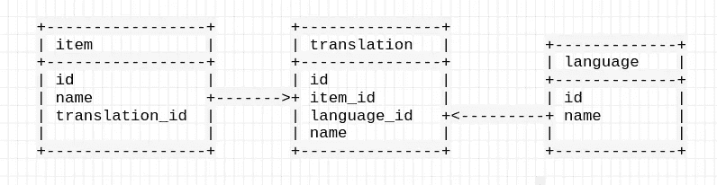
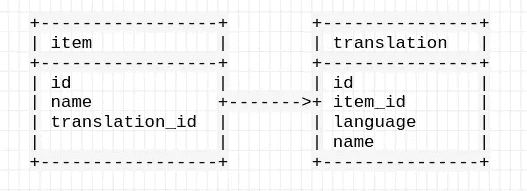
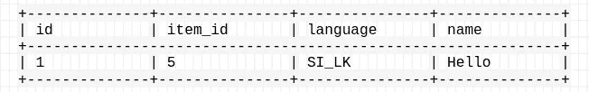

# 带 JPA 和 SpringBoot 的枚举

> 原文：<https://levelup.gitconnected.com/enums-with-jpa-and-springboot-f4351a85216d>

上周，我在一个项目( [SEF 学院](https://sefglobal.org/academix/))的后端工作，这个项目使用了 JPA 和 spring boot。在那里，我必须将数据的翻译也添加到数据库中。(实际上，我们已经在最初的项目中创建了相关的表)有一个单独的语言表和一个单独的翻译表。这个我肯定不清楚。这是一张图表。



几天前，我们发现了一些我们忽略的东西，那就是我们不需要一个单独的语言表，因为我们希望只使用两种语言。所以我们讨论了一下，决定用枚举来表示语言。



桌子


# 什么是枚举？

> 枚举是常数列表。当您需要一个预定义的值列表来表示某种数字或文本数据时，您应该使用枚举。(它必须是一小组可能的值)

所以在这种情况下，我们的预定义语言是🇱🇰 SI_LK 和 TA_LK。

```
public enum Language {
    SI_LK,
    TA_LK
}
```

然后我给相关实体添加了 enums。

```
@Enumerated
@Column(name = "language", length = 5)
private Language language;//getter and setter
```

完整代码[此处](https://github.com/sef-global/sef-core/blob/efb5e1fc84b7b99f68e8314a095b00f1060a1be5/backend/src/main/java/org/sefglobal/core/academix/model/CategoryTranslation.java)。

这里我们必须使用 **@Enumerated** 注释来说明这是一个枚举。
此外，我们可以在注释中使用枚举类型。有两种类型。

*   *枚举类型。序数*
*   *枚举类型。字符串*

*事实:枚举类型也是枚举*

## 序数

序数是默认类型。这将只映射枚举的索引，该索引取自枚举列表的顺序。因此，首先定义的枚举值被映射到 0，第二个被映射到 1，依此类推。因此，它在数据库中只保存一个整数。这是有效的，但可读性是最低的。

## 线

这将在数据库中保存枚举的字符串值。因此，如果我们使用这种方法，数据库的可读性会更好，但效率并不高。

我选择了第二个选项。EnumTupe。字符串，这样我们就可以在数据库中得到一个可读的表。

```
@Enumerated(EnumType.STRING)
@Column(name = "language", length = 5)
private Language language;//getter and setter
```

现在数据存储在这样的转换表中:



简式记帐

并且也有可能使用 Enum 的定制值。

*你知道吗？—在 JPA 的早期版本中，他们不允许我们使用枚举作为组合键。但是现在有可能了。正常使用就好。*

今天到此为止。感谢阅读。