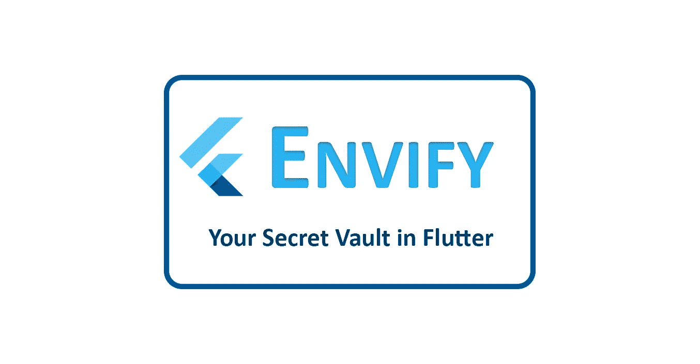
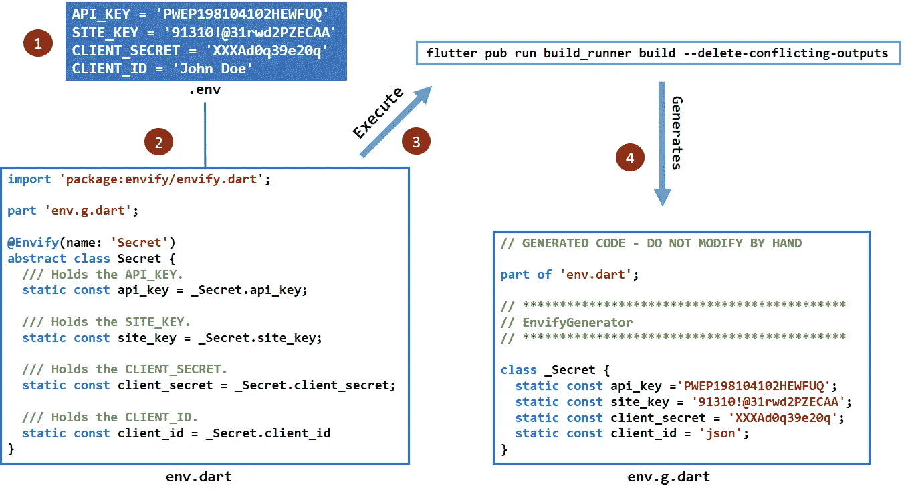
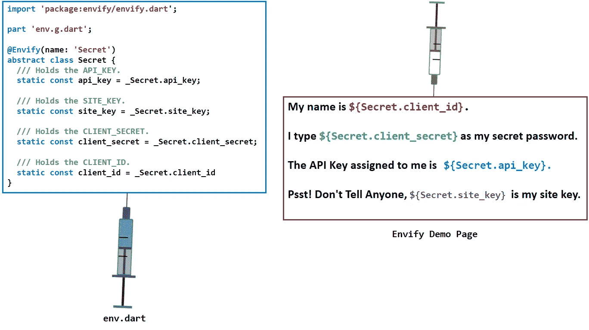
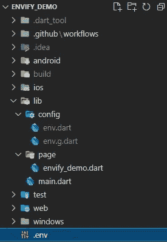
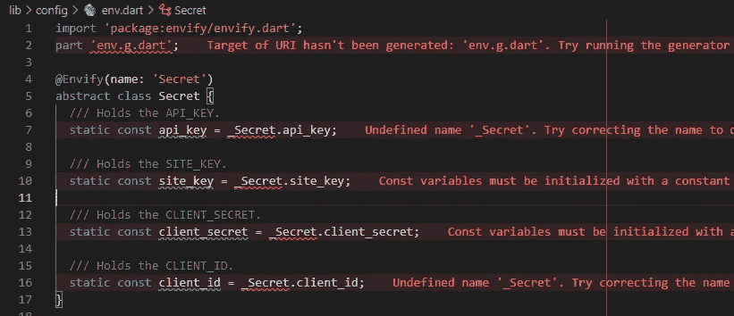
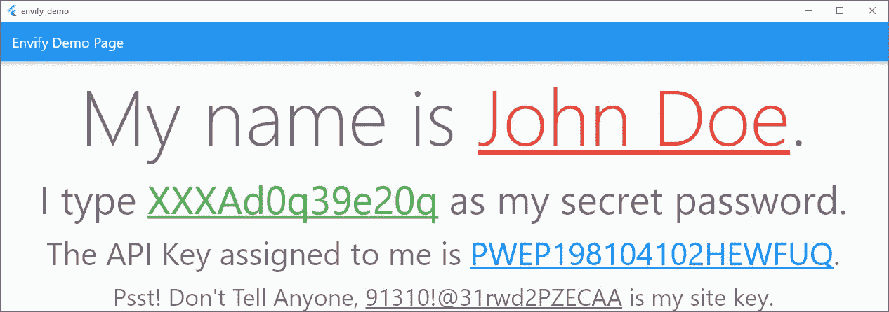
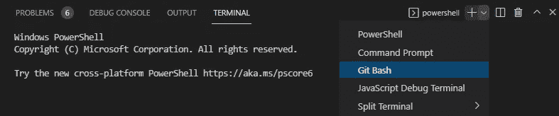
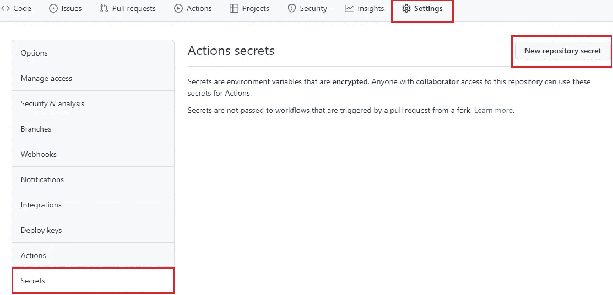
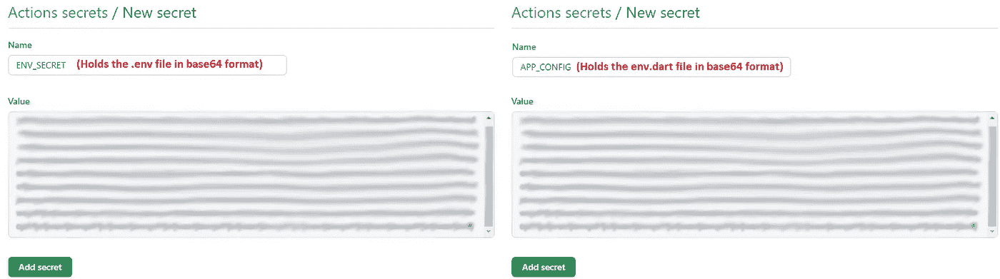
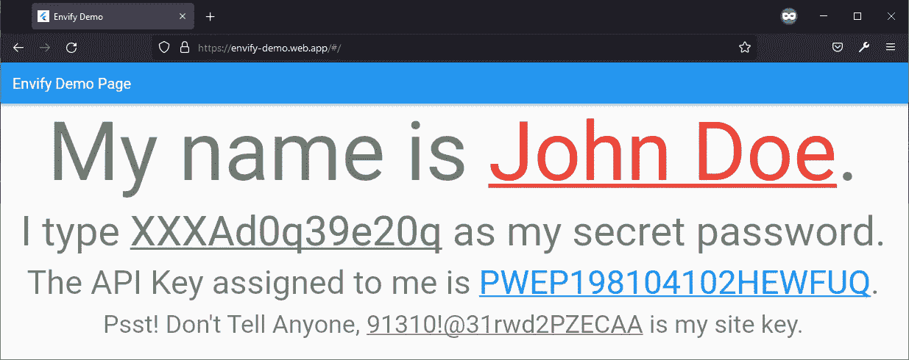

# 嫉妒——你飘动的秘密金库

> 原文：<https://levelup.gitconnected.com/envify-your-secret-vault-in-flutter-808bbffb1af9>

*在 Flutter 中使用 Envify 包隐藏你的秘密。*

**羡慕——你的秘密金库在飘动。**

# 概观

作为一名 Flutter 开发人员，有时您需要在源代码中指定一些机密信息，如 API 密钥、文件路径、URL、客户端密钥等，于是问题出现了:

1.  您将如何对这些数据保密？
2.  如何在不泄露源代码内部的情况下集成它？
3.  如果黑客破解了代码，你会如何保护它？

对于这种情况， [Envify](https://pub.dev/packages/envify) 是您现成的解决方案，可以毫不费力地在源代码中注入环境变量。

# 整体情况

在您的 flutter 项目的根层(在`lib`文件夹之外)，您将创建一个环境文件`.env`，包含您所有的秘密数据。将`envify`包添加到`pubspec.yaml`文件后，您将创建一个`env.dart`文件，如下图所示。一旦你完成了，你可以从终端运行这个命令，然后会生成一个`env.g.dart`来保存你所有的秘密数据作为 dart private `class`。

**羡慕工作机制的例证。**

随后，您只需通过使用`Secret`抽象类字段在代码中的任何地方注入环境变量。

**使用 env.dart 描述秘密数据调用**

# 必需的 PUBSPEC 包

在`pubspec.yaml`文件中，添加包，如下面的代码片段所示。

**pub spec . YAML 文件中需要的包**

# 项目架构

下图说明了整个项目中使用的架构。

**envi fy _ Demo 项目架构示意图。**

# 让我们开始编码吧！

## 第一步:添加 Envify 相关文件到。gitignore

在开始编码之前，在您的`.gitignore`中添加所有与`envify`相关的文件，如下面的代码片段所示。

***将 envify 相关文件添加到. gitignore.***

## 第二步:创建一个环境文件。

在`lib`文件夹之外，创建一个`.env`文件，并输入所有你希望注入源代码的秘密信息，参考下面的代码片段。

**环境中的变量。环境文件。**

## 第三步:在配置文件夹中创建`Env.dart`文件

在`config`文件夹下，创建一个`env.dart`文件，参考下面的代码片段。

**env . dart 的代码片段**

这里我们定义了一个抽象类`Secret`，其中`@Envify`装饰器将`name`参数作为`Secret`和`static const`抽象字段。

根据 [API 文档](https://pub.dev/documentation/envify/latest/#change-generated-class-name) :

> 默认情况下，生成的类将被命名为带前缀`_`的带注释类的名称。您可以使用`name`字段进行更改。请注意，`_`将始终是前缀。

## 步骤 4:从终端运行命令

保持你的抽象字段的命名约定与你将要生成的一致，否则`envify_generator`会产生错误，如下图所示。

**错误日志**

还要注意，第一次创建这个文件时，编译器会说找不到`_Secret`，如下图所示。

**编译器错误的图解。**

不要害怕，发生这种情况是因为您还没有生成`_Secret`类。要生成`env.g.dart`文件，从您的终端运行以下命令。

**生成 env.g.dart 的命令**

## 步骤五:调用源代码中的秘密

恭喜你！现在，您可以在源代码中调用您的秘密，而不会泄露它们。在下面的代码片段中，您可以观察到在每个孩子`TextSpan`的`text`中，数据已经使用`Secret`抽象类被调用。

**envi fy _ demo . dart 的代码片段**

## 步骤六:运行演示应用程序

下面的屏幕描述了成功运行应用程序后的最终结果。

**在 Windows 上使用 Envify 的 App 演示。**

# GITHUB 工作流程

现在你可能想知道如何将应用程序交付给你的客户。不要担心，只要按照下面的步骤。

## 第一步:加密。env & env.dart 文件

1.  在 Visual Studio 代码终端中打开“***Git Bash*”**。

**在 Visual Studio 代码中打开 Git Bash。**

2.导航到`.env`路径&将其加密为`base64`格式，如下所示。
`**$ base64 "C:\envify_demo\.env"**`

3.对`env.dart`也重复步骤 2。
`**$ base64 "C:\envify_demo\lib\config\env.dart"**`

4.记下这些文件的加密代码。

## 第二步:在 GitHub Repo 设置中创建动作秘密

1.  在浏览器上打开 **GitHub Repo 设置**，选择 ***【秘密】*** &点击 ***【新建仓库秘密】*** 按钮。

**导航到 GitHub 上的存储库密码按钮。**

2.粘贴`base64`密码，点击 ***【添加密码】*** 按钮，如下图所示。

**添加加密文件作为 GitHub 操作机密。**

## 第三步:通过 GitHub 动作执行脚本

复制下面的脚本，在占位符文本中添加您的 firebase 项目 id 并执行它。

## 第四步:访问网络应用程序

成功构建后， [web 应用程序](https://envify-demo.web.app) 就可以使用了，如下图所示。

**Firefox 上 Envify 演示 Web 应用的图示。**

访问[envify _ demo](https://github.com/Zujaj/envify_demo)t34】⁴github 库获取源代码。

# 承认

感谢[弗伦科](https://github.com/frencojobs/envify) **⁵** ，在 pub.dev 上创建这个包的开发者

# 参考

**【1】:羡慕|镖包*【https://pub.dev/packages/envify】***

**【2】:envi fy | API Docs** [https://pub . dev/documentation/envi fy/latest/# change-generated-class-name](https://pub.dev/documentation/envify/latest/#change-generated-class-name)

**【3】:envi fy Demo | Web App**[https://envi fy-Demo . Web . App](https://envify-demo.web.app)

**【4】:Envify _ Demo | GitHub Repo**[https://github.com/Zujaj/envify_demo](https://github.com/Zujaj/envify_demo)

**[5]: Frenco | GitHub**[https://github.com/frencojobs](https://github.com/frencojobs/envify)