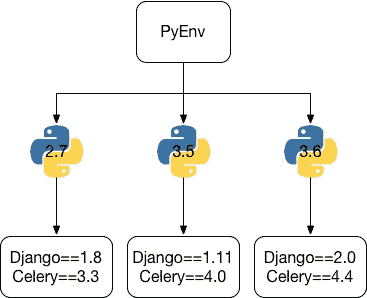
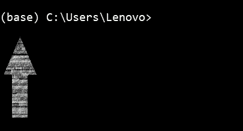
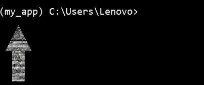

# 使用 Anaconda 的环境变量和包管理

> 原文：<https://levelup.gitconnected.com/environment-variables-and-package-management-using-anaconda-daddadd06b82>


图片提供:[真蟒蛇](https://realpython.com/)

大家好，欢迎。

今天阅读内容是关于 Python 的包管理系统和虚拟环境。坐好，拿着你的咖啡，把那包零食放在 5 米远的地方，因为这会很短，在那段时间里我们不想有任何干扰。

首先，这个博客的目标受众是没有开发经验的人，他们想学习数据科学、机器学习或人工智能，并在 Windows 中使用 Anaconda。如果你是这样的人，那么 bud 这是正确的地方，到这个博客结束时，你会有很多想法，并亲自动手学习。从一般的角度来看，它是为每个在 Windows 中使用 Anaconda 进行开发的人准备的。

几天前，我的朋友是一名商科学士学生，没有开发和编程方面的背景，最近进入了数据科学和机器学习领域。他告诉我，在理解包管理系统和虚拟环境的概念时，他有严重的恐慌症。我告诉他[【科里·斯查费】](https://coreyms.com/)是 Python 开发的起点和终点，然而，已经在 youtube 视频上陷入了很多困境，他不想再看更多。为了及时赶到，他请我帮助他。

以下是我用最简单的语言告诉他的:

**虚拟环境**:虚拟环境是 Python 的一个独立工作副本，它允许你构建一个特定的项目，而不用担心影响其他项目。它支持多个并行的 python 安装，每个项目一个。这只是隔离每个项目的依赖性和需求的一个聪明的方法。为了简单起见，我用了鸭子渡渡鸟，对于那些不了解渡渡鸟的人来说，他是我想象中的朋友。我经常用来解释事情，有趣的事实:他有时比我更懂编程，而且喜欢电子舞曲。



假设 Dodo 正在进行一个使用 Python 3 的项目，但是现在他的老板告诉他要连贯地进行第二个需要 python 2 的项目。现在每次他需要在工作之间切换的时候，会不方便他卸载他的 Python 版本，根据他的使用情况重新安装那个。但是 Dodo 很聪明，他利用虚拟环境创建了两个不同的项目:一个是使用 Python 3 的项目，另一个是使用 Python 2 的项目。通过这种方式，他的依赖关系不会重叠，项目保持隔离，工作流变得容易。现在我们已经了解了虚拟环境，让我们了解 Python 的包管理系统。

**包管理**:在深入研究包管理之前，我们应该首先了解什么是包。所以不用外交手段，保持简单 Numpy 是一个包，Matplotlib 是一个包，Pandas 是一个包。根据定义，包是一个 python 模块的集合，其中一个模块是一个单独的 python 文件。所以本质上和自动地，包管理意味着能够有效地处理包。大多数的 python 包都堆叠在 Python 包索引(PyPI)中，可以通过使用包管理器来安装，“pip”是最流行的一种。

现在我的朋友想进行下一步。

因为许多直接接触数据科学而没有任何开发经验的人都使用 Anaconda，所以我将解释如何在 Anaconda 中使用它。一旦安装完毕，它的软件包管理系统和环境管理系统就叫做 Conda。Anaconda 包含了几乎所有用于数据科学和机器学习的包。为了在 Dev-Vibes 中有效地使用 Anaconda，您需要做的就是导航到您的`Anaconda Prompt`并:

1)要访问 Conda 命令的简易指南，请键入:

```
conda --help
```

2)要检查用 Anaconda 安装的包，请使用:

```
conda list
```

3)要安装新的软件包，请使用:

```
conda install numpy
```

4)要安装多个软件包，比如“numpy，scipy，pandas ”,请使用:

```
conda install numpy scipy pandas
```

5)要安装特定版本的软件包，请使用:

```
conda install  numpy=1.2
```

6)搜索软件包的所有可用版本，或者您不知道确切的软件包名称，因此您可以使用:

```
conda search *numpy*
```

7)要更新软件包，请使用:

```
conda update numpy
```

8)要更新 anaconda 中的所有包，请使用:

```
conda update -–all
```

9)要删除包，请使用:

```
conda remove numpy
```

*注:上述所有命令都是针对 numpy 使用的，并且可以通过将“numpy”替换为任何其他软件包来对任何软件包执行。*

对我来说，这 9 个命令在任何情况下都已经足够了。现在我们来谈谈虚拟环境。就像我告诉你的，在康达成为超级酷的家伙之前，它比安娜康达的另一半更有效地管理虚拟环境。默认情况下，Anaconda 提供了一个名为“base”的环境，最初在 Anaconda 中，您在 Base 环境中的存在是这样的。



基础环境

1.  现在，要创建一个新环境，比如“my_app ”,其中 my_app 是我的 python 应用程序项目的环境名称，您只需键入:

```
conda create --name my_app
```

2)一旦创建了环境，就可以开始使用:

```
conda activate my_app
```

一旦激活并进入环境，它将显示为:



虚拟环境

3)可以类似地安装软件包，软件包管理的其余部分与软件包管理部分中描述的相同，除了安装在此环境中的软件包与特定环境紧密隔离的事实。

4)使用以下命令获取正在创建的环境:

```
conda env list
```

5)一旦创建了环境，安装了所有的依赖项，并且项目完成，为了标记对项目中使用的依赖项版本的检查，可以将环境导出到 yml 文件，如下所示:

```
conda env export> environment.yaml
```

这个`environment.yaml`文件包含了所有的包和版本的信息。

6)要从 yml 文件创建环境，请使用:

```
conda env create –f environment.yaml
```

7)工作完成后，退出环境使用:

```
conda deactivate
```

8)整个项目完成后，您可能想要删除环境，为此，请使用:

```
conda env remove -–name my_app
```

但是在您删除环境之前，请确保它已经被停用。

*注:所有命令都已用于虚拟环境“my_app ”,可以替换为您想要创建的环境。*

以上是一些命令和基本的理解，您已经为您的开发做好了准备。也就是说，请允许我离开一天，如果你有任何疑问，请不要犹豫。谢谢你，祝你学习愉快。

# 礼貌:

1) [蟒蛇文件](https://docs.anaconda.com/)

2) [Python 3 文档](https://docs.python.org/3/tutorial/venv.html)

3) [Udacity 深度学习纳米学位计划](https://www.udacity.com/course/deep-learning-nanodegree--nd101)