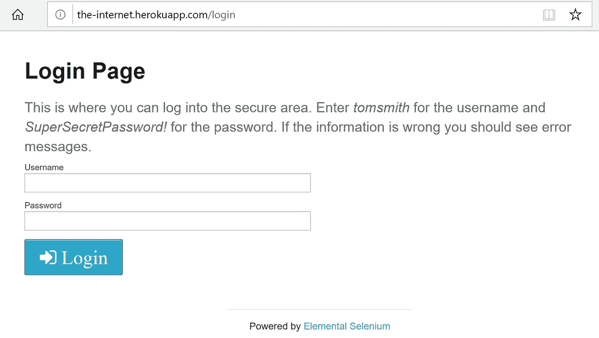
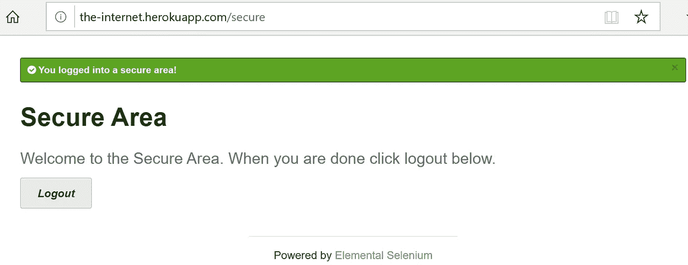
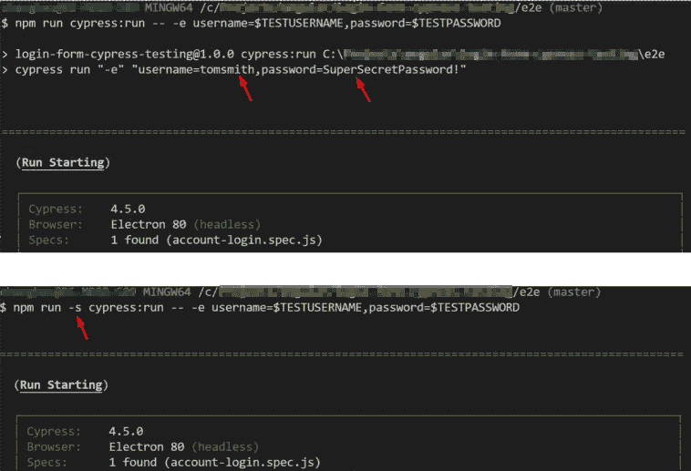
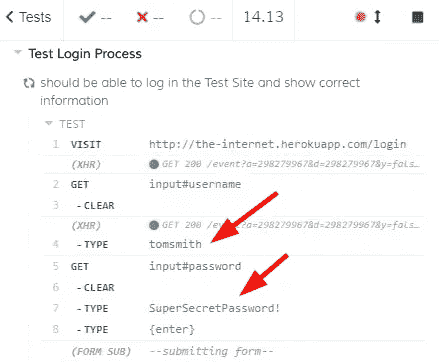

# Cypress 端到端测试中的环境变量

> 原文：<https://levelup.gitconnected.com/environment-variables-in-cypress-end-to-end-testing-e2f20acd6a86>

## 向赛普拉斯测试传递秘密的正确方法。

我们经常需要编写端到端(e2e)测试来验证请求安全资源的流程，这需要适当的凭证。例如，登录表单需要有效的用户名和密码，端点强制使用正确的 API 密钥，HTTP 请求需要可验证的令牌。我们有多种方法来保护 e2e 测试中的这些秘密，这是持续集成(CI)过程的一个关键部分。一种常见的方法是将秘密保存为环境变量，以便测试脚本可以检索它们。

Cypress 提供了几种处理环境变量的方法。在关于环境变量的文档中([链接](https://docs.cypress.io/guides/guides/environment-variables.html#Setting)，Cypress 列出了它们的用法，并比较了每个选项的优缺点。在本文中，我们将关注使用 Cypress 命令行界面(CLI)传递环境变量的选项，并且我们将讨论使用 Cypress npm 包和 Cypress docker 映像的场景。

出于演示目的，我们将针对登录页面编写 e2e 测试([链接](http://the-internet.herokuapp.com/login))。测试用户名和密码将被保存为环境变量，并通过 Cypress CLI 传递给测试。e2e 测试和相关命令可以在[我的 GitHub 库](https://github.com/changhuixu/testing-login-form-with-cypress)中找到。

# e2e 测试

下面的屏幕截图显示了测试中的登录页面。这是一个带有登录表单的通用测试页面。为了登录网站，我们需要提供一个用户名字符串和一个密码字符串。

在这个虚构的例子中，我们已经知道了正确的用户名和密码，因为它们显示在登录页面中。让我们确保不会在现实世界的应用程序中向公众公开凭据。

成功登录后，我们应该能够看到以下屏幕。

为了使 e2e 测试简单，我们将只验证快乐路径。成功的登录结果应该包括一个包含字符串“`secure`”的 URL、一个 CSS 类为“`success`”的 alert 元素和一个标题为“`h2`”的文本“`Secure Area`”。

我们的目标是避免在测试文件中硬编码用户名和密码，这样就不会将秘密提交给我们的代码库。以下代码片段显示了登录过程的 e2e 测试示例。

一个赛普拉斯 e2e 测试用户登录过程。([要点链接](https://gist.github.com/changhuixu/ff94b1b2ea7361f3a4a1bc893414d848))

在第 5 行和第 6 行，Cypress 访问环境变量来获取用户名和密码的值。然后在第 7 行和第 8 行，Cypress 输入用户名和密码来提交登录表单。第 10 到 13 行是成功结果的断言。

# Cypress npm 脚本中的环境变量

在这个测试中，Cypress 期望两个环境变量:`username`和`password`，如第 5 行和第 6 行所示。

我们当然可以使用下面的命令传入这两个环境变量。注意:在 Cypress CLI 工具中，环境变量由逗号分隔。

Cypress 能够解析命令并获得定义的值，e2e 测试通过。

但是，我们不想以明文形式签入这个命令。对于大多数 CI 平台，我们需要提供一个配置文件来描述测试脚本，我们通常在我们的版本控制系统中提交配置文件。因此，为了 CI 管道中的安全性，我们需要有另一层环境变量。

大多数 CI 平台支持凭证插件或类似的东西。在这种情况下，我们可以在 CI 平台中存储键-值对，当在 CI 配置文件中找到键时，CI 代理将替换正确的值。假设我们已经在 CI 平台中设置了两个参数`TESTUSERNAME`和`TESTPASSWORD`，那么我们可以在 CI 配置文件中使用以下命令。

**注意:**如果您不喜欢`$(npm bin)`的语法，更喜欢使用自己的 npm 脚本，那么请考虑添加一个`-s`标志来抑制解释脚本的回声。例如，我在`package.json`文件中定义了一个脚本`“cypress:run”: “cypress run”`，那么 CI 测试命令应该如下所示。

为了帮助你理解`-s`旗的效果，我们来看看下面的截图。如果没有`-s`标志，npm 会将解释后的命令回显到控制台，因此 CI 日志会以明文形式显示秘密，这可能不合适。

说到 CI 日志，我们可能还会对 Cypress e2e 测试生成的视频和截图保持谨慎，因为我们可以在 Cypress 时间旅行记录中看到密码。下面的屏幕截图显示了生成的视频的快照。

知道了这一点，您可能想在`cypress.json`文件中将 video 设置为 false，并使用 Cypress API 抑制快照。或者，至少，我们应该把藏物保存在一个安全的环境中。

# 测试跑步者档案中的环境变量

如果我们的 CI 平台没有存储键值对的特性，那么我们可以将秘密设置为测试运行程序的用户环境变量的一部分，如下所示。

环境变量可以存储在测试运行者的概要文件中，比如存储在`~/.bash_profile`文件中。然后，我们可以按照上一节提到的类似方式使用它们。

然而，使用特定于 Cypress 的环境变量可能更容易，这些变量带有前缀`CYPRESS_`。例如，我们可以在`~/.bash_profile`中设置以下环境变量。

这样，我们不需要在 Cypress 命令中传递环境变量。相反，我们可以简单地运行命令`npm run cypress:run`，测试就会通过。

# docker 图像的环境变量:`cypress/included`

Cypress 提供了一个 docker 镜像`cypress/included`,允许我们只使用一个命令来运行测试。例如，要运行本文中的测试，我们可以转到`e2e`文件夹，并执行下面的命令。

这个命令告诉 docker 以交互方式运行映像`cypress/included:4.5.0`，并将测试文件夹作为卷`/e2e`安装在 docker 容器中。docker 容器将获取环境变量并运行 Cypress 测试。

注意，我在每个卷路径前加了一个斜杠`/`符号，因为我在 Windows 中运行这个命令，斜杠符号帮助 docker 在 Windows 中正确获取卷路径。

在运行 docker 容器的场景中，`CYPRESS_`环境变量不起作用，因为它只存在于主机中。

# 自定义 docker 图像的环境变量

我们可能希望构建一个 docker 映像，并让 CI 管道在一个容器中运行测试。在这种情况下，我们可以根据柏树图像`cypress/base`写出下面的`Dockerfile`。

我们将映像的入口点设置为“`cypress:run`”命令，这样当容器运行映像时，e2e 测试将自动执行。我们可以使用以下命令构建映像并在容器中运行它。

非常好。我们再次看到测试通过，但是是在 docker 容器中。

基本原则是避免将凭证签入代码存储库，在本文中，我们使用环境变量来传递秘密。我想我已经涵盖了我所知道的所有场景，我希望这篇文章能够帮助您决定如何在 Cypress 测试中使用环境变量。

e2e 测试的完整项目可以在[我的 GitHub 库](https://github.com/changhuixu/testing-login-form-with-cypress)中找到。感谢阅读。