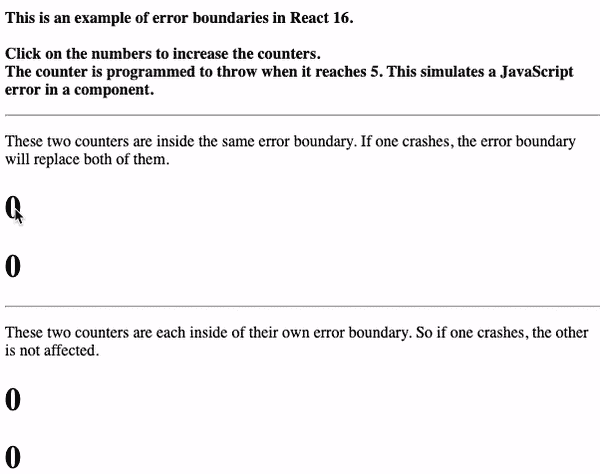
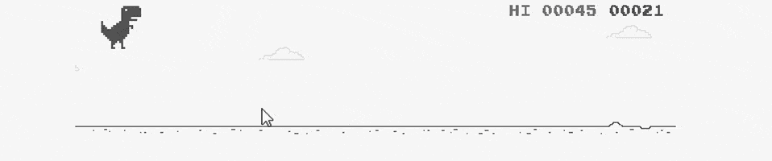

# React 中的错误边界

> 原文：<https://levelup.gitconnected.com/erro-2a61f82526a>


莎拉·基利安在 [Unsplash](https://unsplash.com?utm_source=medium&utm_medium=referral) 上的照片

当我们开发应用程序时，错误是不可避免的。当错误发生时，最好做好防故障准备，而不是天真地声称你的应用程序不会出错。在 React JS 中开发时，可以创建错误边界来捕捉某些错误，并处理它们以不中断用户的体验。

## 为什么要做一个误差边界？

错误边界是简单的组件，被构建来捕捉在它们的子树中发生的基于组件的错误，为开发人员记录它们，并显示保留体验的回退用户界面。

在构造函数、渲染和生命周期方法中捕获错误。而不是因为一个错误而放弃整个应用的体验。通过在组件内卸载树来处理错误，同时仍然提供对应用程序其余部分的访问。与 Javascript 中 catch 块的工作方式非常相似:执行这段代码，但是，如果出现错误，这里有 b 计划。



[演示](https://codepen.io/gaearon/pen/wqvxGa?editors=0010)来自 E [错误边界文档](https://reactjs.org/docs/error-boundaries.html#introducing-error-boundaries)

## 我如何建立一个误差边界？

使错误边界成为错误边界的两个因素是**getderivedstatefromeror()**和 **componentDidCatch( )** 方法。

getDerivedStateFromError( ) 生命周期方法设置组件基于状态的错误。这将触发组件重新呈现，但这次显示的是故障保险，而不是抛出错误的损坏的组件树。这种方法通常是为用户直观地处理错误。

一旦从组件树中的任何地方捕获到错误，componentDidCatch( ) 方法就会触发已定义的代码块执行。此方法通常用于为开发人员处理控制台中的错误。

从技术上来说，这两种生命周期方法中的任何一种都可以插入到任何组件中，并被称为错误边界。然而，根据单一责任原则，好的做法是指定这个错误捕获和处理一个组件，而不是在通用组件中应用它。这也将使它们成为模块化组件，可以应用于不同的组件树。

请参见下文，了解 React 如何定义错误边界组件的结构。

现在，您可以将您希望为其设计故障保护的应用程序部分放置在您的错误边界内。与 React 的演示类似，您可以使用多个错误边界树来保存应用程序的各个部分，同时只卸载某些不完整的部分。

```
<ErrorBoundary>
  <MyComponent />
</ErrorBoundary>
```

作为最低要求，您应该在应用程序的根目录下至少有一个。这样，如果应用程序中的任何地方出现错误，您都可以为您的用户设计一个后备用户界面。

## 其他错误呢？

请注意，错误边界组件旨在捕捉基于组件的错误。它不会从错误边界组件本身、事件处理程序、异步回调或服务器端呈现中捕捉错误。

类似于 React 的一旦计数器达到 5 就抛出错误的演示，自定义错误可以用 **throw** 来模拟。您可以实现自己的条件来引发错误，然后由错误边界或其他处理程序捕获该错误。在下面的例子中，抛出的错误将是字符串*“团队奶油 pb。”*

```
if (peanutButter.texture === "crunchy") throw "team creamy pb"
```

除了基于组件的逻辑和错误之外，使用 try and catch 块将为事件处理程序或独立逻辑做一些类似的事情。

```
try {
  // do this block of code
} catch (error) {
  // do this with the error recieved
}
```

通过 React 组件或简单的 catch 块使用错误处理程序，无论出现什么错误，用户界面都保持受控状态。可能更有趣…



正确处理连接错误。