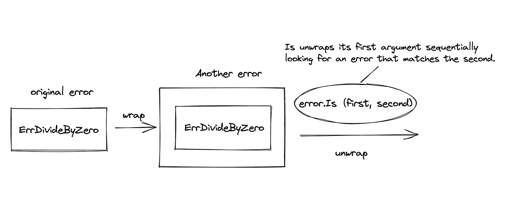

# Golang 中的错误处理函数

> 原文：<https://levelup.gitconnected.com/error-handling-functions-in-golang-159ae73164b3>

在本文中，我将演示在 Go 中处理错误函数的基础知识以及如何使用它们。

# 错误类型是什么？

Go 中的错误类型是接口类型。

```
**type** error **interface** {
    Error() string
}
```

所以基本上，错误类型是任何实现了`Error()`方法的东西。

# 构建错误

有两种方法可以创建错误值。

*   `**error.New**`功能
*   `**fmt.Errorf**`功能

```
func bar() error {
    return errors.New("error: an error occurred")
}func foo() error {
    return fmt.Errorf("error: %s", "an error occurred")
}
```

对这两个函数的每次调用都会返回不同的错误值，即使文本是相同的。

```
fmt.Println(bar()==bar())   # false
```

# 定义预期误差

定义预期错误是 Go 中的一项基本技术，因为它可以帮助我们识别特定的错误并以不同的方式处理它们。

这里有一个例子:

*   我们首先定义一个称为`ErrDivideByZero`的标记错误。
*   然后我们定义一个函数`Divide`，当第二个参数为零时，它返回这个错误。
*   稍后，我们使用`**errors.Is**`来检查返回的错误是否为`ErrDivideByZero`，并相应地采取一些措施。

# 包装错误

包装错误意味着将一个错误值放入另一个错误值，就像包装好的礼物一样。



当您希望在遇到特定错误时返回特定的错误消息时，这很有用。

这里有一个例子。

*   首先，当第二个参数为零时，`Divide`函数返回一个`ErrDivideByZero`
*   然后`doDivide`函数用自定义错误消息包装`ErrDivideByZero`错误，并返回一个**新错误**。
*   最后，在主函数中，我们使用`errors.Is`函数来检查错误在其包装链中是否有`ErrDivideByZero`类型。

# 结论

这里有三个要点

*   Go 中的错误类型是接口类型。
*   预定义的错误将允许我们检查稍后发生的错误。
*   包装错误将上下文添加到函数调用中(类似于堆栈跟踪)

发现这篇文章很有用👏？看看我下面的其他文章吧！

*   [戈朗的断路器示例](/circuit-breaker-example-in-golang-e6459c87eaeb)
*   [戈朗水道是如何工作的](/how-does-golang-channel-works-6d66acd54753)
*   [观察者设计模式在 Golang 的一个例子](/observer-design-pattern-in-golang-with-an-example-6c24898059b1)