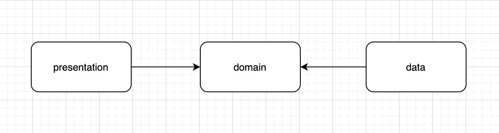
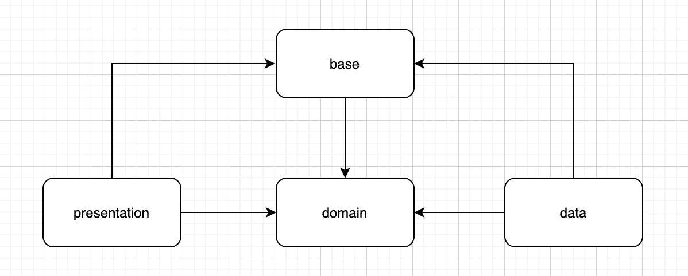

# 干净架构中的错误处理

> 原文：<https://levelup.gitconnected.com/error-handling-in-clean-architecture-9ff159a25d4a>

## 我如何干净利落地处理错误

布雷特·乔丹在 [Unsplash](https://unsplash.com?utm_source=medium&utm_medium=referral) 上的照片

当谈到 Android 中的干净架构时，互联网上有许多不同的实现，有些人喜欢通过**层**来打破他们的模块，有些人喜欢通过**功能**来打破他们的模块，你也会发现有些人更进一步，首先通过**功能**来打破他们的架构，然后每个功能被分解成**层**。

决定选择哪种方法超出了本文的范围，记住这个基本概念， [Clean Architecture](https://blog.cleancoder.com/uncle-bob/2012/08/13/the-clean-architecture.html) 甚至可以在一个**单模块**项目中实现。

错误处理是实现干净架构的一个棘手的部分，即使是完美实现干净架构的应用程序，当涉及到错误处理时，有时也会违反层角色。在应用中，我们通常关心两种类型的误差。

1.  **与业务相关的错误:**例如，如果我们正在构建一个金融应用程序，我们可以有一个业务规则，即只有大于特定年龄的人才能开立银行帐户，因此如果小于该年龄的人试图开立帐户，业务将会抛出一个错误，另一个例子可能是，第二次订购卡将收取额外的金额，因此如果用户的帐户中没有该金额，业务将会抛出一个错误。
2.  **与系统细节(数据库、网络)相关的错误:**例如，用户试图进行资金转账，但他没有连接到互联网，因此网络库将通过 IOException，另一个例子可能是，应用程序试图将数据存储在设备中以便持久存储，但空间不可用，因此保存操作将通过异常来执行。

这两种类型的错误的共同点是，我们需要向用户显示它们，不是堆栈跟踪，而是一些有意义的东西，以便用户可以理解为什么特定的操作不起作用。

既然我们已经定义了错误的类型，是时候看看我们的架构了，这样我们就可以将错误放在它们所属的层中。

在上图中，箭头表示依赖关系，表示和数据依赖于域。

系统中的每个操作都可能导致成功、失败或异常，所以让我们定义我们的结果类型。

这里我们有通用的成功和失败类型，因为每个业务操作将有不同的成功和失败类型，例如，资金转账操作可能导致**资金不足**错误，而创建账户操作可能导致**账户已经存在**错误。

例外情况是与核心业务规则无关的映射错误，如**没有互联网连接**或**空间不足**或系统细节可能引发的任何其他异常。

现在的黄金问题是，**这个结果类属于哪一层？**

问:我们可以在域内使用它吗？

A.嗯，是的，我们可以在域内使用它，因为成功和错误代表着业务的成功或错误，但是例外呢？这就引出了另一个问题。

问:**无连接**或**空间不足**在商业中有什么意义吗？

A.不，因为它们不是业务错误，它们与系统的细节有关，即数据库或远程或任何其他依赖于框架的东西，如果我们遵循干净的规则，我们首先从编写业务开始，我们不关心我们将使用什么数据库，或者我们将如何与远程通信，或者甚至我们是否需要它们。系统的细节可能会快速变化，这就是为什么它们在架构的外层，我们不能让我们的业务依赖于这些细节，这些细节抛出的异常也是如此。

[*我们也不希望这一层受到外部变化的影响，比如数据库、UI 或任何公共框架。这一层与此类问题无关。*](https://blog.cleancoder.com/uncle-bob/2012/08/13/the-clean-architecture.html#:~:text=We%20also%20do%20not%20expect%20this%20layer%20to%20be%20affected%20by%20changes%20to%20externalities%20such%20as%20the%20database%2C%20the%20UI%2C%20or%20any%20of%20the%20common%20frameworks.%20This%20layer%20is%20isolated%20from%20such%20concerns.)

还有另一个问题，在我们当前的架构中，如果我们不将异常放入域中，我们就没有办法在表示中访问它们以向用户显示相关的消息，因为数据和表示都依赖于域，并且数据和表示之间没有直接的依赖关系。我们需要稍微修改一下我们的架构。

我们引入了另一个基本模块来解决数据和表示之间的依赖问题，它们仍然是相互独立的，但是现在我们可以移动我们的异常了。公共基模块的原因，并且可以在域内具有结果类型，而不关心原因。

域内。

内垒。

总结一下，让我们看看我们的应用程序中的代码流是怎样的，用户将点击 UI 中的 transfer 按钮，UI 将调用 ViewModel/Presenter 中的 transfer funds，ViewModel/Presenter 将调用用例，业务将检查用户是否有转移资金所需的金额，如果有，用例将要求存储库执行实际的转移，如果存储库返回结果。如果成功，那么企业将扣除该金额，并将相同的结果返回给演示，例如，如果用户没有连接到互联网，并且网络库抛出 IOException，那么存储库将映射该 IOException 到原因。结果中没有连接，并将它返回给用例，用例将结果返回给表示，表示将使用该原因向用户显示它需要显示的任何错误。

# 参考

 [## 清洁编码器博客

### 在过去的几年里，我们已经看到了一系列关于系统架构的想法。这些包括…

blog.cleancoder.com](https://blog.cleancoder.com/uncle-bob/2012/08/13/the-clean-architecture.html)  [## 为什么不把异常从数据层放到领域层呢？问题#141 …

### 为什么不把数据层的异常放到领域层，让它们成为业务逻辑的一部分呢？那样的话…

github.com](https://github.com/android10/Android-CleanArchitecture/issues/141)