# [已解决]错误 java:包 javafx.application 不存在

> 原文：<https://levelup.gitconnected.com/error-java-package-javafx-application-does-not-exist-ac6ce7aa18ba>

## 逐步使用 screencaps 的错误信息和解决方案

## **语言** : Java

在命令行中我可以看到:

```
java 11.0.9 2020-10-20 LTSJava(TM) SE Runtime Environment 18.9 (build 11.0.9+7-LTS)Java HotSpot(TM) 64-Bit Server VM 18.9 (build 11.0.9+7-LTS, mixed mode)
```

jdk-11.0.9 是我正在使用的 jdk，我已经安装了一些，但 11.0.9 是正在寻找的版本。

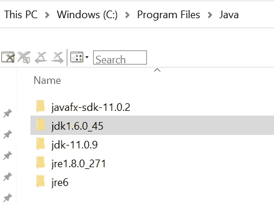

程序文件中的我的 Java 目录

## **OS** :

Windows 10。我也在 Windows 11 上测试过这个。

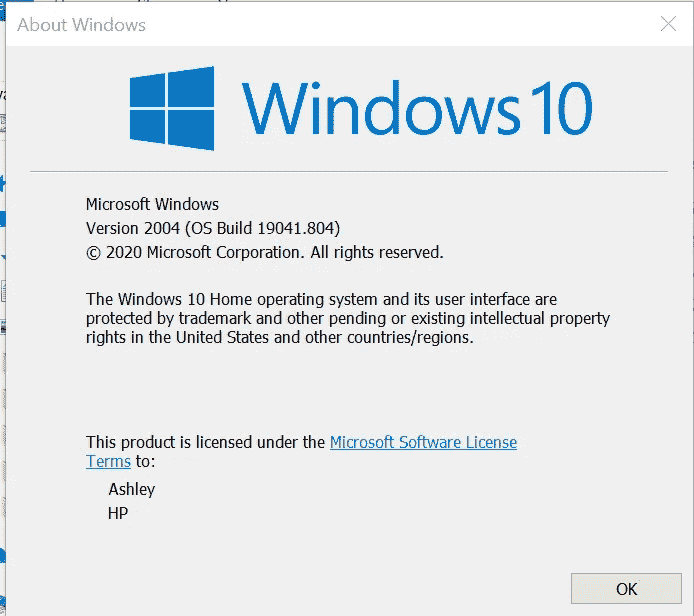

## **IDE** : IntelliJ

```
IntelliJ IDEA 2020.1.4 (Community Edition)
Build #IC-201.8743.12, built on July 21, 2020
Runtime version: 11.0.7+10-b765.65 amd64
VM: OpenJDK 64-Bit Server VM by JetBrains s.r.o.
Windows 10 10.0
GC: ParNew, ConcurrentMarkSweep
Memory: 1964M
Cores: 12
```

## **JavaFX 版本:**

```
javafx.version=11.0.2
javafx.runtime.version=11.0.2+1
javafx.runtime.build=1
```

## 如何获得您的 JavaFX 版本:

在从 internet 下载的 javafx 包的 lib 目录中查找 javafx.properties 文件:

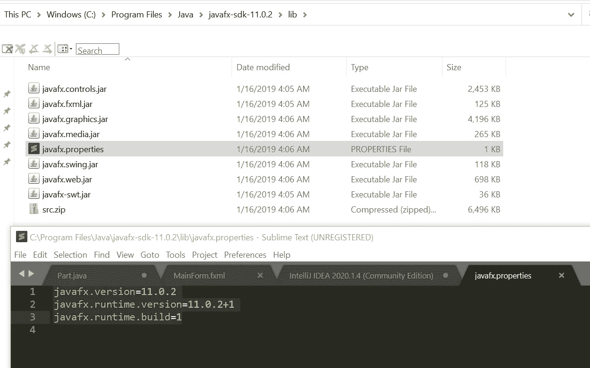

这是我下载 JavaFX 的网页:[https://gluonhq.com/products/javafx/](https://gluonhq.com/products/javafx/)

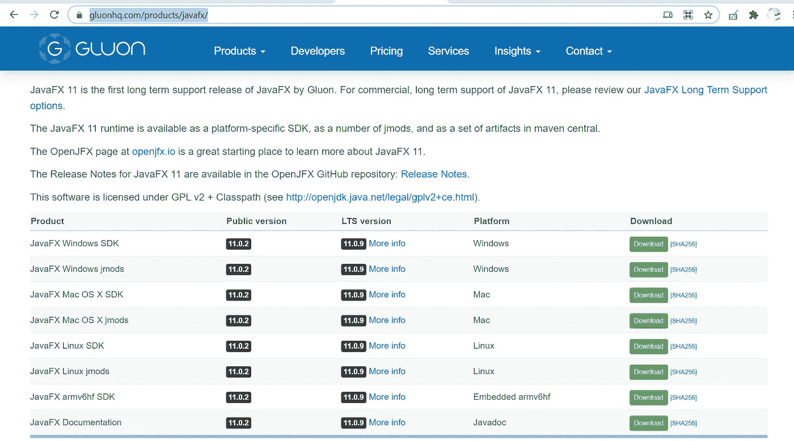

Oracle 网站不再托管 JavaFX。他们的一些文档仍然引用 JavaFX，你可以阅读这些文档，只是不要混淆。胶子是下载它的地方。

## 症状

您刚刚创建了一个新的 JavaFX 项目，

错误消息类似于:

```
Error java: package javafx.application does not exist
```

## 如何修复:

文件->项目结构

点击+按钮

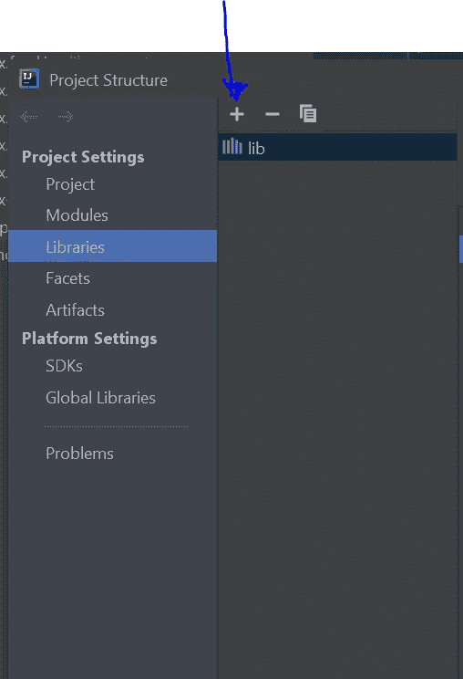

导航到 javafx-sdk- <version>文件夹中的文件夹 lib 文件夹，在该文件夹中存储了所有 javafx。安装 JavaFX SDK 时应该得到的 jar 文件，</version>

我的看起来像这样。我选择将它们复制到程序文件的 Java 文件夹中，这样我所有的 Java 内容都在一个地方，

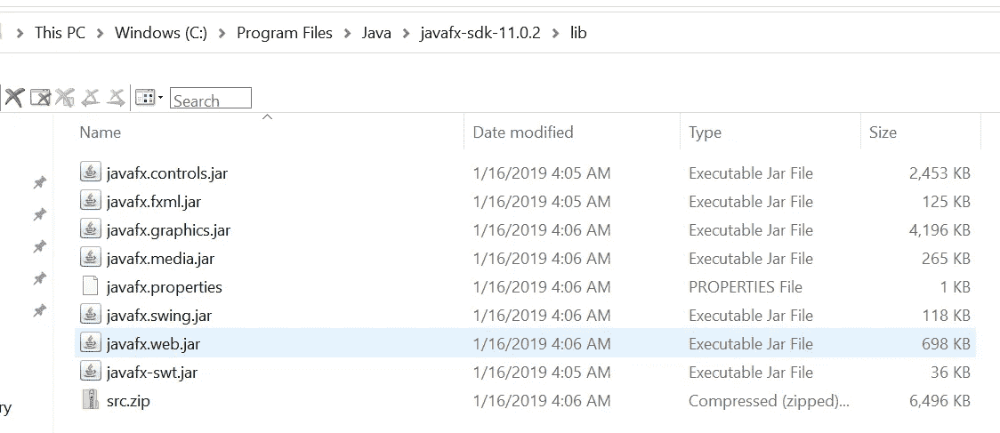

确保您选择了“lib”文件夹

如果你选择正确，它看起来会像这样


在左侧面板的项目浏览器中，当您展开外部库时，应该是这样的

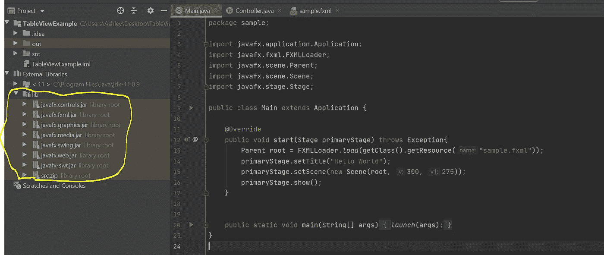

应该有一个 lib 文件夹，展开后会显示所有的 jar 文件

你可以看到我所有的红色文本也消失了，所以我们都准备好了。

## 注意:

您可能需要确保您的 VM 选项也指向您的 JavaFX 库，

## PATH_TO_FX 便利变量

通过转到文件->设置->外观和行为->路径变量来添加路径变量

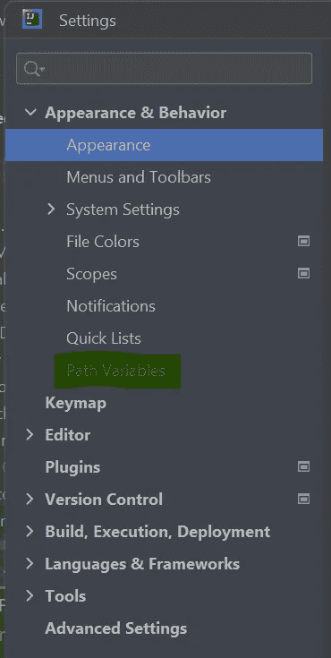

并单击+按钮

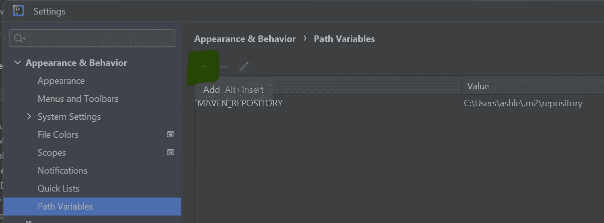

要添加一个新变量，您将调用“PATH_TO_FX”

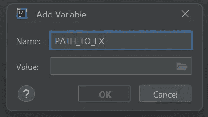

将其值设置为从互联网下载的 JavaFX 模块中 lib 文件夹的路径，

这是我的样子:

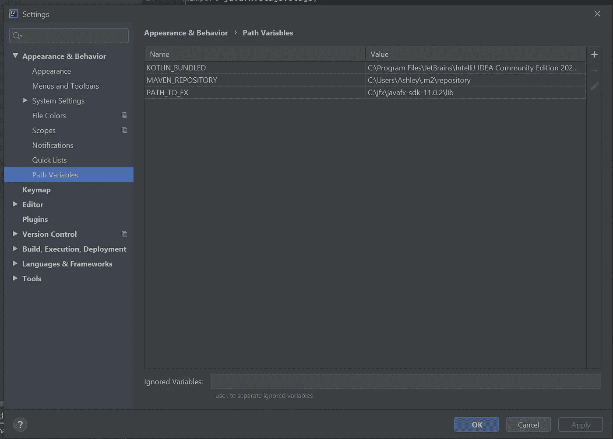

你不必和我在同一个版本上，这是另一个项目的截图，我链接到 18 版

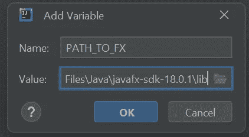

c:\ Program Files \ Java \ Java FX-SDK-18 . 0 . 1 \ lib

## 虚拟机选项

下一步:转到右上角靠近构建和运行按钮的主选择器下拉菜单，选择“编辑配置…”

这是在主 IDE 页面上，就在 build 按钮旁边，而不是在设置对话框的任何地方。

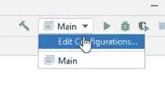

单击“修改选项”

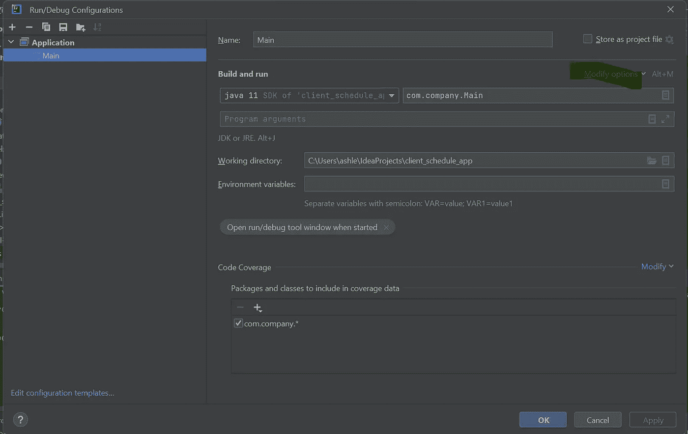

选择“添加虚拟机选项”

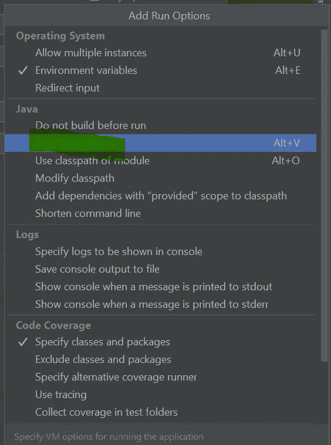

加上这一行:

```
--module-path ${PATH_TO_FX} --add-modules javafx.fxml,javafx.controls,javafx.graphics
```

标签为“虚拟机选项”的选项中

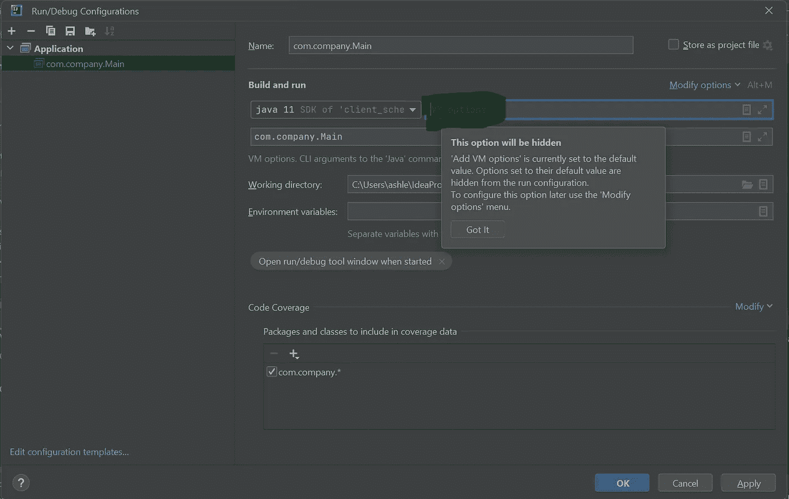

## 以防万一

如果我将 IntelliJ 复制并粘贴到 VM 选项中，甚至是从 Sublime Text 粘贴，我会遇到严重的问题，Sublime Text 是一个面向开发人员的编辑器，不像 Microsoft Word 或其他什么东西那样疯狂，我会遇到问题，所以我强烈建议您实际键入该行，而不是将其复制粘贴到 VM 选项中

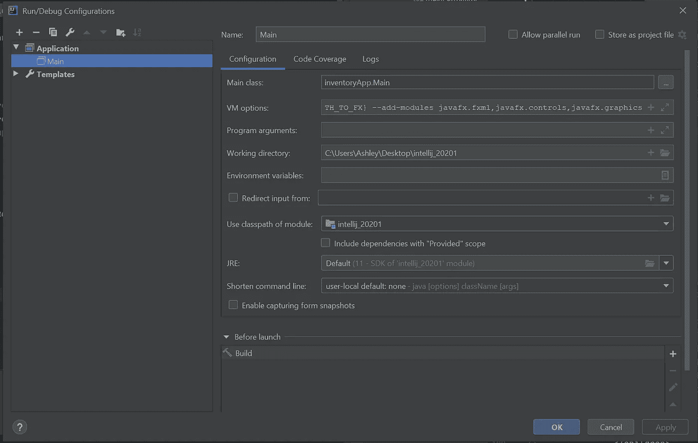

请参见虚拟机选项(表格中的第二项)

添加模块正在变魔术。它正在通过您的 javafx。jar 文件到虚拟机。