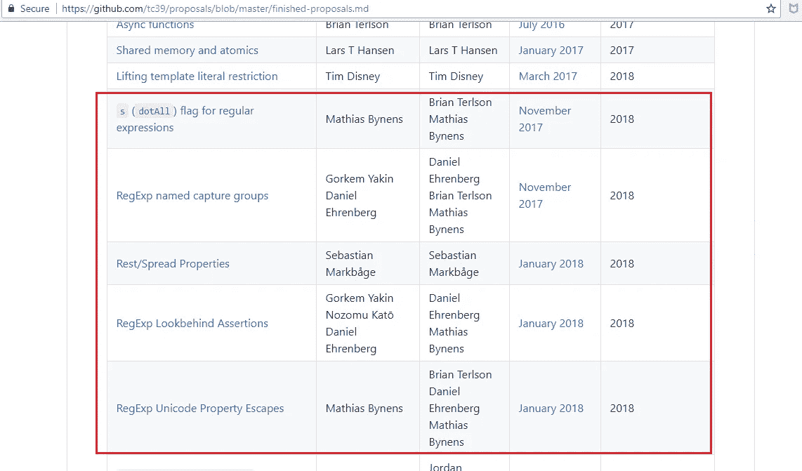
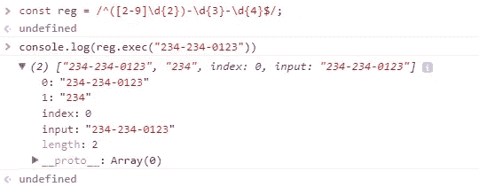
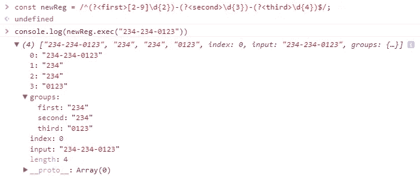
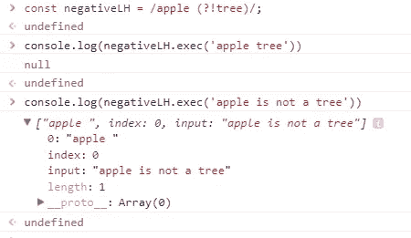
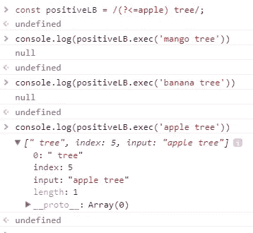
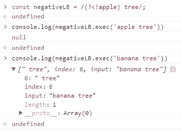

# 带有示例的新正则表达式特性

> 原文：<https://levelup.gitconnected.com/es2018-new-regex-features-with-examples-89d889846d1d>

## ES2018 中引入的功能—“s”**dotAll 标志**、**命名捕获组**、 **Lookbehind 断言**和 **Unicode 属性转义**。


由[黄川](https://unsplash.com/@transonhoang?utm_source=unsplash&utm_medium=referral&utm_content=creditCopyText)在 [Unsplash](https://unsplash.com/@transonhoang?utm_source=unsplash&utm_medium=referral&utm_content=creditCopyText) 上拍摄的照片

ES2018 中引入了最新的正则表达式功能。这些更新包括 4 个新功能— `s` (dotAll)，命名捕获组，后视断言，Unicode 属性转义。

更多类似的内容，请查看 https://betterfullstack.com 的



正则表达式的建议

## [“s”(](https://github.com/tc39/proposal-regexp-dotall-flag)`[dotAll](https://github.com/tc39/proposal-regexp-dotall-flag)`[)标志为正则表达式](https://github.com/tc39/proposal-regexp-dotall-flag)

**问题**:

1.  正则表达式与星号([非 BMP](https://en.wikipedia.org/wiki/Plane_(Unicode)) )字符不匹配。例如:`/^.$/.test('😀') // false`。
2.  正则表达式与`\r`和`\n`不兼容。例子:`/./.test('\n') // false`。

有时我们仍然可以通过添加两个相反的速记字符类`[\w\W]`来检查这一点，比如`/[\w\W]/.test('\n') // true`。

**解决方案**:

ES2018 通过添加标志`\s`(长名称为`dotAll`)修复了这个问题

1.  `/^.$/s.test('😀') // true`
2.  `/./s.test('\n') // true`

## [RegExp 命名的捕获组](https://github.com/tc39/proposal-regexp-named-groups)

我们可以将捕获组命名为正则表达式匹配的字符串的特定部分。

语法:`(?<name>...)`

让我们从我上一篇关于验证电话号码的文章中取一个例子。

```
const reg = /^([2-9]\d{2})-\d{3}-\d{4}$/;
```

当我们使用`exec`获取输出时，很难检索到我们想要的信息。



执行电话号码后输出

现在我们可以通过用`first`、`second`和`third`为每个组命名来应用这个新技术。

```
const newReg = /^(?<first>[2-9]\d{2})-(?<second>\d{3})-(?<third>\d{4})$/;
```



使用捕获组后的输出

我们也可以很容易地通过析构来获取值。

```
const {groups: {first,second,third}} = newReg.exec("234-234-0123");
```

我喜欢的一点是，**我们可以通过`\k<name>`语法在模式**中调用一个命名的捕获组。

```
const duplicate = /\b(?<half>\w+)\s+\k<half>\b/;
duplicate.test('I will go to school tomorrow'); // false
duplicate.test('I will go to to school tomorrow  '); // true
console.log(duplicate.exec('I will go to to school tomorrow  ')); // object
```

这个例子帮助我们检查重复的单词。

## [正则表达式后视断言](https://github.com/tc39/proposal-regexp-lookbehind)

在 ES2018 之前，我们只有正面和负面的前瞻断言。

**正向前瞻**

`/apple (?=tree)/`。这意味着`apple`之后一定是`tree`。


积极前瞻

**负前视** `?!...`

`/apple (?!tree)/`。这意味着单词 follow `apple`不能是`tree`。



消极前瞻

从 ES2018 开始，JavaScript 允许我们执行后视断言。

**正向后视** `?<=...`

`/(?<=apple) tree/`。这仅在`apple`在`tree`之后时匹配。



积极回顾

**否定后视** `?<!…`

`/(?<!apple) tree/`。这仅在`apple`不在`tree`后面时匹配。



消极回顾

## [RegExp Unicode 属性转义](https://github.com/tc39/proposal-regexp-unicode-property-escapes)

设置`\u`时，Unicode 属性转义`\p{...}`和`\P{...}`现在在正则表达式中可用。

这解决了这些问题:

1.  创建支持 Unicode 的正则表达式不再痛苦。
2.  不依赖于运行时库。
3.  正则表达式模式简洁易读——不再有文件大小膨胀。
4.  不再需要创建在构建时生成正则表达式的脚本。
5.  从开发人员的角度来看，使用 Unicode 属性 escapes 的代码“自动”保持最新:每当 Unicode 标准获得更新时，ECMAScript 引擎都会更新其数据。

**怎么用？**

1.  对于非二进制 Unicode 属性如下:`\p{*UnicodePropertyName*=*UnicodePropertyValue*}`
2.  对于二进制属性`\p{*LoneUnicodePropertyNameOrValue*}`

例如:

```
const str = '𝟠';
console.log(/\p{Number}/u.test(str)); // true
```

或者

```
const regexGreekSymbol = /\p{Script=Greek}/u;
regexGreekSymbol.test('π'); // true
```

那么我怎么知道`UnicodePropertyName`*`UnicodePropertyValue`*和`LoneUnicodePropertyNameOrValue`？**

**您可以查看 [PropertyValueAliases](http://unicode.org/Public/UNIDATA/PropertyValueAliases.txt) 或[提案文件](https://tc39.es/proposal-regexp-unicode-property-escapes/#sec-runtime-semantics-unicodematchproperty-p)了解更多信息。**

**我收集了一些最流行的如下:**

1.  **`\p{Script=...}`。从 PropertyValueAliases 中的 **# Script (sc)** 获取。**
2.  **`\p{General_Category=...}`。您从 PropertyValueAliases 中的 **# General_Category (gc)** 获取值。但是，您可以使用`General_Category`值的简写，例如用`\p{Letter}`代替`\p{General_Category=Letter}`。**
3.  **按照 [UTR51](http://unicode.org/reports/tr51/) 匹配表情符号，如**表情符号 _ 修饰符 _ 基础**、**表情符号 _ 修饰符**、**表情符号 _ 呈现**、**表情符号**。**

**注意:**

**要匹配 Unicode 中的任何非单词符号，而不仅仅是`[^a-zA-Z0-9_]`，请使用:`[^\p{Alphabetic}\p{Mark}\p{Decimal_Number}\p{Connector_Punctuation}\p{Join_Control}]`。**

**`\P{…}`是`\p{…}`的否定形式**

**例如:**

```
**const str = '𝟠';
console.log(/\P{Number}/u.test(str)); // false**
```

**或者**

```
**const regexGreekSymbol = /**\P**{Script=Greek}/u;
regexGreekSymbol.test('π'); // false**
```

## **摘要**

**新的正则表达式功能，我们可以节省更多的时间来做一个复杂的任务。**点全标志**改变点的行为。**命名的捕获组**让我们检索数据更容易。**后视断言**使我们能够匹配一个模式，只要它前面有另一个模式。最后，我们将不再痛苦地通过使用 **Unicode 属性转义**来创建支持 Unicode 的正则表达式。**

**既然是新功能，你得先**检查浏览器兼容性**。**

**我希望这篇文章对你有用！可以跟着我上[https://developer . Mozilla . org/en-US/docs/Web/JavaScript/Guide/Regular _ Expressions # Advanced _ searching _ with _ flags _ 2](https://medium.com/@transonhoang#Advanced_searching_with_flags_2)**

**[2]:新的 JavaScript 特性将改变您编写 Regex 的方式[https://www . smashingmagazine . com/2019/02/regexp-Features-regular-expressions/](https://www.smashingmagazine.com/2019/02/regexp-features-regular-expressions/)**

**[3]:完成提案[https://github . com/tc39/Proposals/blob/master/Finished-Proposals . MD](https://github.com/tc39/proposals/blob/master/finished-proposals.md)**

**[4]:浏览器兼容性[https://developer . Mozilla . org/en-US/docs/Web/JavaScript/Reference/Global _ Objects/RegExp # Browser _ compatibility](https://developer.mozilla.org/en-US/docs/Web/JavaScript/Reference/Global_Objects/RegExp#Browser_compatibility)**

**[](https://betterfullstack.com/stories/) [## 故事-更好的全栈

### 所有的故事故事为我们写指南提交故事到更好的编程博客 1。故事指南避免什么…

betterfullstack.com](https://betterfullstack.com/stories/)**