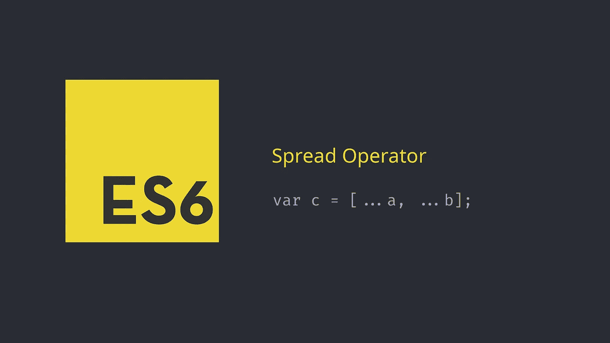

# ES6 传播解释

> 原文：<https://levelup.gitconnected.com/es6-spread-explained-e4d75450ea50>



ES6 给我们带来了很多很酷的功能，其中一个就是 Spread syntax ( `…`)。根据 MDN 文档:

> Spread 语法允许在需要零个或多个参数(对于函数调用)或元素(对于数组文本)的地方扩展可迭代对象，例如数组表达式或字符串，或者在需要零个或多个键值对(对于对象文本)的地方扩展对象表达式。

在其核心层，Spread 所做的是扩展一个 iterable。这个 iterable 可以是数组、字符串或对象。我们将逐一研究这些可重复项，看看它们是如何与 Spread 一起工作的。

# 阵列和分布

假设我们有一个记录全名的函数，如下所示:

```
function PrintFullName (firstName, middleName, lastName){
 console.log (firstName + “ “ + middleName + “ “ + lastName);
}
var Professor = [“Albus”, “Percival”, “Dumbledore”];//Before ES6
PrintFullName (Professor[0], Professor[1], Professor[2]);// using Spread
PrintFullName (…Professor); 
// expected output: Albus Percival Dumbledore
```

第二种方法中的 3 个点是扩展运算符。Spread 操作符遍历数组并扩展该数组，并将函数参数作为单独的值提供。

这里考虑另一个例子。假设我们有两个数组，我们想将一个数组的元素添加到另一个数组中。使用 Spread 实现这一点要简单得多:

```
var arr1 = [1,2];
var arr2 = [3,4];
var combinedArr = […arr1, …arr2];
console.log (combinedArr); // expected output: [1,2,3,4]
```

# 弦乐与跨页

Javascript 字符串就是一系列用双引号括起来的字符。因为它是一系列字符，所以 Spread 语法将读取一个字符串值，就像它从数组中读取一样，并将它以单个字符的形式分开。

```
var str = “Some String”;
var strArr = […str];
console.log (strArr); // expected output: [“S”, “o”, “m”, “e”, “ “, “S”, “t”, “r”, “i”, “n”, “g”]
```

# 对象和跨页

一个简单的 JS 对象非常类似于 JSON 对象——一个键和值对。

```
var jsObject = {
 Name : ‘John’,
};
```

我们可以使用 spread 来组合现有对象并创建更复杂的对象:

```
var empData1 = {
 Name: ‘Trevor’,
 Gender: ‘M’,
 Age: 31
};
var empData2 = {
 State: ‘Pennsylvania’,
 City: ‘Pittsburgh’
};
var empDataComplete = {…empData1, …empData2 };
console.log(empDataComplete); // expected output: {Name: “Trevor”, Gender: “M”, Age: 31, State: “Pennsylvania”, City: “Pittsburgh”}
```

这就是 Javascript 中 Spread 运算符的工作方式。希望对你有帮助。感谢阅读。

[](https://gitconnected.com/learn/javascript) [## 学习 JavaScript -最佳 JavaScript 教程(2019) | gitconnected

### 68 大 JavaScript 教程-免费学习 JavaScript。课程由开发人员提交并投票，从而实现…

gitconnected.com](https://gitconnected.com/learn/javascript)