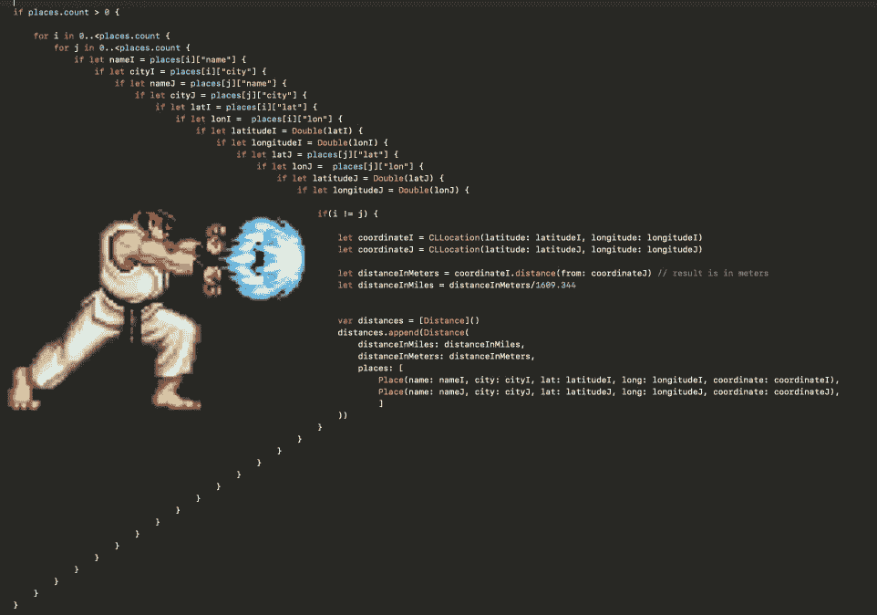

# 逃离末日金字塔

> 原文：<https://levelup.gitconnected.com/escape-the-pyramid-of-doom-c58edd326225>

代码最重要的一个方面是**可读性**，因为它直接关系到**可维护性**。你可以有一个非常高性能的代码，做它需要做的事情，但是如果它不可读，我个人认为它不是好代码。

当你写代码的时候，最好多花 5 分钟来提高可读性，而不是每次别人需要做代码的时候，强迫每个人多花 5-10 分钟来理解它。

伤害可读性但并不难解决的一个问题是“**末日金字塔**”，所以让我们来谈谈这个问题。

# 定义

> 在[计算机编程](https://en.wikipedia.org/wiki/Computer_programming)中，**末日金字塔**是一个常见的问题，当一个程序使用多级嵌套缩进来控制对一个函数的访问时就会出现这个问题。这在检查[空指针](https://en.wikipedia.org/wiki/Null_pointer)或处理[回调](https://en.wikipedia.org/wiki/Callback_(computer_programming))时很常见。
> (来源:[维基百科](https://en.wikipedia.org/wiki/Pyramid_of_doom_(programming)))

末日金字塔，或“哈都肯密码”

# **IF 语句**

考虑下面的代码:

**如何才能避免这种情况？**

*   使用*守卫报表*
*   将可选值与精确值进行比较([我上一篇文章中的技巧 1](https://medium.com/@bocato/tips-and-tricks-to-improve-your-swift-code-138a7d1e1bd8))
*   用上下文名称提取变量的验证
*   代码格式/组织

**一些可能的重构**

示例 1

示例 2

# 关闭

或者说，所谓“回调地狱”。

考虑下面的代码:

我们该如何解决这个问题？

*   调度组
*   信号灯

**一些可能的重构**

调度组

信号灯

**注:**我建议多读一些关于**信号量**和**调度组**的内容，因为这里展示的例子只是简单的使用它们的基本功能。

**建议学习来源:** -[Swift 大中央调度教程 4: Part 2/2](https://www.raywenderlich.com/5371-grand-central-dispatch-tutorial-for-swift-4-part-2-2)
- [深入了解 Swift 大中央调度](https://www.swiftbysundell.com/articles/a-deep-dive-into-grand-central-dispatch-in-swift/)
- [高级 Swift:回调地狱网络调用—异步等待样式修复](https://www.youtube.com/watch?v=JHqxmBFrWl8)
- [何时信号量 vs 调度组！小心多线程共享资源](https://www.youtube.com/watch?v=6rJN_ECd1XM)

# 结论

我们可以看到，逃离末日金字塔模式并没有那么难。只需简单的改进，你的代码就可以变得更具可读性，下一个看到你的代码的人也不必花很多时间去理解它。