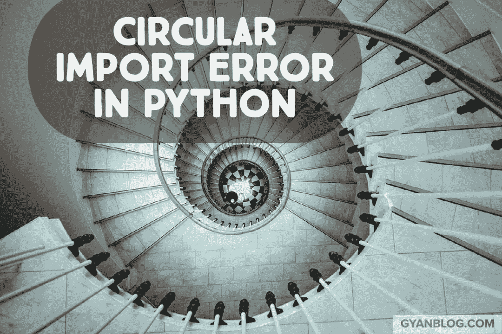

# 逃离 Python 导入迷宫:避免 Python 中循环导入的技巧

> 原文：<https://levelup.gitconnected.com/escaping-the-python-import-maze-tips-for-avoiding-circular-imports-in-python-9046b0be5cb>



当两个或多个模块相互依赖时，可能会发生循环导入。如果每个模块试图在完全加载之前导入另一个模块，就会发生这种情况，导致不可预知的行为和运行时错误。为了避免这些问题，必须仔细考虑代码中的导入语句，并使用下一节中描述的方法之一来打破导入循环。下面是一个错误语句的例子。

```
"ImportError: cannot import name 'users_bp' from partially initialized module 'src.users.routes' (most likely due to a circular import) "
```

# 销毁循环进口的 5 种方法


# 在函数中导入模块

避免循环导入的一种方法是在函数内部导入模块，而不是在模块的顶层导入。这允许模块仅在需要时被导入，而不是在模块第一次被导入时被导入。例如:

```
def foo():
    from module1 import bar
    bar()
```

# 使用导入方式

另一种避免循环导入的方法是使用`import as`语法。这允许您使用不同的名称导入模块，然后可以使用该名称在代码中引用该模块。例如:

```
import module1 as m1

def foo():
    m1.bar()
```

# 将导入移动到模块的末尾

第三种选择是在定义了所有其他代码之后，将 import 语句移到模块的末尾。这确保了模块在被另一个模块导入之前已经被完全定义。例如:

```
def foo():
    pass

def bar():
    pass

import module1
```

# 使用`IMPORTLIB`库

避免循环导入的另一个选择是使用`importlib`库，它允许你在运行时动态导入一个模块。如果在运行时之前不确定需要导入哪个模块，这可能会很有用。例如:

```
import importlib

def foo():
    module = importlib.import_module("module1")
    module.bar()
```

# 创建要从中导入的通用文件

另一种选择是创建一个两个模块都可以导入的公共文件。这有助于打破进口循环，避免循环进口。例如:

```
# common.py
def foo():
    pass

def bar():
    pass

# module1.py
from common import foo
def baz():
    foo()

# module2.py
from common import bar
def qux():
    bar()
```

现在，不要浪费几个小时试图弄清楚循环导入意味着什么，您可以尝试使用这些方法中的任何一种，并且您很快就可以完成。我推荐第五种方法。它非常有效。感谢阅读。在我的[博客](https://stephenadesina.com/blog/)上阅读更多文章。

如有任何调试问题，请在评论或 LinkedIn 上联系我。

**Secundum Allos Parakletos**

# 分级编码

感谢您成为我们社区的一员！在你离开之前:

*   👏为故事鼓掌，跟着作者走👉
*   📰查看[升级编码出版物](https://levelup.gitconnected.com/?utm_source=pub&utm_medium=post)中的更多内容
*   🔔关注我们:[Twitter](https://twitter.com/gitconnected)|[LinkedIn](https://www.linkedin.com/company/gitconnected)|[时事通讯](https://newsletter.levelup.dev)

🚀👉 [**加入升级达人集体，找到一份惊艳的工作**](https://jobs.levelup.dev/talent/welcome?referral=true)