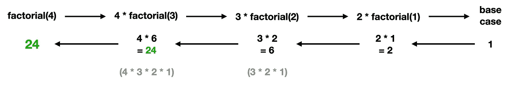
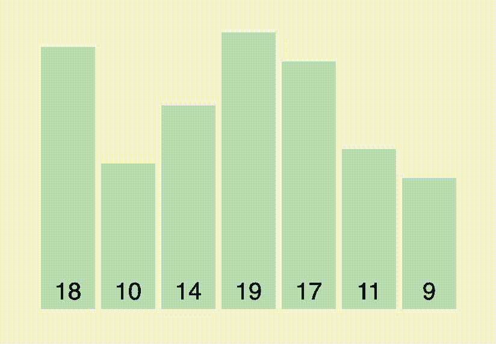
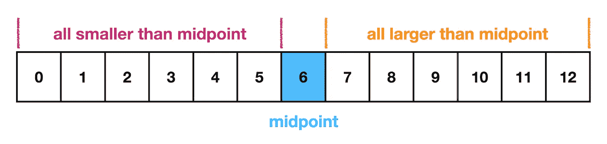
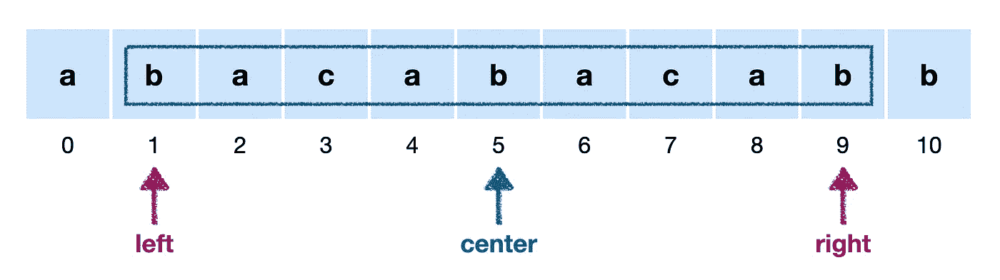

# 编码采访的基本数据结构和算法

> 原文：<https://levelup.gitconnected.com/essential-data-structures-and-algorithms-for-coding-interviews-a283c755b304>

## 在技术面试中成功的 10 大必知话题

由[福赞·萨里](https://unsplash.com/@fznsr_?utm_source=medium&utm_medium=referral)在 [Unsplash](https://unsplash.com?utm_source=medium&utm_medium=referral) 上拍摄的照片

有一种误解，认为钻研数百甚至数千个编码面试问题是成功的唯一途径。这可能对一些人有用，但它可能会浪费大量时间，并错过一个关键点:你很少考虑*为什么*你正在学习一些东西，也不专注于获得可以应用于广泛问题的直觉。

虽然有无数的问题可以问你，但只有有限的几个概念可以实际测试。如果你专注于彻底理解关键的基本原理并观察它们是如何被应用的，而不是试图去记忆解决方案，你就能成功地回答任何问题。

你将会遇到的实际问题都是一些核心概念的变体。

在我的上一篇文章中，我提供了有效准备编码面试的[路线图](/the-roadmap-to-landing-your-next-job-as-a-software-engineer-cf6289d6f274)。本文介绍了编码面试中最重要的 10 个话题(最后有 2 个加分)。

👇**如果你准备好参加 ace 你的编码面试，我还建了** [**这门课程**](https://skilled.dev/) 👇

 [## 顶级编码面试课程| Skilled.dev

### 掌握编码面试的过程

技术开发](https://skilled.dev/) 

在 Skilled.dev 课程中，您将学习所有基本的数据结构和算法，以及概念上如何应用它们来回答任何编码面试问题。

# 1.哈希表

散列表在编写面试代码时是必不可少的，我可以保证你在找工作时会多次用到它们。我们经常看到哈希表有两个原因:

1.  哈希表通常是优化解决方案的最佳工具
2.  哈希表使我们能够编写非常可读的代码

哈希表是一种灵活的数据结构，它允许我们使用键值对来存储项目，这在 O(1)时间上非常快，也使我们的代码更加直观。**如果您需要优化解决方案，请务必考虑是否可以使用哈希表**。

哈希表可以与任何其他数据结构结合，从数组到图形，并且可以无缝集成和改进代码。我们还看到哈希表在更高级的主题中使用，如动态编程。缺点是哈希表(通常)不是有序的，这就是为什么它们经常与其他数据结构结合在一起。

# 2.数组

数组在面试和工作中无时无刻不在出现。我把它们放在哈希表后面的唯一原因是，我认为大多数开发人员通过更多的接触对它们有更多的直觉。然而，它们在面试编码中同样重要。

数组是线性的和索引的。当我们从末尾添加/删除项目时，我们在索引处得到快速操作。

通常，如果给你一个数据列表作为问题输入，它会在一个数组中。您需要对遍历一个数组(从前面和后面)、通过索引访问项目、排序、搜索、更新感到非常舒服——真正地在一个数组上执行任何操作。

我们也经常看到关于创建矩阵的嵌套数组的问题。您应该也能轻松地迭代和使用这些二维数据结构。

# 3.递归

公司喜欢在编程面试中测试递归。事实上，我几乎可以保证，如果你去面试一家公司，他们至少会有一个递归问题。

公司可以引入递归，但不一定是“递归问题”。例如，图或树遍历中的深度优先搜索有一个优雅的递归解决方案，它可以出现在像动态编程这样的高级概念中。递归的其他常见用途是二分搜索法、遍历链表或遍历堆栈数据结构。

**每个递归函数都需要一个基格和递归格——这是递归的基础**。然后你需要开始考虑如何将整个问题看作子问题，递归函数每次只取一个较小的输入值，直到它到达基本情况。要记住的一点是，递归增加了调用堆栈的 O(n)空间(如果没有尾调用优化)，并可能导致堆栈溢出。

# 4.整理

visualgo.net

在我们的采访中，总是需要对数据进行分类。然而，我想指出的是，你很可能不需要从头开始实现排序算法，而且你绝对不应该花时间或脑力去记忆排序算法。

排序最重要的是知道如何使用编程语言中的内置`sort`函数，并知道排序对代码的影响。

总是假设**排序花费 O(n log n)时间**。

你应该能够对包含任何类型数据(数字，字符串等)的数组进行排序。)，包括具有嵌套属性的对象数组。

# 5.树

理解我们如何使用节点构建树并能够遍历它们是至关重要的。这可以通过直接问一个树问题出现，或者如果你是一个前端工程师，你可能被要求迭代通过遵循完全相同的原则的 DOM。树通常是开发人员对非线性数据结构的第一次介绍，它将我们与图形等概念联系起来。

你要知道**前序**、**后序**和**同序**遍历的区别。实现上的差异很小，但是它可以完全改变你解决问题的方式。

最常见的树表示是二叉树，每个父节点最多包含 2 个节点。你也经常会看到二分搜索法树，它们是排序的二叉树。

# 6.图形(和图形遍历)

事实上，在面试中，图表比树更容易出现，但首先了解树是如何工作的，会更容易理解图表。

许多开发人员在第一次学习图形时会觉得它们令人生畏，但是一旦你理解了基本原理，它们就会变成一些更容易的问题。

图形问题出现的频率比你想象的要高得多。例如，可能给你一个矩阵作为输入，但是你遍历它的方式是把它当作一个图。一个常见的例子是计数岛面试问题矩阵中的每一项不是土地就是水。然后，当你找到一块陆地时，你遍历它，找到这个岛上包含的所有相连的陆地项目。您不能简单地进行线性遍历，因此您可以将其视为一个图遍历，其中每个节点的邻居是任何给定项目的上、下、左、右节点。

您应该知道如何实现**深度优先搜索**(使用堆栈数据结构)和**宽度优先搜索**(使用队列数据结构)，并且能够轻松地遍历一个图。

# 7.二分搜索法和 O(log n)时间

公司喜欢间接地介绍二分搜索法。您通常会得到一些输入，并被告知(或需要认识到)它已被排序。通过理解它的排序，你可以实现一个基于问题上下文的二分搜索法版本，在 O(log n)时间内找到项目。

二分搜索法需要分类数据。因为数据是有序的，所以当你搜索时，你知道你要找的东西一定在哪个方向。例如，对于一个标准的排序整数数组，如果你选择中间项，并将其值与你要寻找的目标进行比较，你就知道它在中间项的左边或右边，并且可以向那个方向移动。这消除了一半的项目。

1.  二分搜索法需要分类数据
2.  二分搜索法的运行时间为 O(log n ),因为它在每一步都消除了剩余项目的一半
3.  您应该了解如何从零开始实现二分搜索法
4.  二分搜索法是二分搜索法树的一个基本概念
5.  认识到当输入被排序时(无论是直接陈述还是间接暗示)，这可能是使用二分搜索法的机会

# 8.链表技术

链表是一种较低级的数据结构，所以我们大多数人在日常工作中不会用到它。事实上，需要理解它们经常是一个笑话，因为在面试期间是程序员一生中唯一需要知道如何反转链表的时候。

不管你对它们的看法如何，你应该理解它们是如何为面试工作的，链表的基础植根于计算机科学基础，这对我们领域的任何人都是有益的。

幸运的是，链表的基本概念可以提炼为几点。

*   知道如何通过给定一个头节点来遍历链表
*   从链接列表中删除或插入项目
*   管理多个指针(下一节将详细介绍)
*   实施跑步者技术
*   常见问题:反转一个链表，从尾部删除一个项，查找一个项，判断是否有重复，判断是否有循环，合并多个链表

# 9.管理指针

指针是我们在输入数据结构中引用特定位置的方式。这可能是当我们有一个数组或字符串，并希望维护一个指向特定索引的变量时，或者它可以用于引用链表、树或图中的节点。

值得一提的是，指针可以对我们如何引用内存中的数据有一个更深入的技术定义，然后是一种更高级的方式，即我们从输入中“指向”一个项目。通常，您只需要通过更高层次的定义来理解这个概念，尤其是使用像 JavaScript 或 Python 这样的动态编程语言。

最常见的情况是，指针的挑战只是将逻辑转换成代码，并确保始终保持对正确项的引用。一个常见的例子是寻找最长的回文子串。遍历数组，在每一点使用两个指针从中心向外遍历，检查可能的回文长度。然后，一旦回文结束，你必须返回到中心指针，并通过字符串再次向前移动到下一个项目。

# 10.堆栈和队列

当我们最终关心快速操作时，我们使用堆栈和队列。这可能是当我们关心最近添加的项目(堆栈的后进先出性质)，或者如果我们想要根据项目到达的顺序来处理项目(队列的先进先出性质)。

我们经常在其他数据结构和算法中看到堆栈和队列。例如，我们使用深度优先搜索的堆栈，宽度优先搜索的队列，递归的调用堆栈是一个关键的概念。我们使用队列来实现诸如 LRU 缓存(一个常见的面试问题)之类的东西，使用堆栈来维护一组数据的最小值或最大值。

# 好处 1:面向对象编程或函数式编程

虽然这不是具体的数据结构或算法，但通常至少有一次面试会要求你使用面向对象编程(OOP)或函数式编程(FP)从头构建一些东西。在过去，它几乎总是面向对象，但随着 FP 的增长，这也是一种选择。

很可能这取决于你在 OOP 和 FP 之间的选择，但是目标是看你是否能写出好的代码来构建一些“真实”的东西。该公司试图看看你是否能有效地封装你的逻辑/功能，并以直观的方式维护数据。

他们想回答的问题是:你能写出好的代码来保持或提高他们代码库的质量吗？

# 奖金 2:实际应用和系统设计

系统设计面试随着行业的变化而发展，微服务被大量使用，前端变得越来越复杂。你会被问到的确切问题将取决于你申请的职位，但我将在下面概述核心概念，并将它们分为后端和前端。

后端:你将被要求构建一个复杂的后端系统，该系统可能包含一些类型的数据存储和公开 API。公司希望了解您是否能够理解如何逻辑封装服务，并对架构决策进行合理的推理，从而使系统具有可伸缩性和可维护性。

**前台**:公司想看看你是否能管理一个现代化的前台。这可以通过讨论你的决定进行概念性的测试，或者他们会要求你构建一个小的应用程序。通常在前端测试的概念有:API 集成、构建复杂的用户界面、处理状态或考虑性能。

研究系统设计问题的最好方法是**建造真实的东西**。花时间在项目上，尝试不同的技术，看看它们是如何工作的。一旦你做到了这一点，看看样本系统设计面试问题，这样你会有一个更实际的问题，看看别人是如何解决这些问题的。

# 结论

在我的下一篇文章中，我将进一步向你展示*如何*研究正确的概念以获得广泛的直觉。

成功编写面试代码的最重要因素是有效利用你的时间。我强烈建议您在处理编程问题时，将重点放在学习概念和建立直觉上，这将允许您将这些概念广泛应用于许多其他问题，并增加您成功的可能性。

— Trey ( [@treyhuffine](https://twitter.com/treyhuffine) )

**附言提醒:** [**Skilled.dev 编码面试课程**](https://skilled.dev/) **定于 11 月 17 日上线！最大的折扣将只在有限的时间内提供，所以一定要报名参加通知的电子邮件列表。**

# 分级编码

感谢您成为我们社区的一员！升级正在改变技术招聘。 [**在最好的公司**找到你的完美工作](https://jobs.levelup.dev/talent) **，而不仅仅是你的*下一份工作*。**

 [## 提升——改变招聘流程

### 🔥让软件工程师找到他们热爱的完美角色🧠招聘人才是最痛苦的部分…

作业. levelup.dev](https://jobs.levelup.dev/talent)