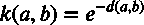
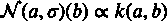

# ML 的基本工程原则

> 原文：<https://levelup.gitconnected.com/essential-engineering-principles-for-ml-aa190a5894a8>

加上深度学习的经验笔记

对于一些上下文，这不仅仅是一个项目列表，参见我的另一篇文章:[编写漂亮的、可复制的、可逆的、经过测试的 ML 代码应该节省时间，而不是耗费时间](https://medium.com/@jgardi/writing-beautiful-reproducible-reversible-tested-ml-code-should-save-time-not-cost-82f7c9cf03e7)

*   黑色格式将确保您的代码在不做额外工作的情况下始终保持完美的格式。使用黑色格式，并与你的编辑器整合:[https://black . readthe docs . io/en/stable/editor _ integration . html](https://black.readthedocs.io/en/stable/editor_integration.html)。它应该会在你每次点击 save 时自动格式化你的代码
*   **尽量少花时间调试**。调试往往会使人沮丧，并消耗大量时间。每当你遇到一个困难的 bug 时，想想将来如何能更快地找到那个 bug。本质上，你希望**自动化**调试过程。一些有帮助的想法是
    类型的提示。类型提示是最好的，因为它们在您键入错误后几毫秒就能发现错误。断言非常奇妙，因为它们每次都运行，甚至在代码运行结束之前就发现错误。
    -小型快速单元测试
    -基于属性的测试:很多单元测试只是测试人们想到的情况，但是最难的 bug 往往来自我们没有预见到的情况。请尝试使用随机生成的数据进行测试。对于这些随机生成的数据，您通常没有正确输出的标签，但是断言可以自动揭示许多问题。
*   调试机器学习模型的健全性检查:
    -始终使用简单的方法设置基线，如线性回归、核岭回归、高斯过程、随机森林或 auto-sklearn。如果基线不工作，表明您在解析数据时犯了一些愚蠢的错误
    -用于诊断神经网络的图:[https://towardsdatascience . com/useful-Plots-to-diagnostic-your-neural-network-521907 fa 2f 45](https://towardsdatascience.com/useful-plots-to-diagnose-your-neural-network-521907fa2f45)
    -确保模型在测试时处于评估模式，以便丢弃和批处理规范化行为正常。
    -标准化并集中数据。不对数据进行标准化会导致神经网络神秘地彻底失败。
    -尝试用随机排列的标签进行训练。然后检查你做的和你猜测的一样好。
*   数据卫生/垃圾输入，垃圾输出:你必须确保你输入的是好的数据。任何项目的第一步都应该是在笔记本上可视化。
    -使用直方图查看数据的分布。
    -使用基于熵的异常检测来识别异常数据，然后开始手动检查异常示例。熵是一种概率度量，用来衡量某一特定数据有多令人惊讶或有趣。
*   不要浪费时间忘记你在命令行输入的旧命令。有一些机制来记住和搜索你使用的每一个命令。我在 vim 键绑定和 zsh 历史中使用 oh-my-zsh
*   使用缓存和多重处理让你的代码运行得更快。更快的代码意味着更快的开发和实验。 [Joblib](https://joblib.readthedocs.io/en/latest/) 对此有好处。缓存~/中的所有内容。[项目名称]目录。此外，对于运行时缓存和连接复杂的依赖关系，使用 python 的@cached_property decorator 进行延迟初始化。缓存的属性使生活变得简单，因为您不必考虑初始化的顺序(函数可以调用文件中定义较低的函数，而变量不能依赖于尚未定义的变量)。
*   用 [comet.ml](http://comet.ml) 追踪实验。Aim 是开源的，看起来很有前途，但是我没有使用它的经验，而且它不太成熟，因为它是新的。在我看来，Weights and biases 的设计很糟糕，他们把所有的钱都花在了广告上，而不是生产更好的产品。重量和偏见产品本身似乎强调美学。也许权重和偏差比 ML 工程更适合数据科学。
*   不要浪费时间手动调整超参数。这无论如何都超出了测试集。请改用具有验证准确性的黑盒优化。确保记录下你的实验结果。我推荐使用 comet.ml 或 pyGPGO
*   在某些情况下，使用 PyTorch lightning 来获得结构良好的代码是有意义的，这些代码有许多额外的功能，如提前停止:[https://py torch-lightning . readthedocs . io/en/latest/new-project . html](https://pytorch-lightning.readthedocs.io/en/latest/new-project.html)。[查看 PyTorch lightning 与 comet.ml 集成的示例](https://www.comet.ml/site/new-integration-comet-pytorch-lightning/)
*   首先要做的是获得一些最简单的端到端的工作，以便进行基准测试。下一个优先事项是确保您的度量没有错误。花时间去试验有缺陷的度量标准是非常令人沮丧的。仔细检查你的代码的最好方法之一就是重构。此外，前面提到的对随机数据的测试是一个很好的健全性检查。优先级列表中较低的是超参数调优，除非您认为可以通过试验超参数学到一些有趣的东西。

# 如何选择超参数

最重要的经验法则是越大越好。下面有更多的警告，但基本上，你想最大限度地提高学习率，批量大小，参数计数，重量衰减，辍学，训练时间，同时保持一定的限制。

## 学习率

在保持稳定训练的同时，尽可能使用最高的学习速度。更高的学习率训练得更快，概括得更好。然而，如果你吃不饱，你应该在最后降低学习速度。但是如果你过度适应，不要降低学习率，因为学习率降低会使过度适应变得更糟。

## 批量

您应该使用硬件允许的最大批量，因为这样可以加快训练速度。如果您没有使用适合内存的最大批量，那么您就没有充分利用您的硬件。

较小的批量有助于泛化，但你可以通过提高学习速度来达到同样的效果。因此，只需将批量大小设置为适合内存的最大值，然后忘记调整批量大小，这样您就可以专注于调整学习速度。另一方面，我不确定是否可以将批大小设置为数据集的一个重要部分，以便连续的批包含相同的样本。大批量是没问题的，但是如果你真的将批量设置为整个训练集，那么你的 SGD 就不再是随机的了，我不确定这是否可以。这一点仍在激烈争论中。

## 网络大小、权重衰减、丢失和提前停止

正则化的一种方法是减少参数的数量。另一种方式是体重下降和辍学。过去，传统的观点是使用尽可能少的参数，因为这样可以减少 VC 的维数。但近年来，我们有很多与风险资本维度相悖的实证证据。具有非常高的权重衰减的极大神经网络已经取得了很大的成功。例如，GPT2 和 Bloom 使用 0.1 的权重衰减。另一方面，减少参数的数量具有减少计算成本的额外好处。一般来说，过去几年的经验证据表明，只要你有足够的计算机能力，参数越多越好。例如，增加 50%的 dropout 比将参数数量减半要好。但是辍学使得训练速度慢了很多。早停也有类似的故事。许多最新的艺术模式，如 GPT 训练到零训练损失。但是这同样在计算上是昂贵的。早期停止并不是提高泛化能力的最佳方式，但它有降低计算成本的额外好处。

# 深度学习的 E *经验性*笔记

*   通过查看激活、输入和输出的直方图来调试神经网络
*   几乎总是使用批处理规范化。不要忘记使用 model.eval()和 model.train()
*   在密集层中使用少量的丢弃，但在卷积层中不要使用。建议[在隐藏层](https://jeffmacaluso.github.io/post/DeepLearningRulesOfThumb/)上使用 50%的落差。但我会从少量辍学开始，因为这需要一个更大的模型，并使培训不稳定和缓慢。不要忘记使用 model.eval()和 model.train()来关闭 dropout。
*   优化器是一个备受争议的话题，没有太大的区别，但是为了一般化，我会使用 SGD，将动量设置为 0.5 到 1 之间的某个值。势头至关重要。没有动量的 SGD 可以在最小值的对边之间反复来回反弹。这可能导致培训损失稳步上升。具有动量的 SGD 比像亚当([https://arxiv.org/pdf/1712.07628.pdf](https://arxiv.org/pdf/1712.07628.pdf))这样的自适应学习率方法更通用，内斯特罗夫比经典动量([http://proceedings.mlr.press/v28/sutskever13.pdf](http://proceedings.mlr.press/v28/sutskever13.pdf))获得更好的准确性。此外，SGD 的简单性有利于调试。然而，您将需要一个具有自适应学习速率的优化器，例如 AdamW，以便处理消失梯度问题。此外，AdamW 通常比 SGD 收敛得更快。如果你真的想要拥有所有最新花样的东西，试试[游侠](https://github.com/lessw2020/Ranger-Deep-Learning-Optimizer)。
*   似乎最受欢迎的学习率调度程序是[。SGDR)](https://pytorch.org/docs/stable/generated/torch.optim.lr_scheduler.CosineAnnealingWarmRestarts.html) 和 [CyclicLR](https://pytorch.org/docs/stable/generated/torch.optim.lr_scheduler.CyclicLR.html) 。由于其初始的高学习率，SGDR 似乎有利于避免局部极小值和推广。参见[解释训练神经网络](http://Towards Explaining the Regularization Effect of Initial Large Learning Rate in Training Neural Networks)中初始大学习率的正则化效应。但是 CyclicLR 逐渐提高学习率有利于训练快速而稳定。
*   Resnet 是 imagenet 数据集上多年经验实验的顶点，因此值得研究其超参数:[https://towards data science . com/an-overview-of-resnet-and-its-variants-5281 e2f 56035](https://towardsdatascience.com/an-overview-of-resnet-and-its-variants-5281e2f56035)。值得注意的特点是:
    ——最著名的是，它使用了剩余连接。这有助于使最终的功能更加平滑，并解决消失/爆炸渐变问题
    -只有两个合并层。池有助于平移不变性，但最好不要使用它超过一次或两次，因为池丢弃了大量的信息
    ——如果您有足够的计算能力，Stride one 和内核大小 3 或 3x3 几乎总是不错的选择。
    -一个卷积层的神经元数量倾向于与前一层相同或者是前一层的两倍。这就像信息单位是如何呈指数增长的。例如，您有字节、千字节、兆字节和千兆字节。还有半精度浮点数(16 位)、浮点数(32 位)和双精度浮点数(64 位)。
*   较深的网络需要较低的学习速率，因为生成的函数往往具有较高的曲率
*   使用 tanh，而不是 sigmoid:[https://stats . stack exchange . com/questions/330559/why-is-tanh-almost-better-than-sigmoid-as-an-activation-function](https://stats.stackexchange.com/questions/330559/why-is-tanh-almost-always-better-than-sigmoid-as-an-activation-function)。事实上，你的网络甚至经常无法使用 sigmoid 进行训练。有些令人不安的是，一些容易错过的东西可能会使整个事情不工作，因为 ML 的好处应该是让数据处理细节。但是不行，你必须知道你在做什么。
*   通过使用混合精度训练，您通常可以在 GPU 上获得更好的性能，而几乎没有负面影响

# 理论观点

*   [没有免费的午餐定理](https://medium.com/@jgardi/no-free-lunch-theorem-lookup-tables-and-smoothness-assumption-9f7e220fc739)指出，当对所有可能的问题进行平均时，所有算法实际上都具有相同的性能。这意味着没有一种机器学习算法可以成为所有问题的最佳解决方案。这是因为所有的机器学习模型都必须做出一些假设(归纳偏差)，以超越训练数据进行归纳，并对新的输入进行预测。这些假设或归纳偏差不能同样适用于所有问题。另一个含义是，没有一种压缩算法或降维方法能对所有数据都有效。更多关于没有免费的午餐的理论，请看我之前的[帖子](https://medium.com/@jgardi/no-free-lunch-theorem-lookup-tables-and-smoothness-assumption-9f7e220fc739)。
*   理解[奥卡姆剃刀](https://medium.com/@jgardi/how-is-science-possible-eb5973da0713)，它陈述了最简单的解释是最有可能的。因此，我们应该更喜欢更简单的机器学习模型。【https://www.dropbox.com/s/2qrefr8fiks6gvi/occamsrazor.pdf? dl=0
*   看看乔姆斯基的普遍语法:【https://en.wikipedia.org/wiki/Universal_grammar】T4。
*   了解人类理解的极限以及它如何应用于机器学习: [Youtube:诺姆·乔姆斯基关于语言极限的采访&心智](https://youtu.be/A1RrbexZ5LY)
*   **核、距离度量、概率和熵之间的深层关系**:核相当于散度(通常是距离的平方)，其中

这里 d 是散度，等于距离的平方。这是一个同构的函数

所以背离是负的对数可能性。换句话说，距离的平方相当于熵。

*   知道[神经网络在无限神经元的极限下等价于高斯过程](https://arxiv.org/pdf/1711.00165.pdf)。但是也知道高斯过程是 O(n ),其中 n 是训练样本的数量，而神经网络是 O(n)
*   根据 [mercer 定理](https://web.archive.org/web/20210429221256/http://fourier.eng.hmc.edu/e161/lectures/gaussianprocess/node8.html)，我们可以将任何正定核(相似性的度量)近似为一个足够高维的点积。
*   任何高维空间都可以通过看很多低维投影来理解。用这个来处理维数灾难。人类通过一次只看 2 个(每只眼睛一个)世界的 2 维投影来理解 4 维世界。证据在[https://medium . com/cantors-paradise/the-Johnson-linden Strauss-lemma-3058 a 123 c 6c](https://medium.com/cantors-paradise/the-johnson-lindenstrauss-lemma-3058a123c6c)。这就是[Spotify aroy](https://github.com/spotify/annoy)在极高维空间中进行近似最近邻搜索的原理。Spotify 使用 Spotify annoy 为他们推荐音乐。例如，人类通过观察许多微小的二维投影来理解他们的四维世界。每个眼球在任何给定时间只能看到非常小的 2d 投影。
*   一张图胜过千言万语:视觉上理解一切因为视觉皮层就像大脑的 GPU。在编码之前，看看你想要构建的大图。

希望这对你有所帮助。对此的任何反馈或建议将不胜感激！🙏

# 分级编码

感谢您成为我们社区的一员！更多内容请参见[升级编码出版物](https://levelup.gitconnected.com/)。
跟随:[推特](https://twitter.com/gitconnected)，[领英](https://www.linkedin.com/company/gitconnected)，[通迅](https://newsletter.levelup.dev/)
**升一级正在改造理工大招聘➡️** [**加入我们的人才集体**](https://jobs.levelup.dev/talent/welcome?referral=true)