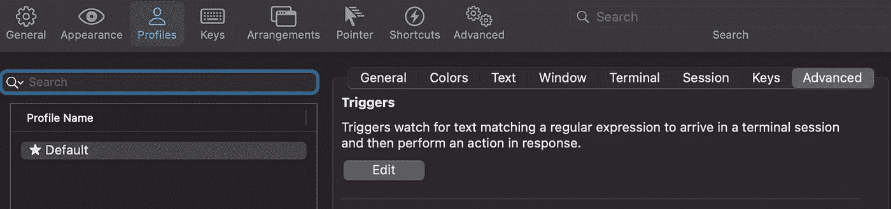
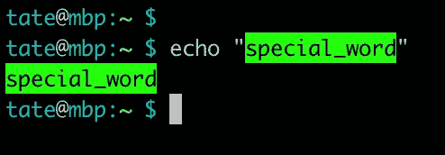

# 针对开发人员的重要 iTerm2 调整

> 原文：<https://levelup.gitconnected.com/essential-iterm2-tweaks-for-developers-216cd807ad7f>

Artem Sapegin 在 [Unsplash](https://unsplash.com/s/photos/coding?utm_source=unsplash&utm_medium=referral&utm_content=creditCopyText) 上拍摄的照片

如果你在 Mac 上构建任何类型的软件，那么你可能会使用 [iTerm2](https://iterm2.com/) 作为你的终端模拟器。iTerm2 取代了 macOS 上默认的“终端”应用。不再是那个丑陋的、被困在白色房间里的终端，而是一个时尚的、功能强大的终端模拟器。

iTerm2 是免费的，拥有巨大的社区支持和繁荣的插件生态系统。难怪它会成为 Mac 事实上的终端。iTerm2 的可扩展性是这么多人喜欢它的另一个原因。你可以调整任何你想要的设置来创造一个完全定制的体验。

我的默认 iTerm2 终端。

开箱即用的 iTerm2 非常棒。它运行良好，有一组可靠的默认选项，但是在它的内部，你可以做一些简单的事情来使它变得更好。在本文中，我们将探索一些非常简单明了的调整，您可以对一些默认 iTerm2 设置进行调整。让我们开始吧。

## 增加回卷线

如果您发现自己在处理大量的控制台输出，这是您可以做出的最重要的调整之一。如果您构建固件，检查大型日志文件或处理任何长格式输出，这是必不可少的。

你的终端的回滚就像它听起来的那样。这是你在终端输出中可以向后滚动的行数。默认值为 1，000 行。如果您想回到 1001 行之前查看一些关键输出，那么您就没有运气了，除非您更改它。幸运的是，改变它很容易。

默认配置文件中的终端设置。

如果您打开 iTerm2 的*首选项>配置文件*页面，并编辑您当前使用的配置文件(这可能是“默认”)您可以增加回滚。在*终端*部分，您可以将回滚线的数量调整到一个更大的数字，或者如果您想要全部，只需启用“无限制回滚”。

现在，你再也不用为丢失一些重要的控制台输出而自责了！

## 关闭铃声

铃声很烦人。没有人喜欢钟声。*关闭铃声*。

默认情况下，当你执行一个触发铃声的动作时(比如在一个空的提示符下按 backspace ),会发出一个恼人的声音。这在实践中比在纸面上听起来更令人讨厌。一开始可能不会困扰你，但相信我，最终会的。

“终端”标签的“通知”部分。

如果你想在按退格键发泄情绪的时候享受一点宁静，请前往你个人资料中的*终端*标签。在“通知”部分，你会看到一个“静音”选项。检查一下。

如果你想知道这个铃铛是怎么回事，[看看这个](https://en.wikipedia.org/wiki/Bell_character)。

## 当缓冲区被清空时重绘屏幕

你曾经弄坏过你的终端吗？收到一堆乱码输出？不小心调整了您的终端大小，破坏了正确的纵横比？现在在你的会话中有一堆坏掉的字符或者一些不会消失的遗留物。这个小场景可能会扭转乾坤。

大多数时候，您可以通过简单地向终端发出`*CTRL + L*`或`*COMMAND + K*`来解决难以控制的输出问题。这将清除内部缓冲区并清理您的控制台。有时候你真的可以打碎东西，但这并不总是奏效。为此，您可以尝试此设置。

高级设置>常规

如果你需要拿出大枪并启用这个设置，前往*首选项>高级*并向下滚动(或搜索)找到以下设置:

*   *选择清除缓冲菜单项后，重绘屏幕。*

如果你启用了这个设置，那么每当你发出`*COMMAND + K*` 来清空缓冲区，它就会立即调整终端窗口的大小。这将迫使终端的内容重新绘制，并能纠正错位或乱码输出。

请记住，这可能无法解决*每个问题*。如果您运行了严重影响您的 shell 会话的东西，这不会有多大帮助。

## 突出显示通常引用的输出

整天盯着一大堆日志输出可不好玩。如果您经常运行相同的作业，并最终搜索关键字或术语，那么添加突出显示触发器会有所帮助。如果你希望你可以自定义语法高亮显示一个任意的文件，你的愿望是*种*批准。

默认配置文件中的高级>触发器部分。

iTerm2 支持添加自定义触发器，这些触发器可以根据控制台中显示的文本执行各种操作。你可以启动脚本，打开文件，高亮显示文本等等。可以在*高级>触发器*部分将触发器添加到您的个人资料中。

添加高亮文本触发器。

上面，添加了一个高亮文本动作，并输入`special_word`作为要搜索的正则表达式。您可以自定义文本和背景颜色，并指定是在文本出现时立即高亮显示还是在返回后高亮显示。

触发器中突出显示的文本。

现在，任何时候你在终端输入`special_word`，它都会被高亮显示。这对于从复杂的输出中筛选出您真正想要的结果非常方便。

您也可以通过从工具栏中选择*会话>添加触发器…* 将触发器添加到当前终端会话中。

## 启用状态栏

下一个调整取决于您如何设置 shell。如果您已经有了一些其他的配置来处理 Git 分支显示，那么这可能不会引起您的兴趣，但是如果您希望将其中的一部分卸载到 iTerm2，那么请继续。

状态栏是 iTerm2 的新增功能。这允许您显示关于终端、存储库甚至整个操作系统的各种信息。该显示器位于 iTerm2 标题栏的正下方，可以提供大量快速信息。

iTerm2 中的状态栏布局。

上图是我当前的状态栏配置。上面有三个项目。我所在的目录的当前 Git 分支，CPU 使用率和内存使用率。CPU 和内存使用情况很好，但是 Git 分支更有帮助。它甚至向您显示您是否有未决的更改，这太棒了。

会话选项卡下的状态栏配置。

如果您想启用状态栏，只需进入您当前个人资料的*会话*选项卡，选中底部附近的复选框。您可以通过单击“配置状态栏”来调整显示的小部件。

确保添加了“Git State”小部件，以便获得分支状态。

查看 [iTerm2 文档](https://iterm2.com/documentation.html)了解更多可用特性的详细信息。

*感谢您抽出时间阅读本文。我希望这些小调整有助于改善您使用 iTerm2 的终端体验。如果你想把你的终端换成更有趣的东西，看看:* [*4 个终端模拟器来增加你的 Shell 体验*](/4-terminal-emulators-to-spice-up-your-shell-experience-1e9d9bb22b93) *。*