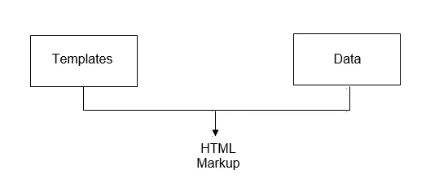

# JavaScript SEO 基本技巧

> 原文：<https://levelup.gitconnected.com/essential-javascript-seo-tips-62d47e1e0537>

## 使您的内容在 Google 搜索中可被发现

由[摄影](https://unsplash.com/@merakist?utm_source=medium&utm_medium=referral)在 [Unsplash](https://unsplash.com?utm_source=medium&utm_medium=referral)

如果你正在使用 JavaScript 构建一个网站或 web 应用程序，你应该采取一些基本步骤来确保你的内容能被搜索引擎发现。

让我们来看几个 SEO 技巧，帮助用户找到你的内容。

# 1.写描述性标题

你所有的页面都应该有一个描述性的、有用的标题，用一个简短的短语来描述页面的内容。这个标题应该在页面上的`<title>`标签中，最好是在`<h1>`标签中。

例如，在食谱页面上，避免使用通用标题，如“阿曼达的烹饪博客”。相反，每一页的标题中都应该有食谱的名字，这样就能清楚地知道页面的内容。

您还应该提供页面将包含的具体内容的描述。比如这个菜谱有什么特别之处或者有什么主要特点。这给了人们一些东西来帮助他们确定实现预期目标的最佳页面，并让谷歌了解如何将搜索与页面匹配。

标题和元标签

这两者都可以通过在标记中添加标题和元标签来实现。您可以通过右键单击->检查并搜索`//title`和`//meta`来查找这些标签。

搜索//标题

如果您没有在标记中看到所有的内容，您可能正在使用 JavaScript 在浏览器中呈现您的页面。这被称为**客户端渲染**，本质上不是问题。

翻译

**渲染**是用来自 API 或数据库的数据填充模板的过程。这可能发生在服务器端，也可能发生在客户端。当它发生在服务器上时，爬虫和你的用户立即获得 HTML 标记形式的所有内容。

在单页面应用程序中，服务器通常将模板和 Javascript 发送给客户端，然后 Javascript 从后端获取数据，并在数据到达时填充模板。

# **2。正确链接您的页面**

另一个重要的细节是允许 Googlebot 通过正确链接你的网页来抓取你的网页。确保包含有用的链接和文本，并在 href 属性中使用 HTML 锚标记和链接的目标 URL。

在 HTML 中链接页面

难道**不**依赖于其他 HTML 元素，如`div`或`span`或使用 Javascript 事件处理程序来实现这一点。爬虫不仅在寻找和跟踪这些伪链接上有困难，而且它们还会导致辅助(a11y)技术的问题。

链接是网络的一个重要特征，它帮助搜索引擎和用户找到并理解网页之间的关系。如果你使用 JavaScript 来增强单个页面之间的转换，使用普通 URL 的**历史 API** ，而不是基于`#`的路由技术。

基于散列的路由技术

使用哈希，也称为片段标识符，来区分不同的页面是一种爬虫可以忽略的黑客行为。

历史 API

另一方面，将 JavaScript history API 与普通 URL 结合使用，为相同的目的提供了一个干净的解决方案。

当使用 JavaScript 在客户端进行路由时，记得测试您的页面和服务器配置。

谷歌机器人将单独访问你的网页。因此，无论是服务人员还是 JavaScript 都不会被之前的访问所识别。

通过在一个新的匿名窗口中打开你的 URL 来测试用户会看到什么。该页面应该加载一个 HTTP 200 状态代码，所有预期的内容应该是可见的。

# 3.使用适当的语义 HTML 标记

正确使用语义 HTML 标记有助于用户更好地理解你的内容以及更快地浏览它。像屏幕阅读器和爬虫这样的辅助技术也依赖于内容的语义。

使用**标题**、**章节**和**段落**来概述内容的结构。使用带有标题**和替代文本**的 HTML 图像和视频标签来添加视觉效果。您有爬虫和辅助技术来找到这些内容并呈现给您的用户。

相比之下，如果您使用 JavaScript 动态生成标记，请确保您没有在初始标记中意外地阻塞 Googlebot。

第一轮索引不执行 JavaScript。在初始有效载荷中包含诸如 no index meta 标签这样的标记可以阻止 Googlebot 使用 JavaScript 运行第二阶段。

遵循这些步骤将有助于 Googlebot 更好地理解您的内容，并使您的内容在 Google 搜索中更容易被发现。