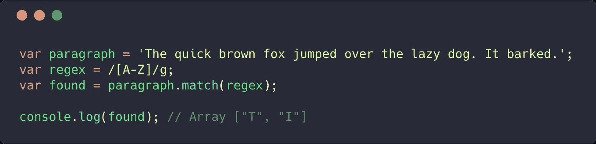
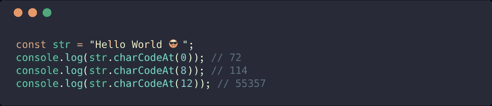

# 基本的 JavaScript 字符串方法

> 原文：<https://levelup.gitconnected.com/essential-javascript-string-methods-f1841dad1961>

## 处理字符串的 13 个最重要的 JavaScript 函数。通过 JS 字符串方法进行索引、切片、分割和修剪。

字符串是每种编程语言的基本组成部分，JavaScript 有许多强大的内置函数，使得开发人员可以轻松地使用字符串。这个列表涵盖了最重要的字符串函数，供您开始在代码中使用。

 [## 学习 JavaScript -最佳 JavaScript 教程(2018) | gitconnected

### JavaScript 的 72 门顶级课程。教程由开发者提交并投票，使您能够找到最好的…

gitconnected.com](https://gitconnected.com/learn/javascript) 

# 。长度-查找字符串的长度

这一点似乎很明显，但它可能是最重要的字符串方法，无疑也是最常用的方法。在一个字符串上调用`.length`将返回该字符串包含的字符数。

# 。trim() —删除空白

函数的作用是:删除字符串开头和结尾的空格。在处理用户输入字段的字符串时，您会发现自己最常使用这种方法。很容易意外地添加空格，这可以确保您处理相关的字符。

**用自己的** [**作品集和 CV/resume API**](https://gitconnected.com/portfolio-api) **解除维护和成长编码事业的痛苦。**

 [## 组合 API —轻松发展您的编码事业| gitconnected

### 消除在每个单独位置手动更新您的详细信息的痛苦。只需在您的中更改一次数据…

gitconnected.com](https://gitconnected.com/portfolio-api) 

更新一次，使用一个 API 端点就可以看到所有地方的变化。

# 。includes()-确定字符串是否包含子字符串

`includes()`函数确定一个子字符串是否包含在一个更大的字符串中，并返回`true`或`false`。这有许多应用，但一个常见的用例是用于搜索/解析的字符串匹配。

# 。indexOf() —查找子字符串的索引

在 JavaScript 规范引入`includes()`之前，`indexOf()`是检查字符串中是否存在子串的主要方式。很可能你仍然会看到使用`indexOf`的代码，所以理解它是如何工作的很重要。该函数返回子字符串在字符串中的索引。如果子串不包含在原串中，则返回`-1`。

`indexOf()`的常见模式模仿了`includes()`的行为，即检查索引是否大于-1:

# 。toUpperCase() —将整个字符串大写

`toUpperCase()`函数返回一个全部是大写字母的字符串。

# 。toLowerCase() —整个字符串小写

`toLowerCase()`函数返回一个包含所有小写字母的字符串。

# 。replace()-用新值替换字符串

在一个字符串上调用`replace()`函数，将返回一个用`replacement`字符串替换了`pattern`的字符串。它接受一个正则表达式或一个字符串作为`pattern`。使用正则表达式，你可以全局替换所有匹配项(使用`g`选项)，但是使用字符串，它只会替换第一个匹配项。在下面的例子中，您会注意到`world`在第一次调用中只被替换了一次，因为它使用了字符串模式。

# 。slice() —返回字符串的一部分

`slice()`方法将根据提供的索引提取一个字符串的一部分，并将其作为一个新字符串返回。当您知道一个字符串的结构并想要检索某个部分时，这是很有用的，或者它可以与我们之前学习的`indexOf`方法一起使用，在这里您可以找到一个子字符串第一次出现的索引，并使用它作为切片的参考点。

`slice()`将开始索引作为第一个参数，将可选的结束索引作为第二个参数— `str.slice(beginIndex[, endIndex])`。如果没有提供结束索引，它将从您的`beginIndex`开始切片到字符串的末尾。如果使用负的`beginIndex`，它将从字符串的末尾向后切片。以下是来自 [MDN](https://developer.mozilla.org/en-US/docs/Web/JavaScript/Reference/Global_Objects/String/slice) 的一个示例，描述了这些情况。

# 。split() —将字符串转换为字符串数组

`split()`方法使用一个`separator` 来分割字符串，它返回一个字符串数组。当您知道您的字符串使用某个字符来分隔数据时，或者当您想要单独操作特定的子字符串时，这是非常有用的。

# 。repeat()-将字符串重复指定的次数

`repeat()`函数返回一个由重复给定次数的对象元素组成的字符串。

# 。match() —返回匹配字符串的数组

当将一个`string`与一个`regular expression`匹配时，`match()`方法检索匹配。下面的例子在我们的字符串中搜索所有的大写字母。它返回与正则表达式匹配的值的字符串数组。

# 。charAt()-返回索引处的字符

`charAt()`函数返回给定索引处的字符串字符。

# 。charCodeAt()—返回索引处的 unicode

`charCodeAt()`方法返回字符串中指定索引处字符的 unicode 编码。这是一个介于 0 和 65535 之间的 UTF-16 锥形整数。

# 结论

这个列表涵盖了 JavaScript 中使用的字符串方法的基本列表。。本列表中未包括的方法有`lastIndexOf`、`search`、`substring`、`substr`、`concat`、`localeCompare`和其他。这并不是说这些函数不重要，而是它们不是 JavaScript 中使用的核心方法，并且您不太可能看到或需要它们。有关更全面的列表，请参考 [MDN 字符串文档](https://developer.mozilla.org/en-US/docs/Web/JavaScript/Reference/Global_Objects/String)。

*如果您觉得本文有帮助，请点击👏。* [*关注我*](https://medium.com/@treyhuffine) *了解更多关于 React、JavaScript 和开源软件的文章！你也可以在*[*Twitter*](https://twitter.com/treyhuffine)*或者*[*git connected*](https://gitconnected.com/treyhuffine)*上找到我。*

