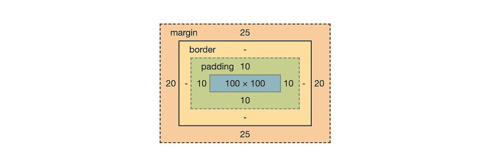
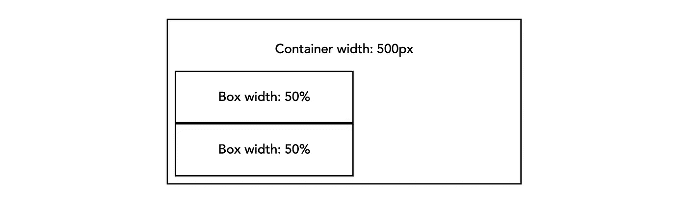
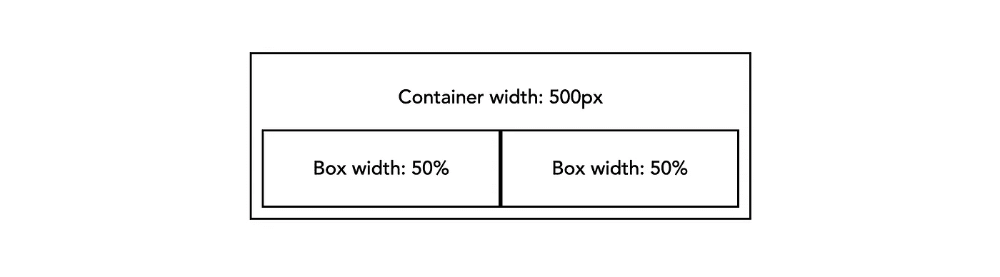
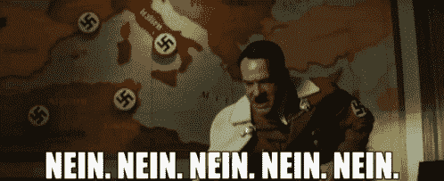
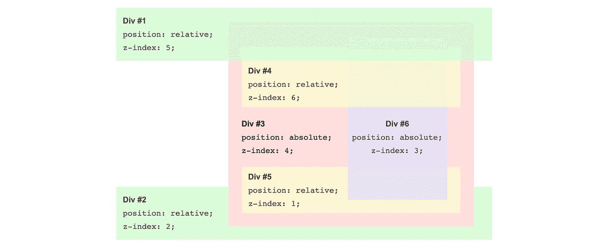

# 破解 CSS 的关键

> 原文：<https://levelup.gitconnected.com/essential-keys-to-crack-css-6f938bb9d4bf>

## 让你说:“啊啊啊……这就是原因！”。


[KOBU 机构](https://unsplash.com/@kobuagency?utm_source=unsplash&utm_medium=referral&utm_content=creditCopyText)在 [Unsplash](https://unsplash.com/s/photos/css?utm_source=unsplash&utm_medium=referral&utm_content=creditCopyText) 上拍摄的照片

# 一切都是一个盒子！

让我们从假设每个 HTML 元素在 DOM 中呈现时都被呈现为一个 ***框*** 开始。然后，你可以开始添加内容或一些风格，使它看起来更花哨。一开始，这是我们的盒子在浏览器中的实际外观:



***蓝色*** 矩形表示内容大小，它可以由 height 或 width 属性指定，也可以适合子项的大小。

***绿色*** 矩形是填充，它把盒子里包含的所有元素都往里推。内部间距。

***浅橙色的*** 矩形是盒子的边框。

***深橙色*** 矩形是外部边距，它将框周围的元素推得更远。

这 4 个维度组合在一起，就代表了我们的盒子所占据的物理空间:*高度/宽度+填充+边框+边距=实际空间。*不过，这个 CSS 盒子模型就没那么直观了。

让我举一个例子来说明这一点。想象一下这种情况:
在一个 500px 大的容器中，你有两个带填充和边框的盒子，你希望这两个盒子在父盒子中相邻。当你读到这些文字的时候，我打赌你在想:“*这很简单。我将只给他们两个宽度的 50%”。*

```
.container {
  width: 500px;
}.box {
  border: 1px solid;
  padding: 10px;
  width: 50%;
}
```

嗯，这将是结果:



原始 CSS 盒模型

是的。这是你可以开始说“这到底是怎么回事！?"。
如果你还记得，我们说过一个盒子的大小等于宽度(容器的 50%，所以 250px)，加上两边的填充(10px)和边框(1px)一共是 272px。因此，它们不能并排放在 500 像素的显示器上是有道理的。

## 介绍古怪的版本

不过有一个解决方案！信不信由你，它来自旧版的 ie 浏览器。在 [***【怪癖模式】***](https://developer.mozilla.org/en-US/docs/Web/HTML/Quirks_Mode_and_Standards_Mode) 中，盒子模型的物理空间是通过*高度/宽度+边距=实际空间来计算的。*因此，在社区的要求下，这个版本在 CSS3 标准中引入了属性*。通过将值 *"border-box"* 赋给该属性，填充和边框将应用于内部，使用我们上面提到的相同样式，结果如下:*

**

*框尺寸边界框*

*使用“ ***** ”选择器在每个元素上应用这个规则是很常见的:*

```
** {
  box-sizing: border-box;
}*
```

# *你必须记住的两条规则是*

*大多数开发人员与 CSS 的关系非常糟糕。他们说“为什么这条规则不管用！?"或者“该死的 div 没有去它应该去的地方！”或者更糟他们开始使用 ***！重要的*** 无处不在，并赋予像**‘99999’**到 ***z-index 这样的值。****

**

*“999999”*

*如果你是这些人中的一员，那么，一旦你知道了下面两条规则，你将停止这样做，你将开始享受编写 CSS。相信我！*

## *位置*

*position 属性定义元素在页面中的位置。
使用类似于“ *top”、“right”、“bottom”、“left”和“z-index”的属性，可以操纵元素的最终位置，但是它们只会影响 ***定位的元素*** (即具有除 ***【静态】*** 之外的任何值的元素)。以后请记住这一点！**

*可能的值有:*

*   ***【静态】**，默认值。该元素将与页面*的*正常* *流程** 一致。**
*   ***【相对】**。根据正常流程，元素相对于其静态位置，但受位置属性的影响。*
*   ***【绝对】**。我认为这个最有争议。每个人都使用它，因为他们认为它做他们想要的，但没有人真正知道它是如何工作的。具有此位置值的元素将从流中物理移除。要知道它现在的位置是*“相对于它的第一个* ***非静态*** *祖先”。*像口头禅一样重复！*
*   ***【固定】**。同样，元素将从页面流中删除，其位置将相对于视口(除了一些小的例外)。此外，固定元素不受滚动的影响。*

****** 元素按照它们在文档中声明的顺序从上到下出现在 DOM 中。这被认为是正常的*流*。*

## *显示*

*显示决定了一个元素相对于其他元素的行为。一旦你理解了不同的值是如何影响元素及其周围环境的，你就有了破解代码的钥匙。
在“显示”的情况下，我们不能说有唯一的默认值。这取决于我们使用的 HTML 标签，每个标签都有一个来自" *computed style"** (例如，div 是" block "，spans 是" inline ")的默认值。*

*可能的值有:*

*   ***《格挡》**。它强制执行垂直堆叠，display 属性设置为 block 的元素将占用所有可能的水平空间，在框的前后生成一个换行符。*
*   ***【内联】**。与“块”不同，它允许水平对齐。行内元素将一个接一个地显示，它们将忽略任何给定的宽度、高度和垂直边距。*
*   ***“内嵌块”**。前两者的混合。它允许水平对齐，我们仍然可以使用宽度和高度属性。*
*   ***【flex】**。它初始化 flexbox 布局系统。容器(display 设置为 flex 的元素)将控制其项目的流程。我们可以根据给出的选项排列物品并分配可用空间。*
*   ***【网格】**。它初始化网格布局，引入具有列和行的二维网格系统。基于一套规则，我们将能够创建“易于制作”的响应式布局。*

*在以后的文章中，我们将更深入地讨论“网格”和“flex”。*

*浏览器有一个用户代理样式表，它将一些内置样式应用到我们使用的 HTML 标签中。*

# *z 指数的奥秘*

*这可能是最容易被误解的规则。为了正确使用它，我们需要假设几个概念。首先，它的作用:*它控制* ***重叠*** 的元素的垂直堆叠顺序。这意味着它只对静态以外的位置起作用，否则，它们不能重叠。*

*要理解的第二个重要行为是嵌套很重要。每当我们将元素放入容器中，我们就开始一个全新的堆栈，类似于当你有段落和子段落时。我们可以将段落编号为 **1** 、 **2** 、**3**……1 的所有子段落将为 **1.1** 、 **1.2** 、 **1.3** 。同样的，你希望所有的元素都在第 2 段之前，如果你有一个元素在另一个元素里面，并且 z-index 等于 1，那么它将总是在其他元素的后面，这些元素在同一嵌套层次上有一个更大的数字。你应该问问自己: **1.9999…** 比 **2** 大吗？”。答案显然是“不”，那么元素为什么要在前面呢？*

*这里有一个直观的例子，其中黄色和蓝色的两个 div 是红色 div 的子 div，因此我们应该这样阅读它们的 *z 索引*:***4.1**， **4.3** ， **4.6** 。**

****

**这开始变得有意义了！？**

# **外卖食品**

**有时 CSS 似乎无法预测，但这只是理解规则如何相互关联的问题，这是通过掌握这门语言的几个原则来实现的，如果你不知道什么，就试试看会发生什么。我在 Codepen 上有一个名为“ [CSS 基础知识](https://codepen.io/collection/AxLbQo)的集合，每支笔处理不同的主题，在每个 CSS 文件的底部，我会一步一步地解释你需要做什么。你可以按照说明，看看每一个变化的后果。**

**如果你有任何问题或者只是想谈谈 CSS，请通过 Linkedin 联系我。**