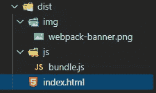

# Javascript 开发人员的基本工具:高级 Webpack 和 Babel

> 原文：<https://levelup.gitconnected.com/essential-tooling-for-javascript-developers-webpack-advanced-and-babel-d84245e1ff1a>


在这个系列中，我们将讨论和理解所有必要的工具，它们是任何 Javascript 开发人员生活中不可或缺的一部分。我们将学习工具和技术，如*命令行界面、NPM、Git 和 GitHub、Webpack 和 Babel、*等。同时了解它们各自的目的和需求。

# 该系列涵盖的主题

1.  [命令行界面。](https://medium.com/@alok.sharma61630/developers-best-friend-command-line-interface-bb841aea4b98?source=friends_link&sk=bea4ceb19c8bb188c85c4ee7ce096cf3)
2.  [NPM。](https://medium.com/swlh/essential-tooling-for-javascript-developers-npm-in-depth-d6dad74cbedc?source=friends_link&sk=49859b8b6bb216edd64e43f245f71861)
3.  Git 和 Github。
4.  网络包和巴别塔。

在我的上一篇文章【Javascript 开发人员必备工具:Webpack 深度中，我讨论了 Webpack 将对我们的源代码应用什么、为什么以及如何应用一些转换:


源代码

并将为我们提供最终优化的生产代码，即“dist”文件夹。



生产代码

我们讨论了公共 JS 模块、入口和输出点、加载器、插件等概念。如果你不知道这些概念，我推荐你去看看那篇文章，这样就很容易理解了。

在本文中，我们将学习和理解高级 Webpack 概念，以便我们最终优化的生产代码，即“dist”文件夹看起来像这样:


## 逐步进行高级 Webpack 配置:

高级 Webpack 配置

## 正在提取 CSS 文件

在我向您展示的上一篇文章中使用基本的 webpack 配置时，我们所有的应用程序样式都工作得很好，即使在‘dist’文件夹中没有样式文件。这仅仅是因为我们使用了——sass-loader、css-loader 和 style-loader 来处理我们的样式

```
rules: [ 
 { 
   test: /\.scss$/’,
   use: [‘style-loader’,’css-loader’, ‘sass-loader’]
 }
]
```

*   sass-loader——它利用 node-sass 包将 SASS 代码转换成等价的 CSS 代码
*   css-loader——它将 CSS 代码转换成等效的 Javascript 代码。
*   style-loader——通过将等效的 javascript 代码注入“bundle.js”中，将它们附加到 DOM 中。

正是因为有了样式加载器，我们的样式才被注入到“bundle.js”中，并且仍然有效。现在，如果我们想提取我们的 CSS 代码，单独在' dist '文件夹中，我们可以利用一个插件。

```
npm install mini-css-extract-plugin --save-dev 
```

## 配置迷你 css-extract-plugin

导入插件

```
const MiniCssExtractPlugin = require("mini-css-extract-plugin");
```

配置插件

```
module: {
 rules: [
  {
   test: /\.scss$/,
   use: [MiniCssExtractPlugin.loader, "css-loader", "sass-loader"],
  },
 ],
},
plugins: [
  new MiniCssExtractPlugin({
   filename: "styles/style.css"
  })
]
```

这里我们将使用 MiniCssExtractPlugin 提供给我们的“loader ”,而不是使用“style-loader”。

*   “mini-css-extract-plugin”会将我们所有的“css”代码提取到“style”文件夹中的“style.css”文件中(*如文件名中所指定，选择您想要的任何名称*
*   ' html-webpack-plugin' ( *在上一篇文章*中配置)将自动注入那个 CSS 文件，在' index.html '的' head '部分。


在头部注入 CSS

注意:如果您不想在“dist”文件夹中创建另一个“styles”文件夹，只需忽略将“styles”文件夹指定为

```
filename: "style.css"
```

现在你可能会想，如果我们的“CSS”代码即使不提取也能工作，那么提取它又有什么意义呢？

很简单，因为当我们不提取我们的“CSS”代码时，“样式加载器”就会开始工作，并将代码附加到“bundle.js”中。

*   在“html-webpack-plugin”的帮助下,“bundle.js”被注入到“index.html”中“body”的末尾。(*为上一篇文章*中讨论的 *)。*
*   如果“样式”出现在“index.html”中“正文”的底部，那么在渲染过程中，您可能会在网页上“反映样式”和加载“html”之间经历一点时间延迟。
*   如果你单独提取你的“CSS”代码，那么它们将在“头”部分注入，在“正文”之前，并且在加载“HTML”和“CSS”之间没有时间延迟。

## 方式

Webpack 在“开发”和“生产”模式下弹出不同大小的包。“开发”环境为我们提供了比“生产”捆绑包更大的捆绑包，因为在“开发”模式下执行的优化更少。

我们的“开发”包看起来像这样


index.html


style.css


bundle.js

另一方面，我们的“生产”包看起来类似于


index.html


style.css


bundle.js

束尺寸的比较


从上面的比较中可以看出，与“开发”包相比，“生产”包要小得多。

好处:更小的包意味着从服务器下载它们所需的时间更少，这反过来会提高我们应用程序的性能和效率。

为了使用不同的构建环境，我们需要指定“mode”属性。

```
mode: "development or production"
```

## 缩小 HTML、CSS 和 Javascript 包

虽然“生产”包的大小相对较小，但我们仍然可以使用某些插件进一步缩小和压缩它们。

*   为了配置这些插件，我们必须在配置文件中指定一个名为“优化”的新属性。
*   “优化”又包含一个名为“最小化器”的属性。
*   “最小化器”指的是我们想要使用的最小化器集合。

```
optimizations: {
   minimizers:[]
}
```

缩小 CSS 和资源(图像文件)

```
npm install optimize-css-assets-webpack-plugin --save-dev
```

导入插件

```
const OptimizeAssets = require("optimize-css-assets-webpack-plugin");
```

使用插件

```
optimization: {  
  minimizer: [new OptimizeAssets()], 
},
```

为了缩小 Javascript，我们不需要安装任何新的插件。Webpack 已经附带了“terser-webpack-plugin ”,默认情况下，它在“生产”模式下在幕后使用该插件。但是一旦我们指定了我们自己的“最小化器”，如上所述(*optimize-CSS-assets-web pack-plugin*)，这个“最小化器”属性就会被覆盖。为了让它再次工作，我们只需要导入并指定它。

导入插件

```
const TerserJSPlugin = require("terser-webpack-plugin");
```

使用插件

```
optimization: {  
  minimizer: [ new TerserJSPlugin(), new OptimizeAssets()], 
}
```

为了缩小 HTML，我们可以使用我们在上一篇文章中安装和配置的“html-webpack-plugin”

```
plugins: [
   new HtmlWebpackPlugin({   
    template: "index.html",   
    filename: "index.html"
   })
}
```

要缩小 HTML，我们需要在“minimizers”属性中指定“html-webpack-plugin ”,而不是“plugins”属性。

```
optimization: {
  minimizer: [
   new TerserJSPlugin(),
   new OptimizeAssets(),
   new HtmlWebpackPlugin({
       template: "index.html",
       filename: "index.html",
   },
  }),
]
```

现在，我们必须通过指定“minify”属性来扩展其配置，该属性可以包含以下规则

```
new HtmlWebpackPlugin({   
  template: "index.html",   
  filename: "index.html",   
  minify: {    
     collapseWhitespace: true,
     removeComments: true,
     removeRedundantAttributes: true,
     removeScriptTypeAttributes: true,
     removeStyleLinkTypeAttributes: true,
     useShortDoctype: true  
  }  
})
```

现在，Webpack 将压缩所有这些包，并弹出尺寸更小的新包。

束尺寸的比较


## 巴比伦式的城市

“巴别塔”是下一代“Javascript 编译器”。Babel 只是允许我们使用“ECMAScript”中引入的最新 Javascript 方法、特性和语法，而不用担心浏览器支持。

‘babel’只是将‘es next’代码( *ES6，ES7，ES8，ES9，ES10* )转换成 ES5 代码(*代码* *支持*跨所有浏览器)。

在配置 Babel 时，我们需要注意两个过程:

1.  蒸腾作用
2.  聚合填充。

“编译”和“填充”都是指将下一代 Javascript 转换成 ES5 代码的过程。

*   “Transpilation”只对存在于“ES5”中的功能有效。例如，在“ES6”中，有一种使用箭头函数编写函数表达式的新方法。因此,“箭头函数”将在后台转换为“函数表达式”。另一方面，
*   多填充指的是处理 ES5 中不存在的相对较新的特性。例如，在“ES5”中没有“类”这种东西。随着“ES6”的引入，类被添加到 Javascript 中。因此，幕后的“巴别塔”创建了一些逻辑来在我们的应用程序中实现这些相对较新的功能。

注意—“Babel”本身是一个独立的工具，不是“Webpack”的一部分，但它可以使用“babel-loader”与“Webpack”同步工作。

## 安装巴别塔—

```
npm install @babel/core @babel/cli @babel/preset-env babel-loader --save-dev
```

*   @babel/core —包含所有编译逻辑的包。
*   @babel/cli —允许我们在应用程序中使用 babel 的包。
*   @ babel/preset-env—‘presets’只是指‘babel’在幕后正常运行所需的一组插件。

例如*，i* 如果我们正在使用‘React’那么我们需要安装@babel/preset-react，如果我们正在使用‘Typescript’那么我们需要使用@babel/preset-typescript。因为我们没有使用任何库或框架,@babel/preset-env 会很好地工作。

*   babel-loader——根据配置实际执行与 Webpack 同步的转换的加载程序。

所有上面的包将照顾' Transpilation '过程。为了处理“聚合填充”,我们需要安装另外两个软件包——

```
npm install core-js regenerator-runtime --save
```

## 配置巴别塔

```
module: {
 rules: [
   { 
      test: /\.js$/,
      exclude: "node_modules",
      use: ["babel-loader"],
   }
 ]
}
```

上面的规则简单地说明了—所有那些以。js 扩展应由“babel-loader”处理，不包括“node_modules”文件夹中的 js 文件(*，因为不需要)*。

仅仅这样是不够的，因为“babel-loader”将会寻找一些关于如何处理这些 js 文件的配置。为了完全配置‘babel ’,我们需要创建一个新文件。babelrc 在我们项目的根级别。


正在配置。巴伯尔克

```
{
"presets": [
  [ "@babel/env", {
       "useBuiltIns": "usage",
       "corejs": "3",
       "targets": { 
        "browsers": ["last 5 versions", "ie >= 8"]
       } } ]
 ]
}
```

上面的配置告诉“babel-loader”使用“babel-preset-env”，core-js 版本 3，代码应该在所有浏览器的最后 5 个版本中受支持，在 internet explorer 上支持版本 8 以上。

## 拆分开发和生产配置

Webpack 允许我们为开发和生产环境创建不同的配置文件。为了将我们的“开发”和“生产”配置分开，不需要创建一个单独的“webpack.config.js”文件，只需为项目文件夹中的每个配置创建单独的新配置文件

*   webpack.dev.js' —用于“开发”配置。
*   webpack.prod.js' —用于“生产”配置。
*   webpack.common.js' —在上面两个文件中保持相同的配置，如条目、输出、“文件加载器”、“html 加载器”、“babel 加载器”等。

注意:这些是用于这种配置的标准名称，您可以随意选择您想要的名称。


新配置文件

在“开发”配置中，根本不需要提取、压缩或缩小文件，因为这需要相当多的时间。对于更快的开发构建，我们可以简单地省略这些步骤。所以我们最终的配置文件看起来会像这样(*确保阅读前面的注释*)

webpack.common.js

webpack.dev.js

webpack.prod.js

注意

*   我在“webpack.common.js”中安装并使用了一个名为“clean-webpack-plugin”的新插件。它只是确保在执行新的构建之前，首先清理“dist”文件夹。(*)否则，如果您之前已经执行了一个生产构建，那么即使在执行了开发构建之后，您也可能会找到提取的 CSS 文件。*)
*   其次，我已经在‘web pack . dev . js’和‘web pack . prod . js’中安装并使用了一个名为‘web pack-merge’的新包。它只是帮助将公共配置( *webpack.common.js* )与单独的“开发”和“生产”配置合并。

```
const merge = require("webpack-merge");
```

*   “合并”只是一个接收大量需要合并的配置的函数。我已经将两个文件中的通用配置导入为

```
const common = require(“./webpack.common”);
```

合并

```
module.exports = merge(common, {development or production config });
```

## 开发服务器

Webpack 还为我们提供了一个“开发服务器”,支持“实时重装”。要安装:

```
npm install webpack-dev-server --save-dev
```

# 运行 Webpack

在您的“package.json”中创建新的 npm 脚本，并将配置传递给它们


现在在终端中以 npm run dev ( *用于开发构建*)、npm run build ( *用于生产构建*)和 npm run start ( *用于实时服务器*)的身份运行这些脚本，看看 webpack 的神奇之处。

Webpack 和 Babel 到此为止！。如果你觉得这篇文章有帮助，请告诉我。敬请期待！