# Javascript 开发人员的基本工具:Webpack 深入。

> 原文：<https://levelup.gitconnected.com/essential-tooling-for-javascript-developers-webpack-in-depth-be77f8d4f66c>

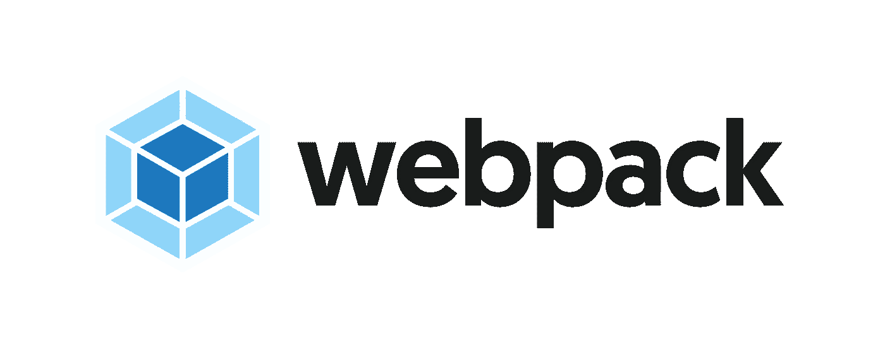

在这个系列中，我们将讨论和理解所有 Javascript 开发人员生活中不可或缺的重要工具。我们将学习工具和技术，如 ***命令行界面、NPM、Git 和 GitHub、Webpack 和 Babel、*** 等。同时了解他们每个人的目的和需求。

# 该系列涵盖的主题—

1.  [命令行界面。](https://medium.com/@alok.sharma61630/developers-best-friend-command-line-interface-bb841aea4b98?source=friends_link&sk=bea4ceb19c8bb188c85c4ee7ce096cf3)
2.  [NPM。](https://medium.com/swlh/essential-tooling-for-javascript-developers-npm-in-depth-d6dad74cbedc?source=friends_link&sk=49859b8b6bb216edd64e43f245f71861)
3.  Git 和 Github。
4.  **网络包和巴别塔。**

我将把 **webpack** 分成一个系列，因为它无法在一篇文章中涵盖。本文将涵盖 Webpack 的内容、原因和方式(*基础到中级*)。接下来的文章将带您了解高级的 Webpack 概念。

## **什么是 Webpack？**

> Webpack 是一个开源的 Javascript 模块/资产捆绑器。

## 开放源码

一个软件被称为**开源**如果它是**公共可访问的**，即用户可以使用、共享以及建议改进这样的软件。**示例** — *Node.js、Bootstrap、Webpack、Linux 等*

## 什么是模块捆绑器？

为了编写更多**可读**、**可扩展**，以及**可维护**的代码，我们作为开发人员利用'**架构 *'*** 和 ***'* 设计模式 *'*** 将我们的应用拆分成多个 **更小的组件**

**模块捆绑器**只是一个工具，由**分析不同**模块**和**之间的连接**将所有这些不同的**模块**捆绑在一起，形成每种类型的一个文件。**

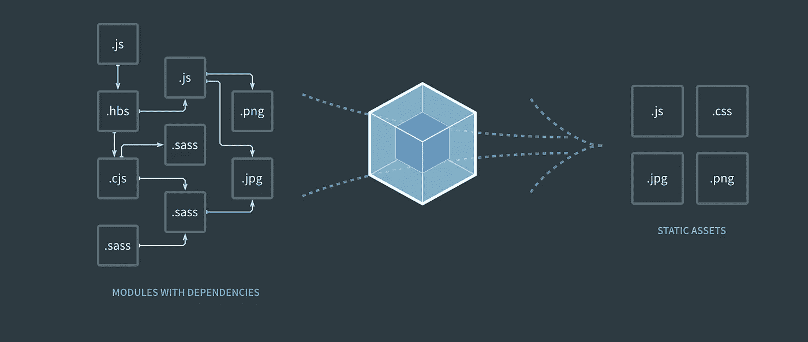

**网络包概述**

***Webpack*** 就是这样一个**模块捆绑器**。如上图所示，Webpack 采用了不同的模块*(文件如。scss，。js，。jpg，。png* )并将它们组合在一起，形成每种类型的单个文件(。js，。css 等)。它还执行各种优化，如**树抖动、平移、多填充、压缩、缩小、**等 ***。***

现在，为了理解 ***我们为什么需要 Webpack，*** 我们需要理解**开发**和**生产**代码的区别。

## 开发 Vs 生产？

***开发代码*** 就是开发者和程序员一起工作的代码。

*   在进行一个项目时，如果开发人员只使用一个有数千行代码的 **'style.css'** 或 **'index.js'** 文件，那么我们的代码将很容易变得**过度拥挤**和**难以管理**。
*   因此，根据项目的*大小*和*范围*，不同的设置用于将应用程序分割成更小的组件，这些组件组合在一起形成完整的应用程序。这使得我们的代码更加 ***可读，可伸缩，*** 和 ***易于管理。***

**例如** —本教程的开发项目结构即源代码( *src)* 看起来像是—

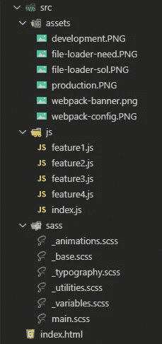

**开发设置**

如你所见有多个**。scss，。js** 文件出现在我们的源代码中。所有这些文件都是相互关联的。我已经把我所有的 **sass** **分部文件** ( *以 _* 开头的文件)导入到了' **main.scss'** 和我所有的。 **js** 文件如 **feature1** 、 **feature2** …等在****【index . js】中。index.js'** 看起来会像这样 **—****

**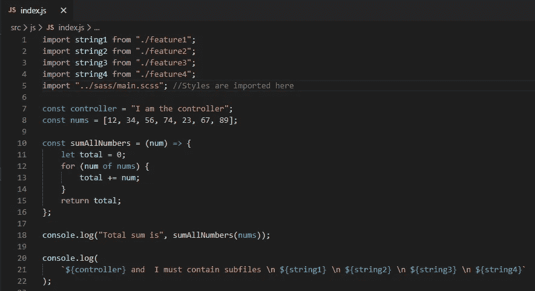**

****index.js****

*****生产代码*** 是指将在**服务器**上**运行**的最终代码，即用户将与之交互的代码。对于用户来说，代码库如何在幕后拆分和开发并不重要，因为他们不必处理代码，对他们来说重要的是应用程序是否工作以及效率是否太高。**

**因此，在使用**模块捆绑器**的帮助下，我们最终的生产设置将看起来像这样—**

**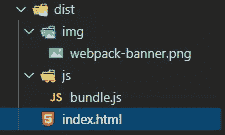**

**如您所见，在' **js'** 文件夹内的' **dist'** 文件夹中只有一个' **bundle.js'** 文件。此外，在' **dist'** '文件夹中没有样式文件，但是所有的样式都可以工作。(虽然我会告诉你，你也可以单独提取你的 **CSS** 文件。)**

****注—**表示**的“分配”。**这只是一个标准名称，用于**生产**代码。同样，如果我查看一下 **bundle.js** ，它看起来会是这样的——**

**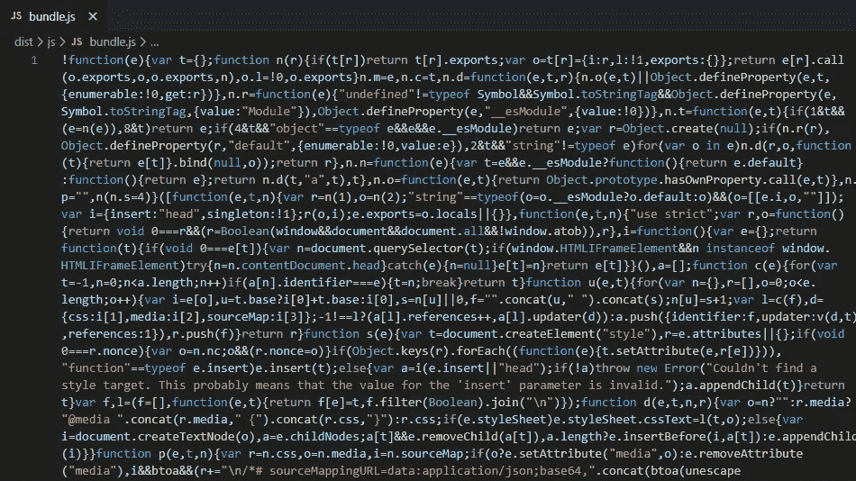**

****bundle.js****

**完成**胡言乱语**！！。但是所有这些代码都是有效的。由于**优化**的缘故，它看起来就像这样，所以最终的捆绑文件是**缩小、压缩的，**和**比**小。**

****结论—** Webpack 将对我们的源代码/开发代码(即**“src”**文件夹)进行一些转换，并将为我们提供最终优化的生产代码(即**“dist”**文件夹)。**

**为了了解**‘web pack’**是如何配置的，让我们创建一个项目**

## ****项目启动者—****

**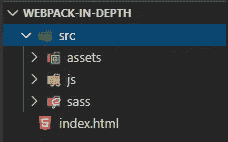**

****项目启动人****

**我已经创建了一个*项目文件夹*，命名为—**web pack-In-Depth**(*随便你选什么名字。*)**

*   **在根级别，它包含一个***index.html***文件和一个 ***src*** 文件夹。你甚至可以在你的 src 文件夹中使用 index.html，但我更喜欢这样使用。)**
*   *****src*** 文件夹进一步包含三个子文件夹——***资产*** *(所有图像)* ***、js、*** 和 ***sass*** 。**

## ****安装 Webpack —****

**要安装 ***Webpack*** 我们需要安装 2 个软件包。打开终端，写下命令—**

```
**npm install webpack webpack-cli --save-dev**
```

*   *****webpack —*** 包含所有**“web pack”**功能的软件包。**
*   ****webpack-cli —** 允许我们使用**“web pack”**功能的软件包。早先它是' **webpack'** 包本身的一部分，但随着 **'webpack4'** 的出现，它被分离到自己的包中。**

## ****配置 Webpack —****

**为了配置' **webpack'** ，我们需要在项目的根级别创建一个' **webpack.config.js'** 文件。**

**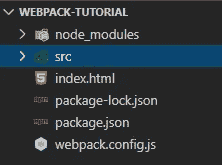**

****webpack.config.js****

**在***web pack . config . js***中，我们需要编写我们的项目配置并将其导出。**

## ****逐步配置 web pack—****

## **Webpack 使用常见的 Js 模块**

**Webpack 在幕后使用 ***Node.js*** 和 ***Node.js*** 使用 ***普通 js 模块*** 作为标准而不是 ***ES6 模块、*** 这就是为什么要导出配置我们需要使用 ***模块. exports*** 而不是**

```
**module.exports = {}**
```

## **进入**

*   **入口点是指**“web pack”**应该开始捆绑模块的起点，即**。**主 javascript 文件**‘index . js’**(在我的例子中是*)***

```
***entry: "./src/js/index.js"***
```

******注意—*** 如果您已经创建了不同的项目结构，请相应地选择路径。***

## ******输出******

*   *****输出**仅指最终**捆绑**文件应该出现的位置，即在**‘dist’**文件夹中。***
*   ***输出属性是一个 ***对象*** ，它进一步由属性 ***路径*** 和 ***文件名组成。******
*   ***path 是指最后一个**捆绑**文件的**绝对路径**。***
*   ***为了构造**绝对路径**，我们需要利用 **Node.js** 内置的' **path'** 包。***

*****导入路径包—*****

```
***const path = require("path");***
```

*****构建绝对路径—*****

```
***path: path.resolve(__dirnanme,"dist")***
```

*   *****path.resolve** 只是帮助我们将一个路径解析成一个**绝对路径。__dirname** 引用当前工作项目文件夹 **Webpack-In-Depth** (在我的例子中)。所以， **path.resolve(__dirname)** 会构造我们当前工作文件夹的绝对路径。***
*   ***在我当前的工作文件夹中，我希望我的最终**捆绑**文件出现在“**dist”**文件夹中。***
*   *****文件名**指最终捆绑文件的名称。**捆绑**。 **js** 是使用的标准名称。(*你可以选择任何你想要的名字****
*   ***我希望' **bundle.js'** 出现在 **dist** 文件夹内的 **'js'** 文件夹中，这就是为什么—***

```
***filename: "js/bundle.js"***
```

*   ***如果您不想在' **dist'** 内创建另一个' **js'** 文件夹，请仅用 **bundle.js** 替换**js/bundle . js**—***

```
***filename: "bundle.js"***
```

## *****装载机*****

***Webpack 是一个 javascript 模块捆绑器，但它仍然可以捆绑和处理其他类型的**模块**，如**。css，。scss，。jpg，。png、**等借助装载机。***

*   ***加载器只是在每个文件的基础上应用某种转换。***
*   ***要使用装载机，我们需要先安装它们。(*没有附带 webpack* )***
*   ***要配置加载程序，我们需要指定**模块**属性。***
*   *****模块**属性是一个**对象**，它进一步由**规则**数组组成。***
*   *****规则**数组包含如何处理特定类型文件的规则集。***

```
***module : { 
   rules: [] 
}***
```

*****处理风格(。css，。scss 文件)—** 为了处理样式，我们需要安装一些加载器—***

```
***npm install style-loader css-loader sass-loader node-sass --save-dev***
```

*   *****sass-loader** —它利用 **node-sass** 包将 sass 代码转换成等价的 CSS 代码***
*   ***css-loader —它将 css 代码转换成等价的 Javascript 代码。***
*   *****样式加载器** —将等效的 javascript 代码附加到 **DOM** 中。***

*****指定规则*****

```
***rules: [ 
 { 
   test: /\.scss$/',
   use: ['style-loader','css-loader', 'sass-loader']
 }
]***
```

*   *****测试**属性是一个**正则表达式。*****

*****注意——***你* *不需要学习* ***正则表达式*** *用装载机工作只要记住上面的模式就可以了。但是如果你想深入了解你可以查看我的文章**[***揭秘 RegEx***](https://medium.com/@alok.sharma61630/demystifying-regex-1-40fadf9db9d0?source=friends_link&sk=3e8fd2d6c809eafe862f6799426548f0) *。*****

*   ******use** 属性指定应该使用哪些加载程序来处理文件。如果我们想传递一些额外的配置，它不一定是一个数组，也可以是一个对象。)****

******上面的规则简单地说明了—** 所有以**结尾的文件。scss 扩展**应该由这些加载器处理— **样式加载器、css 加载器、sass 加载器******

******注意—** 确保顺序与从**右到左**的评估顺序相同。同样，如果你没有使用 **sass** 也不需要使用 **sass-loader** 简单地省略它。****

## ******插件******

*   ****插件允许我们对最终的捆绑文件进行转换，如**‘bundle . js’******
*   ****要使用插件，我们需要首先安装和导入它们。****

******html-webpack-plugin —** 它在“**dist”**文件夹中创建一个新的**index.html***文件，并会自动将我们的 **bundle.js** 注入其中。安装*****

```
*****npm install html-webpack-plugin --save-dev*****
```

*******导入—*******

```
*****const HtmlWebpackPlugin = require('html-webpack-plugin');*****
```

*******配置插件—** 我们需要使用 **new** 关键字创建并配置一个实例，该实例将被传递一个对象作为配置。*****

```
*****plugins: [** **new HtmlWebpackPlugin({** **filename: "index.html",** **template: "./index.html",** **}),****]*****
```

*   *******文件名** —指您要在**‘dist’**文件夹中创建的新 Html 文件的名称。(index.html 是标准的名字，你可以选择任何你想要的名字)。*****
*   *******模板—** 指的是要将内容复制到新建文件中的文件。*****

******所以上面的插件会** —在从**模板**文件中复制所有内容后，在“**dist”**文件夹中创建一个新的 **'index.html'** 文件，并将 **bundle.js** 文件注入其中。****

******注意—** 因为我的**index.html**文件存在于根级别，这就是为什么—****

```
****template: './index.html'****
```

****如果你的 index.html**文件夹**存在于 **src** 文件夹中，那么你需要再次创建一个**绝对路径**作为—****

```
****template: __dirname + './src/index.html'****
```

****但是只有这个设置不能正常工作，因为有一个主要问题**。******

## ********问题** —******

*   ******假设在我们的**index.html**文件中使用了一些图像。所有图像都需要一个 **src** 属性。并且**index.html**中的每个 **src** 属性的值是相对于**资产**文件夹来写的，就像—******

******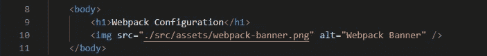******

********相对于资产文件夹的路径********

******但是由于 **html-webpack-plugin** 会在**‘dist’文件夹中新建一个**index.html**文件，**所以这个**路径**会对'**dist**' '**index . html '**无效，因为' **dist'** 文件夹中没有' **src'** 文件夹。所以为了使这些路径**动态**我们需要利用一些**装载器。********

******处理图像文件(。svg，。jpg，。png，。gif) —** 为了处理图像，我们需要使用 **html 加载器**和**文件加载器**。****

```
******npm install html-loader file-loader --save-dev******
```

******配置 html 和文件加载器—******

```
******{ test: /\.html$/, use: ["html-loader"] },****{** **test: /\.(svg|png|jpg|gif)$/,** **use: {** **loader: "file-loader",** **options: {** **name: "[name].[ext]",** **outputPath: "img",** **},** **},****},******
```

******文件加载器规则**简单地陈述了**——所有那些以**结尾的文件。svg，。jpg。png，。gif** 扩展名应该由**文件加载器**处理。******

*   ********文件加载器**会将**‘src’**中的【T66’‘index . html’中遇到的所有图像文件复制到**‘dist’**文件夹**中。********
*   ******对于上面的例子——它将把**webpack-banner.png**文件从**资产**文件夹复制到一个“**img”**文件夹中作为**webpack-banner.png(【名称】)。[ext])** 在' **dist'** 文件夹内。******

********“html-loader”**将自动确定其绝对路径，并将其注入到新创建的“**index . html”**的“**dist”**文件夹中。所以最终的 index.html 文件将会是这样的—******

******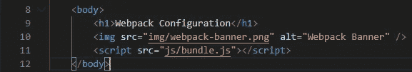******

## ********运行 Webpack********

******只需在您的 **'package.json'** 中创建新的 npm 脚本，并将' **webpack config.js** 作为配置传递给它。******

******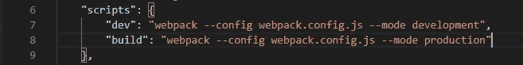******

********npm 脚本********

******— **模式开发** —开发包相对较大，但优化很少。******

******— **生产模式** —生产捆绑包非常小，经过各种优化。******

******只需在终端中以 **npm run build** 或 **npm run dev** 的身份运行这些脚本，就能看到 **webpack 的**魔力。******

******本文到此为止。其他高级 Webpack 概念将在后续文章中讨论。如果你觉得这篇文章有帮助，请告诉我。敬请期待！！！******