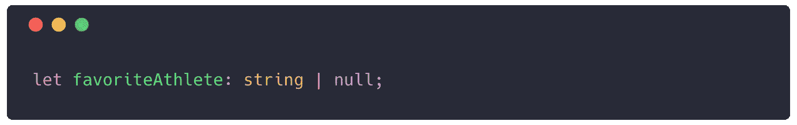

# 初学者的基本打字稿类型

> 原文：<https://levelup.gitconnected.com/essential-typescript-types-get-started-with-typescript-5e20a5106c90>

TypeScript 提供了向 JavaScript 代码添加类型化变量的能力。本文将介绍对于任何 TypeScript 开发人员来说都是必不可少的核心类型，并提供开始使用这种语言的起点。

要开始使用 TypeScript，您必须安装编译器，这可以通过 npm 完成。如果您想获得更深入的安装和开始使用 TypeScript 的指南，请阅读本文。确保你总是在一个`.ts`文件中工作，并使用`tsc`编译你的代码。

 [## 学习 TypeScript -最佳 TypeScript 教程(2019) | gitconnected

### 前 18 名打字稿教程。课程由开发者提交并投票，使您能够找到最好的…

gitconnected.com](https://gitconnected.com/learn/typescript) 

# 原始类型

TypeScript 提供了覆盖 JavaScript 原始值的类型:`string`、`number`、`boolean`。

要声明变量类型，只需在变量类型后面的声明旁边添加冒号`:`。

TypeScript 还能够根据第一个变量声明推断类型，因此在前面的实例中，TypeScript 实际上并不需要类型来正确标识变量。

悬停时推断类型的 VS 代码

声明类型的一个用例是函数定义。定义参数，以便函数总是被正确调用。

TypeScript 有非常清晰的语法来处理数组。您定义数组中的值的类型，后跟大括号`[]`。

# 作为接口的对象

对象是 JavaScript 关键特征的核心。它们是使用`key/value`对定义数据集合的一种方式。TypeScript 允许您通过使用接口定义来定义对象上的数据。

请注意，该语法看起来类似于 JavaScript 中的对象语法。名字前面有`interface`这个词。名称本身通常是大写的，括号前没有`=`。这些行以`;`结束，而不是逗号`,`。

当在一个接口上定义一个函数时，定义参数的类型和返回值的类型。在这种情况下，它接受一个参数`number`，然后返回一个`number`。

要定义一个对象数组，语法与用基本类型定义它是一样的。您使用接口名称后跟大括号。下面是一组`Product`对象。

虽然扩展接口的概念更高级，但我将在这里介绍，以便让大家熟悉。有些情况下，您希望创建一个基接口，然后让其他接口继承它。例如，我们之前创建了一个`Product`接口，它定义了属于一个产品的基本值。我们现在可以创建专门化的产品，这些产品将接收原始产品的所有属性以及在接口上定义的新属性。这是使用单词`extends`完成的。

我们的`Computer`接口包含了与`Product`相关的所有属性以及它自己独特的属性。通过扩展接口，您能够减少代码重复并创建逻辑基础案例。

# 空、未定义和联合

TypeScript 为`null`和`undefined`提供了内置类型，它们是通过使用它们的名字来定义的。

就其本身而言，这并不太有用。但是，您可以通过使用由`|`指示的`union`来组合 TypeScript 中的类型。

在这种情况下，`favoriteAthlete`可以是`string`也可以是`null`。可能不是所有人都关心体育:)

由于`undefined`值在对象中很常见，所以有一个特殊的语法来表示`key/value`是可选的(意味着如果不添加，它将是未定义的)。这是通过在键名旁边添加一个`?`来实现的。

# 特殊打字稿类型

TypeScript 添加了 JavaScript 不具备的类型，但允许您编写更健壮的代码。值得注意的是，这些代码仍然可以编译成本地 JavaScript 代码，但是为了提高可用性，它们被添加到了 TypeScript 中。

**枚举:**在 TypeScript 中创建命名映射

它可以使用任何值，并且不会抛出一个类型错误。`any`应该只在值真的可以是任何值或者它是未知的时候使用，并且你准备在你的代码中处理它。

**Void:** `void`与`any`相反——值根本没有类型。Void 最常用于不返回的函数。

# 包裹

如果你能学会这些基本的类型脚本，你就能很好地使用这种语言。事实上，这些可能会覆盖您日常编码中至少 80%的用例，您现在应该能够开始使用 TypeScript 了。当你觉得准备好了，看看更多的[高级打字稿示例](/advanced-typescript-types-with-examples-1d144e4eda9e)。

*如果您觉得本文有帮助，请点击👏。* [*关注我*](https://medium.com/@treyhuffine) *了解更多关于 React、JavaScript 和开源软件的文章！也可以在*[*Twitter*](https://twitter.com/treyhuffine)*或者*[*git connected*](https://gitconnected.com/treyhuffine)*上找到我。*

 [## 组合 API -轻松发展您的编码事业| gitconnected

### 消除在每个单独位置手动更新您的详细信息的痛苦。只需在您的中更改一次数据…

gitconnected.com](https://gitconnected.com/portfolio-api)