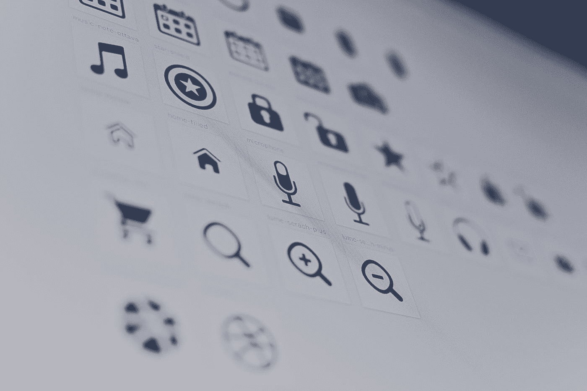
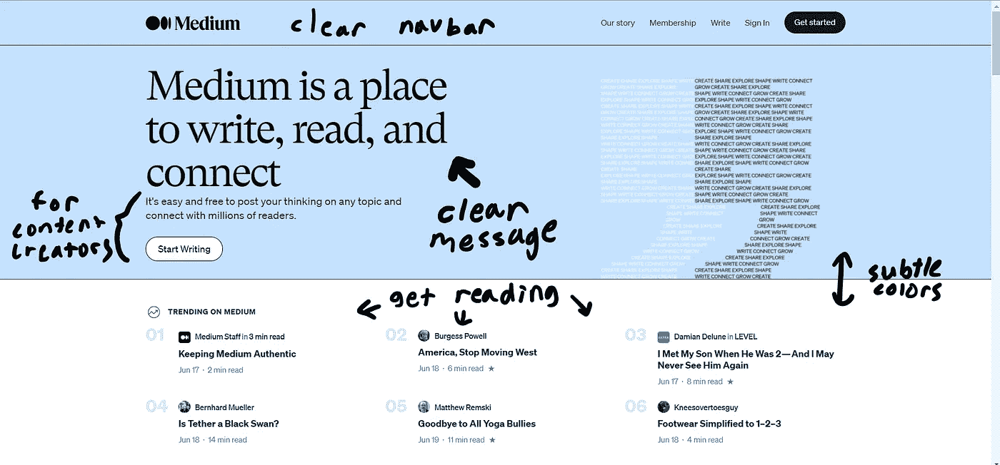
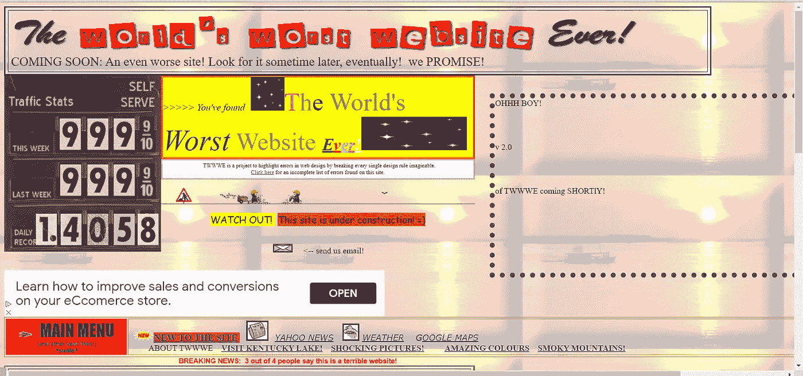
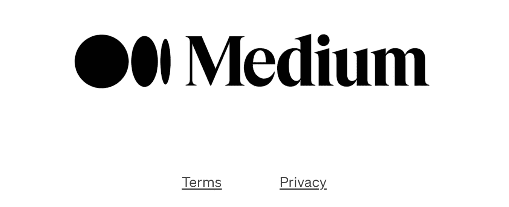
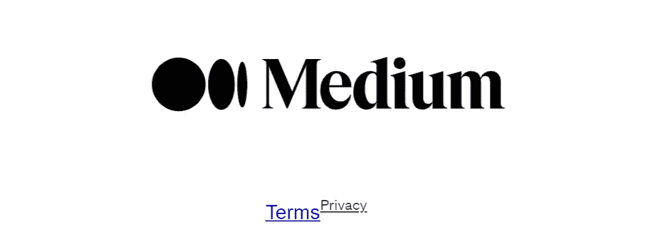
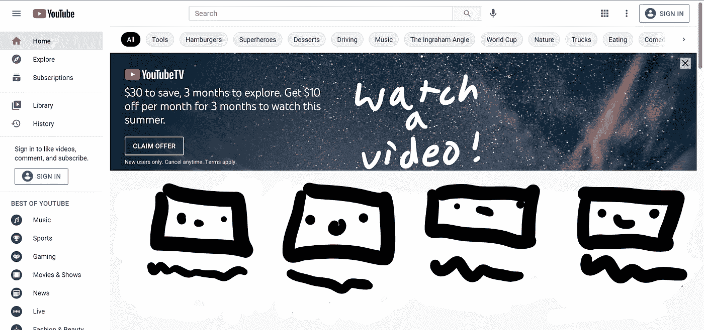

# 必不可少的 UI 设计技巧！

> 原文：<https://levelup.gitconnected.com/essential-ui-design-tips-e872689150ee>

## 吸引你的用户

哈帕尔·辛格在 [Unsplash](https://unsplash.com?utm_source=medium&utm_medium=referral) 上的照片

设计是令人困惑的，在你的后端摸索之后，这是你最不想担心的事情。这里有 3 个提示，可以给你的用户最好的体验！

# 1.保持简单！

没有人喜欢过饱和的界面，你的设计应该清晰地定义自己。

一个很好的例子是 Medium.com 的主页。

这很好，因为:

*   Navbar 使浏览网站变得很容易。
*   Navbar 清晰简洁。没有多余的！
*   一致的字体
*   清除消息。
*   微妙的颜色。
*   对读者和作者都有意义。

我已经在下面的图片上标注了！

媒体首页|来源:【Medium.com 

一个糟糕的网站是世界上最糟糕的网站！。

我认为原因很明显:

全球最差网站|来源:[全球最差网站](https://www.theworldsworstwebsiteever.com/)

# 2.把它隔开！

捆绑在一起的用户界面是一种无组织的用户界面。保持有条理。

我肯定你喜欢这个:

中型页脚|来源:[Medium.com](https://www.medium.com)

不止于此:

编辑中页脚|来源:[Medium.com](https://www.medium.com)

# 了解你的用户

你的项目应该针对特定的受众。他们想先做什么？

Youtube 想让你看一个视频，所以他们的主屏幕马上就有视频了！

Youtube 主屏幕|来源: [Youtube](https://www.youtube.com/)

# 结论

谢谢！

我希望你喜欢读这篇文章，并且你学到了新的东西！如果你有任何问题，建议，或一般的反馈，请随时在评论中提出来！

编码快乐！