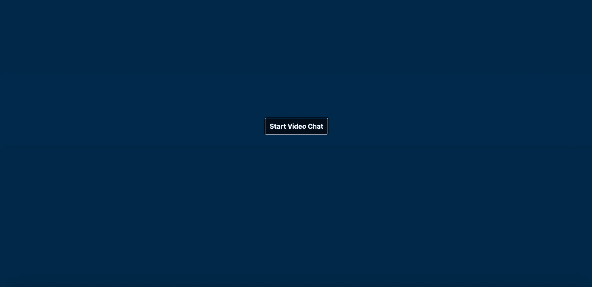
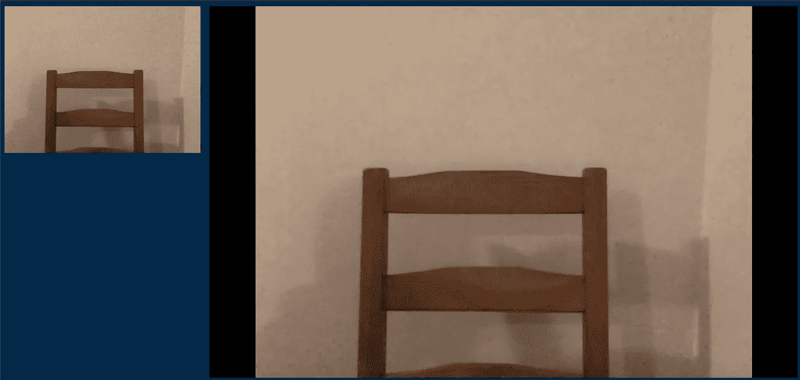
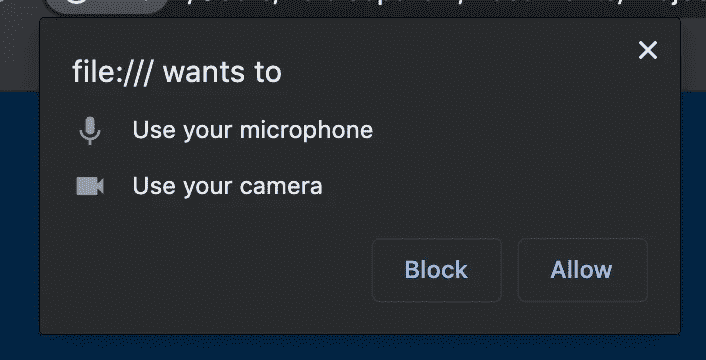

# 建立 WebRTC 连接:使用 WebRTC 进行视频通话步骤 3

> 原文：<https://levelup.gitconnected.com/establishing-the-webrtc-connection-videochat-with-javascript-step-3-48d4ae0e9ea4>


约翰·巴克利在 [Unsplash](https://unsplash.com/s/photos/connection?utm_source=unsplash&utm_medium=referral&utm_content=creditCopyText) 上拍摄的照片

WebRTC (Web 实时通信)是一个开源项目，允许您在浏览器之间创建对等连接。这种连接可以用于不同的目的，一个主要的目的是高质量和高性能的视频通话。本文是我们使用 WebRTC 创建这种视频聊天的系列文章的第三篇。你可以在那里找到前两篇文章:

*   [第一步:来自网络摄像头和麦克风的数据流](/data-stream-from-your-webcam-and-microphone-videochat-with-javascript-step-1-29895b70808b)
*   [第二步:通过 WebSocket 建立连接](/set-up-a-connection-over-websocket-videochat-with-javascript-step-2-f78c307c4fd3)

在第一篇文章中，我们在浏览器中访问了来自用户网络摄像头和麦克风的视频和音频流。第二，我们通过 WebSocket 实现了两个客户端的通信。我们将把这个例子用于信令过程。

在本文中，我们将实际开始视频聊天。

# 信令服务器

为了建立对等连接，对等体首先必须交换它们想要共享的媒体类型，告诉彼此它们何时想要开始或停止通信，并且它们必须在网络中找到彼此。这是信号传递过程。

信号不是 WebRTC 规范的一部分。这意味着您必须自己负责交换建立和控制连接所需的消息。这也意味着你可以自由地使用任何你想要的交流机制。理论上你可以使用电子邮件，但是一个合理的解决方案是使用 WebSocket。这就是为什么我们在前一篇文章中构建了一个 WebSocket 服务器，现在我们将对其进行一些调整以适应信号传输。

信令机制不需要知道任何关于正在交换的消息的信息。我们简化了之前创建的 WebSocket 服务器。要获得在 Node 上运行的帮助，请阅读本文。

我们跟踪所有连接的客户。当客户端发送消息时，该消息被广播给每个人。这不是最终版本，但足以建立 WebRTC 连接。在下一篇文章中，我们将对其进行改进，允许用户找到他们想要聊天的人，并且只与她交流。

# 连接提议和回答

必须通过信令机制交换三种类型的消息:

*   媒体数据:您想要共享哪种类型的媒体(仅音频或视频)，有哪些限制(例如质量)。
*   会话控制数据:打开和关闭通信。
*   网络数据:用户需要获得彼此的 IP 地址和端口，并检查他们是否可以建立对等连接。

假设我们的用户叫做 Alice 和 Bob。Alice 必须首先创建连接提议并将其发送给 Bob:

## 提供

1.如果还没有使用 Bob 的通信通道，Alice 应该加入一个(我们使用运行在端口 1337 上的 WebSocket 服务器)。

```
const signaling = new WebSocket('ws://127.0.0.1:1337');
```

2.Alice 在她的浏览器中创建了一个 [RTCPeerConnection](https://developer.mozilla.org/en-US/docs/Web/API/RTCPeerConnection) 对象。它是一个 JavaScript 接口，是 WebRTC API 的一部分，表示本地浏览器和远程对等点之间的连接。

```
const peerConnection = new RTCPeerConnection({
  iceServers: [{ urls: 'stun:stun.test.com:19000' }],
});
```

传递给构造函数的参数包含 ICE 代理所需的服务器 URL。更多关于这个稍后或[这里](/webrtc-the-ice-framework-stun-and-turn-servers-10b2972483bb)。

3.Alice 将她想要通过连接共享的音轨(音频和视频)添加到她的 RTCPeerConnection 对象中。

```
const stream = await navigator.mediaDevices.getUserMedia({
  audio: true,
  video: true,
});stream.getTracks().forEach(track => peerConnection.addTrack(
  track,
  stream,
));
```

4.爱丽丝创造了一个 [SDP](https://en.wikipedia.org/wiki/Session_Description_Protocol) 要约。SDP 代表会话描述协议。

```
const offer = await peerConnection.createOffer();
```

它是用于描述通信参数的格式。它包含媒体描述和网络信息，看起来像这样。

```
 v=0
   o=alice 123456789 123456789 IN IP4 some-host.com
   s=-
   c=IN IP4 some-host.com
   t=0 0
   m=audio 49170 RTP/AVP 0
   a=rtpmap:0 PCMU/8000
   m=audio 49170 RTP/AVP 31
   a=rtpmap:31 H261/90000
   m=audio 49170 RTP/AVP 32
   a=rtpmap:32 MPV/90000
```

5.Alice 通过调用 *setLocalDescription()将连接的本地描述设置为这个 SDP。*

```
await peerConnection.setLocalDescription(offer);
```

6.Alice 通过信令服务器将这个提议发送给 Bob。

```
signaling.send(JSON.stringify({
  message_type: MESSAGE_TYPE.SDP,
  content: offer,
}));
```

## 回答

Bob 还必须连接到信令服务器，并且必须已经创建了 RTCPeerConnection 对象。在 Alice 向 Bob 发送报价后，Bob 必须执行以下操作:

1.Bob 接收到 Alice 的提议，并将其设置为调用 *setRemoteDescription()* 的 RTCPeerConnection 对象中的远程描述。

```
await peerConnection.setRemoteDescription(offerFromAlice);
```

2.Bob 创建了一个 SDP 答案，其中包含与 Alice 发送的 SDP 报价相同的信息。

```
const answer = await peerConnection.createAnswer();
```

3.Bob 通过调用 *setLocalDescription()将连接的本地描述设置为这个 SDP。*

```
await peerConnection.setLocalDescription(answerFromBob);
```

4.Bob 通过信令机制将这个答案发送给 Alice。

```
signaling.send(JSON.stringify({
  message_type: MESSAGE_TYPE.SDP,
  content: answerFromBob,
}));
```

我们现在回到爱丽丝。她接收 Bob 的回答，并在调用 *setRemoteDescription()* 的 RTCPeerConnection 对象中将其设置为远程描述。

```
await peerConnection.setRemoteDescription(answerFromBob);
```

Alice 和 Bob 现在已经交换了媒体数据，并通知对方他们想要开始视频聊天。如果可能的话，他们现在必须共享网络信息以建立直接连接。这并不像听起来那么简单，但幸运的是 ICE 框架正在为我们做这件事。

# ICE 候选人

由于历史上 IP 地址的缺乏(只有大约 40 亿个 IPv4 地址可用)，用户通常隐藏在 NAT(网络地址转换)网关之后。ICE(交互式连接建立)框架允许对等体发现并传送其公共 IP 地址。这多亏了 STUN 服务器，我们在 RTCPeerConnection 对象中给定了 URL 作为参数。由于对等体的网络配置，直接连接可能是不可能的，在这种情况下，连接将必须通过中继服务器或 TURN 服务器进行。服务器也必须作为参数提供给 RTCPeerConnection。

```
const peerConnection = new RTCPeerConnection({
  iceServers: [
    { urls: 'stun:stun.test.com:19000' },
    { urls: 'turn:turn:19001' },
  ],
});
```

ICE 代理为我们负责这种探索和决策，检查直接连接的可能性，如果不能，则通过 TURN 服务器(如果已提供)建立连接。

Alice 和 Bob 只需监听 RTCPeerConnection 的事件 *icecandidate* 。每次发现候选冰时都会触发该事件。然后他们应该把他们的候选人发给对方。

```
peerConnection.onicecandidate = (iceEvent) => {
  signaling.send(JSON.stringify({
    message_type: MESSAGE_TYPE.CANDIDATE,
    content: iceEvent.candidate,
  }));
};
```

当接收到对方的候选时，Alice 和 Bob 应该将其传递给他们的 RTCPeerConnection 对象的 ice 代理。

```
await peerConnection.addIceCandidate(content);
```

ICE 代理将负责协商并完成连接。如果你想知道更多关于 NATs 和 ICE 的细节，你可以看看[这篇文章](/webrtc-the-ice-framework-stun-and-turn-servers-10b2972483bb)。

建立连接后，磁道数据开始通过连接进行交换。您可以实现 *ontrack* 事件处理程序来显示它们:

```
peerConnection.ontrack = (event) => {
  const video = document.getElementById('remote-view');
  if (!video.srcObject) {
    video.srcObject = event.streams[0];
  }
};
```

# 客户代码

我们的页面首先看起来像这样:



点击开始按钮后，你会在左上角看到你自己，但是在连接建立之前你看不到你的联系人。一旦成功，你们就可以聊天了。



在客户端应用程序的文件夹中，创建一个*index.html*和一个 *styles.css* 文件，然后复制这段代码。

您还需要一个用于 JavaScript 的 *index.js* 。这是最后的 *index.js* 文件:

首先，我们定义用户可能会收到的消息类型。第一个是“SDP”，用于提供和回答。第二个“候选人”是为 ICE 候选人准备的。

在点击开始页面按钮时，我们想要开始聊天，这就是我们正在做的第 9 行到第 13 行。

现在让我们看看 *startChat* 函数。我们首先从摄像机和麦克风请求数据。这应该会触发来自浏览器的访问请求，您必须接受该请求，然后才能继续:



一旦你接受了，我们显示聊天室，显示视频元素和隐藏开始按钮。我们建立到 WebSocket 服务器的连接(第 20 行)，并将这个连接称为*信令*。我们在 *createPeerConnection* 函数中创建 RTCPeerConnection 对象。它给出了一个 STUN 服务器作为参数(这是一个假的，你可以用一个公共的 STUN 服务器来代替它)，并定义了我们讨论过的两个事件处理程序: *onicecandidate* 将把 ICE 候选发送给对等体，以及 *ontrack* 将接收到的音轨设置为我们的视频 HTML 元素。它有一个额外的事件处理程序，实际上是一个非常重要的事件处理程序:*onnegationneedd*。当我们向连接添加跟踪时，以及稍后发生需要重新协商的情况时，将触发此事件。正是在这里，信令交换将真正开始。

回到 *startChat* 函数，在创建了 RTCPeerConnection 对象之后，我们在 *addMessageHandler* 函数*中定义了接收消息时要做什么。*如果我们收到一个候选人，我们会像前面描述的那样将其交给 ICE 代理。如果我们收到一个提议，我们设置远程描述，创建一个答案，将答案保存为本地描述，并将其发送给对等方。当我们收到一个答案时，我们只需将其设置为本地报价。

然后，我们将本地轨道设置为 RTCPeerConnection 对象，并在视频元素中显示它们。在对等连接对象上设置轨道将触发*negogationneedd*事件，事件监听器将调用 *createAndSendOffer* 函数。

启动 WebSocket 服务器，并在两个不同的选项卡中打开客户端。在两个页面点击“开始”后，你应该可以和自己交流了。

多亏了 WebRTC，我们现在已经建立了一个连接。我们的解决方案仍然不是最佳的。我们处理了信令过程，但是目前还没有办法允许两个给定的用户，只有他们，进行通信。前两个用户点击按钮就建立了连接。在下一篇文章中，我们将通过调整我们的信令服务器来解决这个问题。