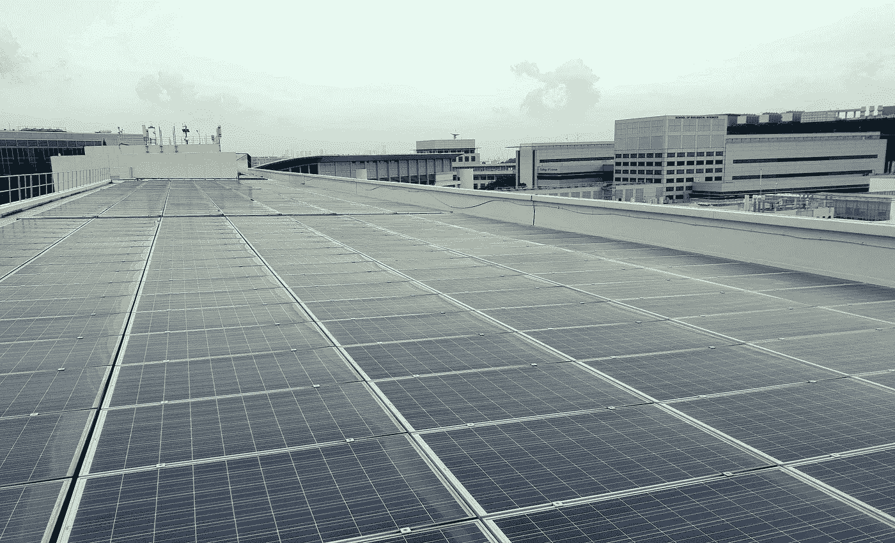
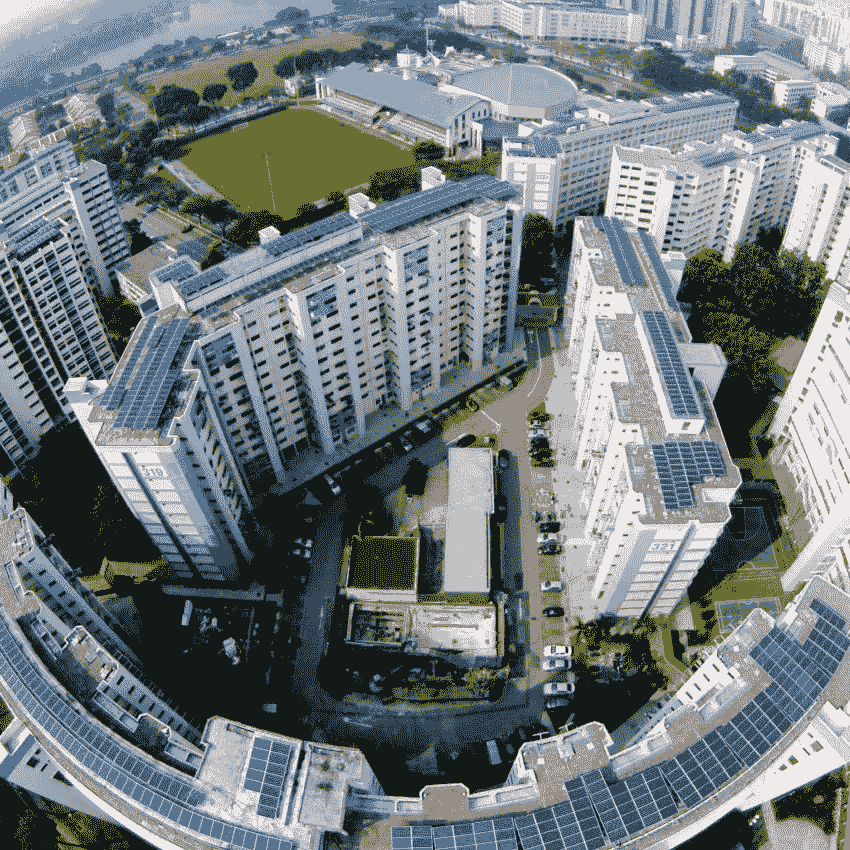
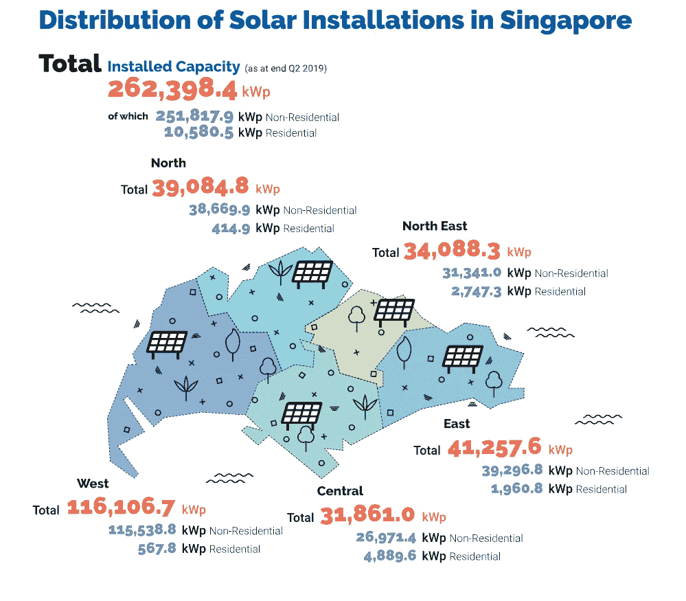
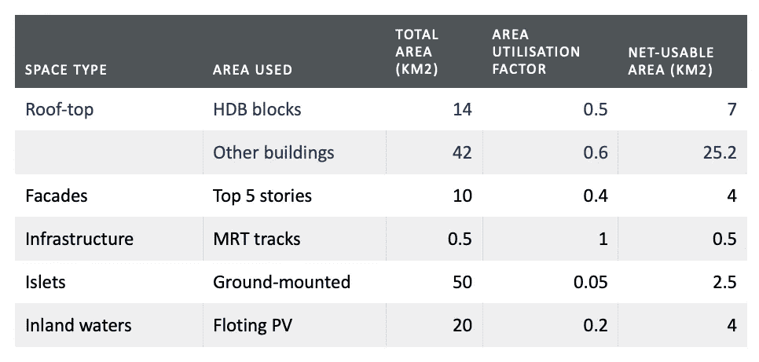
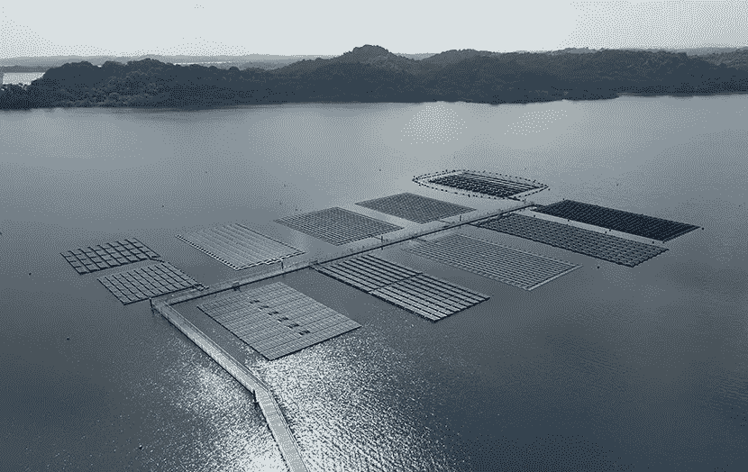
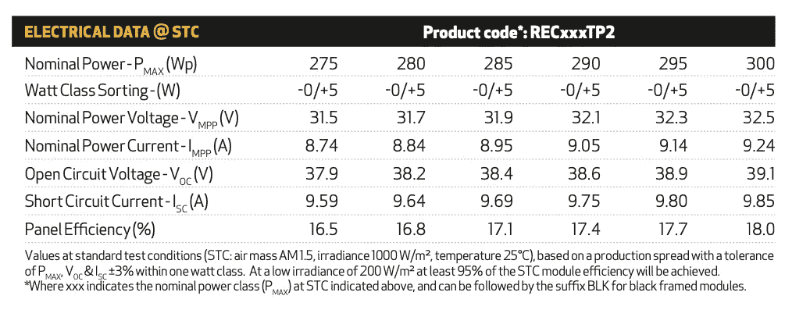
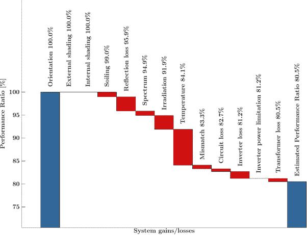
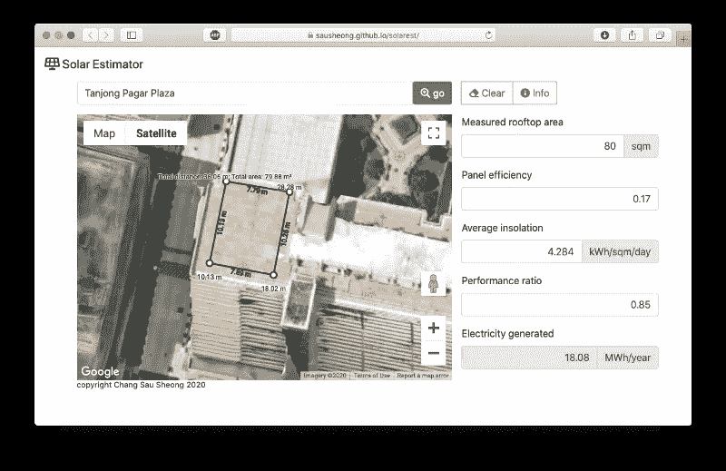

# 用谷歌地图估计你屋顶的太阳能输出

> 原文：<https://levelup.gitconnected.com/estimate-the-solar-output-of-your-rooftop-with-google-maps-725e4f636f14>

## 如何通过 Javascript 和谷歌地图找出你的屋顶产生的太阳能

当我去其他国家参加各种会议时，被问及新加坡的可再生能源是我工作中的职业风险之一。尤其是当我开始谈论[我们利用能源技术帮助提高能源效率和可持续性的努力](https://blog.spdigital.io/year-in-review-2019-f007ba23fb43)时。

当我谈到新加坡的可再生能源时，通常会有一些事情让人们感到惊讶。首先是[我们几乎完全依赖天然气，新加坡 95.3%的电力来自天然气](https://www.ema.gov.sg/Singapore-Energy-Statistics-2019)。太阳能是我们唯一的可再生能源，仅占新加坡发电量的 1.3%或 174.3 兆瓦。



典型的屋顶太阳能光伏装置(鸣谢:张秀雄)

第二，除了太阳能，几乎没有其他可再生能源。新加坡的风速不够高，无法安装风力涡轮机。商业风力涡轮机的风速约为 4.5 米/秒以上，但新加坡的平均风速仅为 2 米/秒左右。新加坡狭窄的潮差和平静的海面对我们的港口非常有利，但这也意味着利用潮汐能已经过时。新加坡没有一条河流的流速足以进行水力发电，也没有地热资源(除非你考虑到[三巴旺温泉公园](https://en.wikipedia.org/wiki/Sembawang_Hot_Spring_Park))。


森巴旺温泉公园(鸣谢:[http://www . checkeimonkie . net/2020/01/sembawang-Hot-spring-Park-Singapore . html](http://www.cheekiemonkie.net/2020/01/sembawang-hot-spring-park-singapore.html))

最后，即使是太阳能也不容易，这部分解释了为什么我们的能源组合中没有太多的太阳能。这对大多数人来说是个打击，因为你通常会认为因为新加坡位于热带，所以我们会有很多阳光，而太阳能只是伸出一个面板来接收从天空溢出的免费能量。不幸的是，我们在新加坡也经常被云覆盖，因为新加坡大部分是城市化的，找到合适的地方放置太阳能电池板不是一件容易的事。

# 新加坡的太阳能

但也不全是悲观。就像世界其他地方一样，太阳能作为一种可再生能源，在过去十年里在新加坡蓬勃发展。新加坡太阳能光伏(PV)系统的并网装机容量已从 2012 年的约 10 MWp 增长到 2019 年年中的约 263 MWp。

这种采用的最大驱动力之一是 SolarNova 项目。该计划于 2014 年由经济发展委员会(EDB)和住房发展委员会(HDB)发起，提供激励措施并帮助市议会和政府建筑在不同地点安装太阳能光伏系统。



EDB 和 HDB 的 SolarNova 项目(鸣谢:[https://www . powerengineeringint . com/2019/10/02/sunseap-to-supply-singapores-maximum-rooftop-solar-project](https://www.powerengineeringint.com/2019/10/02/sunseap-to-supply-singapores-largest-rooftop-solar-project/)

截至 2019 年年中，新加坡 52% (137 MWp)的装机容量来自非住宅私人装置，44% (115 MWp)来自镇议会和公共机构，只有 4% (11 MWp)来自住宅装置。



新加坡太阳能装置(鸣谢:[https://www . EMA . gov . SG/Singapore-Energy-Statistics-2019/Ch06/index 6](https://www.ema.gov.sg/Singapore-Energy-Statistics-2019/Ch06/index6))

在 2019 年 10 月的新加坡国际能源周(SIEW)期间，贸易和工业部长陈振声将太阳能列为新加坡能源故事的 4 个“开关”之一，并设定了到 2030 年实现 2 GWp 的目标。这是一个相当高的要求！想象一下，我们花了大约 8 年时间增加了大约 250 兆瓦的发电量，但现在我们将在大约 10 年内再增加 1740 兆瓦的发电量！


新加坡贸工部长陈振声在 2019 年 SIEW 世博会上讲述新加坡的能源故事(鸣谢:张秀祥)

尽管如此，如果我们把数字合理化一点，我们最终会有点泄气。如果我们假设太阳能光伏系统的平均年产量为 1300kWh/kWp(这是一个乐观的数字)，这意味着:

```
Electricity generated = 1,300 x 2,000,000,000 = 2.6 TWh per year
```

现在，如果你考虑到今天[新加坡的年能源消耗是 50.4 TWh](https://www.ema.gov.sg/Singapore-Energy-Statistics-2019/Ch03/index3) ，这意味着它只是今天需求的 5.1%左右！

考虑到 2030 年将达到 2 GWp，这个数字变得更糟。根据能源市场管理局(EMA)的预测，到 2030 年，[新加坡将消耗 63.4 TWh 至 68 TWh](https://www.ema.gov.sg/cmsmedia/Singapore%20Electricity%20Market%20Outlook%202019.PDF) ，这意味着 2 GWp 将提供新加坡 3.8%至 4.1%的消耗量。

显然，如果我们想在能源组合中增加可再生能源，我们需要做更多的工作。

# 估计屋顶上的太阳能

新加坡太阳能光伏的主要研究之一， [*由新加坡太阳能研究所(SERIS)为 EDB 和 EMA 准备的新加坡*](https://www.nrf.gov.sg/docs/default-source/default-document-library/solar-photovoltaic-roadmap-for-singapore-a-summary48815068efe3678baf95ff0000030609.pdf) 太阳能光伏路线图，对新加坡太阳能的可用空间进行了自上而下的估算。



新加坡 2013 年太阳能光伏路线图中的可用太阳能空间

除了屋顶，研究中讨论的所有其他空间目前都没有广泛使用或实验。除了一些试点项目，使用建筑集成光伏(BIPV)或其他方式的立面仍然不被接受，因为它们存在潜在的火灾和安全风险。基础设施区域已被使用，但发电量影响甚微。新加坡大陆以外的小岛与新加坡没有电连接，因此没有并网。浮动光伏是有前途的，但目前受到限制。新加坡国家水务局公共事业局(PUB)已经委托[在两个水库](https://www.straitstimes.com/singapore/floating-solar-panel-systems-to-be-ready-at-2-reservoirs-next-year)安装 2.5 MWp 的非并网浮动光伏装置，目前还在与 SERIS 合作在 Tengeh 水库[安装一个 50 MWp 的试验台，这是世界上最大的浮动太阳能光伏装置](https://www.businessinsider.sg/pub-is-building-one-of-the-worlds-largest-floating-solar-panel-systems-that-could-generate-enough-power-for-13500-hdb-flats-every-year/)。



*SERIS 管理的世界上最大的浮动光伏试验台，位于 Tengeh 水库(鸣谢:SERIS 网站)*

因此，如果你在不久的将来在新加坡寻找一个太阳能光伏装置，它可能会在一个建筑物的屋顶上。那么 HDB 和其他建筑能产生多少电力呢？

计算发电量可能复杂，也可能简单，这取决于精确度。对于高水平的估计，这个简单的公式是一个很好的近似:

```
electricity generated annually (kWh) = rooftop area (sqm) x panel efficiency (%) x average insolation (kWh/sqm per day) x system performance ratio (%) x 365
```

快速浏览一下参数:

*   **天台面积。**这是你的天台面积，以平方米为单位。
*   **面板效率。**这是你可能在屋顶安装的太阳能电池板的效率。该值来自太阳能电池板制造商，通常在 0.15 到 0.22 之间。
*   **平均日照。**这是地球表面一个水平面上的平均太阳辐射量，单位为千瓦时每平方米每天。
*   **系统性能比率。**这是系统的平均性能。

屋顶区域很简单，但是其余的参数需要更多的解释。

## 面板效率

有很多不同类型和大小的太阳能电池板可以部署在屋顶上。电池板的效率是衡量其将无光转化为可用电能的能力。大多数太阳能电池板的效率在 15%到 22%之间，尽管超过 20%的效率相对较少。根据[新加坡(NSR)](https://www.solar-repository.sg/pv-systems-characteristics) 国家太阳能数据库，新加坡最受欢迎的太阳能电池板类型是多晶硅(他们数据库中 70.4%是这种类型)，而最受欢迎的品牌是 REC (46.6%来自他们)。

你如何找出太阳能电池板的效率？该值应在技术规范中的面板效率下给出。

比如 [REC 双峰 2 系列](https://www.recgroup.com/sites/default/files/documents/ds_rec_twinpeak_2_series_iec_en_rev_j_web.pdf)中，根据 Wp 等级的不同，面板效率从 16.5%到 18%不等。



REC Twin Peak 2 系列规格

## 平均日照

日照是每天照射到一个区域的太阳能量。这是以每天每平方米千瓦时来计算的。正如你可能猜到的那样，日照因地而异，但在新加坡，我们通常可以假设新加坡各地的平均日照并没有变化。

NASA 通过其全球能源资源预测项目提供了非常有用的日照数据。POWER 项目有多个数据集，可以通过它们的 API 访问。

API 文档相当全面，也相对容易理解。为简单起见，您可以在浏览器上直接访问以下 URL:

```
[https://power.larc.nasa.gov/cgi-bin/v1/DataAccess.py?request=execute&identifier=SinglePoint&parameters=ALLSKY_SFC_SW_DWN&startDate=20090301&endDate=20190331&userCommunity=SSE&tempAverage=DAILY&outputList=CSV&lat=1.343887&lon=103.954253&user=anonymous](https://power.larc.nasa.gov/cgi-bin/v1/DataAccess.py?request=execute&identifier=SinglePoint&parameters=ALLSKY_SFC_SW_DWN&startDate=20090301&endDate=20190331&userCommunity=SSE&tempAverage=DAILY&outputList=JSON,ASCII&lat=1.343887&lon=103.954253&user=anonymous)
```

该 API 的参数是:

*   **请求**。这个只有一个值，就是执行。
*   **标识符**。通过提供纬度和经度或描述一个区域的边界框，可以选择一个点，但同样为了简单起见，因为新加坡通常足够小，所以这无关紧要，我使用了`SinglePoint`
*   **参数**。这是我们需要日照数据的地方，指定为`All Sky Insolation Incident on a Horizontal Surface`或`SKY_SFC_SW_DWN`。
*   **开始日期**和**结束日期**。这指定了我们需要数据的时间范围。在这种情况下，我要求从 2009 年 3 月到 2019 年 3 月的 10 年期间。
*   **用户社区**。我们使用`SSE`是因为我们在询问地面气象和太阳能。
*   **温度平均值**。这是在询问数据的持续时间，在我们的例子中，我们正在寻找每日日照数据，所以我们使用的值是`DAILY`
*   **输出**。我要求 CSV 中的数据
*   **横向**和**纵向**。我提供了新加坡的纬度和经度。
*   **用户**。你可以放任何东西。

您可能会惊讶于响应是一个 JSON(而不是 CSV ),但这不是我们要找的(除非您真的想解析 JSON，这是不必要的)。如果你向下滚动到最后，你会看到这样的内容:

```
...
"outputs": {
  "csv": "https://power.larc.nasa.gov/downloads/POWER_SinglePoint_Daily_20090301_20190331_001d34N_103d95E_7f871fb0.csv"
 },
...
```

只需简单地复制 URL 并将其粘贴到浏览器上，您将获得 CSV 格式的相同数据。然后打开您的电子表格，获取`ALLSKY_SFC_SW_DWN`下的值，用`0`替换`-999`值(POWER 将当天的值设置为-999，表示缺少数据)，然后找到所有值的平均值。

或者，您也可以用自己选择的语言编写一个简单的脚本，解析 JSON 并获得平均值。选择你的毒药。

如果你做了所有这些，你应该得到大约`4.284`的平均值。

## 系统性能比率

太阳能光伏系统的[性能比](https://www.solar-repository.sg/solar-basics)是一个描述整个系统效率的数字，取决于许多因素。这可能包括逆变器损耗、温度损耗、电缆损耗、阴影和其他取决于现场的环境因素。一个设计良好的系统可以达到大约 85%的性能比率。



影响性能比率的一些因素的一个例子(图表来自新加坡国家太阳能资料库(鸣谢:[https://www.solar-repository.sg/solar-basics](https://www.solar-repository.sg/solar-basics))

性能比是光伏系统评估的国际标准，已被国际能源署(IEA)光伏发电系统(PVPS)采用，并在 IEC 标准 61724 中有所描述。

## 新加坡所有的屋顶能产生多少电力？

有了这些，让我们回到这个问题——给定 32.2 平方公里的屋顶面积，我们实际上可以产生多少电力？

在我们开始之前，让我们做一个从平方公里(sqkm)到平方米(sqm)的快速转换。1 公里等于 1000 米，所以 1 平方公里等于 1,000 x 1,000 平方米，也就是 100 万平方米。所以 32.2 平方公里等于 3220 万平方米。

让我们也放以下假设:

*   太阳能电池板效率为 0.17
*   平均日照 4.284 千瓦时/平方米/天
*   系统性能比为 0.85

根据前面的公式:

```
electricity generated annually (kWh) = rooftop area (sqm) x panel efficiency (%) x average insolation (kWh/sqm per day) x system performance ratio (%) x 365
```

所以这意味着

```
electricity generated annually (GWh) 
= 32,200,000 x 0.17 x 4.284 x 0.85 x 365
= 7,275 GWh
```

这大约是 7.3 太瓦时，或 2030 年新加坡预计用电量 63.4 太瓦时的 11.5%。如果我们把太阳能光伏路线图建议的所有其他地方都算上，我们最终会得到大约 9.8 TWh 或大约 15.5%。

# 太阳估计工具

你可能意识到，如果你读过我的其他博客文章(甚至读了这篇文章的标题)，迟早会有一些代码。我一直在摆弄一些现有的工具，如谷歌的[项目天窗](https://www.google.com/get/sunroof)以及[国家可再生能源实验室(NREL)的 PWatts 计算器](https://pvwatts.nrel.gov/pvwatts.php)，并从中获得灵感，我创建了一个有点类似的工具，称为[太阳能估计器](https://sausheong.github.io/solarest/)。



[太阳能估算工具](https://sausheong.github.io/solarest/)

如果你在屋顶上安装了太阳能电池板，这个工具可以让你估计屋顶上的发电量。该工具默认为适用于新加坡的值。只有在假设将太阳能电池板的数量封装在一个小区域的情况下，测量的区域才应该是屋顶。*最重要的是—* *该工具仅提供高水平的评估。*

在这里试用一下太阳能估算器—[https://sausheong.github.io/solarest](https://sausheong.github.io/solarest/)

## 步伐

1.  **将地图导航至您想要测量的位置。**默认情况下，它会转到您当前的位置，但您可以键入您想要的位置。您可以在地图上使用地图和卫星模式之间的切换，以便更好地查看您想要测量的区域。
2.  **点击测量按钮。**这会将工具设置为测量模式，并允许您测量屋顶的面积。
3.  **点击地图上的第一个点。然后点击下面几个来建立覆盖你屋顶的多边形。您可以移动这些点进行相应的调整。使用清除按钮清除所有点并退出测量模式。**
4.  测得的面积应该显示在你的右边。每年发电量自动计算。

您还可以调整测得的屋顶面积或面板效率、平均日照，甚至性能比。默认值是为了方便起见，并假设太阳能光伏安装的*乐观*假设。

# 我是如何建造这个的

它实际上是一个非常容易开发的工具。它完全由 HTML、CSS 和 Javascript 构建而成，谷歌地图提供了地图所需的大部分内容。以下是我使用的其他库:

1.  [**测量工具**](https://github.com/zhenyanghua/MeasureTool-GoogleMaps-V3) 。这是一个 Javascript 库，用于实现面积测量功能。
2.  [**JQuery**](https://jquery.com) 。和往常一样，这是标准的 Javascript 通用库。
3.  [**引导**](https://getbootstrap.com) 。我用它来设计风格和布局
4.  [**FontAwesome**](https://fontawesome.com) 。我用这个做图标。

## 谷歌地图

在我们开始之前，我们需要得到一个谷歌地图平台的 API 密钥。前往[https://cloud.google.com/maps-platform/](https://cloud.google.com/maps-platform/)，点击“开始”按钮。


选择地图(这就是你所需要的)并继续。


选择一个项目或通过键入您的项目名称创建一个新项目，然后单击 NEXT。


你完了！请注意，地图 API 不是免费的。这是按使用付费，但谷歌云平台目前每月给你 200 美元来抵消这一数额，所以除非你的地图应用程序变得如此成功(在这种情况下，你真的应该向谷歌付费)，否则你应该很好。

请注意，您还应该保护您的凭据。Solar Estimator 工具使用 Google Maps Javascript API 和地理定位 API。

## HTML 和 CSS

我将所有的 HTML 和 CSS 代码放到了`index.html`文件中。

Solarest 工具的 html 文件

这些都是非常简单的标准 HTML 内容。只需注意带有`map`的`div`，相应调用 3 个功能的 3 个按钮(测量、清除和信息)以及包含的 Javascript 库。我将 Javascript 分离到另一个名为`map.js`的文件中，以保持代码的整洁。

当包含 Google Maps API 时，地图是作为回调函数集的结果绘制的。

```
<script src="https://maps.googleapis.com/maps/api/js?key={the-key}&libraries=geometry&callback=initMap" async defer></script>
```

## java 描述语言

这是所有的代码。

这有几个部分，都包含在回调函数`initMap`中。首先，我们设置地图，这与我们放在 HTML 文件中的`map` div 相关联。然后我们用地图类型`satellite`把它放在一个特定的纬度和经度的中心(我把 lat/lon 设置为我目前在丹戎巴葛的办公室，在新加坡市中心)，以便显示实际的建筑。最后，缩放级别设置为`18`，显示建筑物和一些周围环境。

接下来，我从用户的 IP 地址定位用户的位置，这将显示为一个弹出框，要求用户允许提供他的位置。如果用户允许，我们将围绕用户的位置设置地图中心，否则我们将继续使用默认设置(这是我的办公室)。

到那时地图已经设置好了，所以我们继续设置测量工具。这是一个简单的配置，我们还添加了 2 个事件监听器。第一个是当`measure_end`事件触发时，这发生在点击清除按钮时。我们结束测量模式，并将测量面积和太阳能输出文本输入值重置回 0。

第二个是当`measure_change`事件触发时。每次有新的测量结果时，都会出现这种情况。但是，除非用户关闭多边形，否则面积结果将保持为 0，因此不会发生任何事情。

当用户关闭多边形时，这是我们从事件中获取结果的点，提取`area`值，将其四舍五入并设置为测量区域文本输入。之后，我们计算太阳能输出值。

我们还对它进行了设置，以便我们监控其他文本输入的变化，这样，如果用户手动更改这些值，我们将相应地调整太阳能输出。

# 太阳能上升

我怎么强调都不为过，Solarest 工具的计算值是对可能的太阳能输出的乐观估计。测量的区域被假定为完全被太阳能电池板填满，这在物理上通常是不可能的。此外，也不考虑附近建筑物的遮挡。

最终，当你决定安装太阳能光伏系统时，你应该聘请一个专业团队来帮助你评估你的站点。NSR 网站[上有一个你可以参与的列表。](https://www.solar-repository.sg/solar-companies)

希望这个工具和这篇短文对你在新加坡的太阳能之旅有所帮助！

# 参考资料和进一步阅读

这里有一些关于新加坡太阳能的很好的进一步资料。

*   [新加坡能源统计(2019](https://www.ema.gov.sg/Singapore-Energy-Statistics-2019)
*   [NASA 预测全球能源资源](https://power.larc.nasa.gov)
*   太阳能光伏(PV)路线图(摘要) (2013 年)
*   [新加坡国家太阳能储存库](https://www.solar-repository.sg)
*   [EMA 的太阳能光伏指南](https://www.ema.gov.sg/Guide_to_Solar_PV.aspx)
*   [新加坡的太阳能光伏经济](http://esi.nus.edu.sg/docs/event/the-economics-of-solar-pv_2011nov28_final.pdf?sfvrsn=0) (2011 年)