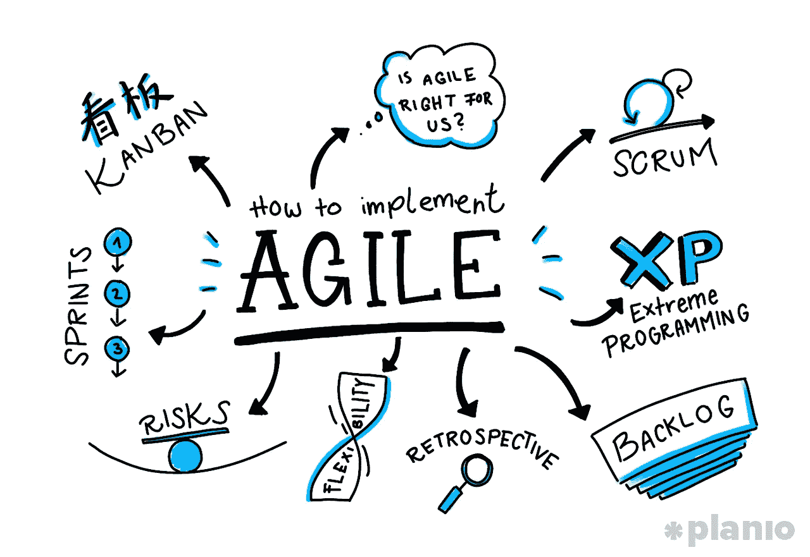
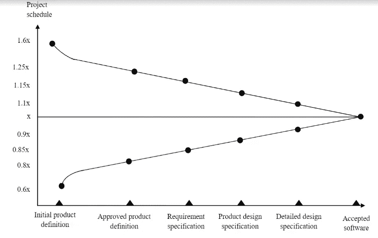

# 评估敏捷中迭代的速度

> 原文：<https://levelup.gitconnected.com/estimating-velocity-for-iterations-in-agile-394496aed24e>

敏捷允许公司更早地向客户交付价值，并更快地适应变化。敏捷方法如 scrum、看板和 XP 在软件开发行业中被广泛使用。

最近，在我的最后一年项目之前，我研究了速度、速度估计及其好处。我想分享一些我在研究速度估计时发现的观点。

> 速度是团队进展速度的度量。它是通过对团队在迭代期间完成的每个用户故事所分配的故事点数求和来计算的。

先说迭代规划。迭代是一个单一的开发周期，通常以一周或两周来度量。有两种规划迭代的方法。速度驱动的迭代规划
02。承诺驱动的迭代规划

## 承诺驱动的迭代规划

这里，团队被要求一个接一个地将故事添加到迭代中，直到他们可以承诺不再完成为止，而不是创建一个迭代计划，这个迭代计划是根据故事点的数量或者在前一个迭代中已经完成的理想天数。

## 速度驱动的迭代规划

首先，他们为即将到来的迭代确定目标速度。然后团队选择一个迭代目标，这是他们希望在即将到来的迭代中完成的事情的一般描述。在选择迭代目标之后，团队选择支持该目标的最高优先级的用户故事。**根据需要选择故事，使其理想日或故事点估计值之和等于目标速度**。最后，将每个选定的故事分解成任务，并对每个任务进行评估。

## 团队如何估算速度？

大多数团队通常使用的假设是，他们在
下一次迭代中的速度将等于最近一次迭代的速度。通过做一个行业调查，我们发现许多团队选择最近一次迭代的速度作为下一次迭代的基础，并做一些调整。

根据包括[1]在内的许多资源，预测速度的最佳方式是运行至少 3 次迭代，然后在一到三次迭代期间根据观察到的速度来估计速度。

此外，可以使用**不确定度锥将观察到的平均速度转换成一个范围。**

来源:使用 Evita Coelho 和 Anirban Basu 的故事点进行敏捷开发的工作量估算

如果团队已经运行了一次迭代，那么就考虑“初始产品定义”里程碑，并使用相应的范围。如果完成了两次迭代，则使用与“批准的产品定义”里程碑相对应的范围，依此类推。例如，一个团队在此期间以 50 的平均速度运行了三次迭代。对于三次迭代，合适的范围是 85%到 115%。这意味着如果团队的平均速度在三次迭代后是 50，那么他们在项目结束时的实际速度可能在 42–58 之间。

## 导致短跑速度波动的因素

引起速度的因素可以分为两类。

01.**摩擦力**是持续拖累生产力和降低项目速度的因素。
例子:
a .团队组成(合适的人和合适的技能)
b .过程(对当前开发过程的改变)
c .环境(干扰、噪音、不良通风条件等。)
d .团队动态(一些团队成员可能与其他人不太合拍)

02.使项目或团队成员减速并导致项目速度不规则的**可变或动态力**。
举例:
a .团队变更
b .新工具
c .厂商缺陷(第三方工具中的缺陷)
d .外部责任
e .个人问题
f .涉众问题
g .需求不明确
h .个人问题

除此之外，我指出高的在制品比率会降低冲刺阶段的速度。

**高工作进度(WIP)** 冲刺中可能存在问题，这些问题在冲刺结束时不符合“已完成”的定义，但已经提交。承诺已经获得了开发人员的努力，但是在计算团队速度时没有考虑。管理在制品数量以获得有效的交付速度是非常重要的。

**结论**
由于团队和外部环境的动态性，速度估算相当具有挑战性。但是仍然可以通过考虑过去迭代的历史数据来进行估计，并且使用不确定性圆锥可以提高精确度。开发团队应该注意 sprint 结束时的在制品数量，因为它们没有被捕捉为 sprint 的完成速度。

**参考文献**
*【1】Mike Cohn 的敏捷估算和规划
【2】Evita Coelho 和 Anirban Basu 的使用故事点进行敏捷开发的工作量估算
【3】Ziauddin、Shahid Kamal Tipu、Shahrukh Zia
的敏捷软件开发工作量估算模型【4】使用 Scrum 了解改进项目
计划的冲刺速度波动:Filipe Albero Pomar、Jose A. Calvo Manzano 的案例研究*

# 分级编码

感谢您成为我们社区的一员！ [**订阅我们的 YouTube 频道**](https://www.youtube.com/channel/UC3v9kBR_ab4UHXXdknz8Fbg?sub_confirmation=1) 或者加入 [**Skilled.dev 编码面试课程**](https://skilled.dev/) 。

 [## 编写面试问题

### 掌握编码面试的过程

技术开发](https://skilled.dev)