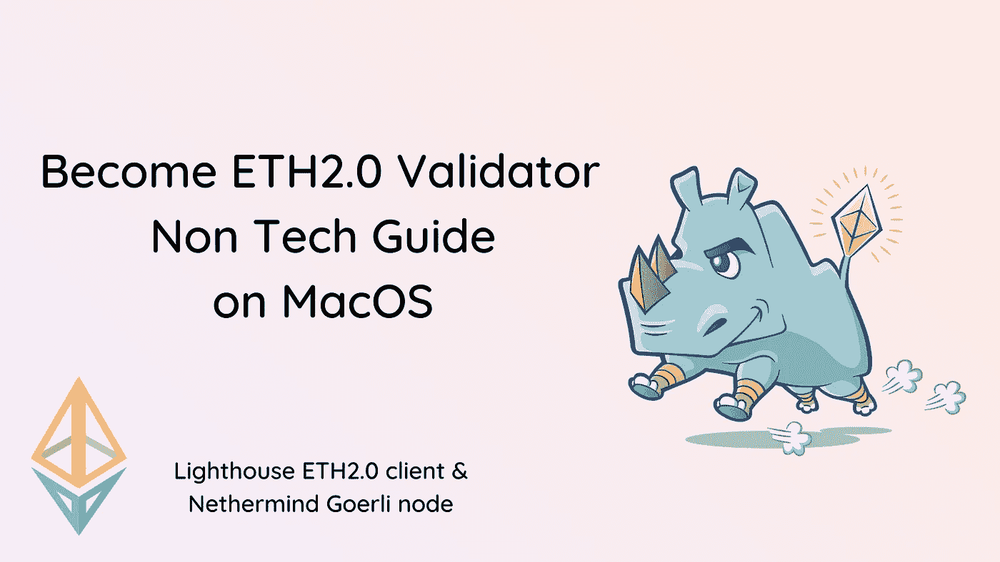
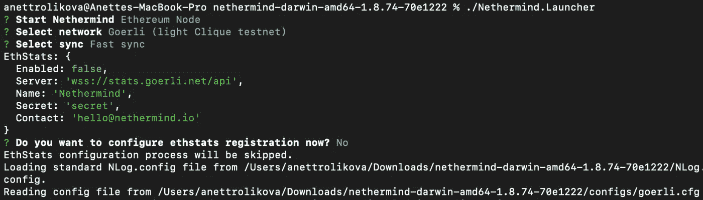
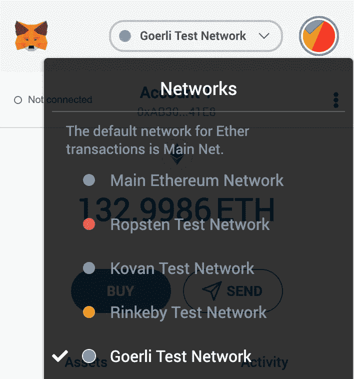

# MacOS 上的 ETH2.0 Lighthouse Validator 非技术指南

> 原文：<https://levelup.gitconnected.com/eth2-0-lighthouse-validator-non-tech-guide-on-macos-90cb00f7ba4f>

如果您对终端命令行没有什么经验，并且希望脱离 Lighthouse Beacon node 并使用 Lighthouse client 加入 ETH2.0 Beacon 链上的 validator 池，本文将指导您在 MacOS 上使用 Lighthouse client 运行 ETH2.0 Beacon Node。本指南包括剥离尼瑟心智戈利节点。

这篇文章的目标是指导你成为一个验证者，而不需要联系团队，这样你就可以在你设法脱离你的信标节点时发布“[这是令人兴奋的](https://twitter.com/AnettRolikova/status/1289153439117836288?s=20)”一类的 tweet(如果你使用这个指南，请确保标记我)。本指南不能用于运行其他客户端，因为在运行不同的 ETH1 客户端以运行 Goerli 节点和其他 ETH2.0 客户端以运行 Beacon 节点时可能会有差异。

*注意:*你可能会遇到 bug。不要担心错误，如果你遇到一些错误，一定要向团队报告:)如果你遇到困难，联系团队——他们很乐意帮助你。



# 介绍

以太坊最近[庆祝了它的第五个生日](https://blog.ethereum.org/2020/07/30/ethereum-turns-5/)(7 月 30 日)，因为 ETH1 链的创世区块被开采。今天，8 月 4 日下午 1 点 UTC ETH2.0 Medalla testnet 将上线。对于以太坊社区来说，这是一个超级激动人心的时刻，因为通往 ETH2.0 的道路即将公开，将开始处理证明和基于利益相关机制的块。这是纪元零的时隙零的开始。重要说明— Medalla 只是 Testnet，这意味着您将使用 Goerli testnet gETH 来加入 Medalla 验证程序池。不是真正的 mainnet ETH。

如果你有兴趣深入了解 ETH2.0，我强烈推荐你去看看丹尼·瑞恩的《ETH2 的状态》，2020 年 6 月

## TL:我们在本指南中所经历的灾难恢复

*   安装开发人员库
*   剥离 ETH1 Goerli 节点
*   通过 Launchpad 存款
*   选择 ETH2.0 客户端
*   安装 Lighthouse 开发者库
*   运行灯塔信标节点
*   运行灯塔验证程序客户端
*   附加阅读

# 安装开发人员库📚⌨️

这只是我们需要的基本安装，以便剥离 ETH1 Goerli 节点，并通过 [Launchpa](https://medalla.launchpad.ethereum.org/overview) d 在 ETH2.0 链上进行存款。我们将在稍后进行一些安装，因为每个 ETH2.0 客户端对运行其客户端所需安装的内容有不同的要求。

首先，您需要安装一些开发人员库。为了避免挣扎，避免“红线”——终端窗口中的错误，你应该前往 Mac 上的“安全与隐私”窗口，选择“无论如何都要打开”，因为你可能会遇到一些应用程序未经苹果公证，这可能会让你头疼。使用本指南通过截图获得更好的解释。您将需要这一步来启用尼日思维运行器——我们稍后将经历这一步。您可能需要这一步来启用家酿或其他库，编程语言。

[自制软件](https://brew.sh/)——这是帮助你在 MacOS 上安装和运行其他程序的魔法。这是您运行下一个程序并帮助您完成安装过程所需要的基础。复制粘贴到您的终端:

```
brew install gmp && brew install snappy && brew install lz4
```

[OpenSSL](https://www.openssl.org/) —这是 Lighthouse 的通用加密库，我相信其他 ETH2.0 客户端也在使用。复制粘贴到终端:

```
brew install openssl
```

我希望你完成了这重要的一步，它会变得更简单🙂

# 格利节点

Goerli node 在所有 ETH 1.0 客户端、工具和基础设施上都得到了很好的支持，并通过部署到 Goerli 的存款合同用于测试 ETH 2.0 过渡。您需要运行 Goerli testnet，以便制定存款合同，您将该合同作为“存款数据”上传到 launchpad，这样您就可以在 ETH2.0 信标链上下注。为了运行 Goerli node，您有更多的选项来选择剥离哪个客户端——使用最多的是 [Geth](https://geth.ethereum.org/downloads/) ，较少的是 [Nethermind](https://nethermind.io/) 。

注:Geth 可能更容易剥离，Nethermind 更轻。你可能会遇到一些你无法处理的问题。我发现了一个很棒的关于如何用 Geth node 剥离 Lighthouse 的[指南。还有另一个关于如何剥离 Goerli Geth node 的指南](https://medium.com/@steve.berryman/ethereum-2-eth2-lighthouse-validator-installation-and-running-guide-53eba6992841)[。](https://kb.beaconcha.in/run-a-goerli-node-eth1-and-beaconnode-eth2#step-1)

## 请求 gETH-Goerli ETH

您将需要 gETH 或 Goerli ETH 才能在 ETH2.0 信标节点上下注。有多种方法可以请求 gETH:

*   进入 [Goerli 认证水龙头](https://faucet.goerli.mudit.blog/)并输入你的 ETH 地址
*   去 [Prysmatic Labs Discord](https://discord.com/channels/476244492043812875/719985056319406182) 可以每 6 小时给你 165 gETH
*   或者问关于[灯塔不和](https://discord.com/invite/cyAszAh)的事

# 从尼瑟德·戈利节点分离出来

要剥离尼日心灵 Goerli node，请前往下载页面，[下载最新版本的尼日心灵](https://downloads.nethermind.io/) ETH1 客户端。解压文件(点击它)。你可能会遇到一些困难，因为虚空思维没有被苹果认证，所以[跳过这个指南](https://support.apple.com/en-us/HT202491)并启用“虚空思维”。启动器”文件。现在粘贴到终端:

```
brew install rocksdb
```

让操作过程然后粘贴到终端:

```
./Nethermind.Launcher
```

*   选择 Goerli(轻型临床试验网)
*   选择同步:快速同步
*   键入:N 不配置 eth 统计信息

您应该能够在您的终端上看到这个:



## 现在你应该可以得到日志并运行🥳节点

这可能需要一些时间，取决于您的互联网带宽。

*注:推荐你去看看* [*本指南*](https://docs.nethermind.io/nethermind/first-steps-with-nethermind/getting-started) *由虚空思维提供的关于如何运行虚空思维节点和日志的解释。*

如果您将遇到一些错误，只需通过 Control + C 重新启动节点，并键入/粘贴到终端:

```
./Nethermind.Launcher
```

重新开始这个过程:

*   选择 Goerli(轻型临床试验网)
*   选择同步:快速同步
*   键入:N 不配置 eth 统计信息

**如果你在这一点上遇到困难，可以随时联系虚空思维团队** [**吉特**](https://gitter.im/nethermindeth/nethermind) **。**

# 通过 Launchpad 存款💸

这是相当令人兴奋的部分，因为你暂时不需要处理终端。这部分你要存 32 gETH (Goerli ETH)。前往 [Launchpad 网站](https://medalla.launchpad.ethereum.org/overview)(在您的浏览器中)。请务必仔细阅读这些步骤，虽然你将只是赌注，但你仍然应该知道你在做什么。一定要注意签名密钥(密钥管理)。点击继续按钮。打开新的终端窗口，此时您应该打开两个终端窗口—一个带有 Goerli 节点，一个用于存款。只需将这一行复制粘贴到第二个(新的)终端窗口中:

```
./deposit — chain medalla
```

现在选择你的助记语言——你选择哪一种并不重要，你会得到助记世界——不同语言的随机生成的世界。默认情况下，英语很好，但你可以从 7 种语言中选择任何一种。

在你的终端上输入语言，并确保将这个助记短语离线保存。

现在输入密码，注意不要让人觉得你在输入密码，所以我建议你使用离线文本编辑器来粘贴密码——你可以使用 Notes、word 或任何其他工具。请确保保存此密码以及您的助记短语

粘贴密码，回车。这只可爱的犀牛应该出现在你的终端:

现在继续进行 Launchpad 的下一步。

找到“存款-数据-[时间戳-数字]。json 文件—将出现一个窗口，您可以在其中找到该文件。可以在 Finder 用户(你的 Mac 用户名)→eth 2.0-deposit-CLI→validator _ keys 中找到。这是生成 Rhino 的密钥库。

现在，您将在 Launchpad 上进行交易。

确保在您的钱包上选择 Goerli Test Network 并存入 Goerli ETH 而不是 mainnet ETH。



不要担心汽油费，这不是真的，只是测试，所以汽油费在这一点上无关紧要。做个交易然后 tadaaaa！

# 选择 ETH2.0 客户端

有一篇由

有一个关于如何用 Geth 客户端运行 Lighthouse ETH2.0 验证器的指南

# 向适马总理致敬

非常感谢你给我这个机会向你展示如何为非技术人员运行灯塔验证器。非常感谢 [Pawan Dhananjay](https://twitter.com/pawan_jay) 的技术支持，在此过程中回答了我的问题。与[适马 Prime](https://sigmaprime.io/) 团队合作非常愉快，祝灯塔 ETH2.0 客户端好运！🥳

感谢来自[虚空之心](https://twitter.com/nethermindeth)的[托马兹·k·斯坦扎克](https://twitter.com/tkstanczak)帮助我解决了戈利节点的问题。